* Overview: 
  + Descriptive analyses of class and mortality in the cross-sectional 1986-2018 NHIS with mortality follow-up through the end of 2019. 
<br>
* Coding of classes:
  + Incorporated business owners are those who are self-employed in an incorporated business.
  + Unincorporated business owners are those who are self-employed in an unincorporated business or working without pay in a family business/farm (very few in the latter).
  + Managers (mgrs) are those who are not self-employed but who are employed and who have an executive, administrative, or managerial occupation.
  + Workers (wrks) are those who are unemployed/"not employed" OR who are employed but do not have an executive, administrative, or managerial occupation.
  + Not in the labor force (NLFs) are those who are "not in the labor force" .
<br>


```r
library(dplyr)
library(data.table)
library(here)
library(survival)
library(rms)
library(broom)
library(Rcpp)
library(survey)
library(kableExtra)
library(tableone)
library(survminer)
library(ipw)
library(directlabels)
library(RColorBrewer)
library(patchwork)
library(cobalt)
library(naniar)
library(ggmosaic)
library(multcomp)
options(scipen=999)
options(knitr.kable.NA = '')
set.cobalt.options(binary="raw", continuous="std") #per https://cran.r-project.org/web/packages/cobalt/vignettes/cobalt.html#distinguishing-continuous-and-binary-covariates

#load ipums data
dat <- fread(here('ipums_dat_1986_2018.csv'))

#make all variable names lowercase
#sort data by nhispid to keep results consistent across runs, as output from ipw package is (very minorly) affected by observation order
dat %>%
  rename_all(tolower) %>%
  arrange(nhispid) -> dat

#####exclusions
#exclude those outside age ranges (age has 0.09% missing)
#exclude those ineligible for mortality follow-up and those <25 or 65+ and those who aren't sample adults from 1997-on (occ1995 and classwk not available for others after that time) #note, from 2015-2018, only sample adult and sample child participants were eligible for mortality follow-up
#exclude 1997-2000, when there's no data on whether business is incorporated or not
#exclude 1992 Hispanic oversample (only a few thousand respondents) (per advice of IPUMS) separately, as we want to include them in sensitivity analyses
dat %>%
  filter((age>=25 & age<65) & mortelig==1 & (is.na(astatflg) | astatflg==1) & (year<1997 | (year>2000))) -> dat_sub

#make variables
dat_sub %>%
  mutate_at(.vars=(vars(-c(mortucod, mortwt, mortwtsa, psu, strata, nhispid, nhishid))),
            ~ifelse(. %in% c(91, 96, 97, 98, 99, 970, 980, 990, 997, 999, 7777, 8888, 9998, 9999), NA, .)) %>%
  mutate(classwk2=ifelse(classwk2 %in% (7:9), NA, classwk2), #these are real values in some other variables so we'll reset them here
         jobsecincorp=ifelse(jobsecincorp %in% (7:9), NA, jobsecincorp),
         racesr=ifelse(racesr==900, NA, racesr),
         lamtwrk=ifelse(lamtwrk %in% 7:9, NA, lamtwrk)) %>%
  #per IPUMS's advice, use mortwt from 1986-1996 and mortwtsa from 1997-on: https://forum.ipums.org/t/weighting-when-using-pooling-1986-2014-nhis-linked-mortality-files/4486
  mutate(mortwt_f=ifelse(year<=1996, mortwt, mortwtsa),
         hispanic_oversample=ifelse((year==1992 & substr(nhispid, 1, 4)==1991), 1, 0),
         int_year_fin=ifelse(year<2001, year, #1986-1996, separate interview year unavailable
                             ifelse(year>=2001 & !is.na(intervwyr), intervwyr, year)), #if interview year is missing (<0.1%), assume it happened in survey-wave year (true in >99% of cases)
         dead=ifelse(mortstat==1, 1, 0),
         time=ifelse(dead==0, 2020 - int_year_fin, mortdody + 1 - int_year_fin), #deaths thru end of 2019, ie, 2020; assume deaths occurred at end of each year (1986 deaths occurred at end of 1986, ie, 1987)
         dead_86_96_05=ifelse(int_year_fin>1996, NA, #time and death indicators for 1986-1996 panel
                              ifelse(int_year_fin<=1996 & (is.na(mortdody) | mortdody>2004), 0,
                                    ifelse(int_year_fin<=1996 & mortdody<=2004, 1, NA))),
         time_86_96_05=ifelse(int_year_fin>1996, NA,
                              ifelse(dead_86_96_05==1, mortdody + 1 - int_year_fin,
                                     ifelse(dead_86_96_05==0, 2005-int_year_fin, NA))),
         race=ifelse(racesr==100, "White", 
                     ifelse(racesr==200, "Black", "Other")),
         hispeth_bin=ifelse(hispeth!=10, 1, 0),
         race_h=factor(ifelse(hispeth!=10, "Hispanic",
                              ifelse(hispeth==10 & race=="White", "NH white",
                                     ifelse(hispeth==10 & race=="Black", "NH black", "NH other"))), levels=c("NH white", "NH black", "Hispanic", "NH other")),
         poc=ifelse(race_h=="NH white", "NH white", "POC"),
         sex=ifelse(sex==1, "male", "female"),
         race_h_sex=factor(ifelse(race_h=="NH white" & sex=="male", "NH white men",
                                  ifelse(race_h=="NH white" & sex=="female", "NH white women",
                                         ifelse(race_h=="NH black" & sex=="male", "NH black men",
                                                ifelse(race_h=="NH black" & sex=="female", "NH black women",
                                                       ifelse(race_h=="Hispanic" & sex=="male", "Hispanic men",
                                                              ifelse(race_h=="Hispanic" & sex=="female", "Hispanic women",
                                                                     ifelse(race_h=="NH other" & sex=="male", "NH other men", "NH other women"))))))),
                           levels=c("NH white men", "NH white women", "NH black men", "NH black women", "Hispanic men", "Hispanic women", "NH other men", "NH other women")),
         educ=factor(ifelse(educrec1<13, "<HS",
                            ifelse(educrec1==13, "HS",
                                   ifelse(educrec1==14, "Some college", "College+"))), levels=c("<HS", "HS", "Some college", "College+")),
         marital_tri=factor(ifelse(marstat %in% 10:12, "Married",
                                   ifelse(marstat %in% 20:40, "Widowed/divorced/separated", 
                                          ifelse(marstat==50, "Single", NA))), levels=c("Married", "Single", "Widowed/divorced/separated")),
         region=ifelse(region==1, "NE", 
                       ifelse(region==2, "MW",
                              ifelse(region==3, "S", "W"))),
         incimp1_rev=ifelse(year<2007, NA,
                            ifelse(incimp1>66, 66, incimp1)),
         managers=ifelse(occ1995>=102 & occ1995<=104, 1, 0),
         class=factor(ifelse(empstat==220, "NLFs",
                             ifelse((empstat>=200 & empstat<=214) | (year<2001 & classwk>=20 & classwk<=34 & managers!=1) | (year>=2001 & classwk2>=1 & classwk2<=4 & managers!=1), "Wrks",
                                    ifelse((year<2001 & classwk>=20 & classwk<=34 & managers==1) | (year>=2001 & classwk2>=1 & classwk2<=4 & managers==1), "Mgrs",
                                           ifelse((year<2001 & classwk==41) | (year>=2001 & classwk2==5 & jobsecincorp==2), "IBOs",
                                                  ifelse((year<2001 & (classwk==42 | classwk==50)) | ((year>=2001 & classwk2==6) | (year>=2001 & classwk2==5 & jobsecincorp==1)), "UBOs", NA))))), 
                     levels=c("IBOs", "UBOs", "Mgrs", "Wrks", "NLFs")),
         class_gender=factor(ifelse(class=="Wrks" & sex=="male", "Male wrks",
                                    ifelse(class=="Wrks" & sex=="female", "Female wrks",
                                           ifelse(class=="Mgrs" & sex=="male", "Male mgrs",
                                                  ifelse(class=="Mgrs" & sex=="female", "Female mgrs",
                                                         ifelse(class=="UBOs" & sex=="male", "Male UBOs",
                                                                ifelse(class=="UBOs" & sex=="female", "Female UBOs",
                                                                       ifelse(class=="IBOs" & sex=="male", "Male IBOs",
                                                                              ifelse(class=="IBOs" & sex=="female", "Female IBOs",
                                                                                     ifelse(class=="NLFs" & sex=="male", "Male NLFs",
                                                                                            ifelse(class=="NLFs" & sex=="female", "Female NLFs", NA)))))))))),
                             levels=c("Male IBOs", "Male UBOs", "Male mgrs", "Male wrks", "Male NLFs",
                                      "Female IBOs", "Female UBOs", "Female mgrs", "Female wrks", "Female NLFs")),
         class_poc=factor(ifelse(class=="Wrks" & poc=="NH white", "NH white wrks",
                                 ifelse(class=="Wrks" & poc=="POC", "POC wrks",
                                        ifelse(class=="Mgrs" & poc=="NH white", "NH white mgrs",
                                               ifelse(class=="Mgrs" & poc=="POC", "POC mgrs",
                                                      ifelse(class=="UBOs" & poc=="NH white", "NH white UBOs",
                                                             ifelse(class=="UBOs" & poc=="POC", "POC UBOs",
                                                                    ifelse(class=="IBOs" & poc=="NH white", "NH white IBOs",
                                                                           ifelse(class=="IBOs" & poc=="POC", "POC IBOs", 
                                                                                  ifelse(class=="NLFs" & poc=="NH white", "NH white NLFs", 
                                                                                         ifelse(class=="NLFs" & poc=="POC", "POC NLFs", NA)))))))))),
                          levels=c("NH white IBOs", "NH white UBOs", "NH white mgrs", "NH white wrks", "NH white NLFs",
                                   "POC IBOs", "POC UBOs", "POC mgrs", "POC wrks", "POC NLFs")),
         class_educ=factor(ifelse(class=="Wrks" & (educ=="<HS" | educ=="HS"), "\u2264HS wrks",
                                 ifelse(class=="Wrks" & (educ=="Some college" | educ=="College+"), ">HS wrks",
                                        ifelse(class=="Mgrs" & (educ=="<HS" | educ=="HS"), "\u2264HS mgrs",
                                               ifelse(class=="Mgrs" & (educ=="Some college" | educ=="College+"), ">HS mgrs",
                                                      ifelse(class=="UBOs" & (educ=="<HS" | educ=="HS"), "\u2264HS UBOs",
                                                             ifelse(class=="UBOs" & (educ=="Some college" | educ=="College+"), ">HS UBOs",
                                                                    ifelse(class=="IBOs" & (educ=="<HS" | educ=="HS"), "\u2264HS IBOs",
                                                                           ifelse(class=="IBOs" & (educ=="Some college" | educ=="College+"), ">HS IBOs", 
                                                                                  ifelse(class=="NLFs" & (educ=="<HS" | educ=="HS"), "\u2264HS NLFs", 
                                                                                         ifelse(class=="NLFs" & (educ=="Some college" | educ=="College+"), ">HS NLFs", NA)))))))))),
                          levels=c(">HS IBOs", ">HS UBOs", ">HS mgrs", ">HS wrks", ">HS NLFs",
                                   "\u2264HS IBOs", "\u2264HS UBOs", "\u2264HS mgrs", "\u2264HS wrks", "\u2264HS NLFs")),
         class_sens=factor(ifelse(year<2001 | year>2003, NA, #identical to primary class variable (in 2002, both approaches to measuring business ownership with classwk/classwk2/etc overlapped)
                                  ifelse(empstat==220, "NLFs",
                                         ifelse((empstat>=200 & empstat<=214) | (classwk>=20 & classwk<=34 & managers!=1), "Wrks",
                                                ifelse((classwk>=20 & classwk<=34 & managers==1), "Mgrs",
                                                       ifelse(classwk==40 & jobsecincorp==2, "IBOs",
                                                              ifelse((classwk==40 & jobsecincorp==1) | classwk==50, "UBOs", NA)))))), 
                          levels=c("IBOs", "UBOs", "Mgrs", "Wrks", "NLFs")),
         class_occ=factor(ifelse(empstat==220, "NLFs",
                                 ifelse(empstat>=200 & empstat<=214, "Unemps",
                                        ifelse((year<2001 & classwk>=20 & classwk<=34 & occ1995>=900) | (year>=2001 & classwk2>=1 & classwk2<=4 & occ1995>=900), "Blue collar",
                                               ifelse((year<2001 & classwk>=20 & classwk<=34 & occ1995>=600 & occ1995<900) | (year>=2001 & classwk2>=1 & classwk2<=4 & occ1995>=600 & occ1995<900), "Services",
                                                      ifelse((year<2001 & classwk>=20 & classwk<=34 & occ1995>=200 & occ1995<600) | (year>=2001 & classwk2>=1 & classwk2<=4 & occ1995>=200 & occ1995<600), "White collar",
                                                             ifelse((year<2001 & classwk>=20 & classwk<=34 & managers==1) | (year>=2001 & classwk2>=1 & classwk2<=4 & managers==1), "Mgrs",
                                                                    ifelse((year<2001 & classwk==41) | (year>=2001 & classwk2==5 & jobsecincorp==2), "IBOs",
                                                                           ifelse((year<2001 & (classwk==42 | classwk==50)) | ((year>=2001 & classwk2==6) | (year>=2001 & classwk2==5 & jobsecincorp==1)), "UBOs", NA)))))))), 
                     levels=c("IBOs", "UBOs", "Mgrs", "White collar", "Services", "Blue collar", "Unemps", "NLFs"))) -> dat_sub

#make dataset without hispanic oversample for main analyses
dat_sub %>%
  filter(hispanic_oversample==0) -> dat_sub_no_hisp
```

# Missingness 

Age missingness is in full dataset among years and samples of interest; missingness for other variables is among those ages 25-64.


```r
#age in full dataset
dat %>%
  filter(mortelig==1 & (is.na(astatflg) | astatflg==1) & (year<1997 | (year>2000)) & 
           !(year==1992 & substr(nhispid, 1, 4)==1991)) %>%
  mutate_at(.vars=(vars(-c(mortucod, mortwt, mortwtsa, psu, strata, nhispid, nhishid))), ~ifelse(. %in% c(91, 96, 97, 98, 99, 970, 980, 990, 7777, 8888, 9999), NA, .)) %>%
  dplyr::select('age') %>%
  miss_var_summary() -> dat_age_na

#other vars in subsetted dataset
dat_sub_no_hisp %>%
  dplyr::select(c('class', 'sex', 'race_h', 'educ', 'marital_tri', 'region')) %>%
  miss_var_summary() -> dat_other_na

#print
kable(bind_rows(dat_age_na, dat_other_na), digits=2, col.names=c("Variable", "Number missing", "Percent missing")) %>%
  kable_styling('striped')
```

<table class="table table-striped" style="margin-left: auto; margin-right: auto;">
 <thead>
  <tr>
   <th style="text-align:left;"> Variable </th>
   <th style="text-align:right;"> Number missing </th>
   <th style="text-align:right;"> Percent missing </th>
  </tr>
 </thead>
<tbody>
  <tr>
   <td style="text-align:left;"> age </td>
   <td style="text-align:right;"> 1058 </td>
   <td style="text-align:right;"> 0.08 </td>
  </tr>
  <tr>
   <td style="text-align:left;"> class </td>
   <td style="text-align:right;"> 15554 </td>
   <td style="text-align:right;"> 1.66 </td>
  </tr>
  <tr>
   <td style="text-align:left;"> educ </td>
   <td style="text-align:right;"> 7094 </td>
   <td style="text-align:right;"> 0.76 </td>
  </tr>
  <tr>
   <td style="text-align:left;"> race_h </td>
   <td style="text-align:right;"> 4730 </td>
   <td style="text-align:right;"> 0.50 </td>
  </tr>
  <tr>
   <td style="text-align:left;"> marital_tri </td>
   <td style="text-align:right;"> 3603 </td>
   <td style="text-align:right;"> 0.38 </td>
  </tr>
  <tr>
   <td style="text-align:left;"> sex </td>
   <td style="text-align:right;"> 0 </td>
   <td style="text-align:right;"> 0.00 </td>
  </tr>
  <tr>
   <td style="text-align:left;"> region </td>
   <td style="text-align:right;"> 0 </td>
   <td style="text-align:right;"> 0.00 </td>
  </tr>
</tbody>
</table>

```r
#create complete-case dataset for rest of analyses
dat_sub_no_hisp <- dat_sub_no_hisp[complete.cases(dat_sub_no_hisp[,c('age', 'time', 'class', 'sex', 'race_h', 'educ', 'marital_tri', 'region')]),]
```

# Descriptives

Weighted and excluding missingness unless otherwise noted.

## Unweighted and stratified table one 


```r
#vars of interest
vars <- c('sex', 'race_h', 'educ', 'marital_tri', 'region', 'age', 'int_year_fin', 'time', 'dead')
catvars <- c("sex", 'dead')
nonorm <- c('age', 'int_year_fin', 'time')

x <- CreateTableOne(data=dat_sub_no_hisp, vars=vars, factorVars=catvars, strata='class', includeNA=TRUE)
x <- print(x, printToggle=FALSE, noSpaces=TRUE, nonnormal=nonorm, test=FALSE)
kable(x) %>%
  kable_styling(c("striped", "condensed"))
```

<table class="table table-striped table-condensed" style="margin-left: auto; margin-right: auto;">
 <thead>
  <tr>
   <th style="text-align:left;">   </th>
   <th style="text-align:left;"> IBOs </th>
   <th style="text-align:left;"> UBOs </th>
   <th style="text-align:left;"> Mgrs </th>
   <th style="text-align:left;"> Wrks </th>
   <th style="text-align:left;"> NLFs </th>
  </tr>
 </thead>
<tbody>
  <tr>
   <td style="text-align:left;"> n </td>
   <td style="text-align:left;"> 19437 </td>
   <td style="text-align:left;"> 60095 </td>
   <td style="text-align:left;"> 85293 </td>
   <td style="text-align:left;"> 547838 </td>
   <td style="text-align:left;"> 199187 </td>
  </tr>
  <tr>
   <td style="text-align:left;"> sex = male (%) </td>
   <td style="text-align:left;"> 14180 (73.0) </td>
   <td style="text-align:left;"> 36790 (61.2) </td>
   <td style="text-align:left;"> 44660 (52.4) </td>
   <td style="text-align:left;"> 274458 (50.1) </td>
   <td style="text-align:left;"> 54479 (27.4) </td>
  </tr>
  <tr>
   <td style="text-align:left;"> race_h (%) </td>
   <td style="text-align:left;">  </td>
   <td style="text-align:left;">  </td>
   <td style="text-align:left;">  </td>
   <td style="text-align:left;">  </td>
   <td style="text-align:left;">  </td>
  </tr>
  <tr>
   <td style="text-align:left;"> NH white </td>
   <td style="text-align:left;"> 16509 (84.9) </td>
   <td style="text-align:left;"> 48099 (80.0) </td>
   <td style="text-align:left;"> 67874 (79.6) </td>
   <td style="text-align:left;"> 372412 (68.0) </td>
   <td style="text-align:left;"> 128438 (64.5) </td>
  </tr>
  <tr>
   <td style="text-align:left;"> NH black </td>
   <td style="text-align:left;"> 780 (4.0) </td>
   <td style="text-align:left;"> 3692 (6.1) </td>
   <td style="text-align:left;"> 7480 (8.8) </td>
   <td style="text-align:left;"> 79000 (14.4) </td>
   <td style="text-align:left;"> 32233 (16.2) </td>
  </tr>
  <tr>
   <td style="text-align:left;"> Hispanic </td>
   <td style="text-align:left;"> 1208 (6.2) </td>
   <td style="text-align:left;"> 5849 (9.7) </td>
   <td style="text-align:left;"> 6104 (7.2) </td>
   <td style="text-align:left;"> 70995 (13.0) </td>
   <td style="text-align:left;"> 28705 (14.4) </td>
  </tr>
  <tr>
   <td style="text-align:left;"> NH other </td>
   <td style="text-align:left;"> 940 (4.8) </td>
   <td style="text-align:left;"> 2455 (4.1) </td>
   <td style="text-align:left;"> 3835 (4.5) </td>
   <td style="text-align:left;"> 25431 (4.6) </td>
   <td style="text-align:left;"> 9811 (4.9) </td>
  </tr>
  <tr>
   <td style="text-align:left;"> educ (%) </td>
   <td style="text-align:left;">  </td>
   <td style="text-align:left;">  </td>
   <td style="text-align:left;">  </td>
   <td style="text-align:left;">  </td>
   <td style="text-align:left;">  </td>
  </tr>
  <tr>
   <td style="text-align:left;"> &lt;HS </td>
   <td style="text-align:left;"> 1109 (5.7) </td>
   <td style="text-align:left;"> 8372 (13.9) </td>
   <td style="text-align:left;"> 2329 (2.7) </td>
   <td style="text-align:left;"> 73666 (13.4) </td>
   <td style="text-align:left;"> 56276 (28.3) </td>
  </tr>
  <tr>
   <td style="text-align:left;"> HS </td>
   <td style="text-align:left;"> 5097 (26.2) </td>
   <td style="text-align:left;"> 21401 (35.6) </td>
   <td style="text-align:left;"> 17695 (20.7) </td>
   <td style="text-align:left;"> 197063 (36.0) </td>
   <td style="text-align:left;"> 72276 (36.3) </td>
  </tr>
  <tr>
   <td style="text-align:left;"> Some college </td>
   <td style="text-align:left;"> 4764 (24.5) </td>
   <td style="text-align:left;"> 14370 (23.9) </td>
   <td style="text-align:left;"> 21916 (25.7) </td>
   <td style="text-align:left;"> 138186 (25.2) </td>
   <td style="text-align:left;"> 40804 (20.5) </td>
  </tr>
  <tr>
   <td style="text-align:left;"> College+ </td>
   <td style="text-align:left;"> 8467 (43.6) </td>
   <td style="text-align:left;"> 15952 (26.5) </td>
   <td style="text-align:left;"> 43353 (50.8) </td>
   <td style="text-align:left;"> 138923 (25.4) </td>
   <td style="text-align:left;"> 29831 (15.0) </td>
  </tr>
  <tr>
   <td style="text-align:left;"> marital_tri (%) </td>
   <td style="text-align:left;">  </td>
   <td style="text-align:left;">  </td>
   <td style="text-align:left;">  </td>
   <td style="text-align:left;">  </td>
   <td style="text-align:left;">  </td>
  </tr>
  <tr>
   <td style="text-align:left;"> Married </td>
   <td style="text-align:left;"> 15569 (80.1) </td>
   <td style="text-align:left;"> 44097 (73.4) </td>
   <td style="text-align:left;"> 57999 (68.0) </td>
   <td style="text-align:left;"> 345615 (63.1) </td>
   <td style="text-align:left;"> 128003 (64.3) </td>
  </tr>
  <tr>
   <td style="text-align:left;"> Single </td>
   <td style="text-align:left;"> 1568 (8.1) </td>
   <td style="text-align:left;"> 6848 (11.4) </td>
   <td style="text-align:left;"> 13465 (15.8) </td>
   <td style="text-align:left;"> 101450 (18.5) </td>
   <td style="text-align:left;"> 28785 (14.5) </td>
  </tr>
  <tr>
   <td style="text-align:left;"> Widowed/divorced/separated </td>
   <td style="text-align:left;"> 2300 (11.8) </td>
   <td style="text-align:left;"> 9150 (15.2) </td>
   <td style="text-align:left;"> 13829 (16.2) </td>
   <td style="text-align:left;"> 100773 (18.4) </td>
   <td style="text-align:left;"> 42399 (21.3) </td>
  </tr>
  <tr>
   <td style="text-align:left;"> region (%) </td>
   <td style="text-align:left;">  </td>
   <td style="text-align:left;">  </td>
   <td style="text-align:left;">  </td>
   <td style="text-align:left;">  </td>
   <td style="text-align:left;">  </td>
  </tr>
  <tr>
   <td style="text-align:left;"> MW </td>
   <td style="text-align:left;"> 4500 (23.2) </td>
   <td style="text-align:left;"> 14686 (24.4) </td>
   <td style="text-align:left;"> 19661 (23.1) </td>
   <td style="text-align:left;"> 133360 (24.3) </td>
   <td style="text-align:left;"> 42760 (21.5) </td>
  </tr>
  <tr>
   <td style="text-align:left;"> NE </td>
   <td style="text-align:left;"> 4091 (21.0) </td>
   <td style="text-align:left;"> 9853 (16.4) </td>
   <td style="text-align:left;"> 17063 (20.0) </td>
   <td style="text-align:left;"> 104533 (19.1) </td>
   <td style="text-align:left;"> 38067 (19.1) </td>
  </tr>
  <tr>
   <td style="text-align:left;"> S </td>
   <td style="text-align:left;"> 6656 (34.2) </td>
   <td style="text-align:left;"> 19588 (32.6) </td>
   <td style="text-align:left;"> 28586 (33.5) </td>
   <td style="text-align:left;"> 188947 (34.5) </td>
   <td style="text-align:left;"> 72644 (36.5) </td>
  </tr>
  <tr>
   <td style="text-align:left;"> W </td>
   <td style="text-align:left;"> 4190 (21.6) </td>
   <td style="text-align:left;"> 15968 (26.6) </td>
   <td style="text-align:left;"> 19983 (23.4) </td>
   <td style="text-align:left;"> 120998 (22.1) </td>
   <td style="text-align:left;"> 45716 (23.0) </td>
  </tr>
  <tr>
   <td style="text-align:left;"> age (median [IQR]) </td>
   <td style="text-align:left;"> 45.00 [38.00, 53.00] </td>
   <td style="text-align:left;"> 44.00 [36.00, 53.00] </td>
   <td style="text-align:left;"> 41.00 [34.00, 49.00] </td>
   <td style="text-align:left;"> 40.00 [32.00, 49.00] </td>
   <td style="text-align:left;"> 48.00 [35.00, 59.00] </td>
  </tr>
  <tr>
   <td style="text-align:left;"> int_year_fin (median [IQR]) </td>
   <td style="text-align:left;"> 1994.00 [1990.00, 2005.00] </td>
   <td style="text-align:left;"> 1993.00 [1989.00, 2003.00] </td>
   <td style="text-align:left;"> 1994.00 [1990.00, 2007.00] </td>
   <td style="text-align:left;"> 1994.00 [1990.00, 2007.00] </td>
   <td style="text-align:left;"> 1994.00 [1990.00, 2007.00] </td>
  </tr>
  <tr>
   <td style="text-align:left;"> time (median [IQR]) </td>
   <td style="text-align:left;"> 25.00 [12.00, 29.00] </td>
   <td style="text-align:left;"> 25.00 [14.00, 29.00] </td>
   <td style="text-align:left;"> 25.00 [11.00, 29.00] </td>
   <td style="text-align:left;"> 24.00 [11.00, 29.00] </td>
   <td style="text-align:left;"> 18.00 [9.00, 28.00] </td>
  </tr>
  <tr>
   <td style="text-align:left;"> dead = 1 (%) </td>
   <td style="text-align:left;"> 3336 (17.2) </td>
   <td style="text-align:left;"> 12673 (21.1) </td>
   <td style="text-align:left;"> 10745 (12.6) </td>
   <td style="text-align:left;"> 83354 (15.2) </td>
   <td style="text-align:left;"> 60726 (30.5) </td>
  </tr>
</tbody>
</table>

## Stratified table one 


```r
dat_sub_no_hisp_svy <- svydesign(ids = ~ psu,
                         strata = ~ strata, 
                         weights = ~ mortwt_f,
                         nest=TRUE, 
                         data=dat_sub_no_hisp)

x <- svyCreateTableOne(data=dat_sub_no_hisp_svy, vars=vars, factorVars=catvars, strata='class', includeNA=FALSE)
x <- print(x, printToggle=FALSE, noSpaces=TRUE, nonnormal=nonorm, format='p', test=FALSE)
kable(x) %>%
  kable_styling(c("striped", "condensed"))
```

<table class="table table-striped table-condensed" style="margin-left: auto; margin-right: auto;">
 <thead>
  <tr>
   <th style="text-align:left;">   </th>
   <th style="text-align:left;"> IBOs </th>
   <th style="text-align:left;"> UBOs </th>
   <th style="text-align:left;"> Mgrs </th>
   <th style="text-align:left;"> Wrks </th>
   <th style="text-align:left;"> NLFs </th>
  </tr>
 </thead>
<tbody>
  <tr>
   <td style="text-align:left;"> n </td>
   <td style="text-align:left;"> 95936894.0 </td>
   <td style="text-align:left;"> 250120938.0 </td>
   <td style="text-align:left;"> 414997755.0 </td>
   <td style="text-align:left;"> 2519249151.0 </td>
   <td style="text-align:left;"> 879701057.0 </td>
  </tr>
  <tr>
   <td style="text-align:left;"> sex = male (%) </td>
   <td style="text-align:left;"> 72.5 </td>
   <td style="text-align:left;"> 61.0 </td>
   <td style="text-align:left;"> 54.1 </td>
   <td style="text-align:left;"> 52.3 </td>
   <td style="text-align:left;"> 30.3 </td>
  </tr>
  <tr>
   <td style="text-align:left;"> race_h (%) </td>
   <td style="text-align:left;">  </td>
   <td style="text-align:left;">  </td>
   <td style="text-align:left;">  </td>
   <td style="text-align:left;">  </td>
   <td style="text-align:left;">  </td>
  </tr>
  <tr>
   <td style="text-align:left;"> NH white </td>
   <td style="text-align:left;"> 83.2 </td>
   <td style="text-align:left;"> 78.7 </td>
   <td style="text-align:left;"> 79.3 </td>
   <td style="text-align:left;"> 68.8 </td>
   <td style="text-align:left;"> 68.0 </td>
  </tr>
  <tr>
   <td style="text-align:left;"> NH black </td>
   <td style="text-align:left;"> 4.2 </td>
   <td style="text-align:left;"> 5.9 </td>
   <td style="text-align:left;"> 8.0 </td>
   <td style="text-align:left;"> 12.5 </td>
   <td style="text-align:left;"> 12.9 </td>
  </tr>
  <tr>
   <td style="text-align:left;"> Hispanic </td>
   <td style="text-align:left;"> 6.8 </td>
   <td style="text-align:left;"> 10.9 </td>
   <td style="text-align:left;"> 7.3 </td>
   <td style="text-align:left;"> 13.2 </td>
   <td style="text-align:left;"> 13.6 </td>
  </tr>
  <tr>
   <td style="text-align:left;"> NH other </td>
   <td style="text-align:left;"> 5.8 </td>
   <td style="text-align:left;"> 4.6 </td>
   <td style="text-align:left;"> 5.4 </td>
   <td style="text-align:left;"> 5.4 </td>
   <td style="text-align:left;"> 5.6 </td>
  </tr>
  <tr>
   <td style="text-align:left;"> educ (%) </td>
   <td style="text-align:left;">  </td>
   <td style="text-align:left;">  </td>
   <td style="text-align:left;">  </td>
   <td style="text-align:left;">  </td>
   <td style="text-align:left;">  </td>
  </tr>
  <tr>
   <td style="text-align:left;"> &lt;HS </td>
   <td style="text-align:left;"> 4.7 </td>
   <td style="text-align:left;"> 12.3 </td>
   <td style="text-align:left;"> 2.0 </td>
   <td style="text-align:left;"> 11.0 </td>
   <td style="text-align:left;"> 22.7 </td>
  </tr>
  <tr>
   <td style="text-align:left;"> HS </td>
   <td style="text-align:left;"> 23.3 </td>
   <td style="text-align:left;"> 33.2 </td>
   <td style="text-align:left;"> 17.1 </td>
   <td style="text-align:left;"> 32.5 </td>
   <td style="text-align:left;"> 34.8 </td>
  </tr>
  <tr>
   <td style="text-align:left;"> Some college </td>
   <td style="text-align:left;"> 26.3 </td>
   <td style="text-align:left;"> 26.4 </td>
   <td style="text-align:left;"> 25.3 </td>
   <td style="text-align:left;"> 27.8 </td>
   <td style="text-align:left;"> 24.1 </td>
  </tr>
  <tr>
   <td style="text-align:left;"> College+ </td>
   <td style="text-align:left;"> 45.7 </td>
   <td style="text-align:left;"> 28.2 </td>
   <td style="text-align:left;"> 55.6 </td>
   <td style="text-align:left;"> 28.7 </td>
   <td style="text-align:left;"> 18.4 </td>
  </tr>
  <tr>
   <td style="text-align:left;"> marital_tri (%) </td>
   <td style="text-align:left;">  </td>
   <td style="text-align:left;">  </td>
   <td style="text-align:left;">  </td>
   <td style="text-align:left;">  </td>
   <td style="text-align:left;">  </td>
  </tr>
  <tr>
   <td style="text-align:left;"> Married </td>
   <td style="text-align:left;"> 80.9 </td>
   <td style="text-align:left;"> 72.6 </td>
   <td style="text-align:left;"> 70.4 </td>
   <td style="text-align:left;"> 64.3 </td>
   <td style="text-align:left;"> 66.0 </td>
  </tr>
  <tr>
   <td style="text-align:left;"> Single </td>
   <td style="text-align:left;"> 8.3 </td>
   <td style="text-align:left;"> 12.4 </td>
   <td style="text-align:left;"> 15.3 </td>
   <td style="text-align:left;"> 19.2 </td>
   <td style="text-align:left;"> 14.9 </td>
  </tr>
  <tr>
   <td style="text-align:left;"> Widowed/divorced/separated </td>
   <td style="text-align:left;"> 10.9 </td>
   <td style="text-align:left;"> 15.0 </td>
   <td style="text-align:left;"> 14.2 </td>
   <td style="text-align:left;"> 16.5 </td>
   <td style="text-align:left;"> 19.1 </td>
  </tr>
  <tr>
   <td style="text-align:left;"> region (%) </td>
   <td style="text-align:left;">  </td>
   <td style="text-align:left;">  </td>
   <td style="text-align:left;">  </td>
   <td style="text-align:left;">  </td>
   <td style="text-align:left;">  </td>
  </tr>
  <tr>
   <td style="text-align:left;"> MW </td>
   <td style="text-align:left;"> 23.1 </td>
   <td style="text-align:left;"> 23.3 </td>
   <td style="text-align:left;"> 23.4 </td>
   <td style="text-align:left;"> 24.5 </td>
   <td style="text-align:left;"> 21.5 </td>
  </tr>
  <tr>
   <td style="text-align:left;"> NE </td>
   <td style="text-align:left;"> 19.3 </td>
   <td style="text-align:left;"> 16.5 </td>
   <td style="text-align:left;"> 19.9 </td>
   <td style="text-align:left;"> 18.9 </td>
   <td style="text-align:left;"> 18.2 </td>
  </tr>
  <tr>
   <td style="text-align:left;"> S </td>
   <td style="text-align:left;"> 36.3 </td>
   <td style="text-align:left;"> 34.0 </td>
   <td style="text-align:left;"> 34.4 </td>
   <td style="text-align:left;"> 35.4 </td>
   <td style="text-align:left;"> 38.1 </td>
  </tr>
  <tr>
   <td style="text-align:left;"> W </td>
   <td style="text-align:left;"> 21.3 </td>
   <td style="text-align:left;"> 26.3 </td>
   <td style="text-align:left;"> 22.3 </td>
   <td style="text-align:left;"> 21.2 </td>
   <td style="text-align:left;"> 22.2 </td>
  </tr>
  <tr>
   <td style="text-align:left;"> age (median [IQR]) </td>
   <td style="text-align:left;"> 46.00 [38.00, 54.00] </td>
   <td style="text-align:left;"> 45.00 [36.00, 53.00] </td>
   <td style="text-align:left;"> 42.00 [34.00, 51.00] </td>
   <td style="text-align:left;"> 41.00 [32.00, 50.00] </td>
   <td style="text-align:left;"> 49.00 [36.00, 59.00] </td>
  </tr>
  <tr>
   <td style="text-align:left;"> int_year_fin (median [IQR]) </td>
   <td style="text-align:left;"> 2005.00 [1994.00, 2012.00] </td>
   <td style="text-align:left;"> 2003.00 [1992.00, 2010.00] </td>
   <td style="text-align:left;"> 2006.00 [1995.00, 2013.00] </td>
   <td style="text-align:left;"> 2006.00 [1994.00, 2012.00] </td>
   <td style="text-align:left;"> 2006.00 [1994.00, 2012.00] </td>
  </tr>
  <tr>
   <td style="text-align:left;"> time (median [IQR]) </td>
   <td style="text-align:left;"> 14.00 [8.00, 24.00] </td>
   <td style="text-align:left;"> 16.00 [9.00, 26.00] </td>
   <td style="text-align:left;"> 14.00 [7.00, 24.00] </td>
   <td style="text-align:left;"> 14.00 [8.00, 24.00] </td>
   <td style="text-align:left;"> 12.00 [7.00, 19.00] </td>
  </tr>
  <tr>
   <td style="text-align:left;"> dead = 1 (%) </td>
   <td style="text-align:left;"> 10.4 </td>
   <td style="text-align:left;"> 14.1 </td>
   <td style="text-align:left;"> 7.5 </td>
   <td style="text-align:left;"> 9.5 </td>
   <td style="text-align:left;"> 21.0 </td>
  </tr>
</tbody>
</table>

## Stratified table one with workers subdivided by occupation


```r
x <- svyCreateTableOne(data=dat_sub_no_hisp_svy, vars=vars, factorVars=catvars, strata='class_occ', includeNA=FALSE)
x <- print(x, printToggle=FALSE, noSpaces=TRUE, nonnormal=nonorm, format='p', test=FALSE)
kable(x) %>%
  kable_styling(c("striped", "condensed"))
```

<table class="table table-striped table-condensed" style="margin-left: auto; margin-right: auto;">
 <thead>
  <tr>
   <th style="text-align:left;">   </th>
   <th style="text-align:left;"> IBOs </th>
   <th style="text-align:left;"> UBOs </th>
   <th style="text-align:left;"> Mgrs </th>
   <th style="text-align:left;"> White collar </th>
   <th style="text-align:left;"> Services </th>
   <th style="text-align:left;"> Blue collar </th>
   <th style="text-align:left;"> Unemps </th>
   <th style="text-align:left;"> NLFs </th>
  </tr>
 </thead>
<tbody>
  <tr>
   <td style="text-align:left;"> n </td>
   <td style="text-align:left;"> 95936894.0 </td>
   <td style="text-align:left;"> 250120938.0 </td>
   <td style="text-align:left;"> 414997755.0 </td>
   <td style="text-align:left;"> 1308724530.0 </td>
   <td style="text-align:left;"> 356909367.0 </td>
   <td style="text-align:left;"> 689111163.0 </td>
   <td style="text-align:left;"> 164504091.0 </td>
   <td style="text-align:left;"> 879701057.0 </td>
  </tr>
  <tr>
   <td style="text-align:left;"> sex = male (%) </td>
   <td style="text-align:left;"> 72.5 </td>
   <td style="text-align:left;"> 61.0 </td>
   <td style="text-align:left;"> 54.1 </td>
   <td style="text-align:left;"> 39.4 </td>
   <td style="text-align:left;"> 41.4 </td>
   <td style="text-align:left;"> 82.6 </td>
   <td style="text-align:left;"> 51.9 </td>
   <td style="text-align:left;"> 30.3 </td>
  </tr>
  <tr>
   <td style="text-align:left;"> race_h (%) </td>
   <td style="text-align:left;">  </td>
   <td style="text-align:left;">  </td>
   <td style="text-align:left;">  </td>
   <td style="text-align:left;">  </td>
   <td style="text-align:left;">  </td>
   <td style="text-align:left;">  </td>
   <td style="text-align:left;">  </td>
   <td style="text-align:left;">  </td>
  </tr>
  <tr>
   <td style="text-align:left;"> NH white </td>
   <td style="text-align:left;"> 83.2 </td>
   <td style="text-align:left;"> 78.7 </td>
   <td style="text-align:left;"> 79.3 </td>
   <td style="text-align:left;"> 75.5 </td>
   <td style="text-align:left;"> 56.1 </td>
   <td style="text-align:left;"> 65.4 </td>
   <td style="text-align:left;"> 58.0 </td>
   <td style="text-align:left;"> 68.0 </td>
  </tr>
  <tr>
   <td style="text-align:left;"> NH black </td>
   <td style="text-align:left;"> 4.2 </td>
   <td style="text-align:left;"> 5.9 </td>
   <td style="text-align:left;"> 8.0 </td>
   <td style="text-align:left;"> 10.1 </td>
   <td style="text-align:left;"> 19.2 </td>
   <td style="text-align:left;"> 11.8 </td>
   <td style="text-align:left;"> 20.2 </td>
   <td style="text-align:left;"> 12.9 </td>
  </tr>
  <tr>
   <td style="text-align:left;"> Hispanic </td>
   <td style="text-align:left;"> 6.8 </td>
   <td style="text-align:left;"> 10.9 </td>
   <td style="text-align:left;"> 7.3 </td>
   <td style="text-align:left;"> 8.3 </td>
   <td style="text-align:left;"> 18.8 </td>
   <td style="text-align:left;"> 19.0 </td>
   <td style="text-align:left;"> 15.9 </td>
   <td style="text-align:left;"> 13.6 </td>
  </tr>
  <tr>
   <td style="text-align:left;"> NH other </td>
   <td style="text-align:left;"> 5.8 </td>
   <td style="text-align:left;"> 4.6 </td>
   <td style="text-align:left;"> 5.4 </td>
   <td style="text-align:left;"> 6.1 </td>
   <td style="text-align:left;"> 5.9 </td>
   <td style="text-align:left;"> 3.8 </td>
   <td style="text-align:left;"> 5.9 </td>
   <td style="text-align:left;"> 5.6 </td>
  </tr>
  <tr>
   <td style="text-align:left;"> educ (%) </td>
   <td style="text-align:left;">  </td>
   <td style="text-align:left;">  </td>
   <td style="text-align:left;">  </td>
   <td style="text-align:left;">  </td>
   <td style="text-align:left;">  </td>
   <td style="text-align:left;">  </td>
   <td style="text-align:left;">  </td>
   <td style="text-align:left;">  </td>
  </tr>
  <tr>
   <td style="text-align:left;"> &lt;HS </td>
   <td style="text-align:left;"> 4.7 </td>
   <td style="text-align:left;"> 12.3 </td>
   <td style="text-align:left;"> 2.0 </td>
   <td style="text-align:left;"> 2.7 </td>
   <td style="text-align:left;"> 17.9 </td>
   <td style="text-align:left;"> 21.4 </td>
   <td style="text-align:left;"> 17.9 </td>
   <td style="text-align:left;"> 22.7 </td>
  </tr>
  <tr>
   <td style="text-align:left;"> HS </td>
   <td style="text-align:left;"> 23.3 </td>
   <td style="text-align:left;"> 33.2 </td>
   <td style="text-align:left;"> 17.1 </td>
   <td style="text-align:left;"> 22.2 </td>
   <td style="text-align:left;"> 40.6 </td>
   <td style="text-align:left;"> 47.5 </td>
   <td style="text-align:left;"> 34.6 </td>
   <td style="text-align:left;"> 34.8 </td>
  </tr>
  <tr>
   <td style="text-align:left;"> Some college </td>
   <td style="text-align:left;"> 26.3 </td>
   <td style="text-align:left;"> 26.4 </td>
   <td style="text-align:left;"> 25.3 </td>
   <td style="text-align:left;"> 28.8 </td>
   <td style="text-align:left;"> 30.1 </td>
   <td style="text-align:left;"> 24.6 </td>
   <td style="text-align:left;"> 28.1 </td>
   <td style="text-align:left;"> 24.1 </td>
  </tr>
  <tr>
   <td style="text-align:left;"> College+ </td>
   <td style="text-align:left;"> 45.7 </td>
   <td style="text-align:left;"> 28.2 </td>
   <td style="text-align:left;"> 55.6 </td>
   <td style="text-align:left;"> 46.3 </td>
   <td style="text-align:left;"> 11.5 </td>
   <td style="text-align:left;"> 6.5 </td>
   <td style="text-align:left;"> 19.4 </td>
   <td style="text-align:left;"> 18.4 </td>
  </tr>
  <tr>
   <td style="text-align:left;"> marital_tri (%) </td>
   <td style="text-align:left;">  </td>
   <td style="text-align:left;">  </td>
   <td style="text-align:left;">  </td>
   <td style="text-align:left;">  </td>
   <td style="text-align:left;">  </td>
   <td style="text-align:left;">  </td>
   <td style="text-align:left;">  </td>
   <td style="text-align:left;">  </td>
  </tr>
  <tr>
   <td style="text-align:left;"> Married </td>
   <td style="text-align:left;"> 80.9 </td>
   <td style="text-align:left;"> 72.6 </td>
   <td style="text-align:left;"> 70.4 </td>
   <td style="text-align:left;"> 66.5 </td>
   <td style="text-align:left;"> 56.8 </td>
   <td style="text-align:left;"> 67.7 </td>
   <td style="text-align:left;"> 48.6 </td>
   <td style="text-align:left;"> 66.0 </td>
  </tr>
  <tr>
   <td style="text-align:left;"> Single </td>
   <td style="text-align:left;"> 8.3 </td>
   <td style="text-align:left;"> 12.4 </td>
   <td style="text-align:left;"> 15.3 </td>
   <td style="text-align:left;"> 18.2 </td>
   <td style="text-align:left;"> 22.7 </td>
   <td style="text-align:left;"> 16.8 </td>
   <td style="text-align:left;"> 29.7 </td>
   <td style="text-align:left;"> 14.9 </td>
  </tr>
  <tr>
   <td style="text-align:left;"> Widowed/divorced/separated </td>
   <td style="text-align:left;"> 10.9 </td>
   <td style="text-align:left;"> 15.0 </td>
   <td style="text-align:left;"> 14.2 </td>
   <td style="text-align:left;"> 15.3 </td>
   <td style="text-align:left;"> 20.5 </td>
   <td style="text-align:left;"> 15.5 </td>
   <td style="text-align:left;"> 21.7 </td>
   <td style="text-align:left;"> 19.1 </td>
  </tr>
  <tr>
   <td style="text-align:left;"> region (%) </td>
   <td style="text-align:left;">  </td>
   <td style="text-align:left;">  </td>
   <td style="text-align:left;">  </td>
   <td style="text-align:left;">  </td>
   <td style="text-align:left;">  </td>
   <td style="text-align:left;">  </td>
   <td style="text-align:left;">  </td>
   <td style="text-align:left;">  </td>
  </tr>
  <tr>
   <td style="text-align:left;"> MW </td>
   <td style="text-align:left;"> 23.1 </td>
   <td style="text-align:left;"> 23.3 </td>
   <td style="text-align:left;"> 23.4 </td>
   <td style="text-align:left;"> 24.2 </td>
   <td style="text-align:left;"> 22.8 </td>
   <td style="text-align:left;"> 26.4 </td>
   <td style="text-align:left;"> 23.2 </td>
   <td style="text-align:left;"> 21.5 </td>
  </tr>
  <tr>
   <td style="text-align:left;"> NE </td>
   <td style="text-align:left;"> 19.3 </td>
   <td style="text-align:left;"> 16.5 </td>
   <td style="text-align:left;"> 19.9 </td>
   <td style="text-align:left;"> 19.9 </td>
   <td style="text-align:left;"> 19.9 </td>
   <td style="text-align:left;"> 16.6 </td>
   <td style="text-align:left;"> 17.6 </td>
   <td style="text-align:left;"> 18.2 </td>
  </tr>
  <tr>
   <td style="text-align:left;"> S </td>
   <td style="text-align:left;"> 36.3 </td>
   <td style="text-align:left;"> 34.0 </td>
   <td style="text-align:left;"> 34.4 </td>
   <td style="text-align:left;"> 34.6 </td>
   <td style="text-align:left;"> 35.3 </td>
   <td style="text-align:left;"> 36.9 </td>
   <td style="text-align:left;"> 35.5 </td>
   <td style="text-align:left;"> 38.1 </td>
  </tr>
  <tr>
   <td style="text-align:left;"> W </td>
   <td style="text-align:left;"> 21.3 </td>
   <td style="text-align:left;"> 26.3 </td>
   <td style="text-align:left;"> 22.3 </td>
   <td style="text-align:left;"> 21.3 </td>
   <td style="text-align:left;"> 22.0 </td>
   <td style="text-align:left;"> 20.0 </td>
   <td style="text-align:left;"> 23.7 </td>
   <td style="text-align:left;"> 22.2 </td>
  </tr>
  <tr>
   <td style="text-align:left;"> age (median [IQR]) </td>
   <td style="text-align:left;"> 46.00 [38.00, 54.00] </td>
   <td style="text-align:left;"> 45.00 [36.00, 53.00] </td>
   <td style="text-align:left;"> 42.00 [34.00, 51.00] </td>
   <td style="text-align:left;"> 41.00 [33.00, 50.00] </td>
   <td style="text-align:left;"> 41.00 [32.00, 50.00] </td>
   <td style="text-align:left;"> 41.00 [32.00, 50.00] </td>
   <td style="text-align:left;"> 39.00 [31.00, 49.00] </td>
   <td style="text-align:left;"> 49.00 [36.00, 59.00] </td>
  </tr>
  <tr>
   <td style="text-align:left;"> int_year_fin (median [IQR]) </td>
   <td style="text-align:left;"> 2005.00 [1994.00, 2012.00] </td>
   <td style="text-align:left;"> 2003.00 [1992.00, 2010.00] </td>
   <td style="text-align:left;"> 2006.00 [1995.00, 2013.00] </td>
   <td style="text-align:left;"> 2006.00 [1994.00, 2012.00] </td>
   <td style="text-align:left;"> 2006.00 [1995.00, 2013.00] </td>
   <td style="text-align:left;"> 2004.00 [1993.00, 2011.00] </td>
   <td style="text-align:left;"> 2009.00 [1996.00, 2012.00] </td>
   <td style="text-align:left;"> 2006.00 [1994.00, 2012.00] </td>
  </tr>
  <tr>
   <td style="text-align:left;"> time (median [IQR]) </td>
   <td style="text-align:left;"> 14.00 [8.00, 24.00] </td>
   <td style="text-align:left;"> 16.00 [9.00, 26.00] </td>
   <td style="text-align:left;"> 14.00 [7.00, 24.00] </td>
   <td style="text-align:left;"> 14.00 [7.00, 25.00] </td>
   <td style="text-align:left;"> 13.00 [7.00, 22.00] </td>
   <td style="text-align:left;"> 15.00 [8.00, 25.00] </td>
   <td style="text-align:left;"> 11.00 [7.00, 19.00] </td>
   <td style="text-align:left;"> 12.00 [7.00, 19.00] </td>
  </tr>
  <tr>
   <td style="text-align:left;"> dead = 1 (%) </td>
   <td style="text-align:left;"> 10.4 </td>
   <td style="text-align:left;"> 14.1 </td>
   <td style="text-align:left;"> 7.5 </td>
   <td style="text-align:left;"> 7.5 </td>
   <td style="text-align:left;"> 10.1 </td>
   <td style="text-align:left;"> 12.6 </td>
   <td style="text-align:left;"> 10.8 </td>
   <td style="text-align:left;"> 21.0 </td>
  </tr>
</tbody>
</table>

## Stratified class composition of gender-races 

### Table


```r
x <- svyCreateTableOne(data=dat_sub_no_hisp_svy, vars='class', factorVars='class', strata='race_h_sex', includeNA=FALSE)
x <- print(x, printToggle=FALSE, noSpaces=TRUE, nonnormal=nonorm, format='p', test=FALSE)
kable(x[2:7,]) %>%
  kable_styling(c("striped", "condensed"))
```

<table class="table table-striped table-condensed" style="margin-left: auto; margin-right: auto;">
 <thead>
  <tr>
   <th style="text-align:left;">   </th>
   <th style="text-align:left;"> NH white men </th>
   <th style="text-align:left;"> NH white women </th>
   <th style="text-align:left;"> NH black men </th>
   <th style="text-align:left;"> NH black women </th>
   <th style="text-align:left;"> Hispanic men </th>
   <th style="text-align:left;"> Hispanic women </th>
   <th style="text-align:left;"> NH other men </th>
   <th style="text-align:left;"> NH other women </th>
  </tr>
 </thead>
<tbody>
  <tr>
   <td style="text-align:left;"> class (%) </td>
   <td style="text-align:left;">  </td>
   <td style="text-align:left;">  </td>
   <td style="text-align:left;">  </td>
   <td style="text-align:left;">  </td>
   <td style="text-align:left;">  </td>
   <td style="text-align:left;">  </td>
   <td style="text-align:left;">  </td>
   <td style="text-align:left;">  </td>
  </tr>
  <tr>
   <td style="text-align:left;"> IBOs </td>
   <td style="text-align:left;"> 4.0 </td>
   <td style="text-align:left;"> 1.4 </td>
   <td style="text-align:left;"> 1.3 </td>
   <td style="text-align:left;"> 0.5 </td>
   <td style="text-align:left;"> 1.9 </td>
   <td style="text-align:left;"> 0.6 </td>
   <td style="text-align:left;"> 3.4 </td>
   <td style="text-align:left;"> 1.7 </td>
  </tr>
  <tr>
   <td style="text-align:left;"> UBOs </td>
   <td style="text-align:left;"> 8.3 </td>
   <td style="text-align:left;"> 5.1 </td>
   <td style="text-align:left;"> 4.3 </td>
   <td style="text-align:left;"> 2.0 </td>
   <td style="text-align:left;"> 6.2 </td>
   <td style="text-align:left;"> 4.3 </td>
   <td style="text-align:left;"> 6.1 </td>
   <td style="text-align:left;"> 4.1 </td>
  </tr>
  <tr>
   <td style="text-align:left;"> Mgrs </td>
   <td style="text-align:left;"> 12.6 </td>
   <td style="text-align:left;"> 9.8 </td>
   <td style="text-align:left;"> 6.4 </td>
   <td style="text-align:left;"> 7.2 </td>
   <td style="text-align:left;"> 6.2 </td>
   <td style="text-align:left;"> 5.6 </td>
   <td style="text-align:left;"> 11.1 </td>
   <td style="text-align:left;"> 8.8 </td>
  </tr>
  <tr>
   <td style="text-align:left;"> Wrks </td>
   <td style="text-align:left;"> 62.3 </td>
   <td style="text-align:left;"> 55.8 </td>
   <td style="text-align:left;"> 68.9 </td>
   <td style="text-align:left;"> 63.0 </td>
   <td style="text-align:left;"> 75.0 </td>
   <td style="text-align:left;"> 53.6 </td>
   <td style="text-align:left;"> 67.1 </td>
   <td style="text-align:left;"> 55.1 </td>
  </tr>
  <tr>
   <td style="text-align:left;"> NLFs </td>
   <td style="text-align:left;"> 12.7 </td>
   <td style="text-align:left;"> 27.8 </td>
   <td style="text-align:left;"> 19.1 </td>
   <td style="text-align:left;"> 27.2 </td>
   <td style="text-align:left;"> 10.6 </td>
   <td style="text-align:left;"> 36.0 </td>
   <td style="text-align:left;"> 12.3 </td>
   <td style="text-align:left;"> 30.3 </td>
  </tr>
</tbody>
</table>

### Mosaic plot


```r
ggplot(data=dat_sub_no_hisp) +
  geom_mosaic(aes(x=product(class, race_h_sex), fill=class, weight=mortwt_f)) +
  ylab("") +
  xlab("")  +
  scale_y_productlist(expand=c(0,0.01)) +
  scale_x_productlist(expand=c(0,0.01)) +
  scale_fill_manual(values=brewer.pal(n = 12, name = "Paired")[c(2,8,4,10,6)]) +
  theme_classic() +
  theme(axis.line=element_blank(), axis.title=element_blank(), legend.position="none",
        axis.text.y=element_text(size=10, color="black"), axis.text.x=element_text(size=10, color="black", angle=25, vjust=1, hjust=1)) 
```

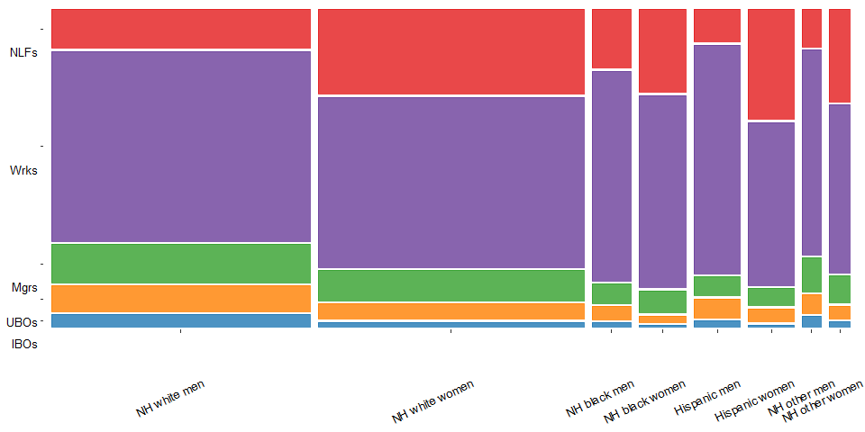<!-- -->

```r
ggsave('mosaic.png', dpi=600, height=5, width=10)
```

## Proportions in classes over time 

Using interview year rather than survey-wave year. Excluded 2019 because <50 respondents interviewed in 2019.


```r
dat_sub_no_hisp %>%
  filter(int_year_fin!=2019) %>%
  group_by(class, int_year_fin) %>%
  summarise(n = sum(mortwt_f)) %>%
  ungroup() %>%
  group_by(int_year_fin) %>%
  mutate(prop = n / sum(n)) -> propped

ggplot(propped, aes(x=int_year_fin, y=prop, group=class, color=class, label=class)) +
  geom_dl(method='last.qp') +
  geom_line() +
  scale_color_manual(values=brewer.pal(n = 12, name = "Paired")[c(2,8,4,10,6)]) +
  scale_x_continuous(breaks=c(1986, 1994, 2002, 2010, 2018), expand=expansion(mult=c(0,0.08))) +
  scale_y_continuous(limits=c(0, 0.63), expand=expansion(mult=c(0,0))) +
  xlab("Interview year") +
  ylab("Proportion") +
  theme_light() +
  theme(legend.position = "none")
```

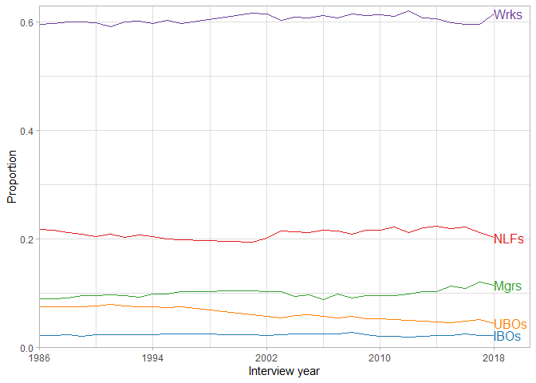<!-- -->

```r
ggsave('proportions_over_time.png', dpi=600)
```

## Family income distribution across classes from 2007-2018 

Income coding inconsistent prior to 2007. Unadjusted for inflation. Row label shows lower bound of category.


```r
x <- svyCreateTableOne(data=subset(dat_sub_no_hisp_svy, year>=2007), vars='incimp1_rev', factorVars='incimp1_rev', strata='class', includeNA=FALSE)
x <- print(x, printToggle=FALSE, noSpaces=TRUE, nonnormal=nonorm, format='p', test=FALSE)
row.names(x)[3:23] <- c(paste0(seq(0,95,5), "k"),">=100k")
kable(x[3:23,]) %>%
  kable_styling(c("striped", "condensed"))
```

<table class="table table-striped table-condensed" style="margin-left: auto; margin-right: auto;">
 <thead>
  <tr>
   <th style="text-align:left;">   </th>
   <th style="text-align:left;"> IBOs </th>
   <th style="text-align:left;"> UBOs </th>
   <th style="text-align:left;"> Mgrs </th>
   <th style="text-align:left;"> Wrks </th>
   <th style="text-align:left;"> NLFs </th>
  </tr>
 </thead>
<tbody>
  <tr>
   <td style="text-align:left;"> 0k </td>
   <td style="text-align:left;"> 0.6 </td>
   <td style="text-align:left;"> 1.8 </td>
   <td style="text-align:left;"> 0.3 </td>
   <td style="text-align:left;"> 1.5 </td>
   <td style="text-align:left;"> 4.2 </td>
  </tr>
  <tr>
   <td style="text-align:left;"> 5k </td>
   <td style="text-align:left;"> 0.5 </td>
   <td style="text-align:left;"> 2.6 </td>
   <td style="text-align:left;"> 0.3 </td>
   <td style="text-align:left;"> 1.9 </td>
   <td style="text-align:left;"> 7.8 </td>
  </tr>
  <tr>
   <td style="text-align:left;"> 10k </td>
   <td style="text-align:left;"> 0.9 </td>
   <td style="text-align:left;"> 4.1 </td>
   <td style="text-align:left;"> 0.6 </td>
   <td style="text-align:left;"> 2.9 </td>
   <td style="text-align:left;"> 8.3 </td>
  </tr>
  <tr>
   <td style="text-align:left;"> 15k </td>
   <td style="text-align:left;"> 1.3 </td>
   <td style="text-align:left;"> 4.3 </td>
   <td style="text-align:left;"> 0.7 </td>
   <td style="text-align:left;"> 3.4 </td>
   <td style="text-align:left;"> 7.1 </td>
  </tr>
  <tr>
   <td style="text-align:left;"> 20k </td>
   <td style="text-align:left;"> 1.8 </td>
   <td style="text-align:left;"> 5.4 </td>
   <td style="text-align:left;"> 1.0 </td>
   <td style="text-align:left;"> 4.4 </td>
   <td style="text-align:left;"> 6.9 </td>
  </tr>
  <tr>
   <td style="text-align:left;"> 25k </td>
   <td style="text-align:left;"> 1.5 </td>
   <td style="text-align:left;"> 4.8 </td>
   <td style="text-align:left;"> 1.5 </td>
   <td style="text-align:left;"> 4.3 </td>
   <td style="text-align:left;"> 5.6 </td>
  </tr>
  <tr>
   <td style="text-align:left;"> 30k </td>
   <td style="text-align:left;"> 2.6 </td>
   <td style="text-align:left;"> 5.1 </td>
   <td style="text-align:left;"> 2.0 </td>
   <td style="text-align:left;"> 4.9 </td>
   <td style="text-align:left;"> 5.6 </td>
  </tr>
  <tr>
   <td style="text-align:left;"> 35k </td>
   <td style="text-align:left;"> 2.8 </td>
   <td style="text-align:left;"> 5.1 </td>
   <td style="text-align:left;"> 2.2 </td>
   <td style="text-align:left;"> 4.6 </td>
   <td style="text-align:left;"> 4.9 </td>
  </tr>
  <tr>
   <td style="text-align:left;"> 40k </td>
   <td style="text-align:left;"> 3.7 </td>
   <td style="text-align:left;"> 5.3 </td>
   <td style="text-align:left;"> 2.7 </td>
   <td style="text-align:left;"> 4.9 </td>
   <td style="text-align:left;"> 4.7 </td>
  </tr>
  <tr>
   <td style="text-align:left;"> 45k </td>
   <td style="text-align:left;"> 2.4 </td>
   <td style="text-align:left;"> 3.7 </td>
   <td style="text-align:left;"> 2.7 </td>
   <td style="text-align:left;"> 4.2 </td>
   <td style="text-align:left;"> 3.9 </td>
  </tr>
  <tr>
   <td style="text-align:left;"> 50k </td>
   <td style="text-align:left;"> 4.5 </td>
   <td style="text-align:left;"> 5.3 </td>
   <td style="text-align:left;"> 3.3 </td>
   <td style="text-align:left;"> 4.9 </td>
   <td style="text-align:left;"> 4.2 </td>
  </tr>
  <tr>
   <td style="text-align:left;"> 55k </td>
   <td style="text-align:left;"> 2.3 </td>
   <td style="text-align:left;"> 3.1 </td>
   <td style="text-align:left;"> 2.7 </td>
   <td style="text-align:left;"> 3.6 </td>
   <td style="text-align:left;"> 2.7 </td>
  </tr>
  <tr>
   <td style="text-align:left;"> 60k </td>
   <td style="text-align:left;"> 3.5 </td>
   <td style="text-align:left;"> 4.1 </td>
   <td style="text-align:left;"> 3.3 </td>
   <td style="text-align:left;"> 4.7 </td>
   <td style="text-align:left;"> 3.4 </td>
  </tr>
  <tr>
   <td style="text-align:left;"> 65k </td>
   <td style="text-align:left;"> 3.1 </td>
   <td style="text-align:left;"> 3.1 </td>
   <td style="text-align:left;"> 2.8 </td>
   <td style="text-align:left;"> 3.5 </td>
   <td style="text-align:left;"> 2.4 </td>
  </tr>
  <tr>
   <td style="text-align:left;"> 70k </td>
   <td style="text-align:left;"> 3.4 </td>
   <td style="text-align:left;"> 3.3 </td>
   <td style="text-align:left;"> 3.7 </td>
   <td style="text-align:left;"> 3.9 </td>
   <td style="text-align:left;"> 2.8 </td>
  </tr>
  <tr>
   <td style="text-align:left;"> 75k </td>
   <td style="text-align:left;"> 3.9 </td>
   <td style="text-align:left;"> 2.9 </td>
   <td style="text-align:left;"> 3.3 </td>
   <td style="text-align:left;"> 3.5 </td>
   <td style="text-align:left;"> 2.2 </td>
  </tr>
  <tr>
   <td style="text-align:left;"> 80k </td>
   <td style="text-align:left;"> 3.8 </td>
   <td style="text-align:left;"> 3.0 </td>
   <td style="text-align:left;"> 4.0 </td>
   <td style="text-align:left;"> 3.6 </td>
   <td style="text-align:left;"> 2.5 </td>
  </tr>
  <tr>
   <td style="text-align:left;"> 85k </td>
   <td style="text-align:left;"> 2.1 </td>
   <td style="text-align:left;"> 2.1 </td>
   <td style="text-align:left;"> 3.1 </td>
   <td style="text-align:left;"> 2.6 </td>
   <td style="text-align:left;"> 1.5 </td>
  </tr>
  <tr>
   <td style="text-align:left;"> 90k </td>
   <td style="text-align:left;"> 3.2 </td>
   <td style="text-align:left;"> 2.5 </td>
   <td style="text-align:left;"> 3.2 </td>
   <td style="text-align:left;"> 3.1 </td>
   <td style="text-align:left;"> 1.8 </td>
  </tr>
  <tr>
   <td style="text-align:left;"> 95k </td>
   <td style="text-align:left;"> 2.0 </td>
   <td style="text-align:left;"> 1.8 </td>
   <td style="text-align:left;"> 2.8 </td>
   <td style="text-align:left;"> 2.3 </td>
   <td style="text-align:left;"> 1.2 </td>
  </tr>
  <tr>
   <td style="text-align:left;"> &gt;=100k </td>
   <td style="text-align:left;"> 50.2 </td>
   <td style="text-align:left;"> 26.6 </td>
   <td style="text-align:left;"> 53.5 </td>
   <td style="text-align:left;"> 27.1 </td>
   <td style="text-align:left;"> 16.5 </td>
  </tr>
</tbody>
</table>

## Number of employees at work across classes from 2001-2018

Excluding those not working. IBOs 4x as likely as UBOs to be in firms with 10+ employees. It makes sense that managers and workers are much more likely than business owners to work in larger firms, since any given firm, regardless of size, will only have one owner (in theory), whereas such firms will have multiple workers. For example, in a society with 5 firms, 4 of which have 5 employees and 1 of which has 1000 employees, 80% of owners will come from firms with 5 employees, but 98% (1000/1020) of workers will come from firms with 1000+ employees.


```r
x <- svyCreateTableOne(data=subset(dat_sub_no_hisp_svy, year>=2001 & numemps!=0 & class!="NLFs"), vars='numemps', factorVars='numemps', strata='class', includeNA=FALSE)
x <- print(x, printToggle=FALSE, noSpaces=TRUE, nonnormal=nonorm, format='p', test=FALSE)
row.names(x)[3:10] <- c("1-9", "10-24", "25-49", "50-99", "100-249", "250-499", "500-999", "1000+")
kable(x[3:10,1:4]) %>%
  kable_styling(c("striped", "condensed"))
```

<table class="table table-striped table-condensed" style="margin-left: auto; margin-right: auto;">
 <thead>
  <tr>
   <th style="text-align:left;">   </th>
   <th style="text-align:left;"> IBOs </th>
   <th style="text-align:left;"> UBOs </th>
   <th style="text-align:left;"> Mgrs </th>
   <th style="text-align:left;"> Wrks </th>
  </tr>
 </thead>
<tbody>
  <tr>
   <td style="text-align:left;"> 1-9 </td>
   <td style="text-align:left;"> 81.5 </td>
   <td style="text-align:left;"> 95.3 </td>
   <td style="text-align:left;"> 17.6 </td>
   <td style="text-align:left;"> 18.9 </td>
  </tr>
  <tr>
   <td style="text-align:left;"> 10-24 </td>
   <td style="text-align:left;"> 10.3 </td>
   <td style="text-align:left;"> 2.6 </td>
   <td style="text-align:left;"> 13.7 </td>
   <td style="text-align:left;"> 14.9 </td>
  </tr>
  <tr>
   <td style="text-align:left;"> 25-49 </td>
   <td style="text-align:left;"> 4.5 </td>
   <td style="text-align:left;"> 0.8 </td>
   <td style="text-align:left;"> 11.7 </td>
   <td style="text-align:left;"> 12.4 </td>
  </tr>
  <tr>
   <td style="text-align:left;"> 50-99 </td>
   <td style="text-align:left;"> 1.9 </td>
   <td style="text-align:left;"> 0.6 </td>
   <td style="text-align:left;"> 11.1 </td>
   <td style="text-align:left;"> 12.0 </td>
  </tr>
  <tr>
   <td style="text-align:left;"> 100-249 </td>
   <td style="text-align:left;"> 1.2 </td>
   <td style="text-align:left;"> 0.3 </td>
   <td style="text-align:left;"> 13.2 </td>
   <td style="text-align:left;"> 13.9 </td>
  </tr>
  <tr>
   <td style="text-align:left;"> 250-499 </td>
   <td style="text-align:left;"> 0.3 </td>
   <td style="text-align:left;"> 0.2 </td>
   <td style="text-align:left;"> 8.4 </td>
   <td style="text-align:left;"> 7.7 </td>
  </tr>
  <tr>
   <td style="text-align:left;"> 500-999 </td>
   <td style="text-align:left;"> 0.2 </td>
   <td style="text-align:left;"> 0.1 </td>
   <td style="text-align:left;"> 7.0 </td>
   <td style="text-align:left;"> 5.9 </td>
  </tr>
  <tr>
   <td style="text-align:left;"> 1000+ </td>
   <td style="text-align:left;"> 0.2 </td>
   <td style="text-align:left;"> 0.2 </td>
   <td style="text-align:left;"> 17.4 </td>
   <td style="text-align:left;"> 14.4 </td>
  </tr>
</tbody>
</table>

## Reason not in labor force

### Main reason for not working last week

Variable only available from 2004-on.


```r
x <- svyCreateTableOne(data=subset(dat_sub_no_hisp_svy, year>=2004 & empstat==220 & whynowk2!=0), vars='whynowk2', factorVars='whynowk2', includeNA=FALSE)
x <- print(x, printToggle=FALSE, noSpaces=TRUE, nonnormal=nonorm, format='p', test=FALSE)
row.names(x)[3:12] <- c("Keeping house", "Going to school", "Retired", "Unable to work for health reasons", "Disabled", "On layoff", "On planned vacation", "On family leave", "Have job/contract; off season", "Other")
kable(x[3:12,], digits=2, col.names="Percent") %>% 
  kable_styling("striped")
```

<table class="table table-striped" style="margin-left: auto; margin-right: auto;">
 <thead>
  <tr>
   <th style="text-align:left;">   </th>
   <th style="text-align:left;"> Percent </th>
  </tr>
 </thead>
<tbody>
  <tr>
   <td style="text-align:left;"> Keeping house </td>
   <td style="text-align:left;"> 34.1 </td>
  </tr>
  <tr>
   <td style="text-align:left;"> Going to school </td>
   <td style="text-align:left;"> 4.4 </td>
  </tr>
  <tr>
   <td style="text-align:left;"> Retired </td>
   <td style="text-align:left;"> 17.8 </td>
  </tr>
  <tr>
   <td style="text-align:left;"> Unable to work for health reasons </td>
   <td style="text-align:left;"> 3.2 </td>
  </tr>
  <tr>
   <td style="text-align:left;"> Disabled </td>
   <td style="text-align:left;"> 32.9 </td>
  </tr>
  <tr>
   <td style="text-align:left;"> On layoff </td>
   <td style="text-align:left;"> 2.1 </td>
  </tr>
  <tr>
   <td style="text-align:left;"> On planned vacation </td>
   <td style="text-align:left;"> 0.8 </td>
  </tr>
  <tr>
   <td style="text-align:left;"> On family leave </td>
   <td style="text-align:left;"> 0.4 </td>
  </tr>
  <tr>
   <td style="text-align:left;"> Have job/contract; off season </td>
   <td style="text-align:left;"> 0.8 </td>
  </tr>
  <tr>
   <td style="text-align:left;"> Other </td>
   <td style="text-align:left;"> 3.5 </td>
  </tr>
</tbody>
</table>

### Limited in kind/amount of work can do

Variable only available from 1997-on.


```r
x <- svyCreateTableOne(data=subset(dat_sub_no_hisp_svy, year>=1997), vars='lamtwrk', factorVars='lamtwrk', strata='empstat', includeNA=FALSE)
x <- print(x, printToggle=FALSE, noSpaces=TRUE, nonnormal=nonorm, format='p', test=FALSE)
row.names(x)[3:5] <- c("Not limited", "Limited", "Unable to work")
kable(x[3:5,], col.names=c("Working for pay", "Working w/o pay", "With job, but not at work", "Not employed", "NILF")) %>% 
  kable_styling("striped")
```

<table class="table table-striped" style="margin-left: auto; margin-right: auto;">
 <thead>
  <tr>
   <th style="text-align:left;">   </th>
   <th style="text-align:left;"> Working for pay </th>
   <th style="text-align:left;"> Working w/o pay </th>
   <th style="text-align:left;"> With job, but not at work </th>
   <th style="text-align:left;"> Not employed </th>
   <th style="text-align:left;"> NILF </th>
  </tr>
 </thead>
<tbody>
  <tr>
   <td style="text-align:left;"> Not limited </td>
   <td style="text-align:left;"> 96.9 </td>
   <td style="text-align:left;"> 90.8 </td>
   <td style="text-align:left;"> 87.9 </td>
   <td style="text-align:left;"> 88.0 </td>
   <td style="text-align:left;"> 62.9 </td>
  </tr>
  <tr>
   <td style="text-align:left;"> Limited </td>
   <td style="text-align:left;"> 2.6 </td>
   <td style="text-align:left;"> 4.9 </td>
   <td style="text-align:left;"> 4.6 </td>
   <td style="text-align:left;"> 6.1 </td>
   <td style="text-align:left;"> 5.9 </td>
  </tr>
  <tr>
   <td style="text-align:left;"> Unable to work </td>
   <td style="text-align:left;"> 0.5 </td>
   <td style="text-align:left;"> 4.3 </td>
   <td style="text-align:left;"> 7.5 </td>
   <td style="text-align:left;"> 5.9 </td>
   <td style="text-align:left;"> 31.3 </td>
  </tr>
</tbody>
</table>

# Class and all-cause mortality


```r
#plotting function
plotted <- function(datted, 
                    classed_repped=34,
                    classed=c(rep("IBOs", classed_repped), rep("UBOs", classed_repped), rep("Mgrs", classed_repped), rep("Wrks", classed_repped), rep("NLFs", classed_repped)),
                    repped=5,
                    grpd, 
                    grps, 
                    dummied=c("IBOs", "UBOs", "Mgrs", "Wrks", "NLFs"),
                    cexed=0.85,
                    vjusted=1,
                    val=brewer.pal(n = 12, name = "Paired")[c(2,4,6,8,10)], 
                    bottom=0.50){
  
  dat_surv <- rbind(data.frame(time=datted$time,
                               surved=datted$surv,
                               se=datted$std.err,
                               class=classed,
                               grp=rep(grpd, grps)),
                    data.frame(time=rep(0, repped), surved=rep(1, repped), se=rep(0, repped), class=dummied, grp=rep(grpd, grps)))
  
  ggplot(dat_surv, aes(x=time, y=surved, group=class, color=class, fill=class, label=class)) + 
    facet_wrap(~grp) +
    geom_line() +
    geom_ribbon(aes(ymin=surved-1.96*se, ymax=surved+1.96*se, color=class), alpha=0.2, lty=0) +
    geom_dl(method=list('last.bumpup', cex=cexed, vjust=vjusted)) +
    scale_color_manual(values=val) +
    scale_fill_manual(values=val) +
    xlab("Follow-up time (years)") +
    ylab("Probability of survival") +
    scale_x_continuous(limits=c(0, 34), breaks=seq(1, 34, 3), expand=expansion(mult=c(0,0.11))) +
    scale_y_continuous(limits=c(bottom, 1.0), expand=expansion(mult=c(0,0))) +
    theme_light() +
    theme(legend.position="none", strip.background=element_rect(color="darkgrey", fill=NA), 
          strip.text=element_text(color="black"), panel.grid.minor.x = element_blank())
}

#group plotting function
plotted_group <- function(datted, 
                    classed_repped=34,
                    classed=rep(c(rep("IBOs", classed_repped), rep("UBOs", classed_repped), rep("Mgrs", classed_repped), rep("Wrks", classed_repped), rep("NLFs", classed_repped)), 2),
                    repped=10,
                    grpd1, 
                    grps1=170, 
                    grpd2,
                    grps2=170,
                    dummied=c("IBOs", "UBOs", "Mgrs", "Wrks", "NLFs"),
                    levelled=c(grpd1, grpd2),
                    cexed=0.85,
                    vjusted=1,
                    val=brewer.pal(n = 12, name = "Paired")[c(2,4,6,8,10)], 
                    bottom=0.50){
  
  dat_surv <- rbind(data.frame(time=rep(0, repped),
                               surved=rep(1, repped), 
                               se=rep(0, repped), 
                               class=dummied,  
                               grp=c(rep(grpd1, 5), rep(grpd2, 5))),
                    data.frame(time=datted$time,
                               surved=datted$surv,
                               se=datted$std.err,
                               class=classed,
                               grp=c(rep(grpd1, grps1), rep(grpd2, grps2)))) %>%
    mutate(grp=factor(grp, levels=levelled))
  
  ggplot(dat_surv, aes(x=time, y=surved, group=class, color=class, fill=class, label=class)) + 
    facet_wrap(~grp) +
    geom_line() +
    geom_ribbon(aes(ymin=surved-1.96*se, ymax=surved+1.96*se, color=class), alpha=0.2, lty=0) +
    geom_dl(method=list('last.bumpup', cex=cexed, vjust=vjusted)) +
    scale_color_manual(values=val) +
    scale_fill_manual(values=val) +
    xlab("Follow-up time (years)") +
    ylab("Probability of survival") +
    scale_x_continuous(limits=c(0, 34), breaks=seq(1, 34, 3), expand=expansion(mult=c(0,0.11))) +
    scale_y_continuous(limits=c(bottom, 1.0), expand=expansion(mult=c(0,0))) +
    theme_light() +
    theme(legend.position="none", strip.background=element_rect(color="darkgrey", fill=NA), 
          strip.text=element_text(color="black"), panel.grid.minor.x = element_blank())
}

#survdiff function
survdiffed <- function(datted, 
                       timed=34){
  
  #end of f/u
  point <- summary(datted, times=timed)
  
  #pb-cap
  pb <- 100*(point$surv[2] - point$surv[1])
  pb_lower <- 100*(pb/100 - 1.96*sqrt(point$std.err[2]^2 + point$std.err[1]^2))
  pb_upper <- 100*(pb/100 + 1.96*sqrt(point$std.err[2]^2 + point$std.err[1]^2))
    
  #mc-cap
  mc <- 100*(point$surv[3] - point$surv[1])
  mc_lower <- 100*(mc/100 - 1.96*sqrt(point$std.err[3]^2 + point$std.err[1]^2))
  mc_upper <- 100*(mc/100 + 1.96*sqrt(point$std.err[3]^2 + point$std.err[1]^2))
  
  #worker-cap
  wc <- 100*(point$surv[4] - point$surv[1])
  wc_lower <- 100*(wc/100 - 1.96*sqrt(point$std.err[4]^2 + point$std.err[1]^2))
  wc_upper <- 100*(wc/100 + 1.96*sqrt(point$std.err[4]^2 + point$std.err[1]^2))
  
  #nilf-cap
  nc <- 100*(point$surv[5] - point$surv[1])
  nc_lower <- 100*(nc/100 - 1.96*sqrt(point$std.err[5]^2 + point$std.err[1]^2))
  nc_upper <- 100*(nc/100 + 1.96*sqrt(point$std.err[5]^2 + point$std.err[1]^2))
  
  rbind(c(pb, pb_lower, pb_upper), c(mc, mc_lower, mc_upper), c(wc, wc_lower, wc_upper), c(nc, nc_lower, nc_upper))
  
}

#survdiff function for worker subdivision
survdiffed_sub <- function(datted, 
                           timed=34){
  
  #end of f/u
  point <- summary(datted, times=timed)
  
  #pb-cap
  pb <- 100*(point$surv[2] - point$surv[1])
  pb_lower <- 100*(pb/100 - 1.96*sqrt(point$std.err[2]^2 + point$std.err[1]^2))
  pb_upper <- 100*(pb/100 + 1.96*sqrt(point$std.err[2]^2 + point$std.err[1]^2))
  
  #mc-cap
  mc <- 100*(point$surv[3] - point$surv[1])
  mc_lower <- 100*(mc/100 - 1.96*sqrt(point$std.err[3]^2 + point$std.err[1]^2))
  mc_upper <- 100*(mc/100 + 1.96*sqrt(point$std.err[3]^2 + point$std.err[1]^2))
  
  #whitecollar-cap
  wc <- 100*(point$surv[4] - point$surv[1])
  wc_lower <- 100*(wc/100 - 1.96*sqrt(point$std.err[4]^2 + point$std.err[1]^2))
  wc_upper <- 100*(wc/100 + 1.96*sqrt(point$std.err[4]^2 + point$std.err[1]^2))
  
  #services-cap
  servs <- 100*(point$surv[5] - point$surv[1])
  servs_lower <- 100*(servs/100 - 1.96*sqrt(point$std.err[5]^2 + point$std.err[1]^2))
  servs_upper <- 100*(servs/100 + 1.96*sqrt(point$std.err[5]^2 + point$std.err[1]^2))
  
  #bluecollar-cap
  bc <- 100*(point$surv[6] - point$surv[1])
  bc_lower <- 100*(bc/100 - 1.96*sqrt(point$std.err[6]^2 + point$std.err[1]^2))
  bc_upper <- 100*(bc/100 + 1.96*sqrt(point$std.err[6]^2 + point$std.err[1]^2))
  
  #pb2-cap
  unemp <- 100*(point$surv[7] - point$surv[1])
  unemp_lower <- 100*(unemp/100 - 1.96*sqrt(point$std.err[7]^2 + point$std.err[1]^2))
  unemp_upper <- 100*(unemp/100 + 1.96*sqrt(point$std.err[7]^2 + point$std.err[1]^2))
  
  #man2-cap
  nilf <- 100*(point$surv[8] - point$surv[1])
  nilf_lower <- 100*(nilf/100 - 1.96*sqrt(point$std.err[8]^2 + point$std.err[1]^2))
  nilf_upper <- 100*(nilf/100 + 1.96*sqrt(point$std.err[8]^2 + point$std.err[1]^2))
  
  rbind(c(pb, pb_lower, pb_upper), c(mc, mc_lower, mc_upper), c(wc, wc_lower, wc_upper), c(servs, servs_lower, servs_upper),
        c(bc, bc_lower, bc_upper), c(unemp, unemp_lower, unemp_upper), c(nilf, nilf_lower, nilf_upper))
  
}

#survdiff function for groups
survdiffed_group <- function(datted,
                             timed=34){
  
  #end of f/u
  point <- summary(datted, times=timed)
  
  #pb-cap
  pb <- 100*(point$surv[2] - point$surv[1])
  pb_lower <- 100*(pb/100 - 1.96*sqrt(point$std.err[2]^2 + point$std.err[1]^2))
  pb_upper <- 100*(pb/100 + 1.96*sqrt(point$std.err[2]^2 + point$std.err[1]^2))
  
  #mc-cap
  mc <- 100*(point$surv[3] - point$surv[1])
  mc_lower <- 100*(mc/100 - 1.96*sqrt(point$std.err[3]^2 + point$std.err[1]^2))
  mc_upper <- 100*(mc/100 + 1.96*sqrt(point$std.err[3]^2 + point$std.err[1]^2))
  
  #worker-cap
  wc <- 100*(point$surv[4] - point$surv[1])
  wc_lower <- 100*(wc/100 - 1.96*sqrt(point$std.err[4]^2 + point$std.err[1]^2))
  wc_upper <- 100*(wc/100 + 1.96*sqrt(point$std.err[4]^2 + point$std.err[1]^2))
  
  #nilf-cap
  nc <- 100*(point$surv[5] - point$surv[1])
  nc_lower <- 100*(nc/100 - 1.96*sqrt(point$std.err[5]^2 + point$std.err[1]^2))
  nc_upper <- 100*(nc/100 + 1.96*sqrt(point$std.err[5]^2 + point$std.err[1]^2))
  
  #cap2-cap
  cap2 <- 100*(point$surv[6] - point$surv[1])
  cap2_lower <- 100*(cap2/100 - 1.96*sqrt(point$std.err[6]^2 + point$std.err[1]^2))
  cap2_upper <- 100*(cap2/100 + 1.96*sqrt(point$std.err[6]^2 + point$std.err[1]^2))
  
  #pb2-cap
  pb2 <- 100*(point$surv[7] - point$surv[1])
  pb2_lower <- 100*(pb2/100 - 1.96*sqrt(point$std.err[7]^2 + point$std.err[1]^2))
  pb2_upper <- 100*(pb2/100 + 1.96*sqrt(point$std.err[7]^2 + point$std.err[1]^2))
  
  #man2-cap
  man2 <- 100*(point$surv[8] - point$surv[1])
  man2_lower <- 100*(man2/100 - 1.96*sqrt(point$std.err[8]^2 + point$std.err[1]^2))
  man2_upper <- 100*(man2/100 + 1.96*sqrt(point$std.err[8]^2 + point$std.err[1]^2))
  
  #wrk2-cap
  wrk2 <- 100*(point$surv[9] - point$surv[1])
  wrk2_lower <- 100*(wrk2/100 - 1.96*sqrt(point$std.err[9]^2 + point$std.err[1]^2))
  wrk2_upper <- 100*(wrk2/100 + 1.96*sqrt(point$std.err[9]^2 + point$std.err[1]^2))
  
  #nilf2-cap
  nilf2 <- 100*(point$surv[10] - point$surv[1])
  nilf2_lower <- 100*(nilf2/100 - 1.96*sqrt(point$std.err[10]^2 + point$std.err[1]^2))
  nilf2_upper <- 100*(nilf2/100 + 1.96*sqrt(point$std.err[10]^2 + point$std.err[1]^2))
  
  rbind(c(pb, pb_lower, pb_upper), c(mc, mc_lower, mc_upper), c(wc, wc_lower, wc_upper), c(nc, nc_lower, nc_upper),
        c(cap2, cap2_lower, cap2_upper), c(pb2, pb2_lower, pb2_upper), c(man2, man2_lower, man2_upper), c(wrk2, wrk2_lower, wrk2_upper), c(nilf2, nilf2_lower, nilf2_upper))
  
}

#ests within groups
within_group_ests <- function(datted, 
                              timed=34, 
                              modded, 
                              term1, 
                              captioned){
  
  #######sdiffs
  #end of f/u
  point <- summary(datted, times=timed)
  
  #pb-cap
  pb <- 100*(point$surv[7] - point$surv[6])
  pb_lower <- 100*(pb/100 - 1.96*sqrt(point$std.err[7]^2 + point$std.err[6]^2))
  pb_upper <- 100*(pb/100 + 1.96*sqrt(point$std.err[7]^2 + point$std.err[6]^2))
  
  #mc-cap
  mc <- 100*(point$surv[8] - point$surv[6])
  mc_lower <- 100*(mc/100 - 1.96*sqrt(point$std.err[8]^2 + point$std.err[6]^2))
  mc_upper <- 100*(mc/100 + 1.96*sqrt(point$std.err[8]^2 + point$std.err[6]^2))
  
  #worker-cap
  wc <- 100*(point$surv[9] - point$surv[6])
  wc_lower <- 100*(wc/100 - 1.96*sqrt(point$std.err[9]^2 + point$std.err[6]^2))
  wc_upper <- 100*(wc/100 + 1.96*sqrt(point$std.err[9]^2 + point$std.err[6]^2))
  
  #nilf-cap
  nc <- 100*(point$surv[10] - point$surv[6])
  nc_lower <- 100*(nc/100 - 1.96*sqrt(point$std.err[10]^2 + point$std.err[6]^2))
  nc_upper <- 100*(nc/100 + 1.96*sqrt(point$std.err[10]^2 + point$std.err[6]^2))
  
  sdiffs <- rbind(c(pb, pb_lower, pb_upper), c(mc, mc_lower, mc_upper), c(wc, wc_lower, wc_upper), c(nc, nc_lower, nc_upper))
  
  ######hrs
  hzds <- rbind(exp(confint(glht(modded, linfct=paste0("`", term1, " UBOs` - ", "`", term1, " IBOs", "`", " = 0")))$confint[1:3]),
                exp(confint(glht(modded, linfct=paste0("`", term1, " mgrs` - ", "`", term1, " IBOs", "`", " = 0")))$confint[1:3]),
                exp(confint(glht(modded, linfct=paste0("`", term1, " wrks` - ", "`", term1, " IBOs", "`", " = 0")))$confint[1:3]),
                exp(confint(glht(modded, linfct=paste0("`", term1, " NLFs` - ", "`", term1, " IBOs", "`", " = 0")))$confint[1:3]))
  
  kable(data.frame(c("classUBOs", "classMgrs", "classWrks", "classNLFs"), hzds, sdiffs), digits=c(2,2,2,2,1,1,1), 
        caption=captioned, col.names=c(" ", "HR", "Lower", "Upper", "SD", "Lower", "Upper")) %>%
    kable_styling("striped") %>%
    add_header_above(c(" ", "HR"=3, "SD per 100 at end of f/u"=3))
  
}

#class-by-year interaction function
int_year_func <- function(modded){
  
  ests <- data.frame(Class=c("classUBOs", "classUBOs", "classMgrs", "classMgrs", "classWrks", "classWrks", "classNLFs", "classNLFs"),
                     Year=rep(c(1986, 2018),4),
                     HR=exp(c(contrast(modded, list(class='UBOs', int_year_fin=c(1986, 2018)), list(class='IBOs', int_year_fin=c(1986, 2018)))$Contrast,
                              contrast(modded, list(class='Mgrs', int_year_fin=c(1986, 2018)), list(class='IBOs', int_year_fin=c(1986, 2018)))$Contrast,
                              contrast(modded, list(class='Wrks', int_year_fin=c(1986, 2018)), list(class='IBOs', int_year_fin=c(1986, 2018)))$Contrast,
                              contrast(modded, list(class='NLFs', int_year_fin=c(1986, 2018)), list(class='IBOs', int_year_fin=c(1986, 2018)))$Contrast)),
                     Lower=exp(c(contrast(modded, list(class='UBOs', int_year_fin=c(1986, 2018)), list(class='IBOs', int_year_fin=c(1986, 2018)))$Lower,
                                 contrast(modded, list(class='Mgrs', int_year_fin=c(1986, 2018)), list(class='IBOs', int_year_fin=c(1986, 2018)))$Lower,
                                 contrast(modded, list(class='Wrks', int_year_fin=c(1986, 2018)), list(class='IBOs', int_year_fin=c(1986, 2018)))$Lower,
                                 contrast(modded, list(class='NLFs', int_year_fin=c(1986, 2018)), list(class='IBOs', int_year_fin=c(1986, 2018)))$Lower)),
                     Upper=exp(c(contrast(modded, list(class='UBOs', int_year_fin=c(1986, 2018)), list(class='IBOs', int_year_fin=c(1986, 2018)))$Upper,
                                 contrast(modded, list(class='Mgrs', int_year_fin=c(1986, 2018)), list(class='IBOs', int_year_fin=c(1986, 2018)))$Upper,
                                 contrast(modded, list(class='Wrks', int_year_fin=c(1986, 2018)), list(class='IBOs', int_year_fin=c(1986, 2018)))$Upper,
                                 contrast(modded, list(class='NLFs', int_year_fin=c(1986, 2018)), list(class='IBOs', int_year_fin=c(1986, 2018)))$Upper)))
  
  chunked <- anova(modded, int_year_fin)[2,3]
  
  kable(cbind(ests[c(1,3,5,7),c(1,3:5)], ests[c(2,4,6,8),c(3:5)], data.frame(N=c(length(modded$residuals), rep(NA, 3))), data.frame(P=c(chunked, rep(NA, 3)))),
        row.names=F, digits=c(2,2,2,2,2,2,2,2,20), caption="Ref: IBOs in given year") %>%
    kable_styling("striped") %>%
    add_header_above(c(" ", "1986"=3, "2018"=3, " ", " "))
  
}

#tidying regression output function
tidy_n <- function(modded, 
                   rows=1:4, 
                   cols=c(1,2,7,8),
                   bind=binded,
                   nad=3, 
                   captioned="Ref: IBOs"){
  
  tidydf <- cbind(tidy(modded, exponentiate=T, conf.int=T)[rows, cols], bind)
  tidydf$N <- c(length(modded$residuals), rep(NA, nad))
  kable(tidydf, digits=c(2,2,2,2,1,1,1,1), caption=captioned, col.names=c(" ", "HR", "Lower", "Upper", "SD", "Lower", "Upper", "N")) %>%
    kable_styling("striped") %>%
    add_header_above(c(" ", "HR"=3, "SD per 100 at end of f/u"=3, " "))
  
}
```

## Overall and subdivided by occupation

### Less-adjusted (age, gender, year)

#### Distribution of IPW

##### Overall


```r
dat_sub_no_hisp %>%
  mutate(sw_over=ipwpoint(exposure=class,
                          family="multinomial",
                          link="logit",
                          numerator=~1,
                          denominator=~rcs(age, 3) + sex + rcs(int_year_fin, 5), 
                          data=dat_sub_no_hisp,
                          weights=mortwt_f,
                          trace=FALSE,
                          maxit=1000)$ipw.weights,
         sw_f_over=sw_over*mortwt_f)  -> dat_sub_no_hisp

summary(dat_sub_no_hisp$sw_over)
```

```
##    Min. 1st Qu.  Median    Mean 3rd Qu.    Max. 
##  0.3329  0.8487  0.9529  0.9900  1.0506  6.2952
```

##### Subdivided


```r
dat_sub_no_hisp %>%
  mutate(sw_sub=ipwpoint(exposure=class_occ,
                         family="multinomial",
                         link="logit",
                         numerator=~1,
                         denominator=~rcs(age, 3) + sex + rcs(int_year_fin, 5), 
                         data=dat_sub_no_hisp,
                         weights=mortwt_f,
                         maxit=1000,
                         trace=FALSE)$ipw.weights,
         sw_f_sub=sw_sub*mortwt_f)  -> dat_sub_no_hisp

summary(dat_sub_no_hisp$sw_sub)
```

```
##    Min. 1st Qu.  Median    Mean 3rd Qu.    Max. 
##  0.3315  0.7107  0.8659  0.9960  1.1579  7.7834
```

#### Covariate balance after weighting

SMDs for continuous variables; MDs for binary/categorical variables.

##### Overall


```r
covs <- subset(dat_sub_no_hisp, select=c('age', 'year', 'sex'))
               
love.plot(covs,
          treat=dat_sub_no_hisp$class, 
          weights=dat_sub_no_hisp$sw_over, 
          threshold=c(m=0.1), 
          which=.all) +
  facet_wrap(~treat, nrow=2) +
  scale_color_manual(values=c("#77AADD", "#114477")) +
  theme_light() +
  theme(legend.title=element_blank(), plot.title=element_blank(), 
        strip.background=element_rect(color="darkgrey", fill=NA), strip.text=element_text(color="black")) +
  scale_y_discrete(labels=rev(c("Age*", "Year*", "Gender"))) 
```

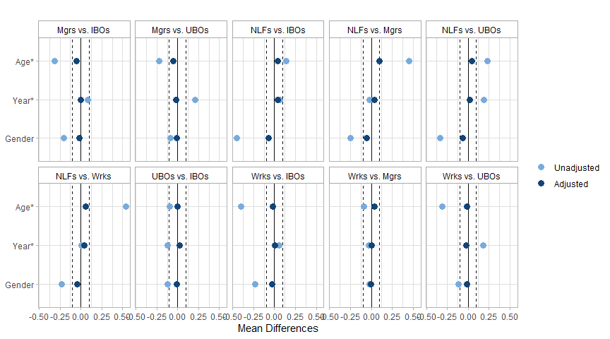<!-- -->

##### Subdivided 


```r
covs <- subset(dat_sub_no_hisp, select=c('age', 'year', 'sex'))
               
love.plot(covs,
          treat=dat_sub_no_hisp$class_occ, 
          weights=dat_sub_no_hisp$sw_sub, 
          threshold=c(m=0.1), 
          which=.all) +
  facet_wrap(~treat, nrow=4) +
  scale_color_manual(values=c("#77AADD", "#114477")) +
  theme_light() +
  theme(legend.title=element_blank(), plot.title=element_blank(), 
        strip.background=element_rect(color="darkgrey", fill=NA), strip.text=element_text(color="black")) +
  scale_y_discrete(labels=rev(c("Age*", "Year*", "Gender"))) 
```

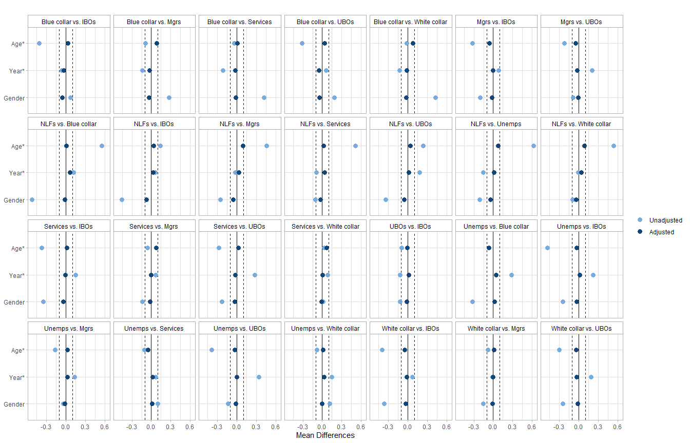<!-- -->

#### Survival 


```r
#overall
kapped_over <- survfit(Surv(time,dead)~class, robust=T, w=sw_f_over, data=dat_sub_no_hisp, se=T)
mod_over <- coxph(Surv(time,dead)~class, robust=T, w=sw_f_over, data=dat_sub_no_hisp)
binded_over <- survdiffed(datted=kapped_over)

#subdivided workers
kapped_sub <- survfit(Surv(time,dead)~class_occ, robust=T, w=sw_f_sub, data=dat_sub_no_hisp, se=T)
mod_sub <- coxph(Surv(time,dead)~class_occ, robust=T, w=sw_f_sub, data=dat_sub_no_hisp)
binded_sub <- survdiffed_sub(datted=kapped_sub)
```

##### IPW survival plots


```r
plotted(datted=kapped_over, 
        grpd="Workers undivided", 
        grps=170) + 
  scale_x_continuous(limits=c(0, 34), breaks=seq(1, 34, 3), expand=expansion(mult=c(0,0.16))) +
plotted(datted=kapped_sub, 
        classed=factor(c(rep("IBOs", 34), rep("UBOs", 34), rep("Mgrs", 34), rep("WCs", 34), rep("Servs", 34), 
                         rep("BCs", 34), rep("Unemps", 34), rep("NLFs", 34)), 
                       levels=c("IBOs", "UBOs", "Mgrs", "WCs", "BCs", "Servs", "Unemps", "NLFs")),
        grpd="Workers subdivided",
        grps=272, 
        repped=8,
        dummied=c("IBOs", "UBOs", "Mgrs", "WCs", "Servs", "BCs", "Unemps", "NLFs"),
        val=c(brewer.pal(n = 12, name = "Paired")[c(2,8,4)], brewer.pal(n=9, name="Purples")[c(5,6,7,8)], brewer.pal(n = 12, name = "Paired")[c(6)])) + 
  scale_x_continuous(limits=c(0, 34), breaks=seq(1, 34, 3), expand=expansion(mult=c(0,0.16))) +
  theme(axis.title.y=element_blank(), axis.text.y=element_blank(), axis.ticks.y=element_blank()) 
```

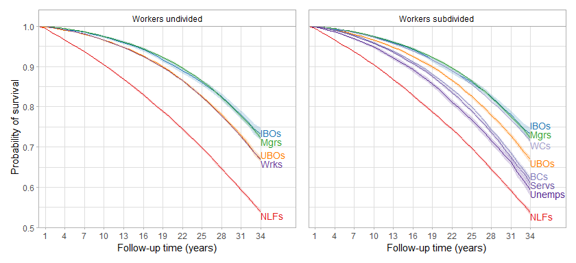<!-- -->

```r
ggsave("overall_subdivided.png", dpi=600, height=4, width=8.75)
```

##### IPW survival differences and hazard ratios


```r
tidy_n(modded=mod_over, bind=binded_over)
```

<table class="table table-striped" style="margin-left: auto; margin-right: auto;">
<caption>Ref: IBOs</caption>
 <thead>
<tr>
<th style="empty-cells: hide;border-bottom:hidden;" colspan="1"></th>
<th style="border-bottom:hidden;padding-bottom:0; padding-left:3px;padding-right:3px;text-align: center; " colspan="3"><div style="border-bottom: 1px solid #ddd; padding-bottom: 5px; ">HR</div></th>
<th style="border-bottom:hidden;padding-bottom:0; padding-left:3px;padding-right:3px;text-align: center; " colspan="3"><div style="border-bottom: 1px solid #ddd; padding-bottom: 5px; ">SD per 100 at end of f/u</div></th>
<th style="empty-cells: hide;border-bottom:hidden;" colspan="1"></th>
</tr>
  <tr>
   <th style="text-align:left;">   </th>
   <th style="text-align:right;"> HR </th>
   <th style="text-align:right;"> Lower </th>
   <th style="text-align:right;"> Upper </th>
   <th style="text-align:right;"> SD </th>
   <th style="text-align:right;"> Lower </th>
   <th style="text-align:right;"> Upper </th>
   <th style="text-align:right;"> N </th>
  </tr>
 </thead>
<tbody>
  <tr>
   <td style="text-align:left;"> classUBOs </td>
   <td style="text-align:right;"> 1.28 </td>
   <td style="text-align:right;"> 1.21 </td>
   <td style="text-align:right;"> 1.36 </td>
   <td style="text-align:right;"> -6.3 </td>
   <td style="text-align:right;"> -8.1 </td>
   <td style="text-align:right;"> -4.6 </td>
   <td style="text-align:right;"> 911850 </td>
  </tr>
  <tr>
   <td style="text-align:left;"> classMgrs </td>
   <td style="text-align:right;"> 0.99 </td>
   <td style="text-align:right;"> 0.93 </td>
   <td style="text-align:right;"> 1.05 </td>
   <td style="text-align:right;"> -1.0 </td>
   <td style="text-align:right;"> -2.7 </td>
   <td style="text-align:right;"> 0.7 </td>
   <td style="text-align:right;">  </td>
  </tr>
  <tr>
   <td style="text-align:left;"> classWrks </td>
   <td style="text-align:right;"> 1.29 </td>
   <td style="text-align:right;"> 1.22 </td>
   <td style="text-align:right;"> 1.36 </td>
   <td style="text-align:right;"> -6.6 </td>
   <td style="text-align:right;"> -8.1 </td>
   <td style="text-align:right;"> -5.0 </td>
   <td style="text-align:right;">  </td>
  </tr>
  <tr>
   <td style="text-align:left;"> classNLFs </td>
   <td style="text-align:right;"> 2.57 </td>
   <td style="text-align:right;"> 2.44 </td>
   <td style="text-align:right;"> 2.72 </td>
   <td style="text-align:right;"> -19.4 </td>
   <td style="text-align:right;"> -21.0 </td>
   <td style="text-align:right;"> -17.7 </td>
   <td style="text-align:right;">  </td>
  </tr>
</tbody>
</table>

```r
tidy_n(modded=mod_sub, bind=binded_sub, rows=1:7, nad=6)
```

<table class="table table-striped" style="margin-left: auto; margin-right: auto;">
<caption>Ref: IBOs</caption>
 <thead>
<tr>
<th style="empty-cells: hide;border-bottom:hidden;" colspan="1"></th>
<th style="border-bottom:hidden;padding-bottom:0; padding-left:3px;padding-right:3px;text-align: center; " colspan="3"><div style="border-bottom: 1px solid #ddd; padding-bottom: 5px; ">HR</div></th>
<th style="border-bottom:hidden;padding-bottom:0; padding-left:3px;padding-right:3px;text-align: center; " colspan="3"><div style="border-bottom: 1px solid #ddd; padding-bottom: 5px; ">SD per 100 at end of f/u</div></th>
<th style="empty-cells: hide;border-bottom:hidden;" colspan="1"></th>
</tr>
  <tr>
   <th style="text-align:left;">   </th>
   <th style="text-align:right;"> HR </th>
   <th style="text-align:right;"> Lower </th>
   <th style="text-align:right;"> Upper </th>
   <th style="text-align:right;"> SD </th>
   <th style="text-align:right;"> Lower </th>
   <th style="text-align:right;"> Upper </th>
   <th style="text-align:right;"> N </th>
  </tr>
 </thead>
<tbody>
  <tr>
   <td style="text-align:left;"> class_occUBOs </td>
   <td style="text-align:right;"> 1.28 </td>
   <td style="text-align:right;"> 1.21 </td>
   <td style="text-align:right;"> 1.36 </td>
   <td style="text-align:right;"> -6.4 </td>
   <td style="text-align:right;"> -8.1 </td>
   <td style="text-align:right;"> -4.6 </td>
   <td style="text-align:right;"> 911850 </td>
  </tr>
  <tr>
   <td style="text-align:left;"> class_occMgrs </td>
   <td style="text-align:right;"> 0.99 </td>
   <td style="text-align:right;"> 0.93 </td>
   <td style="text-align:right;"> 1.05 </td>
   <td style="text-align:right;"> -1.0 </td>
   <td style="text-align:right;"> -2.8 </td>
   <td style="text-align:right;"> 0.7 </td>
   <td style="text-align:right;">  </td>
  </tr>
  <tr>
   <td style="text-align:left;"> class_occWhite collar </td>
   <td style="text-align:right;"> 1.05 </td>
   <td style="text-align:right;"> 0.99 </td>
   <td style="text-align:right;"> 1.11 </td>
   <td style="text-align:right;"> -1.9 </td>
   <td style="text-align:right;"> -3.5 </td>
   <td style="text-align:right;"> -0.3 </td>
   <td style="text-align:right;">  </td>
  </tr>
  <tr>
   <td style="text-align:left;"> class_occServices </td>
   <td style="text-align:right;"> 1.58 </td>
   <td style="text-align:right;"> 1.49 </td>
   <td style="text-align:right;"> 1.67 </td>
   <td style="text-align:right;"> -12.2 </td>
   <td style="text-align:right;"> -14.0 </td>
   <td style="text-align:right;"> -10.4 </td>
   <td style="text-align:right;">  </td>
  </tr>
  <tr>
   <td style="text-align:left;"> class_occBlue collar </td>
   <td style="text-align:right;"> 1.51 </td>
   <td style="text-align:right;"> 1.43 </td>
   <td style="text-align:right;"> 1.60 </td>
   <td style="text-align:right;"> -11.2 </td>
   <td style="text-align:right;"> -13.0 </td>
   <td style="text-align:right;"> -9.5 </td>
   <td style="text-align:right;">  </td>
  </tr>
  <tr>
   <td style="text-align:left;"> class_occUnemps </td>
   <td style="text-align:right;"> 1.77 </td>
   <td style="text-align:right;"> 1.66 </td>
   <td style="text-align:right;"> 1.88 </td>
   <td style="text-align:right;"> -14.0 </td>
   <td style="text-align:right;"> -16.1 </td>
   <td style="text-align:right;"> -11.9 </td>
   <td style="text-align:right;">  </td>
  </tr>
  <tr>
   <td style="text-align:left;"> class_occNLFs </td>
   <td style="text-align:right;"> 2.58 </td>
   <td style="text-align:right;"> 2.45 </td>
   <td style="text-align:right;"> 2.73 </td>
   <td style="text-align:right;"> -19.6 </td>
   <td style="text-align:right;"> -21.2 </td>
   <td style="text-align:right;"> -17.9 </td>
   <td style="text-align:right;">  </td>
  </tr>
</tbody>
</table>

### More-adjusted (age, gender, year, education, marital status, region, and racialized group)

#### Distribution of IPW

Truncated at 0.5% and 99.5%.

##### Overall


```r
dat_sub_no_hisp %>%
  mutate(sw_over_adj=ipwpoint(exposure=class,
                              family="multinomial",
                              link="logit",
                              numerator=~1,
                              denominator=~rcs(age, 3) + sex + rcs(int_year_fin, 5) + educ + marital_tri + region + race_h, 
                              data=dat_sub_no_hisp,
                              weights=mortwt_f,
                              trace=FALSE,
                              maxit=1000,
                              trunc=0.005)$weights.trunc,
         sw_f_over_adj=sw_over_adj*mortwt_f)  -> dat_sub_no_hisp

summary(dat_sub_no_hisp$sw_over_adj)
```

```
##    Min. 1st Qu.  Median    Mean 3rd Qu.    Max. 
##  0.2793  0.7963  0.9183  0.9817  1.0791  3.8188
```

##### Subdivided


```r
dat_sub_no_hisp %>%
  mutate(sw_sub_adj=ipwpoint(exposure=class_occ,
                         family="multinomial",
                         link="logit",
                         numerator=~1,
                         denominator=~rcs(age, 3) + sex + rcs(int_year_fin, 5) + educ + marital_tri + region + race_h, 
                         data=dat_sub_no_hisp,
                         weights=mortwt_f,
                         trace=FALSE,
                         maxit=1000,
                         trunc=0.005)$weights.trunc,
         sw_f_sub_adj=sw_sub_adj*mortwt_f)  -> dat_sub_no_hisp

summary(dat_sub_no_hisp$sw_sub_adj)
```

```
##    Min. 1st Qu.  Median    Mean 3rd Qu.    Max. 
##  0.2646  0.5132  0.7314  0.9712  1.1228  6.0451
```

#### Covariate balance after weighting

SMDs for continuous variables; MDs for binary/categorical variables.

##### Overall


```r
covs <- subset(dat_sub_no_hisp, select=c('age', 'year', 'sex', 'race_h', 'educ', 'marital_tri', 'region'))
               
love.plot(covs,
          treat=dat_sub_no_hisp$class, 
          weights=dat_sub_no_hisp$sw_over_adj, 
          threshold=c(m=0.1), 
          which=.all) +
  facet_wrap(~treat, nrow=2) +
  scale_color_manual(values=c("#77AADD", "#114477")) +
  theme_light() +
  theme(legend.title=element_blank(), plot.title=element_blank(), 
        strip.background=element_rect(color="darkgrey", fill=NA), strip.text=element_text(color="black")) +
  scale_y_discrete(labels=rev(c("Age*", "Year*", "Gender", 'NH white', "NH black", "Hispanic", "NH other", 
                                "<HS", "HS", "Some college", "College+", "Married", "Single", "Wid/div/sep", "MW", "NE", "S", "W"))) 
```

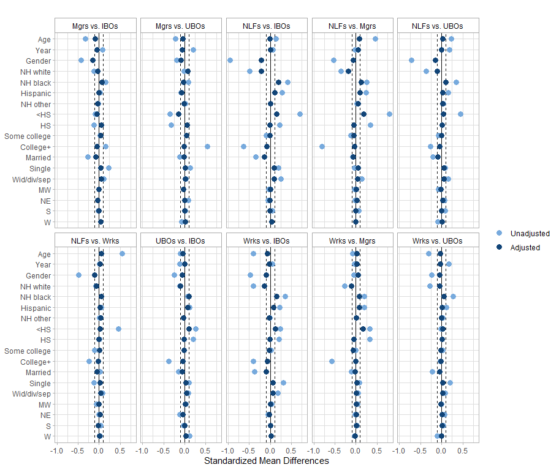<!-- -->

##### Subdivided 


```r
covs <- subset(dat_sub_no_hisp, select=c('age', 'year', 'sex', 'race_h', 'educ', 'marital_tri', 'region'))
               
love.plot(covs,
          treat=dat_sub_no_hisp$class_occ, 
          weights=dat_sub_no_hisp$sw_sub_adj, 
          threshold=c(m=0.1), 
          which=.all) +
  facet_wrap(~treat, nrow=4) +
  scale_color_manual(values=c("#77AADD", "#114477")) +
  theme_light() +
  theme(legend.title=element_blank(), plot.title=element_blank(), 
        strip.background=element_rect(color="darkgrey", fill=NA), strip.text=element_text(color="black")) +
  scale_y_discrete(labels=rev(c("Age*", "Year*", "Gender", 'NH white', "NH black", "Hispanic", "NH other", 
                                "<HS", "HS", "Some college", "College+", "Married", "Single", "Wid/div/sep", "MW", "NE", "S", "W"))) 
```

<!-- -->

#### Survival 


```r
#overall
kapped_over <- survfit(Surv(time,dead)~class, robust=T, w=sw_f_over_adj, data=dat_sub_no_hisp, se=T)
mod_over <- coxph(Surv(time,dead)~class, robust=T, w=sw_f_over_adj, data=dat_sub_no_hisp)
binded_over <- survdiffed(datted=kapped_over)

#subdivided workers
kapped_sub <- survfit(Surv(time,dead)~class_occ, robust=T, w=sw_f_sub_adj, data=dat_sub_no_hisp, se=T)
mod_sub <- coxph(Surv(time,dead)~class_occ, robust=T, w=sw_f_sub_adj, data=dat_sub_no_hisp)
binded_sub <- survdiffed_sub(datted=kapped_sub)
```

##### IPW survival plots


```r
plotted(datted=kapped_over, 
        grpd="Workers undivided", 
        grps=170) + 
  scale_x_continuous(limits=c(0, 34), breaks=seq(1, 34, 3), expand=expansion(mult=c(0,0.16))) +
plotted(datted=kapped_sub, 
        classed=factor(c(rep("IBOs", 34), rep("UBOs", 34), rep("Mgrs", 34), rep("WCs", 34), rep("Servs", 34), 
                         rep("BCs", 34), rep("Unemps", 34), rep("NLFs", 34)), 
                       levels=c("IBOs", "UBOs", "Mgrs", "WCs", "Servs", "BCs", "Unemps", "NLFs")),
        grpd="Workers subdivided",
        grps=272, 
        repped=8,
        dummied=c("IBOs", "UBOs", "Mgrs", "WCs", "Servs", "BCs", "Unemps", "NLFs"),
        vjusted=1.5,
        val=c(brewer.pal(n = 12, name = "Paired")[c(2,8,4)], brewer.pal(n=9, name="Purples")[c(5,6,7,8)], brewer.pal(n = 12, name = "Paired")[c(6)])) + 
  scale_x_continuous(limits=c(0, 34), breaks=seq(1, 34, 3), expand=expansion(mult=c(0,0.16))) +
  theme(axis.title.y=element_blank(), axis.text.y=element_blank(), axis.ticks.y=element_blank()) 
```

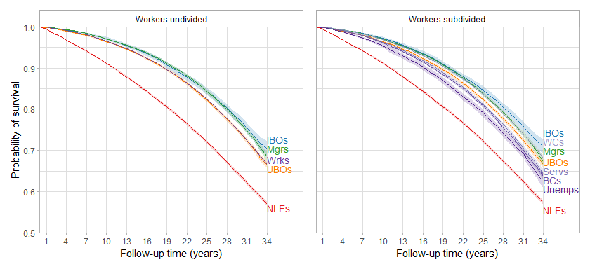<!-- -->

```r
ggsave("overall_subdivided_adj.png", dpi=600, height=4, width=8.75)
```

##### IPW survival differences and hazard ratios


```r
tidy_n(modded=mod_over, bind=binded_over)
```

<table class="table table-striped" style="margin-left: auto; margin-right: auto;">
<caption>Ref: IBOs</caption>
 <thead>
<tr>
<th style="empty-cells: hide;border-bottom:hidden;" colspan="1"></th>
<th style="border-bottom:hidden;padding-bottom:0; padding-left:3px;padding-right:3px;text-align: center; " colspan="3"><div style="border-bottom: 1px solid #ddd; padding-bottom: 5px; ">HR</div></th>
<th style="border-bottom:hidden;padding-bottom:0; padding-left:3px;padding-right:3px;text-align: center; " colspan="3"><div style="border-bottom: 1px solid #ddd; padding-bottom: 5px; ">SD per 100 at end of f/u</div></th>
<th style="empty-cells: hide;border-bottom:hidden;" colspan="1"></th>
</tr>
  <tr>
   <th style="text-align:left;">   </th>
   <th style="text-align:right;"> HR </th>
   <th style="text-align:right;"> Lower </th>
   <th style="text-align:right;"> Upper </th>
   <th style="text-align:right;"> SD </th>
   <th style="text-align:right;"> Lower </th>
   <th style="text-align:right;"> Upper </th>
   <th style="text-align:right;"> N </th>
  </tr>
 </thead>
<tbody>
  <tr>
   <td style="text-align:left;"> classUBOs </td>
   <td style="text-align:right;"> 1.17 </td>
   <td style="text-align:right;"> 1.10 </td>
   <td style="text-align:right;"> 1.24 </td>
   <td style="text-align:right;"> -3.9 </td>
   <td style="text-align:right;"> -5.9 </td>
   <td style="text-align:right;"> -1.9 </td>
   <td style="text-align:right;"> 911850 </td>
  </tr>
  <tr>
   <td style="text-align:left;"> classMgrs </td>
   <td style="text-align:right;"> 1.02 </td>
   <td style="text-align:right;"> 0.95 </td>
   <td style="text-align:right;"> 1.08 </td>
   <td style="text-align:right;"> -2.0 </td>
   <td style="text-align:right;"> -4.1 </td>
   <td style="text-align:right;"> 0.1 </td>
   <td style="text-align:right;">  </td>
  </tr>
  <tr>
   <td style="text-align:left;"> classWrks </td>
   <td style="text-align:right;"> 1.15 </td>
   <td style="text-align:right;"> 1.09 </td>
   <td style="text-align:right;"> 1.22 </td>
   <td style="text-align:right;"> -3.8 </td>
   <td style="text-align:right;"> -5.6 </td>
   <td style="text-align:right;"> -2.0 </td>
   <td style="text-align:right;">  </td>
  </tr>
  <tr>
   <td style="text-align:left;"> classNLFs </td>
   <td style="text-align:right;"> 2.08 </td>
   <td style="text-align:right;"> 1.97 </td>
   <td style="text-align:right;"> 2.21 </td>
   <td style="text-align:right;"> -13.4 </td>
   <td style="text-align:right;"> -15.3 </td>
   <td style="text-align:right;"> -11.5 </td>
   <td style="text-align:right;">  </td>
  </tr>
</tbody>
</table>

```r
tidy_n(modded=mod_sub, bind=binded_sub, rows=1:7, nad=6)
```

<table class="table table-striped" style="margin-left: auto; margin-right: auto;">
<caption>Ref: IBOs</caption>
 <thead>
<tr>
<th style="empty-cells: hide;border-bottom:hidden;" colspan="1"></th>
<th style="border-bottom:hidden;padding-bottom:0; padding-left:3px;padding-right:3px;text-align: center; " colspan="3"><div style="border-bottom: 1px solid #ddd; padding-bottom: 5px; ">HR</div></th>
<th style="border-bottom:hidden;padding-bottom:0; padding-left:3px;padding-right:3px;text-align: center; " colspan="3"><div style="border-bottom: 1px solid #ddd; padding-bottom: 5px; ">SD per 100 at end of f/u</div></th>
<th style="empty-cells: hide;border-bottom:hidden;" colspan="1"></th>
</tr>
  <tr>
   <th style="text-align:left;">   </th>
   <th style="text-align:right;"> HR </th>
   <th style="text-align:right;"> Lower </th>
   <th style="text-align:right;"> Upper </th>
   <th style="text-align:right;"> SD </th>
   <th style="text-align:right;"> Lower </th>
   <th style="text-align:right;"> Upper </th>
   <th style="text-align:right;"> N </th>
  </tr>
 </thead>
<tbody>
  <tr>
   <td style="text-align:left;"> class_occUBOs </td>
   <td style="text-align:right;"> 1.18 </td>
   <td style="text-align:right;"> 1.11 </td>
   <td style="text-align:right;"> 1.26 </td>
   <td style="text-align:right;"> -4.2 </td>
   <td style="text-align:right;"> -6.2 </td>
   <td style="text-align:right;"> -2.3 </td>
   <td style="text-align:right;"> 911850 </td>
  </tr>
  <tr>
   <td style="text-align:left;"> class_occMgrs </td>
   <td style="text-align:right;"> 1.08 </td>
   <td style="text-align:right;"> 1.01 </td>
   <td style="text-align:right;"> 1.15 </td>
   <td style="text-align:right;"> -3.6 </td>
   <td style="text-align:right;"> -5.8 </td>
   <td style="text-align:right;"> -1.5 </td>
   <td style="text-align:right;">  </td>
  </tr>
  <tr>
   <td style="text-align:left;"> class_occWhite collar </td>
   <td style="text-align:right;"> 1.09 </td>
   <td style="text-align:right;"> 1.02 </td>
   <td style="text-align:right;"> 1.16 </td>
   <td style="text-align:right;"> -2.8 </td>
   <td style="text-align:right;"> -4.6 </td>
   <td style="text-align:right;"> -0.9 </td>
   <td style="text-align:right;">  </td>
  </tr>
  <tr>
   <td style="text-align:left;"> class_occServices </td>
   <td style="text-align:right;"> 1.26 </td>
   <td style="text-align:right;"> 1.19 </td>
   <td style="text-align:right;"> 1.35 </td>
   <td style="text-align:right;"> -6.8 </td>
   <td style="text-align:right;"> -8.9 </td>
   <td style="text-align:right;"> -4.6 </td>
   <td style="text-align:right;">  </td>
  </tr>
  <tr>
   <td style="text-align:left;"> class_occBlue collar </td>
   <td style="text-align:right;"> 1.31 </td>
   <td style="text-align:right;"> 1.23 </td>
   <td style="text-align:right;"> 1.39 </td>
   <td style="text-align:right;"> -7.1 </td>
   <td style="text-align:right;"> -9.1 </td>
   <td style="text-align:right;"> -5.2 </td>
   <td style="text-align:right;">  </td>
  </tr>
  <tr>
   <td style="text-align:left;"> class_occUnemps </td>
   <td style="text-align:right;"> 1.43 </td>
   <td style="text-align:right;"> 1.33 </td>
   <td style="text-align:right;"> 1.54 </td>
   <td style="text-align:right;"> -8.5 </td>
   <td style="text-align:right;"> -10.9 </td>
   <td style="text-align:right;"> -6.1 </td>
   <td style="text-align:right;">  </td>
  </tr>
  <tr>
   <td style="text-align:left;"> class_occNLFs </td>
   <td style="text-align:right;"> 2.10 </td>
   <td style="text-align:right;"> 1.98 </td>
   <td style="text-align:right;"> 2.23 </td>
   <td style="text-align:right;"> -13.6 </td>
   <td style="text-align:right;"> -15.5 </td>
   <td style="text-align:right;"> -11.8 </td>
   <td style="text-align:right;">  </td>
  </tr>
</tbody>
</table>

## Class-by-year stratification - 1986-1996 interview years w/ f/u through end of 2004 vs 2001-2019 interview years w/ f/u through end of 2019

### Less-adjusted (age, gender, year)

#### Distribution of IPW

##### 1986-1996


```r
dat_sub_no_hisp %>%
  filter(int_year_fin<=1996) %>%
  mutate(sw=ipwpoint(exposure=class,
                     family="multinomial",
                     link="logit",
                     numerator=~1,
                     denominator=~rcs(age, 3) + sex + rcs(int_year_fin, 3), 
                     data=subset(dat_sub_no_hisp, int_year_fin<=1996),
                     weights=mortwt_f,
                     maxit=1000,
                     trace=FALSE)$ipw.weights,
         sw_f=sw*mortwt_f)  -> dat_sub_no_hisp_1986

summary(dat_sub_no_hisp_1986$sw)
```

```
##    Min. 1st Qu.  Median    Mean 3rd Qu.    Max. 
##  0.2927  0.8250  0.9391  0.9977  1.0344  6.4528
```

##### 2001-2019


```r
dat_sub_no_hisp %>%
  filter(int_year_fin>=2001) %>%
  mutate(sw=ipwpoint(exposure=class,
                     family="multinomial",
                     link="logit",
                     numerator=~1,
                     denominator=~rcs(age, 3) + sex + rcs(int_year_fin, 3), 
                     data=subset(dat_sub_no_hisp, int_year_fin>=2001),
                     weights=mortwt_f,
                     maxit=1000,
                     trace=FALSE)$ipw.weights,
         sw_f=sw*mortwt_f)  -> dat_sub_no_hisp_2001

summary(dat_sub_no_hisp_2001$sw)
```

```
##    Min. 1st Qu.  Median    Mean 3rd Qu.    Max. 
##  0.3542  0.8552  0.9421  0.9991  1.0757  5.5827
```

#### Survival 


```r
#early
kapped_early <- survfit(Surv(time_86_96_05, dead_86_96_05)~class, robust=T, w=sw_f, data=dat_sub_no_hisp_1986, se=T) 
mod_early <- coxph(Surv(time_86_96_05, dead_86_96_05)~class, robust=T, w=sw_f, data=dat_sub_no_hisp_1986)
binded_early <- survdiffed(kapped_early, timed=19)

#late
kapped_late <- survfit(Surv(time,dead)~class, robust=T, w=sw_f, data=dat_sub_no_hisp_2001, se=T)
mod_late <- coxph(Surv(time,dead)~class, robust=T, w=sw_f, data=dat_sub_no_hisp_2001)
binded_late <- survdiffed(kapped_late, timed=19)
```

##### IPW survival plots


```r
plotted(datted=kapped_early,
        classed_repped=19,
        grpd="1986-1996 with follow-up through 2004", 
        grps=95, 
        bottom=0.75) + 
  scale_x_continuous(limits=c(0, 19), breaks=seq(1, 19, 2), expand=expansion(mult=c(0,0.11)))  +
plotted(datted=kapped_late,
        classed_repped=19,
        grpd="2001-2019 with follow-up through 2019", 
        grps=95, 
        bottom=0.75) + 
  scale_x_continuous(limits=c(0, 19), breaks=seq(1, 19, 2), expand=expansion(mult=c(0,0.11))) +
  theme(axis.title.y=element_blank(), axis.text.y=element_blank(), axis.ticks.y=element_blank())
```

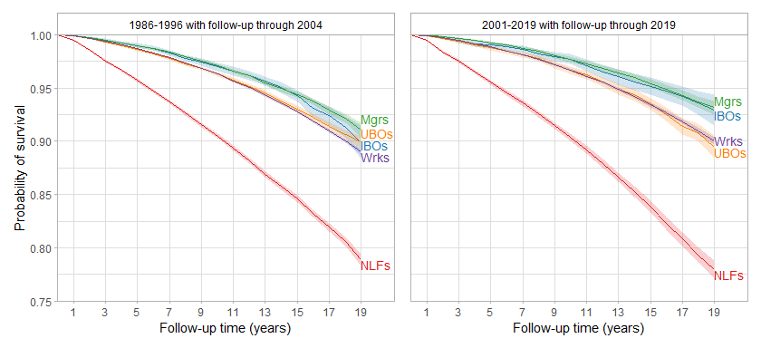<!-- -->

```r
ggsave("change_over_time.png", dpi=600, height=4, width=8.75)
```

##### IPW survival differences and hazard ratios


```r
tidy_n(modded=mod_early, bind=binded_early, captioned="Ref: IBOs (1986-1996 subset)")
```

<table class="table table-striped" style="margin-left: auto; margin-right: auto;">
<caption>Ref: IBOs (1986-1996 subset)</caption>
 <thead>
<tr>
<th style="empty-cells: hide;border-bottom:hidden;" colspan="1"></th>
<th style="border-bottom:hidden;padding-bottom:0; padding-left:3px;padding-right:3px;text-align: center; " colspan="3"><div style="border-bottom: 1px solid #ddd; padding-bottom: 5px; ">HR</div></th>
<th style="border-bottom:hidden;padding-bottom:0; padding-left:3px;padding-right:3px;text-align: center; " colspan="3"><div style="border-bottom: 1px solid #ddd; padding-bottom: 5px; ">SD per 100 at end of f/u</div></th>
<th style="empty-cells: hide;border-bottom:hidden;" colspan="1"></th>
</tr>
  <tr>
   <th style="text-align:left;">   </th>
   <th style="text-align:right;"> HR </th>
   <th style="text-align:right;"> Lower </th>
   <th style="text-align:right;"> Upper </th>
   <th style="text-align:right;"> SD </th>
   <th style="text-align:right;"> Lower </th>
   <th style="text-align:right;"> Upper </th>
   <th style="text-align:right;"> N </th>
  </tr>
 </thead>
<tbody>
  <tr>
   <td style="text-align:left;"> classUBOs </td>
   <td style="text-align:right;"> 1.17 </td>
   <td style="text-align:right;"> 1.05 </td>
   <td style="text-align:right;"> 1.29 </td>
   <td style="text-align:right;"> 0.0 </td>
   <td style="text-align:right;"> -1.7 </td>
   <td style="text-align:right;"> 1.7 </td>
   <td style="text-align:right;"> 564202 </td>
  </tr>
  <tr>
   <td style="text-align:left;"> classMgrs </td>
   <td style="text-align:right;"> 0.95 </td>
   <td style="text-align:right;"> 0.86 </td>
   <td style="text-align:right;"> 1.06 </td>
   <td style="text-align:right;"> 1.2 </td>
   <td style="text-align:right;"> -0.6 </td>
   <td style="text-align:right;"> 2.9 </td>
   <td style="text-align:right;">  </td>
  </tr>
  <tr>
   <td style="text-align:left;"> classWrks </td>
   <td style="text-align:right;"> 1.22 </td>
   <td style="text-align:right;"> 1.10 </td>
   <td style="text-align:right;"> 1.34 </td>
   <td style="text-align:right;"> -0.9 </td>
   <td style="text-align:right;"> -2.5 </td>
   <td style="text-align:right;"> 0.7 </td>
   <td style="text-align:right;">  </td>
  </tr>
  <tr>
   <td style="text-align:left;"> classNLFs </td>
   <td style="text-align:right;"> 2.79 </td>
   <td style="text-align:right;"> 2.53 </td>
   <td style="text-align:right;"> 3.07 </td>
   <td style="text-align:right;"> -11.0 </td>
   <td style="text-align:right;"> -12.7 </td>
   <td style="text-align:right;"> -9.3 </td>
   <td style="text-align:right;">  </td>
  </tr>
</tbody>
</table>

```r
tidy_n(modded=mod_late, bind=binded_late, captioned="Ref: IBOs (2001-2019 subset)")
```

<table class="table table-striped" style="margin-left: auto; margin-right: auto;">
<caption>Ref: IBOs (2001-2019 subset)</caption>
 <thead>
<tr>
<th style="empty-cells: hide;border-bottom:hidden;" colspan="1"></th>
<th style="border-bottom:hidden;padding-bottom:0; padding-left:3px;padding-right:3px;text-align: center; " colspan="3"><div style="border-bottom: 1px solid #ddd; padding-bottom: 5px; ">HR</div></th>
<th style="border-bottom:hidden;padding-bottom:0; padding-left:3px;padding-right:3px;text-align: center; " colspan="3"><div style="border-bottom: 1px solid #ddd; padding-bottom: 5px; ">SD per 100 at end of f/u</div></th>
<th style="empty-cells: hide;border-bottom:hidden;" colspan="1"></th>
</tr>
  <tr>
   <th style="text-align:left;">   </th>
   <th style="text-align:right;"> HR </th>
   <th style="text-align:right;"> Lower </th>
   <th style="text-align:right;"> Upper </th>
   <th style="text-align:right;"> SD </th>
   <th style="text-align:right;"> Lower </th>
   <th style="text-align:right;"> Upper </th>
   <th style="text-align:right;"> N </th>
  </tr>
 </thead>
<tbody>
  <tr>
   <td style="text-align:left;"> classUBOs </td>
   <td style="text-align:right;"> 1.38 </td>
   <td style="text-align:right;"> 1.16 </td>
   <td style="text-align:right;"> 1.65 </td>
   <td style="text-align:right;"> -3.5 </td>
   <td style="text-align:right;"> -5.2 </td>
   <td style="text-align:right;"> -1.7 </td>
   <td style="text-align:right;"> 347648 </td>
  </tr>
  <tr>
   <td style="text-align:left;"> classMgrs </td>
   <td style="text-align:right;"> 0.93 </td>
   <td style="text-align:right;"> 0.78 </td>
   <td style="text-align:right;"> 1.11 </td>
   <td style="text-align:right;"> 0.3 </td>
   <td style="text-align:right;"> -1.3 </td>
   <td style="text-align:right;"> 1.8 </td>
   <td style="text-align:right;">  </td>
  </tr>
  <tr>
   <td style="text-align:left;"> classWrks </td>
   <td style="text-align:right;"> 1.36 </td>
   <td style="text-align:right;"> 1.16 </td>
   <td style="text-align:right;"> 1.59 </td>
   <td style="text-align:right;"> -2.9 </td>
   <td style="text-align:right;"> -4.3 </td>
   <td style="text-align:right;"> -1.4 </td>
   <td style="text-align:right;">  </td>
  </tr>
  <tr>
   <td style="text-align:left;"> classNLFs </td>
   <td style="text-align:right;"> 3.80 </td>
   <td style="text-align:right;"> 3.24 </td>
   <td style="text-align:right;"> 4.45 </td>
   <td style="text-align:right;"> -14.9 </td>
   <td style="text-align:right;"> -16.6 </td>
   <td style="text-align:right;"> -13.3 </td>
   <td style="text-align:right;">  </td>
  </tr>
</tbody>
</table>

### More-adjusted (age, gender, year, education, marital status, region, and racialized group)

#### Distribution of IPW

Truncated at 0.5% and 99.5%.

##### 1986-1996


```r
dat_sub_no_hisp %>%
  filter(int_year_fin<=1996) %>%
  mutate(sw=ipwpoint(exposure=class,
                     family="multinomial",
                     link="logit",
                     numerator=~1,
                     denominator=~rcs(age, 3) + sex + rcs(int_year_fin, 3) + educ + marital_tri + region + race_h, 
                     data=subset(dat_sub_no_hisp, int_year_fin<=1996),
                     weights=mortwt_f,
                     trace=FALSE,
                     maxit=1000,
                     trunc=0.005)$weights.trunc,
         sw_f=sw*mortwt_f)  -> dat_sub_no_hisp_1986

summary(dat_sub_no_hisp_1986$sw)
```

```
##    Min. 1st Qu.  Median    Mean 3rd Qu.    Max. 
##  0.2562  0.7771  0.9153  0.9863  1.0726  4.3989
```

##### 2001-2019


```r
dat_sub_no_hisp %>%
  filter(int_year_fin>=2001) %>%
  mutate(sw=ipwpoint(exposure=class,
                     family="multinomial",
                     link="logit",
                     numerator=~1,
                     denominator=~rcs(age, 3) + sex + rcs(int_year_fin, 3) + educ + marital_tri + region + race_h, 
                     data=subset(dat_sub_no_hisp, int_year_fin>=2001),
                     weights=mortwt_f,
                     trace=FALSE,
                     maxit=1000,
                     trunc=0.005)$weights.trunc,
         sw_f=sw*mortwt_f)  -> dat_sub_no_hisp_2001

summary(dat_sub_no_hisp_2001$sw)
```

```
##    Min. 1st Qu.  Median    Mean 3rd Qu.    Max. 
##  0.2943  0.8045  0.9188  0.9886  1.0877  3.5681
```

#### Survival


```r
#early
kapped_early <- survfit(Surv(time_86_96_05, dead_86_96_05)~class, robust=T, w=sw_f, data=dat_sub_no_hisp_1986, se=T) 
mod_early <- coxph(Surv(time_86_96_05, dead_86_96_05)~class, robust=T, w=sw_f, data=dat_sub_no_hisp_1986)
binded_early <- survdiffed(kapped_early, timed=19)

#late
kapped_late <- survfit(Surv(time,dead)~class, robust=T, w=sw_f, data=dat_sub_no_hisp_2001, se=T)
mod_late <- coxph(Surv(time,dead)~class, robust=T, w=sw_f, data=dat_sub_no_hisp_2001)
binded_late <- survdiffed(kapped_late, timed=19)
```

##### IPW survival plots


```r
plotted(datted=kapped_early,
        classed_repped=19,
        grpd="1986-1996 with follow-up through 2004", 
        grps=95, 
        vjusted=1.5,
        bottom=0.75) + 
  scale_x_continuous(limits=c(0, 19), breaks=seq(1, 19, 2), expand=expansion(mult=c(0,0.11))) +
plotted(datted=kapped_late,
        classed_repped=19,
        grpd="2001-2019 with follow-up through 2019", 
        grps=95, 
        bottom=0.75) + 
  scale_x_continuous(limits=c(0, 19), breaks=seq(1, 19, 2), expand=expansion(mult=c(0,0.11))) +
  theme(axis.title.y=element_blank(), axis.text.y=element_blank(), axis.ticks.y=element_blank())
```

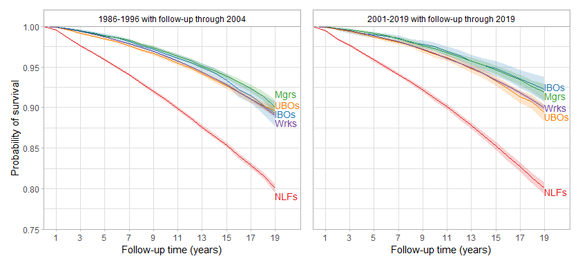<!-- -->

```r
ggsave("change_over_time_adj.png", dpi=600, height=4, width=8.75)
```

##### IPW survival differences and hazard ratios


```r
tidy_n(modded=mod_early, bind=binded_early, captioned="Ref: IBOs (1986-1996 subset)")
```

<table class="table table-striped" style="margin-left: auto; margin-right: auto;">
<caption>Ref: IBOs (1986-1996 subset)</caption>
 <thead>
<tr>
<th style="empty-cells: hide;border-bottom:hidden;" colspan="1"></th>
<th style="border-bottom:hidden;padding-bottom:0; padding-left:3px;padding-right:3px;text-align: center; " colspan="3"><div style="border-bottom: 1px solid #ddd; padding-bottom: 5px; ">HR</div></th>
<th style="border-bottom:hidden;padding-bottom:0; padding-left:3px;padding-right:3px;text-align: center; " colspan="3"><div style="border-bottom: 1px solid #ddd; padding-bottom: 5px; ">SD per 100 at end of f/u</div></th>
<th style="empty-cells: hide;border-bottom:hidden;" colspan="1"></th>
</tr>
  <tr>
   <th style="text-align:left;">   </th>
   <th style="text-align:right;"> HR </th>
   <th style="text-align:right;"> Lower </th>
   <th style="text-align:right;"> Upper </th>
   <th style="text-align:right;"> SD </th>
   <th style="text-align:right;"> Lower </th>
   <th style="text-align:right;"> Upper </th>
   <th style="text-align:right;"> N </th>
  </tr>
 </thead>
<tbody>
  <tr>
   <td style="text-align:left;"> classUBOs </td>
   <td style="text-align:right;"> 1.09 </td>
   <td style="text-align:right;"> 0.98 </td>
   <td style="text-align:right;"> 1.21 </td>
   <td style="text-align:right;"> 0.3 </td>
   <td style="text-align:right;"> -1.3 </td>
   <td style="text-align:right;"> 2.0 </td>
   <td style="text-align:right;"> 564202 </td>
  </tr>
  <tr>
   <td style="text-align:left;"> classMgrs </td>
   <td style="text-align:right;"> 0.92 </td>
   <td style="text-align:right;"> 0.82 </td>
   <td style="text-align:right;"> 1.03 </td>
   <td style="text-align:right;"> 0.8 </td>
   <td style="text-align:right;"> -1.0 </td>
   <td style="text-align:right;"> 2.6 </td>
   <td style="text-align:right;">  </td>
  </tr>
  <tr>
   <td style="text-align:left;"> classWrks </td>
   <td style="text-align:right;"> 1.07 </td>
   <td style="text-align:right;"> 0.97 </td>
   <td style="text-align:right;"> 1.19 </td>
   <td style="text-align:right;"> -0.2 </td>
   <td style="text-align:right;"> -1.8 </td>
   <td style="text-align:right;"> 1.4 </td>
   <td style="text-align:right;">  </td>
  </tr>
  <tr>
   <td style="text-align:left;"> classNLFs </td>
   <td style="text-align:right;"> 2.33 </td>
   <td style="text-align:right;"> 2.11 </td>
   <td style="text-align:right;"> 2.58 </td>
   <td style="text-align:right;"> -9.2 </td>
   <td style="text-align:right;"> -10.9 </td>
   <td style="text-align:right;"> -7.5 </td>
   <td style="text-align:right;">  </td>
  </tr>
</tbody>
</table>

```r
tidy_n(modded=mod_late, bind=binded_late, captioned="Ref: IBOs (2001-2019 subset)")
```

<table class="table table-striped" style="margin-left: auto; margin-right: auto;">
<caption>Ref: IBOs (2001-2019 subset)</caption>
 <thead>
<tr>
<th style="empty-cells: hide;border-bottom:hidden;" colspan="1"></th>
<th style="border-bottom:hidden;padding-bottom:0; padding-left:3px;padding-right:3px;text-align: center; " colspan="3"><div style="border-bottom: 1px solid #ddd; padding-bottom: 5px; ">HR</div></th>
<th style="border-bottom:hidden;padding-bottom:0; padding-left:3px;padding-right:3px;text-align: center; " colspan="3"><div style="border-bottom: 1px solid #ddd; padding-bottom: 5px; ">SD per 100 at end of f/u</div></th>
<th style="empty-cells: hide;border-bottom:hidden;" colspan="1"></th>
</tr>
  <tr>
   <th style="text-align:left;">   </th>
   <th style="text-align:right;"> HR </th>
   <th style="text-align:right;"> Lower </th>
   <th style="text-align:right;"> Upper </th>
   <th style="text-align:right;"> SD </th>
   <th style="text-align:right;"> Lower </th>
   <th style="text-align:right;"> Upper </th>
   <th style="text-align:right;"> N </th>
  </tr>
 </thead>
<tbody>
  <tr>
   <td style="text-align:left;"> classUBOs </td>
   <td style="text-align:right;"> 1.30 </td>
   <td style="text-align:right;"> 1.09 </td>
   <td style="text-align:right;"> 1.56 </td>
   <td style="text-align:right;"> -2.9 </td>
   <td style="text-align:right;"> -4.8 </td>
   <td style="text-align:right;"> -1.1 </td>
   <td style="text-align:right;"> 347648 </td>
  </tr>
  <tr>
   <td style="text-align:left;"> classMgrs </td>
   <td style="text-align:right;"> 1.01 </td>
   <td style="text-align:right;"> 0.84 </td>
   <td style="text-align:right;"> 1.22 </td>
   <td style="text-align:right;"> -0.3 </td>
   <td style="text-align:right;"> -2.1 </td>
   <td style="text-align:right;"> 1.5 </td>
   <td style="text-align:right;">  </td>
  </tr>
  <tr>
   <td style="text-align:left;"> classWrks </td>
   <td style="text-align:right;"> 1.25 </td>
   <td style="text-align:right;"> 1.06 </td>
   <td style="text-align:right;"> 1.47 </td>
   <td style="text-align:right;"> -2.3 </td>
   <td style="text-align:right;"> -3.8 </td>
   <td style="text-align:right;"> -0.7 </td>
   <td style="text-align:right;">  </td>
  </tr>
  <tr>
   <td style="text-align:left;"> classNLFs </td>
   <td style="text-align:right;"> 3.16 </td>
   <td style="text-align:right;"> 2.68 </td>
   <td style="text-align:right;"> 3.72 </td>
   <td style="text-align:right;"> -12.2 </td>
   <td style="text-align:right;"> -13.9 </td>
   <td style="text-align:right;"> -10.5 </td>
   <td style="text-align:right;">  </td>
  </tr>
</tbody>
</table>

## Class-by-gender and class-by-racialized-group interaction

### Distribution of IPW

#### Gender


```r
dat_sub_no_hisp %>%
  mutate(sw_gend=ipwpoint(exposure=class_gender,
                          family="multinomial",
                          link="logit",
                          numerator=~1,
                          denominator=~rcs(age, 3) + rcs(int_year_fin, 5), 
                          data=dat_sub_no_hisp,
                          weights=mortwt_f,
                          maxit=1000,
                          trace=FALSE)$ipw.weights,
         sw_f_gend=sw_gend*mortwt_f,
         gender=ifelse(sex=="female", "Women", "Men"))  -> dat_sub_no_hisp

summary(dat_sub_no_hisp$sw_gend)
```

```
##    Min. 1st Qu.  Median    Mean 3rd Qu.    Max. 
##  0.2644  0.8758  0.9455  0.9962  1.0909  4.2343
```

#### Racialized group


```r
dat_sub_no_hisp %>%
  mutate(sw_race=ipwpoint(exposure=class_poc,
                          family="multinomial",
                          link="logit",
                          numerator=~1,
                          denominator=~rcs(age, 3) + sex + rcs(int_year_fin, 5), 
                          data=dat_sub_no_hisp,
                          weights=mortwt_f,
                          maxit=1000,
                          trace=FALSE)$ipw.weights,
         sw_f_race=sw_race*mortwt_f)  -> dat_sub_no_hisp

summary(dat_sub_no_hisp$sw_race)
```

```
##    Min. 1st Qu.  Median    Mean 3rd Qu.    Max. 
##  0.2595  0.8106  0.9170  0.9995  1.0863  7.9415
```

### Survival


```r
#gender
kapped_gend <- survfit(Surv(time,dead)~class_gender, robust=T, w=sw_f_gend, data=dat_sub_no_hisp, se=T)
mod_gend <- coxph(Surv(time,dead)~class_gender, robust=T, w=sw_f_gend, data=dat_sub_no_hisp)
binded_gend <- survdiffed_group(kapped_gend)

#racialized group
kapped_race <- survfit(Surv(time,dead)~class_poc, robust=T, w=sw_f_race, data=dat_sub_no_hisp, se=T)
mod_race <- coxph(Surv(time,dead)~class_poc, robust=T, w=sw_f_race, data=dat_sub_no_hisp)
binded_race <- survdiffed_group(kapped_race)
```

#### IPW survival plots


```r
plotted_group(kapped_gend, grpd1="Men", grpd2="Women", bottom=0.40) +
  theme(axis.title.x=element_blank(), axis.text.x=element_blank(), axis.ticks.x=element_blank()) +
plotted_group(kapped_race, grpd1="NH white", grpd2="NH Black, Hispanic, or NH other", bottom=0.40) +
  plot_layout(ncol=1)
```

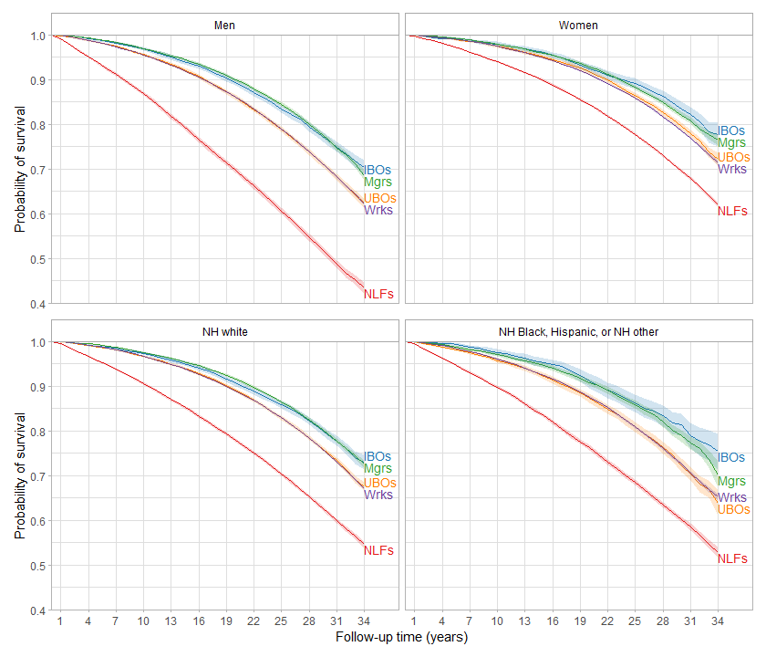<!-- -->

```r
ggsave("gender_race_survival.png", dpi=600, height=7.5, width=8.75)
```

#### IPW survival differences and hazard ratios


```r
tidy_n(modded=mod_gend, bind=binded_gend, rows=1:9, nad=8, captioned="Ref: male IBOs")
```

<table class="table table-striped" style="margin-left: auto; margin-right: auto;">
<caption>Ref: male IBOs</caption>
 <thead>
<tr>
<th style="empty-cells: hide;border-bottom:hidden;" colspan="1"></th>
<th style="border-bottom:hidden;padding-bottom:0; padding-left:3px;padding-right:3px;text-align: center; " colspan="3"><div style="border-bottom: 1px solid #ddd; padding-bottom: 5px; ">HR</div></th>
<th style="border-bottom:hidden;padding-bottom:0; padding-left:3px;padding-right:3px;text-align: center; " colspan="3"><div style="border-bottom: 1px solid #ddd; padding-bottom: 5px; ">SD per 100 at end of f/u</div></th>
<th style="empty-cells: hide;border-bottom:hidden;" colspan="1"></th>
</tr>
  <tr>
   <th style="text-align:left;">   </th>
   <th style="text-align:right;"> HR </th>
   <th style="text-align:right;"> Lower </th>
   <th style="text-align:right;"> Upper </th>
   <th style="text-align:right;"> SD </th>
   <th style="text-align:right;"> Lower </th>
   <th style="text-align:right;"> Upper </th>
   <th style="text-align:right;"> N </th>
  </tr>
 </thead>
<tbody>
  <tr>
   <td style="text-align:left;"> class_genderMale UBOs </td>
   <td style="text-align:right;"> 1.34 </td>
   <td style="text-align:right;"> 1.25 </td>
   <td style="text-align:right;"> 1.42 </td>
   <td style="text-align:right;"> -7.9 </td>
   <td style="text-align:right;"> -9.9 </td>
   <td style="text-align:right;"> -5.9 </td>
   <td style="text-align:right;"> 911850 </td>
  </tr>
  <tr>
   <td style="text-align:left;"> class_genderMale mgrs </td>
   <td style="text-align:right;"> 0.97 </td>
   <td style="text-align:right;"> 0.91 </td>
   <td style="text-align:right;"> 1.03 </td>
   <td style="text-align:right;"> -1.7 </td>
   <td style="text-align:right;"> -3.7 </td>
   <td style="text-align:right;"> 0.4 </td>
   <td style="text-align:right;">  </td>
  </tr>
  <tr>
   <td style="text-align:left;"> class_genderMale wrks </td>
   <td style="text-align:right;"> 1.34 </td>
   <td style="text-align:right;"> 1.27 </td>
   <td style="text-align:right;"> 1.42 </td>
   <td style="text-align:right;"> -8.0 </td>
   <td style="text-align:right;"> -9.8 </td>
   <td style="text-align:right;"> -6.3 </td>
   <td style="text-align:right;">  </td>
  </tr>
  <tr>
   <td style="text-align:left;"> class_genderMale NLFs </td>
   <td style="text-align:right;"> 3.11 </td>
   <td style="text-align:right;"> 2.93 </td>
   <td style="text-align:right;"> 3.30 </td>
   <td style="text-align:right;"> -26.9 </td>
   <td style="text-align:right;"> -29.1 </td>
   <td style="text-align:right;"> -24.8 </td>
   <td style="text-align:right;">  </td>
  </tr>
  <tr>
   <td style="text-align:left;"> class_genderFemale IBOs </td>
   <td style="text-align:right;"> 0.67 </td>
   <td style="text-align:right;"> 0.60 </td>
   <td style="text-align:right;"> 0.75 </td>
   <td style="text-align:right;"> 7.4 </td>
   <td style="text-align:right;"> 4.3 </td>
   <td style="text-align:right;"> 10.5 </td>
   <td style="text-align:right;">  </td>
  </tr>
  <tr>
   <td style="text-align:left;"> class_genderFemale UBOs </td>
   <td style="text-align:right;"> 0.84 </td>
   <td style="text-align:right;"> 0.78 </td>
   <td style="text-align:right;"> 0.90 </td>
   <td style="text-align:right;"> 2.0 </td>
   <td style="text-align:right;"> -0.2 </td>
   <td style="text-align:right;"> 4.2 </td>
   <td style="text-align:right;">  </td>
  </tr>
  <tr>
   <td style="text-align:left;"> class_genderFemale mgrs </td>
   <td style="text-align:right;"> 0.71 </td>
   <td style="text-align:right;"> 0.66 </td>
   <td style="text-align:right;"> 0.75 </td>
   <td style="text-align:right;"> 6.2 </td>
   <td style="text-align:right;"> 4.2 </td>
   <td style="text-align:right;"> 8.2 </td>
   <td style="text-align:right;">  </td>
  </tr>
  <tr>
   <td style="text-align:left;"> class_genderFemale wrks </td>
   <td style="text-align:right;"> 0.87 </td>
   <td style="text-align:right;"> 0.82 </td>
   <td style="text-align:right;"> 0.92 </td>
   <td style="text-align:right;"> 1.2 </td>
   <td style="text-align:right;"> -0.5 </td>
   <td style="text-align:right;"> 2.9 </td>
   <td style="text-align:right;">  </td>
  </tr>
  <tr>
   <td style="text-align:left;"> class_genderFemale NLFs </td>
   <td style="text-align:right;"> 1.48 </td>
   <td style="text-align:right;"> 1.40 </td>
   <td style="text-align:right;"> 1.57 </td>
   <td style="text-align:right;"> -8.2 </td>
   <td style="text-align:right;"> -10.0 </td>
   <td style="text-align:right;"> -6.4 </td>
   <td style="text-align:right;">  </td>
  </tr>
</tbody>
</table>

```r
within_group_ests(datted=kapped_gend, modded=mod_gend, term1="class_genderFemale", captioned="Estimates among women (ref: female IBOs)")
```

<table class="table table-striped" style="margin-left: auto; margin-right: auto;">
<caption>Estimates among women (ref: female IBOs)</caption>
 <thead>
<tr>
<th style="empty-cells: hide;border-bottom:hidden;" colspan="1"></th>
<th style="border-bottom:hidden;padding-bottom:0; padding-left:3px;padding-right:3px;text-align: center; " colspan="3"><div style="border-bottom: 1px solid #ddd; padding-bottom: 5px; ">HR</div></th>
<th style="border-bottom:hidden;padding-bottom:0; padding-left:3px;padding-right:3px;text-align: center; " colspan="3"><div style="border-bottom: 1px solid #ddd; padding-bottom: 5px; ">SD per 100 at end of f/u</div></th>
</tr>
  <tr>
   <th style="text-align:left;">   </th>
   <th style="text-align:right;"> HR </th>
   <th style="text-align:right;"> Lower </th>
   <th style="text-align:right;"> Upper </th>
   <th style="text-align:right;"> SD </th>
   <th style="text-align:right;"> Lower </th>
   <th style="text-align:right;"> Upper </th>
  </tr>
 </thead>
<tbody>
  <tr>
   <td style="text-align:left;"> classUBOs </td>
   <td style="text-align:right;"> 1.25 </td>
   <td style="text-align:right;"> 1.12 </td>
   <td style="text-align:right;"> 1.39 </td>
   <td style="text-align:right;"> -5.5 </td>
   <td style="text-align:right;"> -8.4 </td>
   <td style="text-align:right;"> -2.5 </td>
  </tr>
  <tr>
   <td style="text-align:left;"> classMgrs </td>
   <td style="text-align:right;"> 1.05 </td>
   <td style="text-align:right;"> 0.95 </td>
   <td style="text-align:right;"> 1.17 </td>
   <td style="text-align:right;"> -1.2 </td>
   <td style="text-align:right;"> -4.1 </td>
   <td style="text-align:right;"> 1.6 </td>
  </tr>
  <tr>
   <td style="text-align:left;"> classWrks </td>
   <td style="text-align:right;"> 1.30 </td>
   <td style="text-align:right;"> 1.18 </td>
   <td style="text-align:right;"> 1.44 </td>
   <td style="text-align:right;"> -6.2 </td>
   <td style="text-align:right;"> -8.9 </td>
   <td style="text-align:right;"> -3.6 </td>
  </tr>
  <tr>
   <td style="text-align:left;"> classNLFs </td>
   <td style="text-align:right;"> 2.21 </td>
   <td style="text-align:right;"> 2.00 </td>
   <td style="text-align:right;"> 2.44 </td>
   <td style="text-align:right;"> -15.6 </td>
   <td style="text-align:right;"> -18.3 </td>
   <td style="text-align:right;"> -12.9 </td>
  </tr>
</tbody>
</table>

```r
tidy_n(modded=mod_race, bind=binded_race, rows=1:9, nad=8, captioned="Ref: NH white IBOs")
```

<table class="table table-striped" style="margin-left: auto; margin-right: auto;">
<caption>Ref: NH white IBOs</caption>
 <thead>
<tr>
<th style="empty-cells: hide;border-bottom:hidden;" colspan="1"></th>
<th style="border-bottom:hidden;padding-bottom:0; padding-left:3px;padding-right:3px;text-align: center; " colspan="3"><div style="border-bottom: 1px solid #ddd; padding-bottom: 5px; ">HR</div></th>
<th style="border-bottom:hidden;padding-bottom:0; padding-left:3px;padding-right:3px;text-align: center; " colspan="3"><div style="border-bottom: 1px solid #ddd; padding-bottom: 5px; ">SD per 100 at end of f/u</div></th>
<th style="empty-cells: hide;border-bottom:hidden;" colspan="1"></th>
</tr>
  <tr>
   <th style="text-align:left;">   </th>
   <th style="text-align:right;"> HR </th>
   <th style="text-align:right;"> Lower </th>
   <th style="text-align:right;"> Upper </th>
   <th style="text-align:right;"> SD </th>
   <th style="text-align:right;"> Lower </th>
   <th style="text-align:right;"> Upper </th>
   <th style="text-align:right;"> N </th>
  </tr>
 </thead>
<tbody>
  <tr>
   <td style="text-align:left;"> class_pocNH white UBOs </td>
   <td style="text-align:right;"> 1.23 </td>
   <td style="text-align:right;"> 1.15 </td>
   <td style="text-align:right;"> 1.31 </td>
   <td style="text-align:right;"> -5.4 </td>
   <td style="text-align:right;"> -7.3 </td>
   <td style="text-align:right;"> -3.5 </td>
   <td style="text-align:right;"> 911850 </td>
  </tr>
  <tr>
   <td style="text-align:left;"> class_pocNH white mgrs </td>
   <td style="text-align:right;"> 0.96 </td>
   <td style="text-align:right;"> 0.90 </td>
   <td style="text-align:right;"> 1.02 </td>
   <td style="text-align:right;"> -0.3 </td>
   <td style="text-align:right;"> -2.1 </td>
   <td style="text-align:right;"> 1.5 </td>
   <td style="text-align:right;">  </td>
  </tr>
  <tr>
   <td style="text-align:left;"> class_pocNH white wrks </td>
   <td style="text-align:right;"> 1.24 </td>
   <td style="text-align:right;"> 1.16 </td>
   <td style="text-align:right;"> 1.31 </td>
   <td style="text-align:right;"> -5.8 </td>
   <td style="text-align:right;"> -7.5 </td>
   <td style="text-align:right;"> -4.1 </td>
   <td style="text-align:right;">  </td>
  </tr>
  <tr>
   <td style="text-align:left;"> class_pocNH white NLFs </td>
   <td style="text-align:right;"> 2.48 </td>
   <td style="text-align:right;"> 2.33 </td>
   <td style="text-align:right;"> 2.64 </td>
   <td style="text-align:right;"> -18.3 </td>
   <td style="text-align:right;"> -20.1 </td>
   <td style="text-align:right;"> -16.6 </td>
   <td style="text-align:right;">  </td>
  </tr>
  <tr>
   <td style="text-align:left;"> class_pocPOC IBOs </td>
   <td style="text-align:right;"> 0.91 </td>
   <td style="text-align:right;"> 0.79 </td>
   <td style="text-align:right;"> 1.05 </td>
   <td style="text-align:right;"> 2.4 </td>
   <td style="text-align:right;"> -1.9 </td>
   <td style="text-align:right;"> 6.7 </td>
   <td style="text-align:right;">  </td>
  </tr>
  <tr>
   <td style="text-align:left;"> class_pocPOC UBOs </td>
   <td style="text-align:right;"> 1.41 </td>
   <td style="text-align:right;"> 1.30 </td>
   <td style="text-align:right;"> 1.54 </td>
   <td style="text-align:right;"> -9.1 </td>
   <td style="text-align:right;"> -12.3 </td>
   <td style="text-align:right;"> -5.9 </td>
   <td style="text-align:right;">  </td>
  </tr>
  <tr>
   <td style="text-align:left;"> class_pocPOC mgrs </td>
   <td style="text-align:right;"> 1.03 </td>
   <td style="text-align:right;"> 0.94 </td>
   <td style="text-align:right;"> 1.12 </td>
   <td style="text-align:right;"> -2.7 </td>
   <td style="text-align:right;"> -6.0 </td>
   <td style="text-align:right;"> 0.6 </td>
   <td style="text-align:right;">  </td>
  </tr>
  <tr>
   <td style="text-align:left;"> class_pocPOC wrks </td>
   <td style="text-align:right;"> 1.39 </td>
   <td style="text-align:right;"> 1.31 </td>
   <td style="text-align:right;"> 1.48 </td>
   <td style="text-align:right;"> -7.7 </td>
   <td style="text-align:right;"> -9.5 </td>
   <td style="text-align:right;"> -5.9 </td>
   <td style="text-align:right;">  </td>
  </tr>
  <tr>
   <td style="text-align:left;"> class_pocPOC NLFs </td>
   <td style="text-align:right;"> 2.67 </td>
   <td style="text-align:right;"> 2.50 </td>
   <td style="text-align:right;"> 2.84 </td>
   <td style="text-align:right;"> -20.2 </td>
   <td style="text-align:right;"> -22.2 </td>
   <td style="text-align:right;"> -18.2 </td>
   <td style="text-align:right;">  </td>
  </tr>
</tbody>
</table>

```r
within_group_ests(datted=kapped_race, modded=mod_race, term1="class_pocPOC", captioned="Estimates among POC (ref: POC IBOs)")
```

<table class="table table-striped" style="margin-left: auto; margin-right: auto;">
<caption>Estimates among POC (ref: POC IBOs)</caption>
 <thead>
<tr>
<th style="empty-cells: hide;border-bottom:hidden;" colspan="1"></th>
<th style="border-bottom:hidden;padding-bottom:0; padding-left:3px;padding-right:3px;text-align: center; " colspan="3"><div style="border-bottom: 1px solid #ddd; padding-bottom: 5px; ">HR</div></th>
<th style="border-bottom:hidden;padding-bottom:0; padding-left:3px;padding-right:3px;text-align: center; " colspan="3"><div style="border-bottom: 1px solid #ddd; padding-bottom: 5px; ">SD per 100 at end of f/u</div></th>
</tr>
  <tr>
   <th style="text-align:left;">   </th>
   <th style="text-align:right;"> HR </th>
   <th style="text-align:right;"> Lower </th>
   <th style="text-align:right;"> Upper </th>
   <th style="text-align:right;"> SD </th>
   <th style="text-align:right;"> Lower </th>
   <th style="text-align:right;"> Upper </th>
  </tr>
 </thead>
<tbody>
  <tr>
   <td style="text-align:left;"> classUBOs </td>
   <td style="text-align:right;"> 1.55 </td>
   <td style="text-align:right;"> 1.34 </td>
   <td style="text-align:right;"> 1.80 </td>
   <td style="text-align:right;"> -11.5 </td>
   <td style="text-align:right;"> -16.4 </td>
   <td style="text-align:right;"> -6.7 </td>
  </tr>
  <tr>
   <td style="text-align:left;"> classMgrs </td>
   <td style="text-align:right;"> 1.13 </td>
   <td style="text-align:right;"> 0.97 </td>
   <td style="text-align:right;"> 1.31 </td>
   <td style="text-align:right;"> -5.1 </td>
   <td style="text-align:right;"> -10.1 </td>
   <td style="text-align:right;"> -0.2 </td>
  </tr>
  <tr>
   <td style="text-align:left;"> classWrks </td>
   <td style="text-align:right;"> 1.53 </td>
   <td style="text-align:right;"> 1.33 </td>
   <td style="text-align:right;"> 1.75 </td>
   <td style="text-align:right;"> -10.1 </td>
   <td style="text-align:right;"> -14.2 </td>
   <td style="text-align:right;"> -6.1 </td>
  </tr>
  <tr>
   <td style="text-align:left;"> classNLFs </td>
   <td style="text-align:right;"> 2.93 </td>
   <td style="text-align:right;"> 2.56 </td>
   <td style="text-align:right;"> 3.36 </td>
   <td style="text-align:right;"> -22.6 </td>
   <td style="text-align:right;"> -26.8 </td>
   <td style="text-align:right;"> -18.5 </td>
  </tr>
</tbody>
</table>

## Class-by-education interaction

### Distribution of IPW


```r
dat_sub_no_hisp %>%
  mutate(sw_educ=ipwpoint(exposure=class_educ,
                          family="multinomial",
                          link="logit",
                          numerator=~1,
                          denominator=~rcs(age, 3) + sex + rcs(int_year_fin, 5), 
                          data=dat_sub_no_hisp,
                          weights=mortwt_f,
                          maxit=1000,
                          trace=FALSE)$ipw.weights,
         sw_f_educ=sw_educ*mortwt_f)  -> dat_sub_no_hisp

summary(dat_sub_no_hisp$sw_educ)
```

```
##    Min. 1st Qu.  Median    Mean 3rd Qu.    Max. 
##  0.2528  0.7431  0.9092  0.9870  1.1553  7.1077
```

### Survival


```r
kapped_educ <- survfit(Surv(time,dead)~class_educ, robust=T, w=sw_f_educ, data=dat_sub_no_hisp, se=T)
mod_educ <- coxph(Surv(time,dead)~class_educ, robust=T, w=sw_f_educ, data=dat_sub_no_hisp)
binded_educ <- survdiffed_group(kapped_educ)
```

#### IPW survival plots


```r
plotted_group(kapped_educ, grpd1=">HS", grpd2="\u2264HS", levelled=c("\u2264HS", ">HS"), bottom=0.45)
```

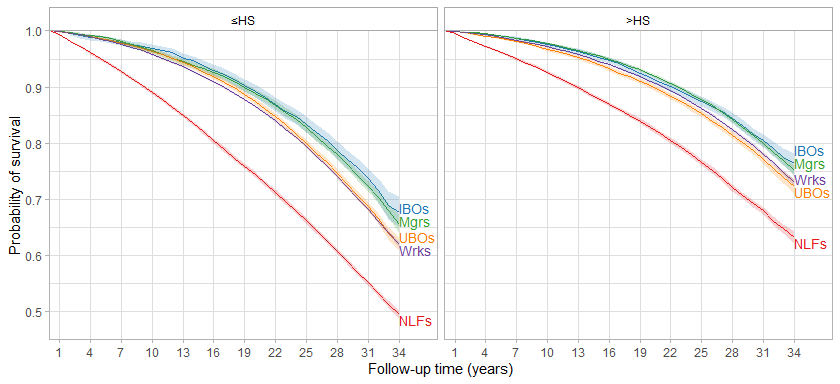<!-- -->

```r
ggsave("educ_survival.png", dpi=600, height=4, width=8.75)
```

#### IPW survival differences and hazard ratios


```r
tidy_n(modded=mod_educ, bind=binded_educ, rows=1:9, nad=8, captioned="Ref: >HS IBOs")
```

<table class="table table-striped" style="margin-left: auto; margin-right: auto;">
<caption>Ref: &gt;HS IBOs</caption>
 <thead>
<tr>
<th style="empty-cells: hide;border-bottom:hidden;" colspan="1"></th>
<th style="border-bottom:hidden;padding-bottom:0; padding-left:3px;padding-right:3px;text-align: center; " colspan="3"><div style="border-bottom: 1px solid #ddd; padding-bottom: 5px; ">HR</div></th>
<th style="border-bottom:hidden;padding-bottom:0; padding-left:3px;padding-right:3px;text-align: center; " colspan="3"><div style="border-bottom: 1px solid #ddd; padding-bottom: 5px; ">SD per 100 at end of f/u</div></th>
<th style="empty-cells: hide;border-bottom:hidden;" colspan="1"></th>
</tr>
  <tr>
   <th style="text-align:left;">   </th>
   <th style="text-align:right;"> HR </th>
   <th style="text-align:right;"> Lower </th>
   <th style="text-align:right;"> Upper </th>
   <th style="text-align:right;"> SD </th>
   <th style="text-align:right;"> Lower </th>
   <th style="text-align:right;"> Upper </th>
   <th style="text-align:right;"> N </th>
  </tr>
 </thead>
<tbody>
  <tr>
   <td style="text-align:left;"> class_educ&gt;HS UBOs </td>
   <td style="text-align:right;"> 1.22 </td>
   <td style="text-align:right;"> 1.13 </td>
   <td style="text-align:right;"> 1.33 </td>
   <td style="text-align:right;"> -4.1 </td>
   <td style="text-align:right;"> -6.3 </td>
   <td style="text-align:right;"> -1.9 </td>
   <td style="text-align:right;"> 911850 </td>
  </tr>
  <tr>
   <td style="text-align:left;"> class_educ&gt;HS mgrs </td>
   <td style="text-align:right;"> 1.00 </td>
   <td style="text-align:right;"> 0.92 </td>
   <td style="text-align:right;"> 1.07 </td>
   <td style="text-align:right;"> -1.1 </td>
   <td style="text-align:right;"> -3.1 </td>
   <td style="text-align:right;"> 0.9 </td>
   <td style="text-align:right;">  </td>
  </tr>
  <tr>
   <td style="text-align:left;"> class_educ&gt;HS wrks </td>
   <td style="text-align:right;"> 1.14 </td>
   <td style="text-align:right;"> 1.06 </td>
   <td style="text-align:right;"> 1.22 </td>
   <td style="text-align:right;"> -3.3 </td>
   <td style="text-align:right;"> -5.1 </td>
   <td style="text-align:right;"> -1.4 </td>
   <td style="text-align:right;">  </td>
  </tr>
  <tr>
   <td style="text-align:left;"> class_educ&gt;HS NLFs </td>
   <td style="text-align:right;"> 2.15 </td>
   <td style="text-align:right;"> 2.00 </td>
   <td style="text-align:right;"> 2.31 </td>
   <td style="text-align:right;"> -13.1 </td>
   <td style="text-align:right;"> -15.2 </td>
   <td style="text-align:right;"> -11.1 </td>
   <td style="text-align:right;">  </td>
  </tr>
  <tr>
   <td style="text-align:left;"> class_educ=HS IBOs </td>
   <td style="text-align:right;"> 1.38 </td>
   <td style="text-align:right;"> 1.24 </td>
   <td style="text-align:right;"> 1.54 </td>
   <td style="text-align:right;"> -8.6 </td>
   <td style="text-align:right;"> -11.9 </td>
   <td style="text-align:right;"> -5.3 </td>
   <td style="text-align:right;">  </td>
  </tr>
  <tr>
   <td style="text-align:left;"> class_educ=HS UBOs </td>
   <td style="text-align:right;"> 1.66 </td>
   <td style="text-align:right;"> 1.54 </td>
   <td style="text-align:right;"> 1.80 </td>
   <td style="text-align:right;"> -14.3 </td>
   <td style="text-align:right;"> -16.5 </td>
   <td style="text-align:right;"> -12.1 </td>
   <td style="text-align:right;">  </td>
  </tr>
  <tr>
   <td style="text-align:left;"> class_educ=HS mgrs </td>
   <td style="text-align:right;"> 1.46 </td>
   <td style="text-align:right;"> 1.34 </td>
   <td style="text-align:right;"> 1.58 </td>
   <td style="text-align:right;"> -10.8 </td>
   <td style="text-align:right;"> -13.3 </td>
   <td style="text-align:right;"> -8.3 </td>
   <td style="text-align:right;">  </td>
  </tr>
  <tr>
   <td style="text-align:left;"> class_educ=HS wrks </td>
   <td style="text-align:right;"> 1.74 </td>
   <td style="text-align:right;"> 1.63 </td>
   <td style="text-align:right;"> 1.87 </td>
   <td style="text-align:right;"> -14.4 </td>
   <td style="text-align:right;"> -16.2 </td>
   <td style="text-align:right;"> -12.5 </td>
   <td style="text-align:right;">  </td>
  </tr>
  <tr>
   <td style="text-align:left;"> class_educ=HS NLFs </td>
   <td style="text-align:right;"> 3.36 </td>
   <td style="text-align:right;"> 3.13 </td>
   <td style="text-align:right;"> 3.61 </td>
   <td style="text-align:right;"> -26.9 </td>
   <td style="text-align:right;"> -28.9 </td>
   <td style="text-align:right;"> -25.0 </td>
   <td style="text-align:right;">  </td>
  </tr>
</tbody>
</table>

```r
within_group_ests(datted=kapped_educ, modded=mod_educ, term1="class_educ=HS", captioned="Estimates among \u2264HS (ref: \u2264HS IBOs)")
```

<table class="table table-striped" style="margin-left: auto; margin-right: auto;">
<caption>Estimates among ≤HS (ref: ≤HS IBOs)</caption>
 <thead>
<tr>
<th style="empty-cells: hide;border-bottom:hidden;" colspan="1"></th>
<th style="border-bottom:hidden;padding-bottom:0; padding-left:3px;padding-right:3px;text-align: center; " colspan="3"><div style="border-bottom: 1px solid #ddd; padding-bottom: 5px; ">HR</div></th>
<th style="border-bottom:hidden;padding-bottom:0; padding-left:3px;padding-right:3px;text-align: center; " colspan="3"><div style="border-bottom: 1px solid #ddd; padding-bottom: 5px; ">SD per 100 at end of f/u</div></th>
</tr>
  <tr>
   <th style="text-align:left;">   </th>
   <th style="text-align:right;"> HR </th>
   <th style="text-align:right;"> Lower </th>
   <th style="text-align:right;"> Upper </th>
   <th style="text-align:right;"> SD </th>
   <th style="text-align:right;"> Lower </th>
   <th style="text-align:right;"> Upper </th>
  </tr>
 </thead>
<tbody>
  <tr>
   <td style="text-align:left;"> classUBOs </td>
   <td style="text-align:right;"> 1.20 </td>
   <td style="text-align:right;"> 1.10 </td>
   <td style="text-align:right;"> 1.32 </td>
   <td style="text-align:right;"> -5.7 </td>
   <td style="text-align:right;"> -8.7 </td>
   <td style="text-align:right;"> -2.7 </td>
  </tr>
  <tr>
   <td style="text-align:left;"> classMgrs </td>
   <td style="text-align:right;"> 1.05 </td>
   <td style="text-align:right;"> 0.95 </td>
   <td style="text-align:right;"> 1.17 </td>
   <td style="text-align:right;"> -2.2 </td>
   <td style="text-align:right;"> -5.4 </td>
   <td style="text-align:right;"> 1.0 </td>
  </tr>
  <tr>
   <td style="text-align:left;"> classWrks </td>
   <td style="text-align:right;"> 1.26 </td>
   <td style="text-align:right;"> 1.16 </td>
   <td style="text-align:right;"> 1.38 </td>
   <td style="text-align:right;"> -5.8 </td>
   <td style="text-align:right;"> -8.6 </td>
   <td style="text-align:right;"> -3.0 </td>
  </tr>
  <tr>
   <td style="text-align:left;"> classNLFs </td>
   <td style="text-align:right;"> 2.43 </td>
   <td style="text-align:right;"> 2.23 </td>
   <td style="text-align:right;"> 2.66 </td>
   <td style="text-align:right;"> -18.3 </td>
   <td style="text-align:right;"> -21.2 </td>
   <td style="text-align:right;"> -15.5 </td>
  </tr>
</tbody>
</table>

## Class-by-age stratification - 25-44 vs 45-64 years old

### Distribution of IPW

#### 25-44


```r
dat_sub_no_hisp %>%
  filter(age<45) %>%
  mutate(sw=ipwpoint(exposure=class,
                     family="multinomial",
                     link="logit",
                     numerator=~1,
                     denominator=~rcs(age, 3) + sex + rcs(int_year_fin, 5), 
                     data=subset(dat_sub_no_hisp, age<45),
                     weights=mortwt_f,
                     maxit=1000,
                     trace=FALSE)$ipw.weights,
         sw_f=sw*mortwt_f)  -> dat_sub_no_hisp_young

summary(dat_sub_no_hisp_young$sw)
```

```
##    Min. 1st Qu.  Median    Mean 3rd Qu.    Max. 
##  0.3796  0.8645  0.9763  0.9966  1.1064  7.7873
```

#### 45-64


```r
dat_sub_no_hisp %>%
  filter(age>=45) %>%
  mutate(sw=ipwpoint(exposure=class,
                     family="multinomial",
                     link="logit",
                     numerator=~1,
                     denominator=~rcs(age, 3) + sex + rcs(int_year_fin, 5), 
                     data=subset(dat_sub_no_hisp, age>=45),
                     weights=mortwt_f,
                     maxit=1000,
                     trace=FALSE)$ipw.weights,
         sw_f=sw*mortwt_f)  -> dat_sub_no_hisp_old

summary(dat_sub_no_hisp_old$sw)
```

```
##    Min. 1st Qu.  Median    Mean 3rd Qu.    Max. 
##  0.3944  0.8366  0.9144  0.9927  1.1012  3.4034
```

### Survival


```r
#young
kapped_young <- survfit(Surv(time,dead)~class, robust=T, w=sw_f, data=dat_sub_no_hisp_young, se=T)
mod_young <- coxph(Surv(time,dead)~class, robust=T, w=sw_f, data=dat_sub_no_hisp_young)
binded_young <- survdiffed(kapped_young)

#old
kapped_old <- survfit(Surv(time,dead)~class, robust=T, w=sw_f, data=dat_sub_no_hisp_old, se=T)
mod_old <- coxph(Surv(time,dead)~class, robust=T, w=sw_f, data=dat_sub_no_hisp_old)
binded_old <- survdiffed(kapped_old)
```

#### IPW survival plots


```r
plotted(datted=kapped_young, grpd="25-44", vjust=1.25, bottom=0.2) + 
plotted(datted=kapped_old, grpd="45-64", bottom=0.2) +
  theme(axis.title.y=element_blank(), axis.text.y=element_blank(), axis.ticks.y=element_blank())
```

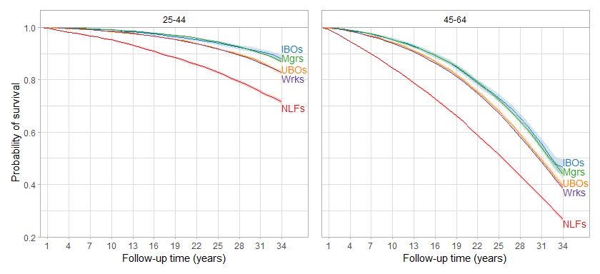<!-- -->

```r
ggsave("age_survival.png", dpi=600, height=4, width=8.75)
```

#### IPW survival differences and hazard ratios


```r
tidy_n(modded=mod_young, bind=binded_young, captioned="Ref: IBOs (25-44 subset)")
```

<table class="table table-striped" style="margin-left: auto; margin-right: auto;">
<caption>Ref: IBOs (25-44 subset)</caption>
 <thead>
<tr>
<th style="empty-cells: hide;border-bottom:hidden;" colspan="1"></th>
<th style="border-bottom:hidden;padding-bottom:0; padding-left:3px;padding-right:3px;text-align: center; " colspan="3"><div style="border-bottom: 1px solid #ddd; padding-bottom: 5px; ">HR</div></th>
<th style="border-bottom:hidden;padding-bottom:0; padding-left:3px;padding-right:3px;text-align: center; " colspan="3"><div style="border-bottom: 1px solid #ddd; padding-bottom: 5px; ">SD per 100 at end of f/u</div></th>
<th style="empty-cells: hide;border-bottom:hidden;" colspan="1"></th>
</tr>
  <tr>
   <th style="text-align:left;">   </th>
   <th style="text-align:right;"> HR </th>
   <th style="text-align:right;"> Lower </th>
   <th style="text-align:right;"> Upper </th>
   <th style="text-align:right;"> SD </th>
   <th style="text-align:right;"> Lower </th>
   <th style="text-align:right;"> Upper </th>
   <th style="text-align:right;"> N </th>
  </tr>
 </thead>
<tbody>
  <tr>
   <td style="text-align:left;"> classUBOs </td>
   <td style="text-align:right;"> 1.42 </td>
   <td style="text-align:right;"> 1.25 </td>
   <td style="text-align:right;"> 1.62 </td>
   <td style="text-align:right;"> -5.2 </td>
   <td style="text-align:right;"> -7.0 </td>
   <td style="text-align:right;"> -3.3 </td>
   <td style="text-align:right;"> 528703 </td>
  </tr>
  <tr>
   <td style="text-align:left;"> classMgrs </td>
   <td style="text-align:right;"> 0.98 </td>
   <td style="text-align:right;"> 0.87 </td>
   <td style="text-align:right;"> 1.12 </td>
   <td style="text-align:right;"> -1.0 </td>
   <td style="text-align:right;"> -2.8 </td>
   <td style="text-align:right;"> 0.7 </td>
   <td style="text-align:right;">  </td>
  </tr>
  <tr>
   <td style="text-align:left;"> classWrks </td>
   <td style="text-align:right;"> 1.43 </td>
   <td style="text-align:right;"> 1.27 </td>
   <td style="text-align:right;"> 1.62 </td>
   <td style="text-align:right;"> -5.2 </td>
   <td style="text-align:right;"> -6.7 </td>
   <td style="text-align:right;"> -3.6 </td>
   <td style="text-align:right;">  </td>
  </tr>
  <tr>
   <td style="text-align:left;"> classNLFs </td>
   <td style="text-align:right;"> 3.22 </td>
   <td style="text-align:right;"> 2.84 </td>
   <td style="text-align:right;"> 3.64 </td>
   <td style="text-align:right;"> -16.5 </td>
   <td style="text-align:right;"> -18.3 </td>
   <td style="text-align:right;"> -14.7 </td>
   <td style="text-align:right;">  </td>
  </tr>
</tbody>
</table>

```r
tidy_n(modded=mod_old, bind=binded_old, captioned="Ref: IBOs (45-64 subset)")
```

<table class="table table-striped" style="margin-left: auto; margin-right: auto;">
<caption>Ref: IBOs (45-64 subset)</caption>
 <thead>
<tr>
<th style="empty-cells: hide;border-bottom:hidden;" colspan="1"></th>
<th style="border-bottom:hidden;padding-bottom:0; padding-left:3px;padding-right:3px;text-align: center; " colspan="3"><div style="border-bottom: 1px solid #ddd; padding-bottom: 5px; ">HR</div></th>
<th style="border-bottom:hidden;padding-bottom:0; padding-left:3px;padding-right:3px;text-align: center; " colspan="3"><div style="border-bottom: 1px solid #ddd; padding-bottom: 5px; ">SD per 100 at end of f/u</div></th>
<th style="empty-cells: hide;border-bottom:hidden;" colspan="1"></th>
</tr>
  <tr>
   <th style="text-align:left;">   </th>
   <th style="text-align:right;"> HR </th>
   <th style="text-align:right;"> Lower </th>
   <th style="text-align:right;"> Upper </th>
   <th style="text-align:right;"> SD </th>
   <th style="text-align:right;"> Lower </th>
   <th style="text-align:right;"> Upper </th>
   <th style="text-align:right;"> N </th>
  </tr>
 </thead>
<tbody>
  <tr>
   <td style="text-align:left;"> classUBOs </td>
   <td style="text-align:right;"> 1.22 </td>
   <td style="text-align:right;"> 1.15 </td>
   <td style="text-align:right;"> 1.30 </td>
   <td style="text-align:right;"> -7.3 </td>
   <td style="text-align:right;"> -10.7 </td>
   <td style="text-align:right;"> -3.9 </td>
   <td style="text-align:right;"> 383147 </td>
  </tr>
  <tr>
   <td style="text-align:left;"> classMgrs </td>
   <td style="text-align:right;"> 1.03 </td>
   <td style="text-align:right;"> 0.96 </td>
   <td style="text-align:right;"> 1.09 </td>
   <td style="text-align:right;"> -2.9 </td>
   <td style="text-align:right;"> -6.4 </td>
   <td style="text-align:right;"> 0.5 </td>
   <td style="text-align:right;">  </td>
  </tr>
  <tr>
   <td style="text-align:left;"> classWrks </td>
   <td style="text-align:right;"> 1.27 </td>
   <td style="text-align:right;"> 1.20 </td>
   <td style="text-align:right;"> 1.34 </td>
   <td style="text-align:right;"> -8.1 </td>
   <td style="text-align:right;"> -11.1 </td>
   <td style="text-align:right;"> -5.1 </td>
   <td style="text-align:right;">  </td>
  </tr>
  <tr>
   <td style="text-align:left;"> classNLFs </td>
   <td style="text-align:right;"> 2.38 </td>
   <td style="text-align:right;"> 2.25 </td>
   <td style="text-align:right;"> 2.52 </td>
   <td style="text-align:right;"> -20.1 </td>
   <td style="text-align:right;"> -23.1 </td>
   <td style="text-align:right;"> -17.0 </td>
   <td style="text-align:right;">  </td>
  </tr>
</tbody>
</table>

## Sensitivity analyses

### Regression adjustment instead of IPW for minimally-adjusted overall Cox analyses

Similar to primary but slightly larger effect sizes for workers and UBOs.


```r
mod_reg <- coxph(Surv(time,dead)~class + rcs(age, 3) + sex + rcs(int_year_fin, 5), robust=T, w=mortwt_f, data=dat_sub_no_hisp)

kable(cbind(tidy(mod_reg, exponentiate=T, conf.int=T)[1:4, c(1,2,7,8)], c(length(mod_reg$residuals), NA, NA, NA)), 
      col.names=c(" ", "HR", "Lower", "Upper", "N"), caption="Ref: IBOs", digits=2) %>%
  kable_styling("striped")
```

<table class="table table-striped" style="margin-left: auto; margin-right: auto;">
<caption>Ref: IBOs</caption>
 <thead>
  <tr>
   <th style="text-align:left;">   </th>
   <th style="text-align:right;"> HR </th>
   <th style="text-align:right;"> Lower </th>
   <th style="text-align:right;"> Upper </th>
   <th style="text-align:right;"> N </th>
  </tr>
 </thead>
<tbody>
  <tr>
   <td style="text-align:left;"> classUBOs </td>
   <td style="text-align:right;"> 1.31 </td>
   <td style="text-align:right;"> 1.25 </td>
   <td style="text-align:right;"> 1.38 </td>
   <td style="text-align:right;"> 911850 </td>
  </tr>
  <tr>
   <td style="text-align:left;"> classMgrs </td>
   <td style="text-align:right;"> 1.00 </td>
   <td style="text-align:right;"> 0.95 </td>
   <td style="text-align:right;"> 1.05 </td>
   <td style="text-align:right;">  </td>
  </tr>
  <tr>
   <td style="text-align:left;"> classWrks </td>
   <td style="text-align:right;"> 1.36 </td>
   <td style="text-align:right;"> 1.30 </td>
   <td style="text-align:right;"> 1.42 </td>
   <td style="text-align:right;">  </td>
  </tr>
  <tr>
   <td style="text-align:left;"> classNLFs </td>
   <td style="text-align:right;"> 2.49 </td>
   <td style="text-align:right;"> 2.38 </td>
   <td style="text-align:right;"> 2.61 </td>
   <td style="text-align:right;">  </td>
  </tr>
</tbody>
</table>

### Checking that SEs in primary analyses align with SEs from other approaches

#### Accounting for survey design in overall Cox analyses (adjusting for confounders with IPW)

Basically identical to primary. It makes no difference that we subsetted the dataset by age above rather than within the svycoxph function because age subpopulations appear in all the clusters.


```r
dat_sub_no_hisp_svy <- svydesign(ids = ~ psu,
                                 strata = ~ strata, 
                                 weights = ~ sw_f_over,
                                 nest=TRUE, 
                                 data=dat_sub_no_hisp)

mod_surv <- svycoxph(Surv(time,dead)~class, design=dat_sub_no_hisp_svy)

kable(cbind(tidy(mod_surv, exponentiate=T, conf.int=T)[1:4, c(1,2,7,8)], c(length(mod_surv$residuals), NA, NA, NA)), 
      col.names=c(" ", "HR", "Lower", "Upper", "N"), caption="Ref: IBOs", digits=2) %>%
  kable_styling("striped")
```

```
## Stratified 1 - level Cluster Sampling design (with replacement)
## With (2575) clusters.
## svydesign(ids = ~psu, strata = ~strata, weights = ~sw_f_over, 
##     nest = TRUE, data = dat_sub_no_hisp)
```

<table class="table table-striped" style="margin-left: auto; margin-right: auto;">
<caption>Ref: IBOs</caption>
 <thead>
  <tr>
   <th style="text-align:left;">   </th>
   <th style="text-align:right;"> HR </th>
   <th style="text-align:right;"> Lower </th>
   <th style="text-align:right;"> Upper </th>
   <th style="text-align:right;"> N </th>
  </tr>
 </thead>
<tbody>
  <tr>
   <td style="text-align:left;"> classUBOs </td>
   <td style="text-align:right;"> 1.28 </td>
   <td style="text-align:right;"> 1.20 </td>
   <td style="text-align:right;"> 1.36 </td>
   <td style="text-align:right;"> 911850 </td>
  </tr>
  <tr>
   <td style="text-align:left;"> classMgrs </td>
   <td style="text-align:right;"> 0.99 </td>
   <td style="text-align:right;"> 0.93 </td>
   <td style="text-align:right;"> 1.05 </td>
   <td style="text-align:right;">  </td>
  </tr>
  <tr>
   <td style="text-align:left;"> classWrks </td>
   <td style="text-align:right;"> 1.29 </td>
   <td style="text-align:right;"> 1.22 </td>
   <td style="text-align:right;"> 1.36 </td>
   <td style="text-align:right;">  </td>
  </tr>
  <tr>
   <td style="text-align:left;"> classNLFs </td>
   <td style="text-align:right;"> 2.57 </td>
   <td style="text-align:right;"> 2.43 </td>
   <td style="text-align:right;"> 2.72 </td>
   <td style="text-align:right;">  </td>
  </tr>
</tbody>
</table>

#### Clustering SEs at household level rather than leaving them unclustered

Also basically identical to primary.


```r
kapped_house <- survfit(Surv(time,dead)~class + cluster(nhishid), w=sw_f_over, data=dat_sub_no_hisp, se=T)
mod_house <- coxph(Surv(time,dead)~class + cluster(nhishid), w=sw_f_over, data=dat_sub_no_hisp)
binded_house <- survdiffed(kapped_house)
```


```r
tidy_n(modded=mod_house, bind=binded_house)
```

<table class="table table-striped" style="margin-left: auto; margin-right: auto;">
<caption>Ref: IBOs</caption>
 <thead>
<tr>
<th style="empty-cells: hide;border-bottom:hidden;" colspan="1"></th>
<th style="border-bottom:hidden;padding-bottom:0; padding-left:3px;padding-right:3px;text-align: center; " colspan="3"><div style="border-bottom: 1px solid #ddd; padding-bottom: 5px; ">HR</div></th>
<th style="border-bottom:hidden;padding-bottom:0; padding-left:3px;padding-right:3px;text-align: center; " colspan="3"><div style="border-bottom: 1px solid #ddd; padding-bottom: 5px; ">SD per 100 at end of f/u</div></th>
<th style="empty-cells: hide;border-bottom:hidden;" colspan="1"></th>
</tr>
  <tr>
   <th style="text-align:left;">   </th>
   <th style="text-align:right;"> HR </th>
   <th style="text-align:right;"> Lower </th>
   <th style="text-align:right;"> Upper </th>
   <th style="text-align:right;"> SD </th>
   <th style="text-align:right;"> Lower </th>
   <th style="text-align:right;"> Upper </th>
   <th style="text-align:right;"> N </th>
  </tr>
 </thead>
<tbody>
  <tr>
   <td style="text-align:left;"> classUBOs </td>
   <td style="text-align:right;"> 1.28 </td>
   <td style="text-align:right;"> 1.21 </td>
   <td style="text-align:right;"> 1.36 </td>
   <td style="text-align:right;"> -6.3 </td>
   <td style="text-align:right;"> -8.1 </td>
   <td style="text-align:right;"> -4.5 </td>
   <td style="text-align:right;"> 911850 </td>
  </tr>
  <tr>
   <td style="text-align:left;"> classMgrs </td>
   <td style="text-align:right;"> 0.99 </td>
   <td style="text-align:right;"> 0.93 </td>
   <td style="text-align:right;"> 1.05 </td>
   <td style="text-align:right;"> -1.0 </td>
   <td style="text-align:right;"> -2.8 </td>
   <td style="text-align:right;"> 0.7 </td>
   <td style="text-align:right;">  </td>
  </tr>
  <tr>
   <td style="text-align:left;"> classWrks </td>
   <td style="text-align:right;"> 1.29 </td>
   <td style="text-align:right;"> 1.22 </td>
   <td style="text-align:right;"> 1.36 </td>
   <td style="text-align:right;"> -6.6 </td>
   <td style="text-align:right;"> -8.2 </td>
   <td style="text-align:right;"> -5.0 </td>
   <td style="text-align:right;">  </td>
  </tr>
  <tr>
   <td style="text-align:left;"> classNLFs </td>
   <td style="text-align:right;"> 2.57 </td>
   <td style="text-align:right;"> 2.44 </td>
   <td style="text-align:right;"> 2.72 </td>
   <td style="text-align:right;"> -19.4 </td>
   <td style="text-align:right;"> -21.0 </td>
   <td style="text-align:right;"> -17.7 </td>
   <td style="text-align:right;">  </td>
  </tr>
</tbody>
</table>

### Including Hispanic oversample to examine effects on point estimates 

Similar to primary, as Hispanic oversample is very small.

#### Distribution of IPW


```r
dat_sub <- dat_sub[complete.cases(dat_sub[,c('age', 'time', 'class', 'sex', 'race_h', 'educ', 'marital_tri', 'region')]),] #exclude missingness using approach from primary analyses

dat_sub %>%
  mutate(sw_hisp=ipwpoint(exposure=class,
                          family="multinomial",
                          link="logit",
                          numerator=~1,
                          denominator=~rcs(age, 3) + sex + rcs(int_year_fin, 5), 
                          data=dat_sub,
                          weights=mortwt_f,
                          maxit=1000,
                          trace=FALSE)$ipw.weights,
         sw_f_hisp=sw_hisp*mortwt_f)  -> dat_sub_hisp_overall

summary(dat_sub_hisp_overall$sw_hisp)
```

```
##    Min. 1st Qu.  Median    Mean 3rd Qu.    Max. 
##  0.3332  0.8490  0.9529  0.9899  1.0505  6.2868
```


```r
kapped_hisp <- survfit(Surv(time,dead)~class, robust=T, w=sw_f_hisp, data=dat_sub_hisp_overall, se=T)
mod_hisp <- coxph(Surv(time,dead)~class, robust=T, w=sw_f_hisp, data=dat_sub_hisp_overall)
binded_hisp <- survdiffed(kapped_hisp)
```

#### IPW survival differences and hazard ratios


```r
tidy_n(modded=mod_hisp, bind=binded_hisp)
```

<table class="table table-striped" style="margin-left: auto; margin-right: auto;">
<caption>Ref: IBOs</caption>
 <thead>
<tr>
<th style="empty-cells: hide;border-bottom:hidden;" colspan="1"></th>
<th style="border-bottom:hidden;padding-bottom:0; padding-left:3px;padding-right:3px;text-align: center; " colspan="3"><div style="border-bottom: 1px solid #ddd; padding-bottom: 5px; ">HR</div></th>
<th style="border-bottom:hidden;padding-bottom:0; padding-left:3px;padding-right:3px;text-align: center; " colspan="3"><div style="border-bottom: 1px solid #ddd; padding-bottom: 5px; ">SD per 100 at end of f/u</div></th>
<th style="empty-cells: hide;border-bottom:hidden;" colspan="1"></th>
</tr>
  <tr>
   <th style="text-align:left;">   </th>
   <th style="text-align:right;"> HR </th>
   <th style="text-align:right;"> Lower </th>
   <th style="text-align:right;"> Upper </th>
   <th style="text-align:right;"> SD </th>
   <th style="text-align:right;"> Lower </th>
   <th style="text-align:right;"> Upper </th>
   <th style="text-align:right;"> N </th>
  </tr>
 </thead>
<tbody>
  <tr>
   <td style="text-align:left;"> classUBOs </td>
   <td style="text-align:right;"> 1.28 </td>
   <td style="text-align:right;"> 1.21 </td>
   <td style="text-align:right;"> 1.36 </td>
   <td style="text-align:right;"> -6.3 </td>
   <td style="text-align:right;"> -8.1 </td>
   <td style="text-align:right;"> -4.6 </td>
   <td style="text-align:right;"> 915268 </td>
  </tr>
  <tr>
   <td style="text-align:left;"> classMgrs </td>
   <td style="text-align:right;"> 0.99 </td>
   <td style="text-align:right;"> 0.93 </td>
   <td style="text-align:right;"> 1.05 </td>
   <td style="text-align:right;"> -1.0 </td>
   <td style="text-align:right;"> -2.7 </td>
   <td style="text-align:right;"> 0.7 </td>
   <td style="text-align:right;">  </td>
  </tr>
  <tr>
   <td style="text-align:left;"> classWrks </td>
   <td style="text-align:right;"> 1.29 </td>
   <td style="text-align:right;"> 1.22 </td>
   <td style="text-align:right;"> 1.36 </td>
   <td style="text-align:right;"> -6.6 </td>
   <td style="text-align:right;"> -8.1 </td>
   <td style="text-align:right;"> -5.0 </td>
   <td style="text-align:right;">  </td>
  </tr>
  <tr>
   <td style="text-align:left;"> classNLFs </td>
   <td style="text-align:right;"> 2.57 </td>
   <td style="text-align:right;"> 2.44 </td>
   <td style="text-align:right;"> 2.72 </td>
   <td style="text-align:right;"> -19.4 </td>
   <td style="text-align:right;"> -21.0 </td>
   <td style="text-align:right;"> -17.7 </td>
   <td style="text-align:right;">  </td>
  </tr>
</tbody>
</table>

### Excluding NHIS sampling weights from analyses 

Similar to primary, but generally somewhat attenuated. 

#### Overall

##### Distribution of IPW


```r
dat_sub_no_hisp %>%
  mutate(sw_over_excl=ipwpoint(exposure=class,
                               family="multinomial",
                               link="logit",
                               numerator=~1,
                               denominator=~rcs(age, 3) + sex + rcs(int_year_fin, 5), 
                               data=dat_sub_no_hisp,
                               trace=FALSE,
                               maxit=1000)$ipw.weights)  -> dat_sub_no_hisp

summary(dat_sub_no_hisp$sw_over_excl)
```

```
##    Min. 1st Qu.  Median    Mean 3rd Qu.    Max. 
##  0.3267  0.8390  0.9430  0.9967  1.0498  6.6870
```


```r
kapped_over_excl <- survfit(Surv(time,dead)~class, robust=T, w=sw_over_excl, data=dat_sub_no_hisp, se=T)
mod_over_excl <- coxph(Surv(time,dead)~class, robust=T, w=sw_over_excl, data=dat_sub_no_hisp)
binded_over_excl <- survdiffed(datted=kapped_over_excl)
```

##### IPW survival differences and hazard ratios


```r
tidy_n(modded=mod_over_excl, bind=binded_over_excl)
```

<table class="table table-striped" style="margin-left: auto; margin-right: auto;">
<caption>Ref: IBOs</caption>
 <thead>
<tr>
<th style="empty-cells: hide;border-bottom:hidden;" colspan="1"></th>
<th style="border-bottom:hidden;padding-bottom:0; padding-left:3px;padding-right:3px;text-align: center; " colspan="3"><div style="border-bottom: 1px solid #ddd; padding-bottom: 5px; ">HR</div></th>
<th style="border-bottom:hidden;padding-bottom:0; padding-left:3px;padding-right:3px;text-align: center; " colspan="3"><div style="border-bottom: 1px solid #ddd; padding-bottom: 5px; ">SD per 100 at end of f/u</div></th>
<th style="empty-cells: hide;border-bottom:hidden;" colspan="1"></th>
</tr>
  <tr>
   <th style="text-align:left;">   </th>
   <th style="text-align:right;"> HR </th>
   <th style="text-align:right;"> Lower </th>
   <th style="text-align:right;"> Upper </th>
   <th style="text-align:right;"> SD </th>
   <th style="text-align:right;"> Lower </th>
   <th style="text-align:right;"> Upper </th>
   <th style="text-align:right;"> N </th>
  </tr>
 </thead>
<tbody>
  <tr>
   <td style="text-align:left;"> classUBOs </td>
   <td style="text-align:right;"> 1.23 </td>
   <td style="text-align:right;"> 1.17 </td>
   <td style="text-align:right;"> 1.29 </td>
   <td style="text-align:right;"> -5.6 </td>
   <td style="text-align:right;"> -7.3 </td>
   <td style="text-align:right;"> -3.8 </td>
   <td style="text-align:right;"> 911850 </td>
  </tr>
  <tr>
   <td style="text-align:left;"> classMgrs </td>
   <td style="text-align:right;"> 1.01 </td>
   <td style="text-align:right;"> 0.97 </td>
   <td style="text-align:right;"> 1.06 </td>
   <td style="text-align:right;"> -1.1 </td>
   <td style="text-align:right;"> -2.8 </td>
   <td style="text-align:right;"> 0.6 </td>
   <td style="text-align:right;">  </td>
  </tr>
  <tr>
   <td style="text-align:left;"> classWrks </td>
   <td style="text-align:right;"> 1.28 </td>
   <td style="text-align:right;"> 1.23 </td>
   <td style="text-align:right;"> 1.34 </td>
   <td style="text-align:right;"> -6.5 </td>
   <td style="text-align:right;"> -8.1 </td>
   <td style="text-align:right;"> -5.0 </td>
   <td style="text-align:right;">  </td>
  </tr>
  <tr>
   <td style="text-align:left;"> classNLFs </td>
   <td style="text-align:right;"> 2.27 </td>
   <td style="text-align:right;"> 2.17 </td>
   <td style="text-align:right;"> 2.38 </td>
   <td style="text-align:right;"> -18.6 </td>
   <td style="text-align:right;"> -20.2 </td>
   <td style="text-align:right;"> -17.0 </td>
   <td style="text-align:right;">  </td>
  </tr>
</tbody>
</table>

#### Class-by-year stratification - 1986-1996 interview years w/ f/u through end of 2004 vs 2001-2019 interview years w/ f/u through end of 2019

##### Distribution of IPW

###### 1986-1996


```r
dat_sub_no_hisp %>%
  filter(int_year_fin<=1996) %>%
  mutate(sw_excl=ipwpoint(exposure=class,
                     family="multinomial",
                     link="logit",
                     numerator=~1,
                     denominator=~rcs(age, 3) + sex + rcs(int_year_fin, 3), 
                     data=subset(dat_sub_no_hisp, int_year_fin<=1996),
                     maxit=1000,
                     trace=FALSE)$ipw.weights)  -> dat_sub_no_hisp_1986

summary(dat_sub_no_hisp_1986$sw_excl)
```

```
##    Min. 1st Qu.  Median    Mean 3rd Qu.    Max. 
##  0.3035  0.8233  0.9378  0.9964  1.0325  6.5543
```

###### 2001-2019


```r
dat_sub_no_hisp %>%
  filter(int_year_fin>=2001) %>%
  mutate(sw_excl=ipwpoint(exposure=class,
                     family="multinomial",
                     link="logit",
                     numerator=~1,
                     denominator=~rcs(age, 3) + sex + rcs(int_year_fin, 3), 
                     data=subset(dat_sub_no_hisp, int_year_fin>=2001),
                     maxit=1000,
                     trace=FALSE)$ipw.weights)  -> dat_sub_no_hisp_2001

summary(dat_sub_no_hisp_2001$sw_excl)
```

```
##    Min. 1st Qu.  Median    Mean 3rd Qu.    Max. 
##  0.3701  0.8551  0.9354  0.9970  1.0826  5.1617
```

##### Survival 


```r
#early
kapped_early <- survfit(Surv(time_86_96_05, dead_86_96_05)~class, robust=T, w=sw_excl, data=dat_sub_no_hisp_1986, se=T) 
mod_early <- coxph(Surv(time_86_96_05, dead_86_96_05)~class, robust=T, w=sw_excl, data=dat_sub_no_hisp_1986)
binded_early <- survdiffed(kapped_early, timed=19)

#late
kapped_late <- survfit(Surv(time,dead)~class, robust=T, w=sw_excl, data=dat_sub_no_hisp_2001, se=T)
mod_late <- coxph(Surv(time,dead)~class, robust=T, w=sw_excl, data=dat_sub_no_hisp_2001)
binded_late <- survdiffed(kapped_late, timed=19)
```

###### IPW survival plots


```r
plotted(datted=kapped_early,
        classed_repped=19,
        grpd="1986-1996 with follow-up through 2004", 
        grps=95, 
        bottom=0.75) + 
  scale_x_continuous(limits=c(0, 19), breaks=seq(1, 19, 2), expand=expansion(mult=c(0,0.11)))  +
plotted(datted=kapped_late,
        classed_repped=19,
        grpd="2001-2019 with follow-up through 2019", 
        grps=95, 
        bottom=0.75) + 
  scale_x_continuous(limits=c(0, 19), breaks=seq(1, 19, 2), expand=expansion(mult=c(0,0.11))) +
  theme(axis.title.y=element_blank(), axis.text.y=element_blank(), axis.ticks.y=element_blank())
```

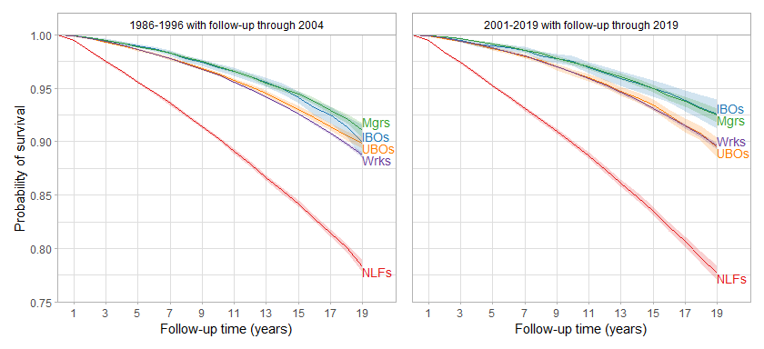<!-- -->

###### IPW survival differences and hazard ratios


```r
tidy_n(modded=mod_early, bind=binded_early, captioned="Ref: IBOs (1986-1996 subset)")
```

<table class="table table-striped" style="margin-left: auto; margin-right: auto;">
<caption>Ref: IBOs (1986-1996 subset)</caption>
 <thead>
<tr>
<th style="empty-cells: hide;border-bottom:hidden;" colspan="1"></th>
<th style="border-bottom:hidden;padding-bottom:0; padding-left:3px;padding-right:3px;text-align: center; " colspan="3"><div style="border-bottom: 1px solid #ddd; padding-bottom: 5px; ">HR</div></th>
<th style="border-bottom:hidden;padding-bottom:0; padding-left:3px;padding-right:3px;text-align: center; " colspan="3"><div style="border-bottom: 1px solid #ddd; padding-bottom: 5px; ">SD per 100 at end of f/u</div></th>
<th style="empty-cells: hide;border-bottom:hidden;" colspan="1"></th>
</tr>
  <tr>
   <th style="text-align:left;">   </th>
   <th style="text-align:right;"> HR </th>
   <th style="text-align:right;"> Lower </th>
   <th style="text-align:right;"> Upper </th>
   <th style="text-align:right;"> SD </th>
   <th style="text-align:right;"> Lower </th>
   <th style="text-align:right;"> Upper </th>
   <th style="text-align:right;"> N </th>
  </tr>
 </thead>
<tbody>
  <tr>
   <td style="text-align:left;"> classUBOs </td>
   <td style="text-align:right;"> 1.17 </td>
   <td style="text-align:right;"> 1.06 </td>
   <td style="text-align:right;"> 1.29 </td>
   <td style="text-align:right;"> -0.1 </td>
   <td style="text-align:right;"> -1.8 </td>
   <td style="text-align:right;"> 1.5 </td>
   <td style="text-align:right;"> 564202 </td>
  </tr>
  <tr>
   <td style="text-align:left;"> classMgrs </td>
   <td style="text-align:right;"> 0.95 </td>
   <td style="text-align:right;"> 0.86 </td>
   <td style="text-align:right;"> 1.05 </td>
   <td style="text-align:right;"> 1.1 </td>
   <td style="text-align:right;"> -0.6 </td>
   <td style="text-align:right;"> 2.8 </td>
   <td style="text-align:right;">  </td>
  </tr>
  <tr>
   <td style="text-align:left;"> classWrks </td>
   <td style="text-align:right;"> 1.25 </td>
   <td style="text-align:right;"> 1.14 </td>
   <td style="text-align:right;"> 1.36 </td>
   <td style="text-align:right;"> -1.2 </td>
   <td style="text-align:right;"> -2.8 </td>
   <td style="text-align:right;"> 0.3 </td>
   <td style="text-align:right;">  </td>
  </tr>
  <tr>
   <td style="text-align:left;"> classNLFs </td>
   <td style="text-align:right;"> 2.85 </td>
   <td style="text-align:right;"> 2.61 </td>
   <td style="text-align:right;"> 3.12 </td>
   <td style="text-align:right;"> -11.7 </td>
   <td style="text-align:right;"> -13.3 </td>
   <td style="text-align:right;"> -10.0 </td>
   <td style="text-align:right;">  </td>
  </tr>
</tbody>
</table>

```r
tidy_n(modded=mod_late, bind=binded_late, captioned="Ref: IBOs (2001-2019 subset)")
```

<table class="table table-striped" style="margin-left: auto; margin-right: auto;">
<caption>Ref: IBOs (2001-2019 subset)</caption>
 <thead>
<tr>
<th style="empty-cells: hide;border-bottom:hidden;" colspan="1"></th>
<th style="border-bottom:hidden;padding-bottom:0; padding-left:3px;padding-right:3px;text-align: center; " colspan="3"><div style="border-bottom: 1px solid #ddd; padding-bottom: 5px; ">HR</div></th>
<th style="border-bottom:hidden;padding-bottom:0; padding-left:3px;padding-right:3px;text-align: center; " colspan="3"><div style="border-bottom: 1px solid #ddd; padding-bottom: 5px; ">SD per 100 at end of f/u</div></th>
<th style="empty-cells: hide;border-bottom:hidden;" colspan="1"></th>
</tr>
  <tr>
   <th style="text-align:left;">   </th>
   <th style="text-align:right;"> HR </th>
   <th style="text-align:right;"> Lower </th>
   <th style="text-align:right;"> Upper </th>
   <th style="text-align:right;"> SD </th>
   <th style="text-align:right;"> Lower </th>
   <th style="text-align:right;"> Upper </th>
   <th style="text-align:right;"> N </th>
  </tr>
 </thead>
<tbody>
  <tr>
   <td style="text-align:left;"> classUBOs </td>
   <td style="text-align:right;"> 1.35 </td>
   <td style="text-align:right;"> 1.16 </td>
   <td style="text-align:right;"> 1.57 </td>
   <td style="text-align:right;"> -3.2 </td>
   <td style="text-align:right;"> -4.8 </td>
   <td style="text-align:right;"> -1.5 </td>
   <td style="text-align:right;"> 347648 </td>
  </tr>
  <tr>
   <td style="text-align:left;"> classMgrs </td>
   <td style="text-align:right;"> 0.98 </td>
   <td style="text-align:right;"> 0.84 </td>
   <td style="text-align:right;"> 1.14 </td>
   <td style="text-align:right;"> -0.1 </td>
   <td style="text-align:right;"> -1.6 </td>
   <td style="text-align:right;"> 1.4 </td>
   <td style="text-align:right;">  </td>
  </tr>
  <tr>
   <td style="text-align:left;"> classWrks </td>
   <td style="text-align:right;"> 1.36 </td>
   <td style="text-align:right;"> 1.18 </td>
   <td style="text-align:right;"> 1.57 </td>
   <td style="text-align:right;"> -3.0 </td>
   <td style="text-align:right;"> -4.4 </td>
   <td style="text-align:right;"> -1.6 </td>
   <td style="text-align:right;">  </td>
  </tr>
  <tr>
   <td style="text-align:left;"> classNLFs </td>
   <td style="text-align:right;"> 3.72 </td>
   <td style="text-align:right;"> 3.23 </td>
   <td style="text-align:right;"> 4.28 </td>
   <td style="text-align:right;"> -14.9 </td>
   <td style="text-align:right;"> -16.4 </td>
   <td style="text-align:right;"> -13.4 </td>
   <td style="text-align:right;">  </td>
  </tr>
</tbody>
</table>

### Class by year interaction with regression adjustment instead of period stratification and IPW

Similar to primary, but imprecise, especially in spline analyses. Used 2018 instead of 2019 as end-of-follow-up year because <50 respondents were interviewed in 2019. Pointwise confidence intervals. P-value is for chunk test of joint significance of interaction term.

#### Year as linear term

##### Less-adjusted


```r
ddist <- datadist(dat_sub_no_hisp)
options(datadist="ddist")
mod_linear <- cph(Surv(time,dead)~class*int_year_fin + rcs(age, 3) + sex + cluster(nhispid), w=mortwt_f, data=dat_sub_no_hisp, x=T, y=T)

int_year_func(modded=mod_linear)
```

<table class="table table-striped" style="margin-left: auto; margin-right: auto;">
<caption>Ref: IBOs in given year</caption>
 <thead>
<tr>
<th style="empty-cells: hide;border-bottom:hidden;" colspan="1"></th>
<th style="border-bottom:hidden;padding-bottom:0; padding-left:3px;padding-right:3px;text-align: center; " colspan="3"><div style="border-bottom: 1px solid #ddd; padding-bottom: 5px; ">1986</div></th>
<th style="border-bottom:hidden;padding-bottom:0; padding-left:3px;padding-right:3px;text-align: center; " colspan="3"><div style="border-bottom: 1px solid #ddd; padding-bottom: 5px; ">2018</div></th>
<th style="empty-cells: hide;border-bottom:hidden;" colspan="1"></th>
<th style="empty-cells: hide;border-bottom:hidden;" colspan="1"></th>
</tr>
  <tr>
   <th style="text-align:left;"> Class </th>
   <th style="text-align:right;"> HR </th>
   <th style="text-align:right;"> Lower </th>
   <th style="text-align:right;"> Upper </th>
   <th style="text-align:right;"> HR </th>
   <th style="text-align:right;"> Lower </th>
   <th style="text-align:right;"> Upper </th>
   <th style="text-align:right;"> N </th>
   <th style="text-align:right;"> P </th>
  </tr>
 </thead>
<tbody>
  <tr>
   <td style="text-align:left;"> classUBOs </td>
   <td style="text-align:right;"> 1.25 </td>
   <td style="text-align:right;"> 1.18 </td>
   <td style="text-align:right;"> 1.33 </td>
   <td style="text-align:right;"> 1.45 </td>
   <td style="text-align:right;"> 1.14 </td>
   <td style="text-align:right;"> 1.84 </td>
   <td style="text-align:right;"> 911850 </td>
   <td style="text-align:right;"> 0 </td>
  </tr>
  <tr>
   <td style="text-align:left;"> classMgrs </td>
   <td style="text-align:right;"> 1.04 </td>
   <td style="text-align:right;"> 0.98 </td>
   <td style="text-align:right;"> 1.11 </td>
   <td style="text-align:right;"> 0.89 </td>
   <td style="text-align:right;"> 0.70 </td>
   <td style="text-align:right;"> 1.14 </td>
   <td style="text-align:right;">  </td>
   <td style="text-align:right;">  </td>
  </tr>
  <tr>
   <td style="text-align:left;"> classWrks </td>
   <td style="text-align:right;"> 1.30 </td>
   <td style="text-align:right;"> 1.23 </td>
   <td style="text-align:right;"> 1.38 </td>
   <td style="text-align:right;"> 1.53 </td>
   <td style="text-align:right;"> 1.24 </td>
   <td style="text-align:right;"> 1.89 </td>
   <td style="text-align:right;">  </td>
   <td style="text-align:right;">  </td>
  </tr>
  <tr>
   <td style="text-align:left;"> classNLFs </td>
   <td style="text-align:right;"> 1.92 </td>
   <td style="text-align:right;"> 1.81 </td>
   <td style="text-align:right;"> 2.03 </td>
   <td style="text-align:right;"> 4.58 </td>
   <td style="text-align:right;"> 3.70 </td>
   <td style="text-align:right;"> 5.66 </td>
   <td style="text-align:right;">  </td>
   <td style="text-align:right;">  </td>
  </tr>
</tbody>
</table>

##### More-adjusted


```r
mod_linear_adj <- cph(Surv(time,dead)~class*int_year_fin + rcs(age, 3) + sex + educ + marital_tri + region + race_h + cluster(nhispid), w=mortwt_f, data=dat_sub_no_hisp, x=T, y=T)

int_year_func(modded=mod_linear_adj)
```

<table class="table table-striped" style="margin-left: auto; margin-right: auto;">
<caption>Ref: IBOs in given year</caption>
 <thead>
<tr>
<th style="empty-cells: hide;border-bottom:hidden;" colspan="1"></th>
<th style="border-bottom:hidden;padding-bottom:0; padding-left:3px;padding-right:3px;text-align: center; " colspan="3"><div style="border-bottom: 1px solid #ddd; padding-bottom: 5px; ">1986</div></th>
<th style="border-bottom:hidden;padding-bottom:0; padding-left:3px;padding-right:3px;text-align: center; " colspan="3"><div style="border-bottom: 1px solid #ddd; padding-bottom: 5px; ">2018</div></th>
<th style="empty-cells: hide;border-bottom:hidden;" colspan="1"></th>
<th style="empty-cells: hide;border-bottom:hidden;" colspan="1"></th>
</tr>
  <tr>
   <th style="text-align:left;"> Class </th>
   <th style="text-align:right;"> HR </th>
   <th style="text-align:right;"> Lower </th>
   <th style="text-align:right;"> Upper </th>
   <th style="text-align:right;"> HR </th>
   <th style="text-align:right;"> Lower </th>
   <th style="text-align:right;"> Upper </th>
   <th style="text-align:right;"> N </th>
   <th style="text-align:right;"> P </th>
  </tr>
 </thead>
<tbody>
  <tr>
   <td style="text-align:left;"> classUBOs </td>
   <td style="text-align:right;"> 1.09 </td>
   <td style="text-align:right;"> 1.03 </td>
   <td style="text-align:right;"> 1.16 </td>
   <td style="text-align:right;"> 1.27 </td>
   <td style="text-align:right;"> 1.00 </td>
   <td style="text-align:right;"> 1.62 </td>
   <td style="text-align:right;"> 911850 </td>
   <td style="text-align:right;"> 0 </td>
  </tr>
  <tr>
   <td style="text-align:left;"> classMgrs </td>
   <td style="text-align:right;"> 1.04 </td>
   <td style="text-align:right;"> 0.98 </td>
   <td style="text-align:right;"> 1.11 </td>
   <td style="text-align:right;"> 0.92 </td>
   <td style="text-align:right;"> 0.73 </td>
   <td style="text-align:right;"> 1.17 </td>
   <td style="text-align:right;">  </td>
   <td style="text-align:right;">  </td>
  </tr>
  <tr>
   <td style="text-align:left;"> classWrks </td>
   <td style="text-align:right;"> 1.09 </td>
   <td style="text-align:right;"> 1.03 </td>
   <td style="text-align:right;"> 1.15 </td>
   <td style="text-align:right;"> 1.31 </td>
   <td style="text-align:right;"> 1.06 </td>
   <td style="text-align:right;"> 1.62 </td>
   <td style="text-align:right;">  </td>
   <td style="text-align:right;">  </td>
  </tr>
  <tr>
   <td style="text-align:left;"> classNLFs </td>
   <td style="text-align:right;"> 1.50 </td>
   <td style="text-align:right;"> 1.41 </td>
   <td style="text-align:right;"> 1.59 </td>
   <td style="text-align:right;"> 3.58 </td>
   <td style="text-align:right;"> 2.90 </td>
   <td style="text-align:right;"> 4.43 </td>
   <td style="text-align:right;">  </td>
   <td style="text-align:right;">  </td>
  </tr>
</tbody>
</table>

#### Year as 5-knot restricted cubic spline

##### Less-adjusted


```r
mod_spline <- cph(Surv(time,dead)~class*rcs(int_year_fin, 5) + rcs(age, 3) + sex + cluster(nhispid), w=mortwt_f, data=dat_sub_no_hisp, x=T, y=T)

int_year_func(modded=mod_spline)
```

<table class="table table-striped" style="margin-left: auto; margin-right: auto;">
<caption>Ref: IBOs in given year</caption>
 <thead>
<tr>
<th style="empty-cells: hide;border-bottom:hidden;" colspan="1"></th>
<th style="border-bottom:hidden;padding-bottom:0; padding-left:3px;padding-right:3px;text-align: center; " colspan="3"><div style="border-bottom: 1px solid #ddd; padding-bottom: 5px; ">1986</div></th>
<th style="border-bottom:hidden;padding-bottom:0; padding-left:3px;padding-right:3px;text-align: center; " colspan="3"><div style="border-bottom: 1px solid #ddd; padding-bottom: 5px; ">2018</div></th>
<th style="empty-cells: hide;border-bottom:hidden;" colspan="1"></th>
<th style="empty-cells: hide;border-bottom:hidden;" colspan="1"></th>
</tr>
  <tr>
   <th style="text-align:left;"> Class </th>
   <th style="text-align:right;"> HR </th>
   <th style="text-align:right;"> Lower </th>
   <th style="text-align:right;"> Upper </th>
   <th style="text-align:right;"> HR </th>
   <th style="text-align:right;"> Lower </th>
   <th style="text-align:right;"> Upper </th>
   <th style="text-align:right;"> N </th>
   <th style="text-align:right;"> P </th>
  </tr>
 </thead>
<tbody>
  <tr>
   <td style="text-align:left;"> classUBOs </td>
   <td style="text-align:right;"> 1.22 </td>
   <td style="text-align:right;"> 1.10 </td>
   <td style="text-align:right;"> 1.35 </td>
   <td style="text-align:right;"> 1.55 </td>
   <td style="text-align:right;"> 0.79 </td>
   <td style="text-align:right;"> 3.02 </td>
   <td style="text-align:right;"> 911850 </td>
   <td style="text-align:right;"> 0 </td>
  </tr>
  <tr>
   <td style="text-align:left;"> classMgrs </td>
   <td style="text-align:right;"> 1.00 </td>
   <td style="text-align:right;"> 0.90 </td>
   <td style="text-align:right;"> 1.11 </td>
   <td style="text-align:right;"> 0.99 </td>
   <td style="text-align:right;"> 0.52 </td>
   <td style="text-align:right;"> 1.88 </td>
   <td style="text-align:right;">  </td>
   <td style="text-align:right;">  </td>
  </tr>
  <tr>
   <td style="text-align:left;"> classWrks </td>
   <td style="text-align:right;"> 1.21 </td>
   <td style="text-align:right;"> 1.10 </td>
   <td style="text-align:right;"> 1.32 </td>
   <td style="text-align:right;"> 1.55 </td>
   <td style="text-align:right;"> 0.88 </td>
   <td style="text-align:right;"> 2.74 </td>
   <td style="text-align:right;">  </td>
   <td style="text-align:right;">  </td>
  </tr>
  <tr>
   <td style="text-align:left;"> classNLFs </td>
   <td style="text-align:right;"> 1.90 </td>
   <td style="text-align:right;"> 1.73 </td>
   <td style="text-align:right;"> 2.09 </td>
   <td style="text-align:right;"> 5.64 </td>
   <td style="text-align:right;"> 3.20 </td>
   <td style="text-align:right;"> 9.93 </td>
   <td style="text-align:right;">  </td>
   <td style="text-align:right;">  </td>
  </tr>
</tbody>
</table>

##### More-adjusted


```r
mod_spline_adj <- cph(Surv(time,dead)~class*rcs(int_year_fin, 5) + rcs(age, 3) + sex + educ + marital_tri + region + race_h + cluster(nhispid), w=mortwt_f, data=dat_sub_no_hisp, x=T, y=T)

int_year_func(modded=mod_spline_adj)
```

<table class="table table-striped" style="margin-left: auto; margin-right: auto;">
<caption>Ref: IBOs in given year</caption>
 <thead>
<tr>
<th style="empty-cells: hide;border-bottom:hidden;" colspan="1"></th>
<th style="border-bottom:hidden;padding-bottom:0; padding-left:3px;padding-right:3px;text-align: center; " colspan="3"><div style="border-bottom: 1px solid #ddd; padding-bottom: 5px; ">1986</div></th>
<th style="border-bottom:hidden;padding-bottom:0; padding-left:3px;padding-right:3px;text-align: center; " colspan="3"><div style="border-bottom: 1px solid #ddd; padding-bottom: 5px; ">2018</div></th>
<th style="empty-cells: hide;border-bottom:hidden;" colspan="1"></th>
<th style="empty-cells: hide;border-bottom:hidden;" colspan="1"></th>
</tr>
  <tr>
   <th style="text-align:left;"> Class </th>
   <th style="text-align:right;"> HR </th>
   <th style="text-align:right;"> Lower </th>
   <th style="text-align:right;"> Upper </th>
   <th style="text-align:right;"> HR </th>
   <th style="text-align:right;"> Lower </th>
   <th style="text-align:right;"> Upper </th>
   <th style="text-align:right;"> N </th>
   <th style="text-align:right;"> P </th>
  </tr>
 </thead>
<tbody>
  <tr>
   <td style="text-align:left;"> classUBOs </td>
   <td style="text-align:right;"> 1.05 </td>
   <td style="text-align:right;"> 0.95 </td>
   <td style="text-align:right;"> 1.17 </td>
   <td style="text-align:right;"> 1.33 </td>
   <td style="text-align:right;"> 0.68 </td>
   <td style="text-align:right;"> 2.59 </td>
   <td style="text-align:right;"> 911850 </td>
   <td style="text-align:right;"> 0 </td>
  </tr>
  <tr>
   <td style="text-align:left;"> classMgrs </td>
   <td style="text-align:right;"> 1.00 </td>
   <td style="text-align:right;"> 0.90 </td>
   <td style="text-align:right;"> 1.11 </td>
   <td style="text-align:right;"> 1.04 </td>
   <td style="text-align:right;"> 0.55 </td>
   <td style="text-align:right;"> 1.98 </td>
   <td style="text-align:right;">  </td>
   <td style="text-align:right;">  </td>
  </tr>
  <tr>
   <td style="text-align:left;"> classWrks </td>
   <td style="text-align:right;"> 1.01 </td>
   <td style="text-align:right;"> 0.92 </td>
   <td style="text-align:right;"> 1.10 </td>
   <td style="text-align:right;"> 1.34 </td>
   <td style="text-align:right;"> 0.76 </td>
   <td style="text-align:right;"> 2.37 </td>
   <td style="text-align:right;">  </td>
   <td style="text-align:right;">  </td>
  </tr>
  <tr>
   <td style="text-align:left;"> classNLFs </td>
   <td style="text-align:right;"> 1.50 </td>
   <td style="text-align:right;"> 1.36 </td>
   <td style="text-align:right;"> 1.65 </td>
   <td style="text-align:right;"> 4.24 </td>
   <td style="text-align:right;"> 2.41 </td>
   <td style="text-align:right;"> 7.47 </td>
   <td style="text-align:right;">  </td>
   <td style="text-align:right;">  </td>
  </tr>
</tbody>
</table>

### Including employed "chief executives, general and operative managers, and legislators" in IBO class rather than managerial class from 2005-2018

HR similar to 2001-2019 analysis above. IBO class increases from 5282 to 7650 with change (2368 respondents move from managerial class to IBO class). A bit more missingness in class measure because using alternative occupation variable that contains "chief executives, general and operative managers, and legislators" category. 


```r
dat_sub_no_hisp %>%
  filter(year>=2005) %>%
  mutate(ceo=ifelse(occ==1, 1, 0),
         class_ceo=factor(ifelse(empstat==220, "NLFs",
                                ifelse((empstat>=200 & empstat<=214) | (classwk2>=1 & classwk2<=4 & managers!=1  & ceo!=1), "Workers",
                                      ifelse(classwk2>=1 & classwk2<=4 & managers==1 & ceo!=1, "Managers",
                                            ifelse((classwk2==5 & jobsecincorp==2) | (classwk2>=1 & classwk2<=4 & managers==1 & ceo==1), "IBOs",
                                                    ifelse((classwk2==6  & ceo!=1) | (classwk2==5 & jobsecincorp==1 & ceo!=1), "UBOs", NA))))), 
                          levels=c("IBOs", "UBOs", "Managers", "Workers", "NLFs"))) -> dat_sub_no_hisp_2005_ceo

dat_sub_no_hisp_2005_ceo %>%
  filter(!is.na(class_ceo)) %>% #small amount of missingness because using alternative occupation variable
  mutate(sw_ceo=ipwpoint(exposure=class_ceo,
                         family="multinomial",
                         link="logit",
                         numerator=~1,
                         denominator=~rcs(age, 3) + sex + rcs(int_year_fin, 3), 
                         data=subset(dat_sub_no_hisp_2005_ceo, !is.na(class_ceo)),
                         weights=mortwt_f,
                         maxit=1000,
                         trace=FALSE)$ipw.weights,
         sw_f_ceo=sw_ceo*mortwt_f)  -> dat_sub_no_hisp_2005_ceo

summary(dat_sub_no_hisp_2005_ceo$sw_ceo)
```

```
##    Min. 1st Qu.  Median    Mean 3rd Qu.    Max. 
##  0.3658  0.8542  0.9402  0.9994  1.0789  5.4310
```


```r
kapped_ceo <- survfit(Surv(time,dead)~class, robust=T, w=sw_f_ceo, data=dat_sub_no_hisp_2005_ceo, se=T)
mod_ceo <- coxph(Surv(time,dead)~class, robust=T, w=sw_f_ceo, data=dat_sub_no_hisp_2005_ceo)
binded_ceo <- survdiffed(kapped_ceo, timed=15)
```

#### IPW survival differences and hazard ratios


```r
tidy_n(modded=mod_ceo, bind=binded_ceo)
```

<table class="table table-striped" style="margin-left: auto; margin-right: auto;">
<caption>Ref: IBOs</caption>
 <thead>
<tr>
<th style="empty-cells: hide;border-bottom:hidden;" colspan="1"></th>
<th style="border-bottom:hidden;padding-bottom:0; padding-left:3px;padding-right:3px;text-align: center; " colspan="3"><div style="border-bottom: 1px solid #ddd; padding-bottom: 5px; ">HR</div></th>
<th style="border-bottom:hidden;padding-bottom:0; padding-left:3px;padding-right:3px;text-align: center; " colspan="3"><div style="border-bottom: 1px solid #ddd; padding-bottom: 5px; ">SD per 100 at end of f/u</div></th>
<th style="empty-cells: hide;border-bottom:hidden;" colspan="1"></th>
</tr>
  <tr>
   <th style="text-align:left;">   </th>
   <th style="text-align:right;"> HR </th>
   <th style="text-align:right;"> Lower </th>
   <th style="text-align:right;"> Upper </th>
   <th style="text-align:right;"> SD </th>
   <th style="text-align:right;"> Lower </th>
   <th style="text-align:right;"> Upper </th>
   <th style="text-align:right;"> N </th>
  </tr>
 </thead>
<tbody>
  <tr>
   <td style="text-align:left;"> classUBOs </td>
   <td style="text-align:right;"> 1.28 </td>
   <td style="text-align:right;"> 1.00 </td>
   <td style="text-align:right;"> 1.64 </td>
   <td style="text-align:right;"> -1.2 </td>
   <td style="text-align:right;"> -2.8 </td>
   <td style="text-align:right;"> 0.4 </td>
   <td style="text-align:right;"> 266803 </td>
  </tr>
  <tr>
   <td style="text-align:left;"> classMgrs </td>
   <td style="text-align:right;"> 0.89 </td>
   <td style="text-align:right;"> 0.70 </td>
   <td style="text-align:right;"> 1.14 </td>
   <td style="text-align:right;"> 0.6 </td>
   <td style="text-align:right;"> -0.9 </td>
   <td style="text-align:right;"> 2.0 </td>
   <td style="text-align:right;">  </td>
  </tr>
  <tr>
   <td style="text-align:left;"> classWrks </td>
   <td style="text-align:right;"> 1.32 </td>
   <td style="text-align:right;"> 1.06 </td>
   <td style="text-align:right;"> 1.65 </td>
   <td style="text-align:right;"> -1.5 </td>
   <td style="text-align:right;"> -2.9 </td>
   <td style="text-align:right;"> -0.2 </td>
   <td style="text-align:right;">  </td>
  </tr>
  <tr>
   <td style="text-align:left;"> classNLFs </td>
   <td style="text-align:right;"> 4.01 </td>
   <td style="text-align:right;"> 3.21 </td>
   <td style="text-align:right;"> 5.01 </td>
   <td style="text-align:right;"> -11.4 </td>
   <td style="text-align:right;"> -13.0 </td>
   <td style="text-align:right;"> -9.8 </td>
   <td style="text-align:right;">  </td>
  </tr>
</tbody>
</table>

# Confirming class variables are coded correctly


```r
kable(table(dat_sub_no_hisp$class, dat_sub_no_hisp$empstat), caption="Confirming that all unemployed (200-214) are workers and all NLF (220) are NLF") %>%
  kable_styling("striped")
```

<table class="table table-striped" style="margin-left: auto; margin-right: auto;">
<caption>Confirming that all unemployed (200-214) are workers and all NLF (220) are NLF</caption>
 <thead>
  <tr>
   <th style="text-align:left;">   </th>
   <th style="text-align:right;"> 110 </th>
   <th style="text-align:right;"> 111 </th>
   <th style="text-align:right;"> 112 </th>
   <th style="text-align:right;"> 120 </th>
   <th style="text-align:right;"> 121 </th>
   <th style="text-align:right;"> 122 </th>
   <th style="text-align:right;"> 200 </th>
   <th style="text-align:right;"> 211 </th>
   <th style="text-align:right;"> 212 </th>
   <th style="text-align:right;"> 213 </th>
   <th style="text-align:right;"> 214 </th>
   <th style="text-align:right;"> 220 </th>
  </tr>
 </thead>
<tbody>
  <tr>
   <td style="text-align:left;"> IBOs </td>
   <td style="text-align:right;"> 12350 </td>
   <td style="text-align:right;"> 6237 </td>
   <td style="text-align:right;"> 417 </td>
   <td style="text-align:right;"> 248 </td>
   <td style="text-align:right;"> 180 </td>
   <td style="text-align:right;"> 5 </td>
   <td style="text-align:right;"> 0 </td>
   <td style="text-align:right;"> 0 </td>
   <td style="text-align:right;"> 0 </td>
   <td style="text-align:right;"> 0 </td>
   <td style="text-align:right;"> 0 </td>
   <td style="text-align:right;"> 0 </td>
  </tr>
  <tr>
   <td style="text-align:left;"> UBOs </td>
   <td style="text-align:right;"> 41068 </td>
   <td style="text-align:right;"> 15440 </td>
   <td style="text-align:right;"> 1716 </td>
   <td style="text-align:right;"> 803 </td>
   <td style="text-align:right;"> 1010 </td>
   <td style="text-align:right;"> 58 </td>
   <td style="text-align:right;"> 0 </td>
   <td style="text-align:right;"> 0 </td>
   <td style="text-align:right;"> 0 </td>
   <td style="text-align:right;"> 0 </td>
   <td style="text-align:right;"> 0 </td>
   <td style="text-align:right;"> 0 </td>
  </tr>
  <tr>
   <td style="text-align:left;"> Mgrs </td>
   <td style="text-align:right;"> 51167 </td>
   <td style="text-align:right;"> 32370 </td>
   <td style="text-align:right;"> 93 </td>
   <td style="text-align:right;"> 1041 </td>
   <td style="text-align:right;"> 601 </td>
   <td style="text-align:right;"> 21 </td>
   <td style="text-align:right;"> 0 </td>
   <td style="text-align:right;"> 0 </td>
   <td style="text-align:right;"> 0 </td>
   <td style="text-align:right;"> 0 </td>
   <td style="text-align:right;"> 0 </td>
   <td style="text-align:right;"> 0 </td>
  </tr>
  <tr>
   <td style="text-align:left;"> Wrks </td>
   <td style="text-align:right;"> 311123 </td>
   <td style="text-align:right;"> 186940 </td>
   <td style="text-align:right;"> 567 </td>
   <td style="text-align:right;"> 8041 </td>
   <td style="text-align:right;"> 6261 </td>
   <td style="text-align:right;"> 214 </td>
   <td style="text-align:right;"> 16083 </td>
   <td style="text-align:right;"> 1232 </td>
   <td style="text-align:right;"> 95 </td>
   <td style="text-align:right;"> 3493 </td>
   <td style="text-align:right;"> 13789 </td>
   <td style="text-align:right;"> 0 </td>
  </tr>
  <tr>
   <td style="text-align:left;"> NLFs </td>
   <td style="text-align:right;"> 0 </td>
   <td style="text-align:right;"> 0 </td>
   <td style="text-align:right;"> 0 </td>
   <td style="text-align:right;"> 0 </td>
   <td style="text-align:right;"> 0 </td>
   <td style="text-align:right;"> 0 </td>
   <td style="text-align:right;"> 0 </td>
   <td style="text-align:right;"> 0 </td>
   <td style="text-align:right;"> 0 </td>
   <td style="text-align:right;"> 0 </td>
   <td style="text-align:right;"> 0 </td>
   <td style="text-align:right;"> 199187 </td>
  </tr>
</tbody>
</table>

```r
kable(table(dat_sub_no_hisp$class, dat_sub_no_hisp$managers), caption="Class by manager: 1=managers") %>%
  kable_styling("striped") 
```

<table class="table table-striped" style="margin-left: auto; margin-right: auto;">
<caption>Class by manager: 1=managers</caption>
 <thead>
  <tr>
   <th style="text-align:left;">   </th>
   <th style="text-align:right;"> 0 </th>
   <th style="text-align:right;"> 1 </th>
  </tr>
 </thead>
<tbody>
  <tr>
   <td style="text-align:left;"> IBOs </td>
   <td style="text-align:right;"> 12319 </td>
   <td style="text-align:right;"> 7028 </td>
  </tr>
  <tr>
   <td style="text-align:left;"> UBOs </td>
   <td style="text-align:right;"> 49415 </td>
   <td style="text-align:right;"> 10246 </td>
  </tr>
  <tr>
   <td style="text-align:left;"> Mgrs </td>
   <td style="text-align:right;"> 0 </td>
   <td style="text-align:right;"> 85293 </td>
  </tr>
  <tr>
   <td style="text-align:left;"> Wrks </td>
   <td style="text-align:right;"> 543859 </td>
   <td style="text-align:right;"> 2710 </td>
  </tr>
  <tr>
   <td style="text-align:left;"> NLFs </td>
   <td style="text-align:right;"> 193453 </td>
   <td style="text-align:right;"> 4596 </td>
  </tr>
</tbody>
</table>

```r
kable(table(subset(dat_sub_no_hisp, managers==1)$class, subset(dat_sub_no_hisp, managers==1)$empstat), caption="Confirming that all workers and NLFs who have 'managers==1' are either unemp or NLF") %>%
  kable_styling("striped")
```

<table class="table table-striped" style="margin-left: auto; margin-right: auto;">
<caption>Confirming that all workers and NLFs who have 'managers==1' are either unemp or NLF</caption>
 <thead>
  <tr>
   <th style="text-align:left;">   </th>
   <th style="text-align:right;"> 110 </th>
   <th style="text-align:right;"> 111 </th>
   <th style="text-align:right;"> 112 </th>
   <th style="text-align:right;"> 120 </th>
   <th style="text-align:right;"> 121 </th>
   <th style="text-align:right;"> 122 </th>
   <th style="text-align:right;"> 200 </th>
   <th style="text-align:right;"> 211 </th>
   <th style="text-align:right;"> 212 </th>
   <th style="text-align:right;"> 213 </th>
   <th style="text-align:right;"> 214 </th>
   <th style="text-align:right;"> 220 </th>
  </tr>
 </thead>
<tbody>
  <tr>
   <td style="text-align:left;"> IBOs </td>
   <td style="text-align:right;"> 4806 </td>
   <td style="text-align:right;"> 1923 </td>
   <td style="text-align:right;"> 140 </td>
   <td style="text-align:right;"> 86 </td>
   <td style="text-align:right;"> 73 </td>
   <td style="text-align:right;"> 0 </td>
   <td style="text-align:right;"> 0 </td>
   <td style="text-align:right;"> 0 </td>
   <td style="text-align:right;"> 0 </td>
   <td style="text-align:right;"> 0 </td>
   <td style="text-align:right;"> 0 </td>
   <td style="text-align:right;"> 0 </td>
  </tr>
  <tr>
   <td style="text-align:left;"> UBOs </td>
   <td style="text-align:right;"> 7293 </td>
   <td style="text-align:right;"> 2212 </td>
   <td style="text-align:right;"> 440 </td>
   <td style="text-align:right;"> 122 </td>
   <td style="text-align:right;"> 170 </td>
   <td style="text-align:right;"> 9 </td>
   <td style="text-align:right;"> 0 </td>
   <td style="text-align:right;"> 0 </td>
   <td style="text-align:right;"> 0 </td>
   <td style="text-align:right;"> 0 </td>
   <td style="text-align:right;"> 0 </td>
   <td style="text-align:right;"> 0 </td>
  </tr>
  <tr>
   <td style="text-align:left;"> Mgrs </td>
   <td style="text-align:right;"> 51167 </td>
   <td style="text-align:right;"> 32370 </td>
   <td style="text-align:right;"> 93 </td>
   <td style="text-align:right;"> 1041 </td>
   <td style="text-align:right;"> 601 </td>
   <td style="text-align:right;"> 21 </td>
   <td style="text-align:right;"> 0 </td>
   <td style="text-align:right;"> 0 </td>
   <td style="text-align:right;"> 0 </td>
   <td style="text-align:right;"> 0 </td>
   <td style="text-align:right;"> 0 </td>
   <td style="text-align:right;"> 0 </td>
  </tr>
  <tr>
   <td style="text-align:left;"> Wrks </td>
   <td style="text-align:right;"> 0 </td>
   <td style="text-align:right;"> 0 </td>
   <td style="text-align:right;"> 0 </td>
   <td style="text-align:right;"> 0 </td>
   <td style="text-align:right;"> 0 </td>
   <td style="text-align:right;"> 0 </td>
   <td style="text-align:right;"> 1259 </td>
   <td style="text-align:right;"> 50 </td>
   <td style="text-align:right;"> 11 </td>
   <td style="text-align:right;"> 363 </td>
   <td style="text-align:right;"> 1027 </td>
   <td style="text-align:right;"> 0 </td>
  </tr>
  <tr>
   <td style="text-align:left;"> NLFs </td>
   <td style="text-align:right;"> 0 </td>
   <td style="text-align:right;"> 0 </td>
   <td style="text-align:right;"> 0 </td>
   <td style="text-align:right;"> 0 </td>
   <td style="text-align:right;"> 0 </td>
   <td style="text-align:right;"> 0 </td>
   <td style="text-align:right;"> 0 </td>
   <td style="text-align:right;"> 0 </td>
   <td style="text-align:right;"> 0 </td>
   <td style="text-align:right;"> 0 </td>
   <td style="text-align:right;"> 0 </td>
   <td style="text-align:right;"> 4596 </td>
  </tr>
</tbody>
</table>

```r
kable(table(subset(dat_sub_no_hisp, managers==1 & year<2001)$class, subset(dat_sub_no_hisp, managers==1 & year<2001)$classwk), 
      caption="1986-1996: confirming that all IBOs and UBOs who have 'managers==1' are self-employed") %>%
  kable_styling("striped")
```

<table class="table table-striped" style="margin-left: auto; margin-right: auto;">
<caption>1986-1996: confirming that all IBOs and UBOs who have 'managers==1' are self-employed</caption>
 <thead>
  <tr>
   <th style="text-align:left;">   </th>
   <th style="text-align:right;"> 20 </th>
   <th style="text-align:right;"> 31 </th>
   <th style="text-align:right;"> 33 </th>
   <th style="text-align:right;"> 34 </th>
   <th style="text-align:right;"> 41 </th>
   <th style="text-align:right;"> 42 </th>
   <th style="text-align:right;"> 50 </th>
  </tr>
 </thead>
<tbody>
  <tr>
   <td style="text-align:left;"> IBOs </td>
   <td style="text-align:right;"> 0 </td>
   <td style="text-align:right;"> 0 </td>
   <td style="text-align:right;"> 0 </td>
   <td style="text-align:right;"> 0 </td>
   <td style="text-align:right;"> 4879 </td>
   <td style="text-align:right;"> 0 </td>
   <td style="text-align:right;"> 0 </td>
  </tr>
  <tr>
   <td style="text-align:left;"> UBOs </td>
   <td style="text-align:right;"> 0 </td>
   <td style="text-align:right;"> 0 </td>
   <td style="text-align:right;"> 0 </td>
   <td style="text-align:right;"> 0 </td>
   <td style="text-align:right;"> 0 </td>
   <td style="text-align:right;"> 7392 </td>
   <td style="text-align:right;"> 80 </td>
  </tr>
  <tr>
   <td style="text-align:left;"> Mgrs </td>
   <td style="text-align:right;"> 41858 </td>
   <td style="text-align:right;"> 2881 </td>
   <td style="text-align:right;"> 3089 </td>
   <td style="text-align:right;"> 3961 </td>
   <td style="text-align:right;"> 0 </td>
   <td style="text-align:right;"> 0 </td>
   <td style="text-align:right;"> 0 </td>
  </tr>
  <tr>
   <td style="text-align:left;"> Wrks </td>
   <td style="text-align:right;"> 1079 </td>
   <td style="text-align:right;"> 52 </td>
   <td style="text-align:right;"> 43 </td>
   <td style="text-align:right;"> 66 </td>
   <td style="text-align:right;"> 66 </td>
   <td style="text-align:right;"> 137 </td>
   <td style="text-align:right;"> 4 </td>
  </tr>
  <tr>
   <td style="text-align:left;"> NLFs </td>
   <td style="text-align:right;"> 0 </td>
   <td style="text-align:right;"> 0 </td>
   <td style="text-align:right;"> 0 </td>
   <td style="text-align:right;"> 0 </td>
   <td style="text-align:right;"> 0 </td>
   <td style="text-align:right;"> 0 </td>
   <td style="text-align:right;"> 0 </td>
  </tr>
</tbody>
</table>

```r
kable(table(subset(dat_sub_no_hisp, managers==1 & year>=2001)$class, subset(dat_sub_no_hisp, managers==1 & year>=2001)$classwk2), 
      caption="2001-2018: confirming that all IBOs and UBOs who have 'managers==1' are self-employed") %>%
  kable_styling("striped")
```

<table class="table table-striped" style="margin-left: auto; margin-right: auto;">
<caption>2001-2018: confirming that all IBOs and UBOs who have 'managers==1' are self-employed</caption>
 <thead>
  <tr>
   <th style="text-align:left;">   </th>
   <th style="text-align:right;"> 1 </th>
   <th style="text-align:right;"> 2 </th>
   <th style="text-align:right;"> 3 </th>
   <th style="text-align:right;"> 4 </th>
   <th style="text-align:right;"> 5 </th>
   <th style="text-align:right;"> 6 </th>
  </tr>
 </thead>
<tbody>
  <tr>
   <td style="text-align:left;"> IBOs </td>
   <td style="text-align:right;"> 0 </td>
   <td style="text-align:right;"> 0 </td>
   <td style="text-align:right;"> 0 </td>
   <td style="text-align:right;"> 0 </td>
   <td style="text-align:right;"> 2149 </td>
   <td style="text-align:right;"> 0 </td>
  </tr>
  <tr>
   <td style="text-align:left;"> UBOs </td>
   <td style="text-align:right;"> 0 </td>
   <td style="text-align:right;"> 0 </td>
   <td style="text-align:right;"> 0 </td>
   <td style="text-align:right;"> 0 </td>
   <td style="text-align:right;"> 2663 </td>
   <td style="text-align:right;"> 111 </td>
  </tr>
  <tr>
   <td style="text-align:left;"> Mgrs </td>
   <td style="text-align:right;"> 28195 </td>
   <td style="text-align:right;"> 1486 </td>
   <td style="text-align:right;"> 2057 </td>
   <td style="text-align:right;"> 1766 </td>
   <td style="text-align:right;"> 0 </td>
   <td style="text-align:right;"> 0 </td>
  </tr>
  <tr>
   <td style="text-align:left;"> Wrks </td>
   <td style="text-align:right;"> 1069 </td>
   <td style="text-align:right;"> 31 </td>
   <td style="text-align:right;"> 33 </td>
   <td style="text-align:right;"> 23 </td>
   <td style="text-align:right;"> 95 </td>
   <td style="text-align:right;"> 3 </td>
  </tr>
  <tr>
   <td style="text-align:left;"> NLFs </td>
   <td style="text-align:right;"> 3199 </td>
   <td style="text-align:right;"> 318 </td>
   <td style="text-align:right;"> 339 </td>
   <td style="text-align:right;"> 262 </td>
   <td style="text-align:right;"> 457 </td>
   <td style="text-align:right;"> 10 </td>
  </tr>
</tbody>
</table>

```r
kable(table(subset(dat_sub_no_hisp, year<2001)$class, subset(dat_sub_no_hisp, year<2001)$classwk), caption="1986-1996: class by classwk; all 41 are IBO/wrk and 42-50 are UBO/wrk") %>%
  kable_styling("striped")
```

<table class="table table-striped" style="margin-left: auto; margin-right: auto;">
<caption>1986-1996: class by classwk; all 41 are IBO/wrk and 42-50 are UBO/wrk</caption>
 <thead>
  <tr>
   <th style="text-align:left;">   </th>
   <th style="text-align:right;"> 11 </th>
   <th style="text-align:right;"> 12 </th>
   <th style="text-align:right;"> 20 </th>
   <th style="text-align:right;"> 31 </th>
   <th style="text-align:right;"> 33 </th>
   <th style="text-align:right;"> 34 </th>
   <th style="text-align:right;"> 41 </th>
   <th style="text-align:right;"> 42 </th>
   <th style="text-align:right;"> 50 </th>
  </tr>
 </thead>
<tbody>
  <tr>
   <td style="text-align:left;"> IBOs </td>
   <td style="text-align:right;"> 0 </td>
   <td style="text-align:right;"> 0 </td>
   <td style="text-align:right;"> 0 </td>
   <td style="text-align:right;"> 0 </td>
   <td style="text-align:right;"> 0 </td>
   <td style="text-align:right;"> 0 </td>
   <td style="text-align:right;"> 12535 </td>
   <td style="text-align:right;"> 0 </td>
   <td style="text-align:right;"> 0 </td>
  </tr>
  <tr>
   <td style="text-align:left;"> UBOs </td>
   <td style="text-align:right;"> 0 </td>
   <td style="text-align:right;"> 0 </td>
   <td style="text-align:right;"> 0 </td>
   <td style="text-align:right;"> 0 </td>
   <td style="text-align:right;"> 0 </td>
   <td style="text-align:right;"> 0 </td>
   <td style="text-align:right;"> 0 </td>
   <td style="text-align:right;"> 41362 </td>
   <td style="text-align:right;"> 774 </td>
  </tr>
  <tr>
   <td style="text-align:left;"> Mgrs </td>
   <td style="text-align:right;"> 0 </td>
   <td style="text-align:right;"> 0 </td>
   <td style="text-align:right;"> 41858 </td>
   <td style="text-align:right;"> 2881 </td>
   <td style="text-align:right;"> 3089 </td>
   <td style="text-align:right;"> 3961 </td>
   <td style="text-align:right;"> 0 </td>
   <td style="text-align:right;"> 0 </td>
   <td style="text-align:right;"> 0 </td>
  </tr>
  <tr>
   <td style="text-align:left;"> Wrks </td>
   <td style="text-align:right;"> 0 </td>
   <td style="text-align:right;"> 216 </td>
   <td style="text-align:right;"> 270685 </td>
   <td style="text-align:right;"> 11440 </td>
   <td style="text-align:right;"> 16426 </td>
   <td style="text-align:right;"> 35591 </td>
   <td style="text-align:right;"> 147 </td>
   <td style="text-align:right;"> 917 </td>
   <td style="text-align:right;"> 23 </td>
  </tr>
  <tr>
   <td style="text-align:left;"> NLFs </td>
   <td style="text-align:right;"> 121535 </td>
   <td style="text-align:right;"> 0 </td>
   <td style="text-align:right;"> 0 </td>
   <td style="text-align:right;"> 0 </td>
   <td style="text-align:right;"> 0 </td>
   <td style="text-align:right;"> 0 </td>
   <td style="text-align:right;"> 0 </td>
   <td style="text-align:right;"> 0 </td>
   <td style="text-align:right;"> 0 </td>
  </tr>
</tbody>
</table>

```r
kable(table(subset(dat_sub_no_hisp, year<2001 & class=="Wrks")$classwk, subset(dat_sub_no_hisp, year<2001 & class=="Wrks")$empstat), 
            caption="1986-1996: confirming that all workers who have classwk==41-50 are unemployed (211-214)") %>%
  kable_styling("striped")
```

<table class="table table-striped" style="margin-left: auto; margin-right: auto;">
<caption>1986-1996: confirming that all workers who have classwk==41-50 are unemployed (211-214)</caption>
 <thead>
  <tr>
   <th style="text-align:left;">   </th>
   <th style="text-align:right;"> 110 </th>
   <th style="text-align:right;"> 121 </th>
   <th style="text-align:right;"> 122 </th>
   <th style="text-align:right;"> 211 </th>
   <th style="text-align:right;"> 212 </th>
   <th style="text-align:right;"> 213 </th>
   <th style="text-align:right;"> 214 </th>
  </tr>
 </thead>
<tbody>
  <tr>
   <td style="text-align:left;"> 12 </td>
   <td style="text-align:right;"> 0 </td>
   <td style="text-align:right;"> 0 </td>
   <td style="text-align:right;"> 0 </td>
   <td style="text-align:right;"> 0 </td>
   <td style="text-align:right;"> 0 </td>
   <td style="text-align:right;"> 0 </td>
   <td style="text-align:right;"> 216 </td>
  </tr>
  <tr>
   <td style="text-align:left;"> 20 </td>
   <td style="text-align:right;"> 251941 </td>
   <td style="text-align:right;"> 4281 </td>
   <td style="text-align:right;"> 188 </td>
   <td style="text-align:right;"> 1004 </td>
   <td style="text-align:right;"> 66 </td>
   <td style="text-align:right;"> 1825 </td>
   <td style="text-align:right;"> 11380 </td>
  </tr>
  <tr>
   <td style="text-align:left;"> 31 </td>
   <td style="text-align:right;"> 10839 </td>
   <td style="text-align:right;"> 182 </td>
   <td style="text-align:right;"> 6 </td>
   <td style="text-align:right;"> 23 </td>
   <td style="text-align:right;"> 2 </td>
   <td style="text-align:right;"> 68 </td>
   <td style="text-align:right;"> 320 </td>
  </tr>
  <tr>
   <td style="text-align:left;"> 33 </td>
   <td style="text-align:right;"> 15535 </td>
   <td style="text-align:right;"> 370 </td>
   <td style="text-align:right;"> 6 </td>
   <td style="text-align:right;"> 34 </td>
   <td style="text-align:right;"> 3 </td>
   <td style="text-align:right;"> 194 </td>
   <td style="text-align:right;"> 284 </td>
  </tr>
  <tr>
   <td style="text-align:left;"> 34 </td>
   <td style="text-align:right;"> 32808 </td>
   <td style="text-align:right;"> 1428 </td>
   <td style="text-align:right;"> 14 </td>
   <td style="text-align:right;"> 105 </td>
   <td style="text-align:right;"> 9 </td>
   <td style="text-align:right;"> 698 </td>
   <td style="text-align:right;"> 529 </td>
  </tr>
  <tr>
   <td style="text-align:left;"> 41 </td>
   <td style="text-align:right;"> 0 </td>
   <td style="text-align:right;"> 0 </td>
   <td style="text-align:right;"> 0 </td>
   <td style="text-align:right;"> 3 </td>
   <td style="text-align:right;"> 0 </td>
   <td style="text-align:right;"> 88 </td>
   <td style="text-align:right;"> 56 </td>
  </tr>
  <tr>
   <td style="text-align:left;"> 42 </td>
   <td style="text-align:right;"> 0 </td>
   <td style="text-align:right;"> 0 </td>
   <td style="text-align:right;"> 0 </td>
   <td style="text-align:right;"> 49 </td>
   <td style="text-align:right;"> 12 </td>
   <td style="text-align:right;"> 451 </td>
   <td style="text-align:right;"> 405 </td>
  </tr>
  <tr>
   <td style="text-align:left;"> 50 </td>
   <td style="text-align:right;"> 0 </td>
   <td style="text-align:right;"> 0 </td>
   <td style="text-align:right;"> 0 </td>
   <td style="text-align:right;"> 1 </td>
   <td style="text-align:right;"> 0 </td>
   <td style="text-align:right;"> 13 </td>
   <td style="text-align:right;"> 9 </td>
  </tr>
</tbody>
</table>

```r
kable(table(subset(dat_sub_no_hisp, year>=2001)$class, subset(dat_sub_no_hisp, year>=2001)$classwk2), caption="2001-2018: class by classwk; all 5-6 are IBO/UBO/wrk/NLF") %>%
  kable_styling("striped")
```

<table class="table table-striped" style="margin-left: auto; margin-right: auto;">
<caption>2001-2018: class by classwk; all 5-6 are IBO/UBO/wrk/NLF</caption>
 <thead>
  <tr>
   <th style="text-align:left;">   </th>
   <th style="text-align:right;"> 0 </th>
   <th style="text-align:right;"> 1 </th>
   <th style="text-align:right;"> 2 </th>
   <th style="text-align:right;"> 3 </th>
   <th style="text-align:right;"> 4 </th>
   <th style="text-align:right;"> 5 </th>
   <th style="text-align:right;"> 6 </th>
  </tr>
 </thead>
<tbody>
  <tr>
   <td style="text-align:left;"> IBOs </td>
   <td style="text-align:right;"> 0 </td>
   <td style="text-align:right;"> 0 </td>
   <td style="text-align:right;"> 0 </td>
   <td style="text-align:right;"> 0 </td>
   <td style="text-align:right;"> 0 </td>
   <td style="text-align:right;"> 6902 </td>
   <td style="text-align:right;"> 0 </td>
  </tr>
  <tr>
   <td style="text-align:left;"> UBOs </td>
   <td style="text-align:right;"> 0 </td>
   <td style="text-align:right;"> 0 </td>
   <td style="text-align:right;"> 0 </td>
   <td style="text-align:right;"> 0 </td>
   <td style="text-align:right;"> 0 </td>
   <td style="text-align:right;"> 17210 </td>
   <td style="text-align:right;"> 749 </td>
  </tr>
  <tr>
   <td style="text-align:left;"> Mgrs </td>
   <td style="text-align:right;"> 0 </td>
   <td style="text-align:right;"> 28195 </td>
   <td style="text-align:right;"> 1486 </td>
   <td style="text-align:right;"> 2057 </td>
   <td style="text-align:right;"> 1766 </td>
   <td style="text-align:right;"> 0 </td>
   <td style="text-align:right;"> 0 </td>
  </tr>
  <tr>
   <td style="text-align:left;"> Wrks </td>
   <td style="text-align:right;"> 761 </td>
   <td style="text-align:right;"> 170058 </td>
   <td style="text-align:right;"> 6602 </td>
   <td style="text-align:right;"> 15298 </td>
   <td style="text-align:right;"> 18037 </td>
   <td style="text-align:right;"> 768 </td>
   <td style="text-align:right;"> 23 </td>
  </tr>
  <tr>
   <td style="text-align:left;"> NLFs </td>
   <td style="text-align:right;"> 12600 </td>
   <td style="text-align:right;"> 49037 </td>
   <td style="text-align:right;"> 2962 </td>
   <td style="text-align:right;"> 4148 </td>
   <td style="text-align:right;"> 4587 </td>
   <td style="text-align:right;"> 3658 </td>
   <td style="text-align:right;"> 112 </td>
  </tr>
</tbody>
</table>

```r
kable(table(subset(dat_sub_no_hisp, year>=2001 & class=="Wrks")$classwk2, subset(dat_sub_no_hisp, year>=2001 & class=="Wrks")$empstat), 
            caption="2001-2018: confirming that all workers who have classwk==5-6 are unemployed (200)") %>%
  kable_styling("striped")
```

<table class="table table-striped" style="margin-left: auto; margin-right: auto;">
<caption>2001-2018: confirming that all workers who have classwk==5-6 are unemployed (200)</caption>
 <thead>
  <tr>
   <th style="text-align:left;">   </th>
   <th style="text-align:right;"> 111 </th>
   <th style="text-align:right;"> 112 </th>
   <th style="text-align:right;"> 120 </th>
   <th style="text-align:right;"> 200 </th>
  </tr>
 </thead>
<tbody>
  <tr>
   <td style="text-align:left;"> 0 </td>
   <td style="text-align:right;"> 0 </td>
   <td style="text-align:right;"> 0 </td>
   <td style="text-align:right;"> 0 </td>
   <td style="text-align:right;"> 761 </td>
  </tr>
  <tr>
   <td style="text-align:left;"> 1 </td>
   <td style="text-align:right;"> 151033 </td>
   <td style="text-align:right;"> 494 </td>
   <td style="text-align:right;"> 5411 </td>
   <td style="text-align:right;"> 13120 </td>
  </tr>
  <tr>
   <td style="text-align:left;"> 2 </td>
   <td style="text-align:right;"> 5985 </td>
   <td style="text-align:right;"> 11 </td>
   <td style="text-align:right;"> 277 </td>
   <td style="text-align:right;"> 329 </td>
  </tr>
  <tr>
   <td style="text-align:left;"> 3 </td>
   <td style="text-align:right;"> 13816 </td>
   <td style="text-align:right;"> 29 </td>
   <td style="text-align:right;"> 958 </td>
   <td style="text-align:right;"> 495 </td>
  </tr>
  <tr>
   <td style="text-align:left;"> 4 </td>
   <td style="text-align:right;"> 16106 </td>
   <td style="text-align:right;"> 33 </td>
   <td style="text-align:right;"> 1395 </td>
   <td style="text-align:right;"> 503 </td>
  </tr>
  <tr>
   <td style="text-align:left;"> 5 </td>
   <td style="text-align:right;"> 0 </td>
   <td style="text-align:right;"> 0 </td>
   <td style="text-align:right;"> 0 </td>
   <td style="text-align:right;"> 768 </td>
  </tr>
  <tr>
   <td style="text-align:left;"> 6 </td>
   <td style="text-align:right;"> 0 </td>
   <td style="text-align:right;"> 0 </td>
   <td style="text-align:right;"> 0 </td>
   <td style="text-align:right;"> 23 </td>
  </tr>
</tbody>
</table>

```r
kable(table(subset(dat_sub_no_hisp, year>=2001 & class=="IBOs" | class=="UBOs")$class, subset(dat_sub_no_hisp, year>=2001 & class=="IBOs" | class=="UBOs")$jobsecincorp), 
            caption="2001-2018: confirming that all self-employed (classwk2 5-6) with jobsecincorp==2 are IBO and jobsecincorp==1 or 0 are UBO)") %>%
  kable_styling("striped")
```

<table class="table table-striped" style="margin-left: auto; margin-right: auto;">
<caption>2001-2018: confirming that all self-employed (classwk2 5-6) with jobsecincorp==2 are IBO and jobsecincorp==1 or 0 are UBO)</caption>
 <thead>
  <tr>
   <th style="text-align:left;">   </th>
   <th style="text-align:right;"> 0 </th>
   <th style="text-align:right;"> 1 </th>
   <th style="text-align:right;"> 2 </th>
  </tr>
 </thead>
<tbody>
  <tr>
   <td style="text-align:left;"> IBOs </td>
   <td style="text-align:right;"> 0 </td>
   <td style="text-align:right;"> 0 </td>
   <td style="text-align:right;"> 6902 </td>
  </tr>
  <tr>
   <td style="text-align:left;"> UBOs </td>
   <td style="text-align:right;"> 749 </td>
   <td style="text-align:right;"> 17210 </td>
   <td style="text-align:right;"> 0 </td>
  </tr>
  <tr>
   <td style="text-align:left;"> Mgrs </td>
   <td style="text-align:right;"> 0 </td>
   <td style="text-align:right;"> 0 </td>
   <td style="text-align:right;"> 0 </td>
  </tr>
  <tr>
   <td style="text-align:left;"> Wrks </td>
   <td style="text-align:right;"> 0 </td>
   <td style="text-align:right;"> 0 </td>
   <td style="text-align:right;"> 0 </td>
  </tr>
  <tr>
   <td style="text-align:left;"> NLFs </td>
   <td style="text-align:right;"> 0 </td>
   <td style="text-align:right;"> 0 </td>
   <td style="text-align:right;"> 0 </td>
  </tr>
</tbody>
</table>

```r
kable(table(subset(dat_sub_no_hisp, year>=2001 & class=="UBOs")$classwk2, subset(dat_sub_no_hisp, year>=2001 & class=="UBOs")$jobsecincorp), 
            caption="2001-2018: confirming that all UBOs with jobsecincorp==0 have classwk2==6 (working w/o pay in family bus/farm)") %>%
  kable_styling("striped")
```

<table class="table table-striped" style="margin-left: auto; margin-right: auto;">
<caption>2001-2018: confirming that all UBOs with jobsecincorp==0 have classwk2==6 (working w/o pay in family bus/farm)</caption>
 <thead>
  <tr>
   <th style="text-align:left;">   </th>
   <th style="text-align:right;"> 0 </th>
   <th style="text-align:right;"> 1 </th>
  </tr>
 </thead>
<tbody>
  <tr>
   <td style="text-align:left;"> 5 </td>
   <td style="text-align:right;"> 0 </td>
   <td style="text-align:right;"> 17210 </td>
  </tr>
  <tr>
   <td style="text-align:left;"> 6 </td>
   <td style="text-align:right;"> 749 </td>
   <td style="text-align:right;"> 0 </td>
  </tr>
</tbody>
</table>

# Session info


```r
sessionInfo()
```

```
## R version 4.1.0 (2021-05-18)
## Platform: x86_64-w64-mingw32/x64 (64-bit)
## Running under: Windows 10 x64 (build 22000)
## 
## Matrix products: default
## 
## locale:
## [1] LC_COLLATE=English_United States.1252 
## [2] LC_CTYPE=English_United States.1252   
## [3] LC_MONETARY=English_United States.1252
## [4] LC_NUMERIC=C                          
## [5] LC_TIME=English_United States.1252    
## 
## attached base packages:
## [1] grid      stats     graphics  grDevices utils     datasets  methods  
## [8] base     
## 
## other attached packages:
##  [1] multcomp_1.4-17        TH.data_1.0-10         MASS_7.3-54           
##  [4] mvtnorm_1.1-1          ggmosaic_0.3.3         naniar_0.6.1          
##  [7] cobalt_4.3.2           patchwork_1.1.1        RColorBrewer_1.1-2    
## [10] directlabels_2021.1.13 ipw_1.0-11             survminer_0.4.9       
## [13] ggpubr_0.4.0           tableone_0.12.0        kableExtra_1.3.4      
## [16] survey_4.0             Matrix_1.3-3           Rcpp_1.0.7            
## [19] broom_0.7.6            rms_6.2-0              SparseM_1.81          
## [22] Hmisc_4.5-0            ggplot2_3.3.3          Formula_1.2-4         
## [25] lattice_0.20-44        survival_3.4-0         here_1.0.1            
## [28] data.table_1.14.0      dplyr_1.0.6           
## 
## loaded via a namespace (and not attached):
##   [1] readxl_1.3.1        backports_1.4.1     systemfonts_1.0.2  
##   [4] plyr_1.8.6          lazyeval_0.2.2      splines_4.1.0      
##   [7] digest_0.6.27       htmltools_0.5.2     productplots_0.1.1 
##  [10] fansi_0.4.2         magrittr_2.0.1      checkmate_2.0.0    
##  [13] cluster_2.1.2       openxlsx_4.2.3      matrixStats_0.58.0 
##  [16] sandwich_3.0-1      svglite_2.0.0       jpeg_0.1-8.1       
##  [19] colorspace_2.0-1    rvest_1.0.0         ggrepel_0.9.1      
##  [22] mitools_2.4         haven_2.4.1         xfun_0.32          
##  [25] crayon_1.4.1        jsonlite_1.7.2      zoo_1.8-9          
##  [28] glue_1.4.2          geepack_1.3-2       gtable_0.3.0       
##  [31] webshot_0.5.2       MatrixModels_0.5-0  car_3.0-10         
##  [34] abind_1.4-5         scales_1.1.1        DBI_1.1.1          
##  [37] rstatix_0.7.0       viridisLite_0.4.0   xtable_1.8-4       
##  [40] htmlTable_2.2.1     foreign_0.8-81      bit_4.0.4          
##  [43] proxy_0.4-25        km.ci_0.5-2         htmlwidgets_1.5.4  
##  [46] httr_1.4.2          ellipsis_0.3.2      farver_2.1.0       
##  [49] pkgconfig_2.0.3     nnet_7.3-16         sass_0.4.0         
##  [52] utf8_1.2.1          labeling_0.4.2      tidyselect_1.1.1   
##  [55] rlang_0.4.11        munsell_0.5.0       cellranger_1.1.0   
##  [58] tools_4.1.0         generics_0.1.0      evaluate_0.16      
##  [61] stringr_1.4.0       fastmap_1.1.0       yaml_2.2.1         
##  [64] knitr_1.40          bit64_4.0.5         zip_2.1.1          
##  [67] survMisc_0.5.5      purrr_0.3.4         visdat_0.5.3       
##  [70] nlme_3.1-152        quantreg_5.85       xml2_1.3.2         
##  [73] compiler_4.1.0      rstudioapi_0.13     plotly_4.9.3       
##  [76] curl_4.3.1          png_0.1-7           e1071_1.7-6        
##  [79] ggsignif_0.6.1      tibble_3.1.2        bslib_0.3.1        
##  [82] stringi_1.6.1       highr_0.9           forcats_0.5.1      
##  [85] KMsurv_0.1-5        vctrs_0.3.8         pillar_1.6.1       
##  [88] lifecycle_1.0.0     jquerylib_0.1.4     conquer_1.0.2      
##  [91] R6_2.5.0            latticeExtra_0.6-29 gridExtra_2.3      
##  [94] rio_0.5.26          codetools_0.2-18    polspline_1.1.19   
##  [97] assertthat_0.2.1    rprojroot_2.0.2     withr_2.4.2        
## [100] hms_1.1.0           quadprog_1.5-8      rpart_4.1-15       
## [103] labelled_2.8.0      tidyr_1.1.3         class_7.3-19       
## [106] rmarkdown_2.16      carData_3.0-4       base64enc_0.1-3
```
