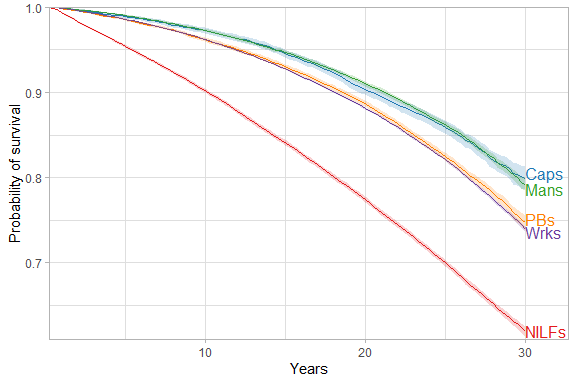
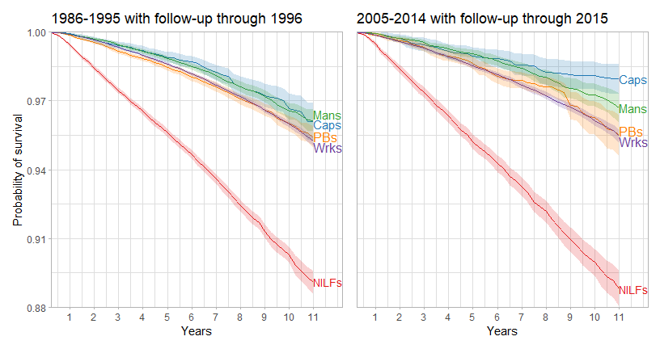

* Analysis:

    + subdivide workers (and managers?) based on ONET or Krieger's method
    + compare results using classwk/classwk2 2001-2003 when the variables overlap
    + incorporate firmno variable (numemps) for capitalist vs PB from 1997-2014 as sensitivity/descriptive analysis?
    + sensitivity using survey design object - show SEs are similar to main
    + estimate proportions in classes over time
    
* Investigate: 
    + need to handle hispanic oversample correctly: advice here: https://nhis.ipums.org/nhis/userNotes_Hispanic_oversample.shtml
        + do so by using inverse probability of selection weights in sensitivity analyses? Tig says that makes sense, check if anyone ever responds on IPUMS forum

* General notes:
    + originally was hoping to examine cause-specific mortality, but I'm not sure it makes sense as counts are small, detailed cause of death not available from 2005-on, and would need to handle competing events
    + i don't think it's worth doing MICE since there's very little missingness and it'd be incredibly computationally intensive given the size of the dataset

* Methods notes: 
    + when robust=T, weights are treated properly by survfit and coxph functions (as probability or sampling weights rathert than frequency weights)
    + citations for propensity score approach: https://www.ncbi.nlm.nih.gov/labs/pmc/articles/PMC5802372/; https://journals.sagepub.com/doi/full/10.1177/0193841X20938497
  


```r
library(dplyr)
library(data.table)
library(here)
library(survival)
library(rms)
library(broom)
library(Rcpp)
library(rstpm2)
library(survey)
library(kableExtra)
library(tableone)
library(survminer)
library(ipw)
library(directlabels)
library(RColorBrewer)
library(patchwork)
options(scipen=999)
options(knitr.kable.NA = '')

#load dat
dat <- fread(here('nhis_1986_2014.csv'))

#make all variable names lowercase
dat %>%
  rename_all(tolower) -> dat

#exclude those outside age ranges (age has 0.09% missing)
#exclude those ineligible for mortality follow-up and those <25 or 65+ and those who aren't sample adults from 1997-on (occ1995 and classwk not available for others after that time)
#exclude 1997-2000, when there's no data on whether business is incorporated or not
#exclude 2015-on, when there's no mortality data
#exclude 1992 Hispanic oversample (only 4641 additional respondents) per advice of IPUMS
dat %>%
  filter((age>=25 & age<65) & mortelig==1 & (is.na(astatflg) | astatflg==1) & (year<1997 | (year>2000 & year<2015)) & !(year==1992 & substr(nhispid, 1, 4)==1991)) -> dat_sub

#make variables
dat_sub %>%
  mutate_at(.vars=(vars(-c(mortucod, mortwt, mortwtsa, psu, strata))), ~ifelse(. %in% c(91, 96, 97, 98, 99, 970, 980, 990, 7777, 8888, 9999), NA, .)) %>%
  mutate(classwk2=ifelse(classwk2 %in% (7:9), NA, classwk2), #these are real values in some other variables so we'll reset them here
         racesr=ifelse(racesr==900, NA, racesr)) %>%
  mutate(year_1986=year-1986, #center year at beginning and end of follow-up
         year_2014=year-2014,
         mortwt_f=ifelse(year<=1996, mortwt, mortwtsa), #per advice of IPUMS help desk, use mortwt from 1986-1996 and mortwtsa from 1997-on
         dead=ifelse(mortstat==1, 1, 0),
         mortdodq=ifelse(mortdodq==1, 91.25, #assume deaths occurred at the end of the quarter
                         ifelse(mortdodq==2, 182.5,
                                ifelse(mortdodq==3, 273.75, 
                                       ifelse(mortdodq==4, 365, NA)))),
         time=ifelse(dead==0, 2016 - year, mortdody + (mortdodq/365) - year), #deaths were allowed to occur through the end of Dec 31 2015, i.e., 2016
         dead_1996=ifelse(year>1996, NA,
                          ifelse(year<=1996 & (is.na(mortdody) | mortdody>1996), 0,
                                 ifelse(year<=1996 & mortdody<=1996, 1, NA))),
         time_1996=ifelse(year>1996, NA,
                          ifelse(dead_1996==1, mortdody + (mortdodq/365) - year,
                                 ifelse(dead_1996==0, 1997-year, NA))),
         manager=ifelse(occ1995>=102 & occ1995<=104, 1, 0),
         class=factor(ifelse(empstat==220, "NILF",
                             ifelse((empstat>=210 & empstat<=214) | (year<2001 & (classwk>=20 & classwk<=34) & manager!=1) | (year>=2001 & (classwk2>=1 & classwk2<=4) & manager!=1), "Worker",
                                    ifelse((year<2001 & (classwk>=20 & classwk<=34) & manager==1) | (year>=2001 & (classwk2>=1 & classwk2<=4) & manager==1), "Manager",
                                           ifelse((year<2001 & classwk==41) | (year>=2001 & classwk2==5 & jobsecincorp==2), "Capitalist",
                                                  ifelse((year<2001 & (classwk==42 | classwk==50)) | ((year>=2001 & classwk2==6) | (year>=2001 & classwk2==5 & jobsecincorp==1)), "PB", NA))))), 
                     levels=c("Capitalist", "PB", "Manager", "Worker", "NILF")),
         race=ifelse(racesr==100, "White", 
                     ifelse(racesr==200, "Black", "Other")),
         race_h=factor(ifelse(hispeth!=10, "Hispanic",
                              ifelse(hispeth==10 & race=="White", "NH white",
                                     ifelse(hispeth==10 & race=="Black", "NH black", "NH other"))), levels=c("NH white", "NH black", "Hispanic", "NH other")),
         poc=ifelse(race_h=="NH white", "NH white", "POC"),
         sex=ifelse(sex==1, "male", "female"),
         educ=factor(ifelse(educrec1<13, "<HS",
                            ifelse(educrec1==13, "HS",
                                   ifelse(educrec1==14, "Some college", "College+"))), levels=c("<HS", "HS", "Some college", "College+")),
         marital_tri=factor(ifelse(marstat %in% 10:12, "Married",
                                   ifelse(marstat %in% 20:40, "Widowed/divorced/separated", 
                                          ifelse(marstat==50, "Single", NA))), levels=c("Married", "Single", "Widowed/divorced/separated")),
         region=ifelse(region==1, "NE", 
                       ifelse(region==2, "MW",
                              ifelse(region==3, "S", "W"))),
         class_gender=factor(ifelse(class=="Worker" & sex=="male", "Male worker",
                                    ifelse(class=="Worker" & sex=="female", "Female worker",
                                           ifelse(class=="Manager" & sex=="male", "Male manager",
                                                  ifelse(class=="Manager" & sex=="female", "Female manager",
                                                         ifelse(class=="PB" & sex=="male", "Male PB",
                                                                ifelse(class=="PB" & sex=="female", "Female PB",
                                                                       ifelse(class=="Capitalist" & sex=="male", "Male capitalist",
                                                                              ifelse(class=="Capitalist" & sex=="female", "Female capitalist",
                                                                                     ifelse(class=="NILF" & sex=="male", "Male NILF",
                                                                                            ifelse(class=="NILF" & sex=="female", "Female NILF", NA)))))))))),
                             levels=c("Male capitalist", "Male PB", "Male manager", "Male worker", "Male NILF",
                                      "Female capitalist", "Female PB", "Female manager", "Female worker", "Female NILF")),
         class_poc=factor(ifelse(class=="Worker" & poc=="NH white", "NH white worker",
                                 ifelse(class=="Worker" & poc=="POC", "POC worker",
                                        ifelse(class=="Manager" & poc=="NH white", "NH white manager",
                                               ifelse(class=="Manager" & poc=="POC", "POC manager",
                                                      ifelse(class=="PB" & poc=="NH white", "NH white PB",
                                                             ifelse(class=="PB" & poc=="POC", "POC PB",
                                                                    ifelse(class=="Capitalist" & poc=="NH white", "NH white capitalist",
                                                                           ifelse(class=="Capitalist" & poc=="POC", "POC capitalist", 
                                                                                  ifelse(class=="NILF" & poc=="NH white", "NH white NILF", 
                                                                                         ifelse(class=="NILF" & poc=="POC", "POC NILF", NA)))))))))),
                          levels=c("NH white capitalist", "NH white PB", "NH white manager", "NH white worker", "NH white NILF",
                                   "POC capitalist", "POC PB", "POC manager", "POC worker", "POC NILF")),
         class_region=factor(ifelse(class=="Worker" & region=="MW", "MW worker",
                                    ifelse(class=="Worker" & region=="NE", "NE worker",
                                           ifelse(class=="Worker" & region=="S", "S worker",
                                                  ifelse(class=="Worker" & region=="W", "W worker",
                                                         ifelse(class=="Manager" & region=="MW", "MW manager",
                                                                ifelse(class=="Manager" & region=="NE", "NE manager",
                                                                       ifelse(class=="Manager" & region=="S", "S manager",
                                                                              ifelse(class=="Manager" & region=="W", "W manager",
                                                                                     ifelse(class=="PB" & region=="MW", "MW PB",
                                                                                            ifelse(class=="PB" & region=="NE", "NE PB",
                                                                                                   ifelse(class=="PB" & region=="S", "S PB",
                                                                                                          ifelse(class=="PB" & region=="W", "W PB",
                                                                                                                 ifelse(class=="Capitalist" & region=="MW", "MW capitalist",
                                                                                                                        ifelse(class=="Capitalist" & region=="NE", "NE capitalist",
                                                                                                                               ifelse(class=="Capitalist" & region=="S", "S capitalist",
                                                                                                                                      ifelse(class=="Capitalist" & region=="W", "W capitalist", 
                                                                                                                                             ifelse(class=="NILF" & region=="MW", "MW NILF",
                                                                                                                                                    ifelse(class=="NILF" & region=="NE", "NE NILF",
                                                                                                                                                           ifelse(class=="NILF" & region=="S", "S NILF",
                                                                                                                                                                  ifelse(class=="NILF" & region=="W", "W NILF", NA)))))))))))))))))))),
                             levels=c("MW capitalist", "NE capitalist", "S capitalist", "W capitalist",
                                      "MW PB", "NE PB", "S PB", "W PB", 
                                      "MW manager", "NE manager", "S manager", "W manager",
                                      "MW worker", "NE worker", "S worker", "W worker",
                                      "MW NILF", "NE NILF", "S NILF", "W NILF"))) -> dat_sub
                                                                                     
#exclude couple respondents with negative follow-up time
dat_sub %>%
  filter(time>=0) -> dat_sub
```

# Missingness 

Age missingness is in full dataset; missingness for other variables is among those ages 25-64


```r
#age in full dataset
dat %>%
  mutate_at(.vars=(vars(-c(mortucod, mortwt, mortwtsa, psu, strata))), ~ifelse(. %in% c(91, 96, 97, 98, 99, 970, 980, 990, 7777, 8888, 9999), NA, .)) %>%
  summarise_at(vars('age'), funs(na=100*sum(is.na(.)/1233801))) %>%
  mutate(name='age') %>% 
  relocate(na, .after=last_col()) -> dat_age_na

#other vars in subsetted dataset
dat_sub %>%
  summarise_at(vars(c('class', 'sex', 'race_h', 'educ', 'marital_tri', 'region')), funs(100*sum(is.na(.)/861724))) %>%
  tidyr::pivot_longer(class:region, values_to='na') -> dat_other_na

kable(bind_rows(dat_age_na, dat_other_na), digits=2, col.names=c("Variable", "Percent missing")) %>%
  kable_styling('striped')
```

<table class="table table-striped" style="margin-left: auto; margin-right: auto;">
 <thead>
  <tr>
   <th style="text-align:left;"> Variable </th>
   <th style="text-align:right;"> Percent missing </th>
  </tr>
 </thead>
<tbody>
  <tr>
   <td style="text-align:left;"> age </td>
   <td style="text-align:right;"> 0.09 </td>
  </tr>
  <tr>
   <td style="text-align:left;"> class </td>
   <td style="text-align:right;"> 1.80 </td>
  </tr>
  <tr>
   <td style="text-align:left;"> sex </td>
   <td style="text-align:right;"> 0.00 </td>
  </tr>
  <tr>
   <td style="text-align:left;"> race_h </td>
   <td style="text-align:right;"> 0.55 </td>
  </tr>
  <tr>
   <td style="text-align:left;"> educ </td>
   <td style="text-align:right;"> 0.80 </td>
  </tr>
  <tr>
   <td style="text-align:left;"> marital_tri </td>
   <td style="text-align:right;"> 0.40 </td>
  </tr>
  <tr>
   <td style="text-align:left;"> region </td>
   <td style="text-align:right;"> 0.00 </td>
  </tr>
</tbody>
</table>

# Descriptives

## Unweighted and stratified with missingness in variables of interest (aside from age and class)


```r
#vars of interest
vars <- c('sex', 'race_h', 'educ', 'marital_tri', 'region', 'age')
catvars <- c("sex")
nonorm <- c('age')

x <- CreateTableOne(data = dat_sub, vars=vars, factorVars=catvars, strata='class', includeNA=TRUE)
x <- print(x, printToggle=FALSE, noSpaces=TRUE, nonnormal=nonorm, format='p')
kable(x[,1:5]) %>%
  kable_styling(c("striped", "condensed"))
```

<table class="table table-striped table-condensed" style="margin-left: auto; margin-right: auto;">
 <thead>
  <tr>
   <th style="text-align:left;">   </th>
   <th style="text-align:left;"> Capitalist </th>
   <th style="text-align:left;"> PB </th>
   <th style="text-align:left;"> Manager </th>
   <th style="text-align:left;"> Worker </th>
   <th style="text-align:left;"> NILF </th>
  </tr>
 </thead>
<tbody>
  <tr>
   <td style="text-align:left;"> n </td>
   <td style="text-align:left;"> 18072 </td>
   <td style="text-align:left;"> 57609 </td>
   <td style="text-align:left;"> 78414 </td>
   <td style="text-align:left;"> 506278 </td>
   <td style="text-align:left;"> 185854 </td>
  </tr>
  <tr>
   <td style="text-align:left;"> sex = male (%) </td>
   <td style="text-align:left;"> 73.5 </td>
   <td style="text-align:left;"> 61.7 </td>
   <td style="text-align:left;"> 52.7 </td>
   <td style="text-align:left;"> 50.2 </td>
   <td style="text-align:left;"> 27.0 </td>
  </tr>
  <tr>
   <td style="text-align:left;"> race_h (%) </td>
   <td style="text-align:left;">  </td>
   <td style="text-align:left;">  </td>
   <td style="text-align:left;">  </td>
   <td style="text-align:left;">  </td>
   <td style="text-align:left;">  </td>
  </tr>
  <tr>
   <td style="text-align:left;"> NH white </td>
   <td style="text-align:left;"> 85.1 </td>
   <td style="text-align:left;"> 79.9 </td>
   <td style="text-align:left;"> 79.6 </td>
   <td style="text-align:left;"> 68.0 </td>
   <td style="text-align:left;"> 64.0 </td>
  </tr>
  <tr>
   <td style="text-align:left;"> NH black </td>
   <td style="text-align:left;"> 3.8 </td>
   <td style="text-align:left;"> 6.2 </td>
   <td style="text-align:left;"> 8.9 </td>
   <td style="text-align:left;"> 14.5 </td>
   <td style="text-align:left;"> 16.4 </td>
  </tr>
  <tr>
   <td style="text-align:left;"> Hispanic </td>
   <td style="text-align:left;"> 6.1 </td>
   <td style="text-align:left;"> 9.5 </td>
   <td style="text-align:left;"> 7.0 </td>
   <td style="text-align:left;"> 12.7 </td>
   <td style="text-align:left;"> 14.3 </td>
  </tr>
  <tr>
   <td style="text-align:left;"> NH other </td>
   <td style="text-align:left;"> 4.5 </td>
   <td style="text-align:left;"> 4.0 </td>
   <td style="text-align:left;"> 4.2 </td>
   <td style="text-align:left;"> 4.4 </td>
   <td style="text-align:left;"> 4.8 </td>
  </tr>
  <tr>
   <td style="text-align:left;"> NA </td>
   <td style="text-align:left;"> 0.5 </td>
   <td style="text-align:left;"> 0.4 </td>
   <td style="text-align:left;"> 0.4 </td>
   <td style="text-align:left;"> 0.4 </td>
   <td style="text-align:left;"> 0.6 </td>
  </tr>
  <tr>
   <td style="text-align:left;"> educ (%) </td>
   <td style="text-align:left;">  </td>
   <td style="text-align:left;">  </td>
   <td style="text-align:left;">  </td>
   <td style="text-align:left;">  </td>
   <td style="text-align:left;">  </td>
  </tr>
  <tr>
   <td style="text-align:left;"> &lt;HS </td>
   <td style="text-align:left;"> 5.9 </td>
   <td style="text-align:left;"> 14.2 </td>
   <td style="text-align:left;"> 2.9 </td>
   <td style="text-align:left;"> 13.9 </td>
   <td style="text-align:left;"> 29.0 </td>
  </tr>
  <tr>
   <td style="text-align:left;"> HS </td>
   <td style="text-align:left;"> 26.8 </td>
   <td style="text-align:left;"> 35.9 </td>
   <td style="text-align:left;"> 21.7 </td>
   <td style="text-align:left;"> 36.8 </td>
   <td style="text-align:left;"> 36.3 </td>
  </tr>
  <tr>
   <td style="text-align:left;"> Some college </td>
   <td style="text-align:left;"> 24.2 </td>
   <td style="text-align:left;"> 23.4 </td>
   <td style="text-align:left;"> 25.9 </td>
   <td style="text-align:left;"> 24.5 </td>
   <td style="text-align:left;"> 19.4 </td>
  </tr>
  <tr>
   <td style="text-align:left;"> College+ </td>
   <td style="text-align:left;"> 42.9 </td>
   <td style="text-align:left;"> 26.0 </td>
   <td style="text-align:left;"> 49.3 </td>
   <td style="text-align:left;"> 24.3 </td>
   <td style="text-align:left;"> 14.2 </td>
  </tr>
  <tr>
   <td style="text-align:left;"> NA </td>
   <td style="text-align:left;"> 0.2 </td>
   <td style="text-align:left;"> 0.4 </td>
   <td style="text-align:left;"> 0.2 </td>
   <td style="text-align:left;"> 0.4 </td>
   <td style="text-align:left;"> 1.2 </td>
  </tr>
  <tr>
   <td style="text-align:left;"> marital_tri (%) </td>
   <td style="text-align:left;">  </td>
   <td style="text-align:left;">  </td>
   <td style="text-align:left;">  </td>
   <td style="text-align:left;">  </td>
   <td style="text-align:left;">  </td>
  </tr>
  <tr>
   <td style="text-align:left;"> Married </td>
   <td style="text-align:left;"> 81.0 </td>
   <td style="text-align:left;"> 74.2 </td>
   <td style="text-align:left;"> 68.9 </td>
   <td style="text-align:left;"> 64.4 </td>
   <td style="text-align:left;"> 65.3 </td>
  </tr>
  <tr>
   <td style="text-align:left;"> Single </td>
   <td style="text-align:left;"> 7.6 </td>
   <td style="text-align:left;"> 11.0 </td>
   <td style="text-align:left;"> 15.1 </td>
   <td style="text-align:left;"> 17.5 </td>
   <td style="text-align:left;"> 13.8 </td>
  </tr>
  <tr>
   <td style="text-align:left;"> Widowed/divorced/separated </td>
   <td style="text-align:left;"> 11.3 </td>
   <td style="text-align:left;"> 14.6 </td>
   <td style="text-align:left;"> 15.9 </td>
   <td style="text-align:left;"> 17.9 </td>
   <td style="text-align:left;"> 20.5 </td>
  </tr>
  <tr>
   <td style="text-align:left;"> NA </td>
   <td style="text-align:left;"> 0.1 </td>
   <td style="text-align:left;"> 0.2 </td>
   <td style="text-align:left;"> 0.1 </td>
   <td style="text-align:left;"> 0.2 </td>
   <td style="text-align:left;"> 0.5 </td>
  </tr>
  <tr>
   <td style="text-align:left;"> region (%) </td>
   <td style="text-align:left;">  </td>
   <td style="text-align:left;">  </td>
   <td style="text-align:left;">  </td>
   <td style="text-align:left;">  </td>
   <td style="text-align:left;">  </td>
  </tr>
  <tr>
   <td style="text-align:left;"> MW </td>
   <td style="text-align:left;"> 23.2 </td>
   <td style="text-align:left;"> 24.6 </td>
   <td style="text-align:left;"> 23.0 </td>
   <td style="text-align:left;"> 24.4 </td>
   <td style="text-align:left;"> 21.6 </td>
  </tr>
  <tr>
   <td style="text-align:left;"> NE </td>
   <td style="text-align:left;"> 21.5 </td>
   <td style="text-align:left;"> 16.5 </td>
   <td style="text-align:left;"> 20.3 </td>
   <td style="text-align:left;"> 19.4 </td>
   <td style="text-align:left;"> 19.5 </td>
  </tr>
  <tr>
   <td style="text-align:left;"> S </td>
   <td style="text-align:left;"> 34.2 </td>
   <td style="text-align:left;"> 32.7 </td>
   <td style="text-align:left;"> 33.4 </td>
   <td style="text-align:left;"> 34.5 </td>
   <td style="text-align:left;"> 36.2 </td>
  </tr>
  <tr>
   <td style="text-align:left;"> W </td>
   <td style="text-align:left;"> 21.0 </td>
   <td style="text-align:left;"> 26.3 </td>
   <td style="text-align:left;"> 23.2 </td>
   <td style="text-align:left;"> 21.8 </td>
   <td style="text-align:left;"> 22.7 </td>
  </tr>
  <tr>
   <td style="text-align:left;"> age (median [IQR]) </td>
   <td style="text-align:left;"> 45.00 [37.00, 53.00] </td>
   <td style="text-align:left;"> 44.00 [36.00, 52.00] </td>
   <td style="text-align:left;"> 41.00 [33.00, 49.00] </td>
   <td style="text-align:left;"> 39.00 [32.00, 49.00] </td>
   <td style="text-align:left;"> 47.00 [35.00, 58.00] </td>
  </tr>
</tbody>
</table>

# Class and all-cause mortality


```r
#plotting function
plotted <- function(datted=kapped, caps=120, pbs=120, mans=120, works=120, nilfs=120){
  
  dat_surv <- data.frame(time=datted$time,
                         surved=datted$surv,
                         se=datted$std.err,
                         class=c(rep("Caps", caps), rep("PBs", pbs), rep("Mans", mans), rep("Wrks", works), rep("NILFs", nilfs)))

  ggplot(dat_surv, aes(x=time, y=surved, group=class, color=class, fill=class, label=class)) + 
    geom_line() +
    geom_ribbon(aes(ymin=surved-1.96*se, ymax=surved+1.96*se, color=class), alpha=0.2, lty=0) +
    geom_dl(method='last.qp') +
    scale_color_manual(values=brewer.pal(n = 12, name = "Paired")[c(2,4,6,8,10)]) +
    scale_fill_manual(values=brewer.pal(n = 12, name = "Paired")[c(2,4,6,8,10)]) +
    xlab("Years") +
    ylab("Probability of survival") +
    scale_x_continuous(expand=expansion(mult=c(0,0.09))) +
    scale_y_continuous(expand=expansion(mult=c(0.01,0))) +
    theme_light() +
    theme(legend.position="none")
}

#survdiff function
survdiffed <- function(datted=kapped, timed=30){
  
  #end of f/u
  point <- summary(datted,times=timed)
  
  #pb-cap
  pb <- 100*(point$surv[2] - point$surv[1])
  pb_lower <- 100*(pb/100 - 1.96*sqrt(point$std.err[2]^2 + point$std.err[1]^2))
  pb_upper <- 100*(pb/100 + 1.96*sqrt(point$std.err[2]^2 + point$std.err[1]^2))
    
  #mc-cap
  mc <- 100*(point$surv[3] - point$surv[1])
  mc_lower <- 100*(mc/100 - 1.96*sqrt(point$std.err[3]^2 + point$std.err[1]^2))
  mc_upper <- 100*(mc/100 + 1.96*sqrt(point$std.err[3]^2 + point$std.err[1]^2))
  
  #worker-cap
  wc <- 100*(point$surv[4] - point$surv[1])
  wc_lower <- 100*(wc/100 - 1.96*sqrt(point$std.err[4]^2 + point$std.err[1]^2))
  wc_upper <- 100*(wc/100 + 1.96*sqrt(point$std.err[4]^2 + point$std.err[1]^2))
  
  #nilf-cap
  nc <- 100*(point$surv[5] - point$surv[1])
  nc_lower <- 100*(nc/100 - 1.96*sqrt(point$std.err[5]^2 + point$std.err[1]^2))
  nc_upper <- 100*(nc/100 + 1.96*sqrt(point$std.err[5]^2 + point$std.err[1]^2))
  
  rbind(c(pb, pb_lower, pb_upper), c(mc, mc_lower, mc_upper), c(wc, wc_lower, wc_upper), c(nc, nc_lower, nc_upper))
  
}

#tidying regression output function
tidy_n <- function(modded=mod, rows=1:4, cols=c(1,2,7,8), bind=binded, captioned="Ref: capitalist") {
  tidydf <- cbind(tidy(modded, exponentiate=T, conf.int=T)[rows, cols], bind)
  tidydf$N <- c(length(modded$residuals), NA, NA, NA)
  kable(tidydf, digits=c(2,2,2,2,1,1,1,1), caption=captioned, col.names=c(" ", "HR", "Lower", "Upper", "SD", "Lower", "Upper", "N")) %>%
    kable_styling("striped") %>%
    add_header_above(c(" ", "HR"=3, "SD per 100 at end of f/u"=3, " "))
}

#alternative KM approach using ggsurvplot - makes it look like more of a traditional KM plot (with steps), but is harder to read
#plotted <- ggsurvplot(kapped, 
#           ylim=c(0.6, 1.0),
#           conf.int = T,
#           axes.offset=T,
#           censor=F,
#           palette=brewer.pal(n = 12, name = "Paired")[c(2,4,6,8,10)],
#           legend="none",
#           ggtheme=theme_light()) +
#  ylab("Probability of survival") +
#  xlab("Year") 
#
#plotted %++%
#  geom_dl(aes(label = class), method = 'last.qp')
```

## Overall

### Distribution of IPW


```r
dat_sub %>%
  filter(!is.na(class) & !is.na(age) & !is.na(sex) & !is.na(year)) %>%
  mutate(sw=ipwpoint(exposure=class,
                     family="multinomial",
                     link="logit",
                     numerator=~1,
                     denominator=~rcs(age, 3) + sex + rcs(year, 5), 
                     data = subset(dat_sub, !is.na(class) & !is.na(age) & !is.na(sex) & !is.na(year)),
                     weights=mortwt_f,
                     trace=FALSE)$ipw.weights,
         sw_f=sw*mortwt_f)  -> dat_sub_overall

summary(dat_sub_overall$sw)
```

```
##    Min. 1st Qu.  Median    Mean 3rd Qu.    Max. 
##  0.3271  0.8458  0.9464  0.9906  1.0484  6.5302
```


```r
kapped <- survfit(Surv(time,dead)~class, robust=T, w=sw_f, data=dat_sub_overall, se=T)
mod <- coxph(Surv(time,dead)~class, robust=T, w=sw_f, data=dat_sub_overall)
binded <- survdiffed()
```

### Survival plot


```r
plotted()
```

<!-- -->

```r
ggsave("overall_survival.png", dpi=600, height=4, width=6)
```

### Survival difference and hazard ratio


```r
tidy_n()
```

<table class="table table-striped" style="margin-left: auto; margin-right: auto;">
<caption>Ref: capitalist</caption>
 <thead>
<tr>
<th style="empty-cells: hide;border-bottom:hidden;" colspan="1"></th>
<th style="border-bottom:hidden;padding-bottom:0; padding-left:3px;padding-right:3px;text-align: center; " colspan="3"><div style="border-bottom: 1px solid #ddd; padding-bottom: 5px; ">HR</div></th>
<th style="border-bottom:hidden;padding-bottom:0; padding-left:3px;padding-right:3px;text-align: center; " colspan="3"><div style="border-bottom: 1px solid #ddd; padding-bottom: 5px; ">SD per 100 at end of f/u</div></th>
<th style="empty-cells: hide;border-bottom:hidden;" colspan="1"></th>
</tr>
  <tr>
   <th style="text-align:left;">   </th>
   <th style="text-align:right;"> HR </th>
   <th style="text-align:right;"> Lower </th>
   <th style="text-align:right;"> Upper </th>
   <th style="text-align:right;"> SD </th>
   <th style="text-align:right;"> Lower </th>
   <th style="text-align:right;"> Upper </th>
   <th style="text-align:right;"> N </th>
  </tr>
 </thead>
<tbody>
  <tr>
   <td style="text-align:left;"> classPB </td>
   <td style="text-align:right;"> 1.27 </td>
   <td style="text-align:right;"> 1.19 </td>
   <td style="text-align:right;"> 1.36 </td>
   <td style="text-align:right;"> -5.2 </td>
   <td style="text-align:right;"> -6.8 </td>
   <td style="text-align:right;"> -3.6 </td>
   <td style="text-align:right;"> 846227 </td>
  </tr>
  <tr>
   <td style="text-align:left;"> classManager </td>
   <td style="text-align:right;"> 0.98 </td>
   <td style="text-align:right;"> 0.92 </td>
   <td style="text-align:right;"> 1.05 </td>
   <td style="text-align:right;"> -0.7 </td>
   <td style="text-align:right;"> -2.3 </td>
   <td style="text-align:right;"> 0.8 </td>
   <td style="text-align:right;">  </td>
  </tr>
  <tr>
   <td style="text-align:left;"> classWorker </td>
   <td style="text-align:right;"> 1.31 </td>
   <td style="text-align:right;"> 1.23 </td>
   <td style="text-align:right;"> 1.39 </td>
   <td style="text-align:right;"> -6.0 </td>
   <td style="text-align:right;"> -7.4 </td>
   <td style="text-align:right;"> -4.6 </td>
   <td style="text-align:right;">  </td>
  </tr>
  <tr>
   <td style="text-align:left;"> classNILF </td>
   <td style="text-align:right;"> 2.65 </td>
   <td style="text-align:right;"> 2.49 </td>
   <td style="text-align:right;"> 2.82 </td>
   <td style="text-align:right;"> -18.0 </td>
   <td style="text-align:right;"> -19.5 </td>
   <td style="text-align:right;"> -16.5 </td>
   <td style="text-align:right;">  </td>
  </tr>
</tbody>
</table>

## 1986-1995 waves w/ f/u through end of 1996 vs 2005-2014 waves w/ f/u through end of 2015

### Distribution of IPW

#### Early wave


```r
dat_sub %>%
  filter(year<=1995 & !is.na(class) & !is.na(age) & !is.na(sex) & !is.na(year)) %>%
  mutate(sw=ipwpoint(exposure=class,
                     family="multinomial",
                     link="logit",
                     numerator=~1,
                     denominator=~rcs(age, 3) + sex + rcs(year, 3), 
                     data = subset(dat_sub, year<=1995 & !is.na(class) & !is.na(age) & !is.na(sex) & !is.na(year)),
                     weights=mortwt_f,
                     trace=FALSE)$ipw.weights,
         sw_f=sw*mortwt_f)  -> dat_sub_1986

summary(dat_sub_1986$sw)
```

```
##    Min. 1st Qu.  Median    Mean 3rd Qu.    Max. 
##  0.2952  0.8246  0.9387  0.9984  1.0339  6.3506
```

#### Late wave


```r
dat_sub %>%
  filter(year>=2005 & !is.na(class) & !is.na(age) & !is.na(sex) & !is.na(year)) %>%
  mutate(sw=ipwpoint(exposure=class,
                     family="multinomial",
                     link="logit",
                     numerator=~1,
                     denominator=~rcs(age, 3) + sex + rcs(year, 3), 
                     data = subset(dat_sub, year>=2005 & !is.na(class) & !is.na(age) & !is.na(sex) & !is.na(year)),
                     weights=mortwt_f,
                     trace=FALSE)$ipw.weights,
         sw_f=sw*mortwt_f)  -> dat_sub_2005

summary(dat_sub_2005$sw)
```

```
##    Min. 1st Qu.  Median    Mean 3rd Qu.    Max. 
##  0.3615  0.8550  0.9366  1.0003  1.0763  6.0337
```


```r
#early
kapped_early <- survfit(Surv(time_1996, dead_1996)~class, robust=T, w=sw_f, data=dat_sub_1986, se=T)
mod_early <- coxph(Surv(time_1996, dead_1996)~class, robust=T, w=sw_f, data=dat_sub_1986)
binded_early <- survdiffed(kapped_early, timed=11)

#late
kapped_late <- survfit(Surv(time,dead)~class, robust=T, w=sw_f, data=dat_sub_2005, se=T)
mod_late <- coxph(Surv(time,dead)~class, robust=T, w=sw_f, data=dat_sub_2005)
binded_late <- survdiffed(kapped_late, timed=11)
```

### Survival plots


```r
plotted(datted=kapped_early, caps=43, pbs=44, mans=43, works=44, nilfs=44) + 
  ggtitle("1986-1995 with follow-up through 1996") + 
  scale_y_continuous(limits=c(0.88, 1.0), breaks=c(0.88, 0.91, 0.94, 0.97, 1.0), expand=expansion(mult=c(0,0))) +
  scale_x_continuous(breaks=seq(1, 11, 1), expand=expansion(mult=c(0,0.11))) +
plotted(datted=kapped_late, caps=33, pbs=44, mans=44, works=44, nilfs=44) + 
  ggtitle("2005-2014 with follow-up through 2015") + 
  scale_y_continuous(limits=c(0.88, 1.0), breaks=c(0.88, 0.91, 0.94, 0.97, 1.0), expand=expansion(mult=c(0,0))) +
  scale_x_continuous(breaks=seq(1, 11, 1), expand=expansion(mult=c(0,0.11))) +
  theme(axis.title.y=element_blank(), axis.text.y=element_blank(), axis.ticks.y=element_blank())
```

<!-- -->

```r
ggsave("change_over_time.png", dpi=600, height=4, width=8.5)
```

### Survival difference and hazard ratio


```r
tidy_n(modded=mod_early, bind=binded_early, captioned="Ref: capitalists (1986-1995 subset)")
```

<table class="table table-striped" style="margin-left: auto; margin-right: auto;">
<caption>Ref: capitalists (1986-1995 subset)</caption>
 <thead>
<tr>
<th style="empty-cells: hide;border-bottom:hidden;" colspan="1"></th>
<th style="border-bottom:hidden;padding-bottom:0; padding-left:3px;padding-right:3px;text-align: center; " colspan="3"><div style="border-bottom: 1px solid #ddd; padding-bottom: 5px; ">HR</div></th>
<th style="border-bottom:hidden;padding-bottom:0; padding-left:3px;padding-right:3px;text-align: center; " colspan="3"><div style="border-bottom: 1px solid #ddd; padding-bottom: 5px; ">SD per 100 at end of f/u</div></th>
<th style="empty-cells: hide;border-bottom:hidden;" colspan="1"></th>
</tr>
  <tr>
   <th style="text-align:left;">   </th>
   <th style="text-align:right;"> HR </th>
   <th style="text-align:right;"> Lower </th>
   <th style="text-align:right;"> Upper </th>
   <th style="text-align:right;"> SD </th>
   <th style="text-align:right;"> Lower </th>
   <th style="text-align:right;"> Upper </th>
   <th style="text-align:right;"> N </th>
  </tr>
 </thead>
<tbody>
  <tr>
   <td style="text-align:left;"> classPB </td>
   <td style="text-align:right;"> 1.28 </td>
   <td style="text-align:right;"> 1.08 </td>
   <td style="text-align:right;"> 1.54 </td>
   <td style="text-align:right;"> -0.7 </td>
   <td style="text-align:right;"> -1.6 </td>
   <td style="text-align:right;"> 0.2 </td>
   <td style="text-align:right;"> 540854 </td>
  </tr>
  <tr>
   <td style="text-align:left;"> classManager </td>
   <td style="text-align:right;"> 1.03 </td>
   <td style="text-align:right;"> 0.86 </td>
   <td style="text-align:right;"> 1.23 </td>
   <td style="text-align:right;"> 0.0 </td>
   <td style="text-align:right;"> -0.9 </td>
   <td style="text-align:right;"> 1.0 </td>
   <td style="text-align:right;">  </td>
  </tr>
  <tr>
   <td style="text-align:left;"> classWorker </td>
   <td style="text-align:right;"> 1.24 </td>
   <td style="text-align:right;"> 1.05 </td>
   <td style="text-align:right;"> 1.47 </td>
   <td style="text-align:right;"> -0.9 </td>
   <td style="text-align:right;"> -1.7 </td>
   <td style="text-align:right;"> 0.0 </td>
   <td style="text-align:right;">  </td>
  </tr>
  <tr>
   <td style="text-align:left;"> classNILF </td>
   <td style="text-align:right;"> 3.47 </td>
   <td style="text-align:right;"> 2.94 </td>
   <td style="text-align:right;"> 4.10 </td>
   <td style="text-align:right;"> -7.0 </td>
   <td style="text-align:right;"> -8.0 </td>
   <td style="text-align:right;"> -6.1 </td>
   <td style="text-align:right;">  </td>
  </tr>
</tbody>
</table>

```r
tidy_n(modded=mod_late, bind=binded_late, captioned="Ref: capitalists (2005-2014 subset)")
```

<table class="table table-striped" style="margin-left: auto; margin-right: auto;">
<caption>Ref: capitalists (2005-2014 subset)</caption>
 <thead>
<tr>
<th style="empty-cells: hide;border-bottom:hidden;" colspan="1"></th>
<th style="border-bottom:hidden;padding-bottom:0; padding-left:3px;padding-right:3px;text-align: center; " colspan="3"><div style="border-bottom: 1px solid #ddd; padding-bottom: 5px; ">HR</div></th>
<th style="border-bottom:hidden;padding-bottom:0; padding-left:3px;padding-right:3px;text-align: center; " colspan="3"><div style="border-bottom: 1px solid #ddd; padding-bottom: 5px; ">SD per 100 at end of f/u</div></th>
<th style="empty-cells: hide;border-bottom:hidden;" colspan="1"></th>
</tr>
  <tr>
   <th style="text-align:left;">   </th>
   <th style="text-align:right;"> HR </th>
   <th style="text-align:right;"> Lower </th>
   <th style="text-align:right;"> Upper </th>
   <th style="text-align:right;"> SD </th>
   <th style="text-align:right;"> Lower </th>
   <th style="text-align:right;"> Upper </th>
   <th style="text-align:right;"> N </th>
  </tr>
 </thead>
<tbody>
  <tr>
   <td style="text-align:left;"> classPB </td>
   <td style="text-align:right;"> 1.66 </td>
   <td style="text-align:right;"> 1.18 </td>
   <td style="text-align:right;"> 2.33 </td>
   <td style="text-align:right;"> -2.5 </td>
   <td style="text-align:right;"> -3.5 </td>
   <td style="text-align:right;"> -1.4 </td>
   <td style="text-align:right;"> 193481 </td>
  </tr>
  <tr>
   <td style="text-align:left;"> classManager </td>
   <td style="text-align:right;"> 1.22 </td>
   <td style="text-align:right;"> 0.87 </td>
   <td style="text-align:right;"> 1.71 </td>
   <td style="text-align:right;"> -1.3 </td>
   <td style="text-align:right;"> -2.1 </td>
   <td style="text-align:right;"> -0.4 </td>
   <td style="text-align:right;">  </td>
  </tr>
  <tr>
   <td style="text-align:left;"> classWorker </td>
   <td style="text-align:right;"> 1.75 </td>
   <td style="text-align:right;"> 1.28 </td>
   <td style="text-align:right;"> 2.38 </td>
   <td style="text-align:right;"> -2.5 </td>
   <td style="text-align:right;"> -3.2 </td>
   <td style="text-align:right;"> -1.8 </td>
   <td style="text-align:right;">  </td>
  </tr>
  <tr>
   <td style="text-align:left;"> classNILF </td>
   <td style="text-align:right;"> 5.13 </td>
   <td style="text-align:right;"> 3.77 </td>
   <td style="text-align:right;"> 6.99 </td>
   <td style="text-align:right;"> -9.2 </td>
   <td style="text-align:right;"> -10.2 </td>
   <td style="text-align:right;"> -8.2 </td>
   <td style="text-align:right;">  </td>
  </tr>
</tbody>
</table>

# Session info


```r
sessionInfo()
```

```
## R version 4.1.0 (2021-05-18)
## Platform: x86_64-w64-mingw32/x64 (64-bit)
## Running under: Windows 10 x64 (build 19044)
## 
## Matrix products: default
## 
## locale:
## [1] LC_COLLATE=English_United States.1252 
## [2] LC_CTYPE=English_United States.1252   
## [3] LC_MONETARY=English_United States.1252
## [4] LC_NUMERIC=C                          
## [5] LC_TIME=English_United States.1252    
## 
## attached base packages:
## [1] grid      splines   stats     graphics  grDevices utils     datasets 
## [8] methods   base     
## 
## other attached packages:
##  [1] patchwork_1.1.1        RColorBrewer_1.1-2     directlabels_2021.1.13
##  [4] ipw_1.0-11             survminer_0.4.9        ggpubr_0.4.0          
##  [7] tableone_0.12.0        kableExtra_1.3.4       survey_4.0            
## [10] Matrix_1.3-3           rstpm2_1.5.2           Rcpp_1.0.7            
## [13] broom_0.7.6            rms_6.2-0              SparseM_1.81          
## [16] Hmisc_4.5-0            ggplot2_3.3.3          Formula_1.2-4         
## [19] lattice_0.20-44        survival_3.2-11        here_1.0.1            
## [22] data.table_1.14.0      dplyr_1.0.6           
## 
## loaded via a namespace (and not attached):
##   [1] TH.data_1.0-10      colorspace_2.0-1    ggsignif_0.6.1     
##   [4] class_7.3-19        ellipsis_0.3.2      rio_0.5.26         
##   [7] rprojroot_2.0.2     htmlTable_2.2.1     base64enc_0.1-3    
##  [10] proxy_0.4-25        rstudioapi_0.13     farver_2.1.0       
##  [13] MatrixModels_0.5-0  bit64_4.0.5         fansi_0.4.2        
##  [16] mvtnorm_1.1-1       xml2_1.3.2          codetools_0.2-18   
##  [19] knitr_1.33          jsonlite_1.7.2      km.ci_0.5-2        
##  [22] cluster_2.1.2       geepack_1.3-2       png_0.1-7          
##  [25] compiler_4.1.0      httr_1.4.2          backports_1.2.1    
##  [28] assertthat_0.2.1    fastmap_1.1.0       htmltools_0.5.2    
##  [31] quantreg_5.85       tools_4.1.0         gtable_0.3.0       
##  [34] glue_1.4.2          carData_3.0-4       bbmle_1.0.24       
##  [37] cellranger_1.1.0    jquerylib_0.1.4     vctrs_0.3.8        
##  [40] svglite_2.0.0       nlme_3.1-152        conquer_1.0.2      
##  [43] xfun_0.23           stringr_1.4.0       openxlsx_4.2.3     
##  [46] rvest_1.0.0         lifecycle_1.0.0     rstatix_0.7.0      
##  [49] polspline_1.1.19    MASS_7.3-54         zoo_1.8-9          
##  [52] scales_1.1.1        hms_1.1.0           sandwich_3.0-1     
##  [55] yaml_2.2.1          curl_4.3.1          gridExtra_2.3      
##  [58] KMsurv_0.1-5        sass_0.4.0          labelled_2.8.0     
##  [61] bdsmatrix_1.3-4     rpart_4.1-15        latticeExtra_0.6-29
##  [64] stringi_1.6.1       highr_0.9           e1071_1.7-6        
##  [67] checkmate_2.0.0     zip_2.1.1           rlang_0.4.11       
##  [70] pkgconfig_2.0.3     systemfonts_1.0.2   matrixStats_0.58.0 
##  [73] evaluate_0.14       purrr_0.3.4         labeling_0.4.2     
##  [76] htmlwidgets_1.5.3   bit_4.0.4           tidyselect_1.1.1   
##  [79] deSolve_1.30        magrittr_2.0.1      R6_2.5.0           
##  [82] generics_0.1.0      multcomp_1.4-17     DBI_1.1.1          
##  [85] pillar_1.6.1        haven_2.4.1         foreign_0.8-81     
##  [88] withr_2.4.2         mgcv_1.8-38         abind_1.4-5        
##  [91] nnet_7.3-16         tibble_3.1.2        crayon_1.4.1       
##  [94] car_3.0-10          survMisc_0.5.5      utf8_1.2.1         
##  [97] rmarkdown_2.8       jpeg_0.1-8.1        readxl_1.3.1       
## [100] forcats_0.5.1       digest_0.6.27       webshot_0.5.2      
## [103] xtable_1.8-4        tidyr_1.1.3         numDeriv_2016.8-1.1
## [106] stats4_4.1.0        munsell_0.5.0       viridisLite_0.4.0  
## [109] bslib_0.3.1         quadprog_1.5-8      mitools_2.4
```
