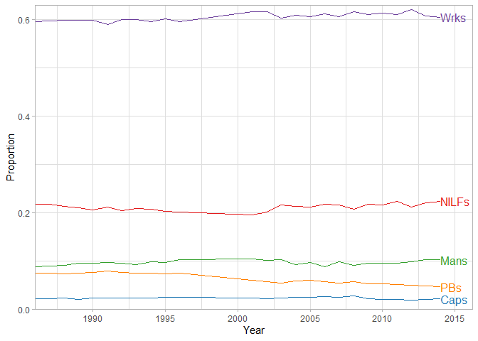
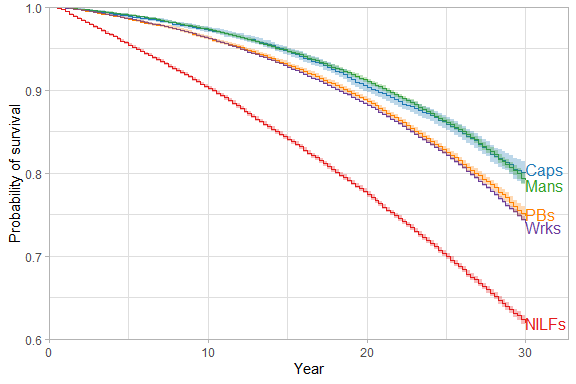
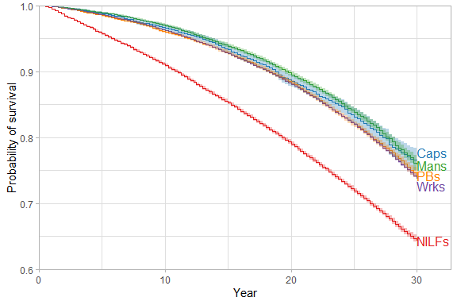
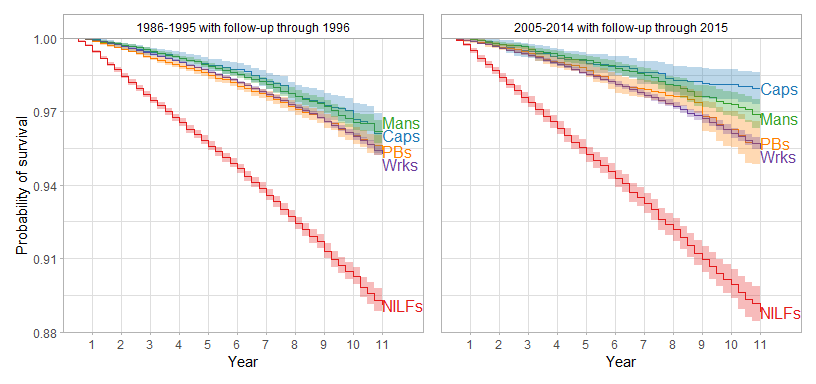
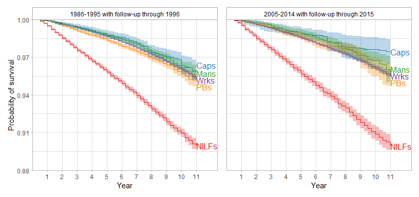
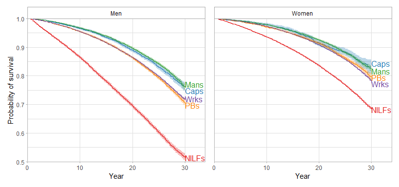
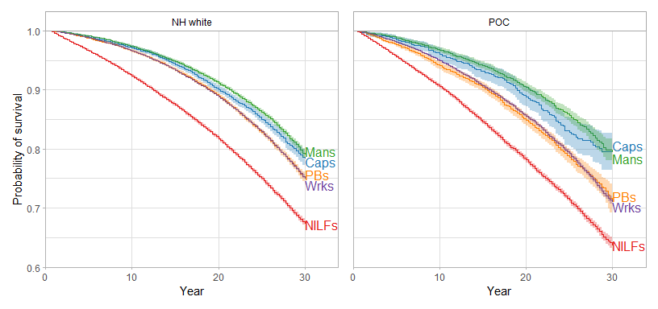
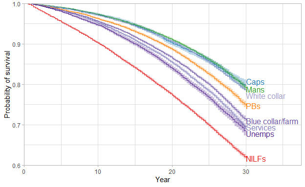

* Overview: 
  + Descriptive analyses of class and mortality in the cross-sectional 1986-2014 NHIS with mortality follow-up through the end of 2015. Survival curves and Cox models are minimally adjusted (age, gender, and year) using IPW unless otherwise noted.
<br>
* Coding of classes:
  + Capitalists are those who are self-employed in an incorporated business
  + The petite bourgeoisie (PBs) are those who are self-employed in an unincorporated business or working without pay in a family business/farm (very few people in the latter)
  + Managers are those who are not self-employed but who are employed and who have an "executive, administrative, or managerial" occupation
  + Workers are those who are unemployed/"not employed" (few people) OR who are employed but do not have a management occupation
  + Not in the labor force (NILFs) are those who are "not in the labor force" 
<br>
* To-do:
  + Decide whether we want to keep worker subdivision (white collar, service, blue-collar/farming, unemployed) as a secondary analysis or incorporate it into our primary analyses. Imprecision could become problematic.
    - Based on: https://ajph.aphapublications.org/doi/pdfplus/10.2105/AJPH.2011.300173 and https://pubmed.ncbi.nlm.nih.gov/21671459/
    - Could combine services, blue collar/farming, and unemployed, given similar survival probabilities among them
<br>
* General notes:
    + We could just call capitalists/PBs incorporated business owners/unincorporated business owners if we're worried the class measure is too imprecise (and say they're analogous to capitalists/PBs in the text)
    + Numemps (number of employees at work) only available from 2001-2014 - would be alternative way to classify capitalists/PBs but I think its categories are too imprecise and limited availability is problematic
    + Can't identify "chief executives, general and operative managers, and legislators" until 2004 because of limited occupation data before then (can never identify "chief executives" alone, who we've classified as capitalists in the past)
    + Originally was hoping to examine cause-specific mortality, but I'm not sure it makes sense as counts are small, detailed cause of death not available from 2005-on, and would need to handle competing events
    + I don't think it's worth doing MICE since there's very little missingness and it'd be incredibly computationally intensive given the size of the dataset
    + Tried subdividing POC into finer racialized groups but estimates were very imprecise, particularly among NH Black and Hispanic capitalists
    + Useful citation regarding occupation and mortality in NHIS: https://www.sciencedirect.com/science/article/pii/S0091743520301535 and http://paa2019.populationassociation.org/uploads/190718
<br>
* Methods notes: 
    + When robust=T, weights are treated properly by survfit and coxph functions (as probability or sampling weights rather than frequency weights)
    + Citations for propensity score approach: https://www.ncbi.nlm.nih.gov/labs/pmc/articles/PMC5802372/ and https://journals.sagepub.com/doi/full/10.1177/0193841X20938497
  


```r
library(dplyr)
library(data.table)
library(here)
library(survival)
library(rms)
library(broom)
library(Rcpp)
library(rstpm2)
library(survey)
library(kableExtra)
library(tableone)
library(survminer)
library(ipw)
library(directlabels)
library(RColorBrewer)
library(patchwork)
options(scipen=999)
options(knitr.kable.NA = '')

#load dat
dat <- fread(here('nhis_1986_2014.csv'))

#make all variable names lowercase
dat %>%
  rename_all(tolower) -> dat

#exclude those outside age ranges (age has 0.09% missing)
#exclude those ineligible for mortality follow-up and those <25 or 65+ and those who aren't sample adults from 1997-on (occ1995 and classwk not available for others after that time)
#exclude 1997-2000, when there's no data on whether business is incorporated or not
#exclude 2015-on, when there's no mortality data
#we'll exclude 1992 Hispanic oversample (only 3517 additional respondents) (per advice of IPUMS) separately, as we want to include them in sensitivity analyses
dat %>%
  filter((age>=25 & age<65) & mortelig==1 & (is.na(astatflg) | astatflg==1) & (year<1997 | (year>2000 & year<2015))) -> dat_sub

#make variables
dat_sub %>%
  mutate_at(.vars=(vars(-c(mortucod, mortwt, mortwtsa, psu, strata, nhispid, nhishid))),
            ~ifelse(. %in% c(91, 96, 97, 98, 99, 970, 980, 990, 997, 999, 7777, 8888, 9999), NA, .)) %>%
  mutate(classwk2=ifelse(classwk2 %in% (7:9), NA, classwk2), #these are real values in some other variables so we'll reset them here
         jobsecincorp=ifelse(jobsecincorp %in% (7:9), NA, jobsecincorp),
         racesr=ifelse(racesr==900, NA, racesr),
         lamtwrk=ifelse(lamtwrk %in% 7:9, NA, lamtwrk)) %>%
  mutate(hispanic_oversample=ifelse((year==1992 & substr(nhispid, 1, 4)==1991), 1, 0),
         year_1986=year-1986, #center year at beginning and end of follow-up
         year_2014=year-2014,
         mortwt_f=ifelse(year<=1996, mortwt, mortwtsa), #per advice of IPUMS help desk, use mortwt from 1986-1996 and mortwtsa from 1997-on
         dead=ifelse(mortstat==1, 1, 0),
         mortdodq=ifelse(mortdodq==1, 91.25, #assume deaths occurred at the end of the quarter
                         ifelse(mortdodq==2, 182.5,
                                ifelse(mortdodq==3, 273.75, 
                                       ifelse(mortdodq==4, 365, NA)))),
         time=ifelse(dead==0, 2016 - year, mortdody + (mortdodq/365) - year), #deaths were allowed to occur through the end of Dec 31 2015, i.e., 2016
         dead_86_95_96=ifelse(year>1995, NA,
                              ifelse(year<=1995 & (is.na(mortdody) | mortdody>1996), 0,
                                    ifelse(year<=1995 & mortdody<=1996, 1, NA))),
         time_86_95_96=ifelse(year>1995, NA,
                              ifelse(dead_86_95_96==1, mortdody + (mortdodq/365) - year,
                                     ifelse(dead_86_95_96==0, 1997-year, NA))),
         race=ifelse(racesr==100, "White", 
                     ifelse(racesr==200, "Black", "Other")),
         hispeth_bin=ifelse(hispeth!=10, 1, 0),
         race_h=factor(ifelse(hispeth!=10, "Hispanic",
                              ifelse(hispeth==10 & race=="White", "NH white",
                                     ifelse(hispeth==10 & race=="Black", "NH black", "NH other"))), levels=c("NH white", "NH black", "Hispanic", "NH other")),
         poc=ifelse(race_h=="NH white", "NH white", "POC"),
         sex=ifelse(sex==1, "male", "female"),
         race_h_sex=paste(race_h, sex),
         educ=factor(ifelse(educrec1<13, "<HS",
                            ifelse(educrec1==13, "HS",
                                   ifelse(educrec1==14, "Some college", "College+"))), levels=c("<HS", "HS", "Some college", "College+")),
         marital_tri=factor(ifelse(marstat %in% 10:12, "Married",
                                   ifelse(marstat %in% 20:40, "Widowed/divorced/separated", 
                                          ifelse(marstat==50, "Single", NA))), levels=c("Married", "Single", "Widowed/divorced/separated")),
         region=ifelse(region==1, "NE", 
                       ifelse(region==2, "MW",
                              ifelse(region==3, "S", "W"))),
         incimp1_rev=ifelse(year<2007, NA,
                            ifelse(incimp1>66, 66, incimp1)),
         managers=ifelse(occ1995>=102 & occ1995<=104, 1, 0),
         class=factor(ifelse(empstat==220, "NILFs",
                             ifelse((empstat>=200 & empstat<=214) | (year<2001 & classwk>=20 & classwk<=34 & managers!=1) | (year>=2001 & classwk2>=1 & classwk2<=4 & managers!=1), "Wrks",
                                    ifelse((year<2001 & classwk>=20 & classwk<=34 & managers==1) | (year>=2001 & classwk2>=1 & classwk2<=4 & managers==1), "Mans",
                                           ifelse((year<2001 & classwk==41) | (year>=2001 & classwk2==5 & jobsecincorp==2), "Caps",
                                                  ifelse((year<2001 & (classwk==42 | classwk==50)) | ((year>=2001 & classwk2==6) | (year>=2001 & classwk2==5 & jobsecincorp==1)), "PBs", NA))))), 
                     levels=c("Caps", "PBs", "Mans", "Wrks", "NILFs")),
         class_gender=factor(ifelse(class=="Wrks" & sex=="male", "Male wrks",
                                    ifelse(class=="Wrks" & sex=="female", "Female wrks",
                                           ifelse(class=="Mans" & sex=="male", "Male mans",
                                                  ifelse(class=="Mans" & sex=="female", "Female mans",
                                                         ifelse(class=="PBs" & sex=="male", "Male PBs",
                                                                ifelse(class=="PBs" & sex=="female", "Female PBs",
                                                                       ifelse(class=="Caps" & sex=="male", "Male caps",
                                                                              ifelse(class=="Caps" & sex=="female", "Female caps",
                                                                                     ifelse(class=="NILFs" & sex=="male", "Male NILFs",
                                                                                            ifelse(class=="NILFs" & sex=="female", "Female NILFs", NA)))))))))),
                             levels=c("Male caps", "Male PBs", "Male mans", "Male wrks", "Male NILFs",
                                      "Female caps", "Female PBs", "Female mans", "Female wrks", "Female NILFs")),
         class_poc=factor(ifelse(class=="Wrks" & poc=="NH white", "NH white wrks",
                                 ifelse(class=="Wrks" & poc=="POC", "POC wrks",
                                        ifelse(class=="Mans" & poc=="NH white", "NH white mans",
                                               ifelse(class=="Mans" & poc=="POC", "POC mans",
                                                      ifelse(class=="PBs" & poc=="NH white", "NH white PBs",
                                                             ifelse(class=="PBs" & poc=="POC", "POC PBs",
                                                                    ifelse(class=="Caps" & poc=="NH white", "NH white caps",
                                                                           ifelse(class=="Caps" & poc=="POC", "POC caps", 
                                                                                  ifelse(class=="NILFs" & poc=="NH white", "NH white NILFs", 
                                                                                         ifelse(class=="NILFs" & poc=="POC", "POC NILFs", NA)))))))))),
                          levels=c("NH white caps", "NH white PBs", "NH white mans", "NH white wrks", "NH white NILFs",
                                   "POC caps", "POC PBs", "POC mans", "POC wrks", "POC NILFs")),
         class_sens=factor(ifelse(year<2001 | year>2003, NA, #identical to class variable
                                  ifelse(empstat==220, "NILFs",
                                         ifelse((empstat>=200 & empstat<=214) | (classwk>=20 & classwk<=34 & managers!=1), "Wrks",
                                                ifelse((classwk>=20 & classwk<=34 & managers==1), "Mans",
                                                       ifelse(classwk==40 & jobsecincorp==2, "Caps",
                                                              ifelse((classwk==40 & jobsecincorp==1) | classwk==50, "PBs", NA)))))), 
                          levels=c("Caps", "PBs", "Mans", "Wrks", "NILFs")),
         class_occ=factor(ifelse(empstat==220, "NILFs",
                                 ifelse(empstat>=200 & empstat<=214, "Unemps",
                                        ifelse((year<2001 & classwk>=20 & classwk<=34 & occ1995>=900) | (year>=2001 & classwk2>=1 & classwk2<=4 & occ1995>=900), "Blue collar/farm",
                                               ifelse((year<2001 & classwk>=20 & classwk<=34 & occ1995>=600 & occ1995<900) | (year>=2001 & classwk2>=1 & classwk2<=4 & occ1995>=600 & occ1995<900), "Services",
                                                      ifelse((year<2001 & classwk>=20 & classwk<=34 & occ1995>=200 & occ1995<600) | (year>=2001 & classwk2>=1 & classwk2<=4 & occ1995>=200 & occ1995<600), "White collar",
                                                             ifelse((year<2001 & classwk>=20 & classwk<=34 & managers==1) | (year>=2001 & classwk2>=1 & classwk2<=4 & managers==1), "Mans",
                                                                    ifelse((year<2001 & classwk==41) | (year>=2001 & classwk2==5 & jobsecincorp==2), "Caps",
                                                                           ifelse((year<2001 & (classwk==42 | classwk==50)) | ((year>=2001 & classwk2==6) | (year>=2001 & classwk2==5 & jobsecincorp==1)), "PBs", NA)))))))), 
                     levels=c("Caps", "PBs", "Mans", "White collar", "Services", "Blue collar/farm", "Unemps", "NILFs"))) -> dat_sub
                                                                                     
#exclude couple respondents with negative follow-up time
dat_sub %>%
  filter(time>=0) -> dat_sub

#make dataset without hispanic oversample for main analyses
dat_sub %>%
  filter(hispanic_oversample==0) -> dat_sub_no_hisp
```

# Missingness 

Age missingness is in full dataset among years and samples of interest; missingness for other variables is among those ages 25-64


```r
#age in full dataset
dat %>%
  filter(mortelig==1 & (is.na(astatflg) | astatflg==1) & (year<1997 | (year>2000 & year<2015)) & 
           !(year==1992 & substr(nhispid, 1, 4)==1991)) %>%
  mutate_at(.vars=(vars(-c(mortucod, mortwt, mortwtsa, psu, strata, nhispid, nhishid))), ~ifelse(. %in% c(91, 96, 97, 98, 99, 970, 980, 990, 7777, 8888, 9999), NA, .)) %>%
  summarise_at(vars('age'), funs(na=100*sum(is.na(.)/1233802))) %>%
  mutate(name='age') %>% 
  relocate(na, .after=last_col()) -> dat_age_na

#other vars in subsetted dataset
dat_sub_no_hisp %>%
  summarise_at(vars(c('class', 'sex', 'race_h', 'educ', 'marital_tri', 'region')), funs(100*sum(is.na(.)/861724))) %>%
  tidyr::pivot_longer(class:region, values_to='na') -> dat_other_na

kable(bind_rows(dat_age_na, dat_other_na), digits=2, col.names=c("Variable", "Percent missing")) %>%
  kable_styling('striped')
```

<table class="table table-striped" style="margin-left: auto; margin-right: auto;">
 <thead>
  <tr>
   <th style="text-align:left;"> Variable </th>
   <th style="text-align:right;"> Percent missing </th>
  </tr>
 </thead>
<tbody>
  <tr>
   <td style="text-align:left;"> age </td>
   <td style="text-align:right;"> 0.09 </td>
  </tr>
  <tr>
   <td style="text-align:left;"> class </td>
   <td style="text-align:right;"> 1.69 </td>
  </tr>
  <tr>
   <td style="text-align:left;"> sex </td>
   <td style="text-align:right;"> 0.00 </td>
  </tr>
  <tr>
   <td style="text-align:left;"> race_h </td>
   <td style="text-align:right;"> 0.55 </td>
  </tr>
  <tr>
   <td style="text-align:left;"> educ </td>
   <td style="text-align:right;"> 0.80 </td>
  </tr>
  <tr>
   <td style="text-align:left;"> marital_tri </td>
   <td style="text-align:right;"> 0.40 </td>
  </tr>
  <tr>
   <td style="text-align:left;"> region </td>
   <td style="text-align:right;"> 0.00 </td>
  </tr>
</tbody>
</table>

# Descriptives

Excluding missingness unless otherwise noted

## Unweighted and stratified table one with missingness in variables of interest (aside from age and class)


```r
#vars of interest
vars <- c('sex', 'race_h', 'educ', 'marital_tri', 'region', 'age', 'dead')
catvars <- c("sex", 'dead')
nonorm <- c('age')

x <- CreateTableOne(data = dat_sub_no_hisp, vars=vars, factorVars=catvars, strata='class', includeNA=TRUE)
x <- print(x, printToggle=FALSE, noSpaces=TRUE, nonnormal=nonorm, test=FALSE)
kable(x) %>%
  kable_styling(c("striped", "condensed"))
```

<table class="table table-striped table-condensed" style="margin-left: auto; margin-right: auto;">
 <thead>
  <tr>
   <th style="text-align:left;">   </th>
   <th style="text-align:left;"> Caps </th>
   <th style="text-align:left;"> PBs </th>
   <th style="text-align:left;"> Mans </th>
   <th style="text-align:left;"> Wrks </th>
   <th style="text-align:left;"> NILFs </th>
  </tr>
 </thead>
<tbody>
  <tr>
   <td style="text-align:left;"> n </td>
   <td style="text-align:left;"> 17988 </td>
   <td style="text-align:left;"> 57104 </td>
   <td style="text-align:left;"> 77518 </td>
   <td style="text-align:left;"> 508673 </td>
   <td style="text-align:left;"> 185854 </td>
  </tr>
  <tr>
   <td style="text-align:left;"> sex = male (%) </td>
   <td style="text-align:left;"> 13221 (73.5) </td>
   <td style="text-align:left;"> 35263 (61.8) </td>
   <td style="text-align:left;"> 40936 (52.8) </td>
   <td style="text-align:left;"> 255316 (50.2) </td>
   <td style="text-align:left;"> 50100 (27.0) </td>
  </tr>
  <tr>
   <td style="text-align:left;"> race_h (%) </td>
   <td style="text-align:left;">  </td>
   <td style="text-align:left;">  </td>
   <td style="text-align:left;">  </td>
   <td style="text-align:left;">  </td>
   <td style="text-align:left;">  </td>
  </tr>
  <tr>
   <td style="text-align:left;"> NH white </td>
   <td style="text-align:left;"> 15319 (85.2) </td>
   <td style="text-align:left;"> 45794 (80.2) </td>
   <td style="text-align:left;"> 61827 (79.8) </td>
   <td style="text-align:left;"> 345435 (67.9) </td>
   <td style="text-align:left;"> 118934 (64.0) </td>
  </tr>
  <tr>
   <td style="text-align:left;"> NH black </td>
   <td style="text-align:left;"> 680 (3.8) </td>
   <td style="text-align:left;"> 3507 (6.1) </td>
   <td style="text-align:left;"> 6823 (8.8) </td>
   <td style="text-align:left;"> 73976 (14.5) </td>
   <td style="text-align:left;"> 30415 (16.4) </td>
  </tr>
  <tr>
   <td style="text-align:left;"> Hispanic </td>
   <td style="text-align:left;"> 1084 (6.0) </td>
   <td style="text-align:left;"> 5317 (9.3) </td>
   <td style="text-align:left;"> 5353 (6.9) </td>
   <td style="text-align:left;"> 64909 (12.8) </td>
   <td style="text-align:left;"> 26521 (14.3) </td>
  </tr>
  <tr>
   <td style="text-align:left;"> NH other </td>
   <td style="text-align:left;"> 815 (4.5) </td>
   <td style="text-align:left;"> 2262 (4.0) </td>
   <td style="text-align:left;"> 3228 (4.2) </td>
   <td style="text-align:left;"> 22367 (4.4) </td>
   <td style="text-align:left;"> 8837 (4.8) </td>
  </tr>
  <tr>
   <td style="text-align:left;"> NA </td>
   <td style="text-align:left;"> 90 (0.5) </td>
   <td style="text-align:left;"> 224 (0.4) </td>
   <td style="text-align:left;"> 287 (0.4) </td>
   <td style="text-align:left;"> 1986 (0.4) </td>
   <td style="text-align:left;"> 1147 (0.6) </td>
  </tr>
  <tr>
   <td style="text-align:left;"> educ (%) </td>
   <td style="text-align:left;">  </td>
   <td style="text-align:left;">  </td>
   <td style="text-align:left;">  </td>
   <td style="text-align:left;">  </td>
   <td style="text-align:left;">  </td>
  </tr>
  <tr>
   <td style="text-align:left;"> &lt;HS </td>
   <td style="text-align:left;"> 1068 (5.9) </td>
   <td style="text-align:left;"> 8089 (14.2) </td>
   <td style="text-align:left;"> 2239 (2.9) </td>
   <td style="text-align:left;"> 70813 (13.9) </td>
   <td style="text-align:left;"> 53872 (29.0) </td>
  </tr>
  <tr>
   <td style="text-align:left;"> HS </td>
   <td style="text-align:left;"> 4817 (26.8) </td>
   <td style="text-align:left;"> 20542 (36.0) </td>
   <td style="text-align:left;"> 16876 (21.8) </td>
   <td style="text-align:left;"> 187086 (36.8) </td>
   <td style="text-align:left;"> 67503 (36.3) </td>
  </tr>
  <tr>
   <td style="text-align:left;"> Some college </td>
   <td style="text-align:left;"> 4348 (24.2) </td>
   <td style="text-align:left;"> 13345 (23.4) </td>
   <td style="text-align:left;"> 20009 (25.8) </td>
   <td style="text-align:left;"> 124693 (24.5) </td>
   <td style="text-align:left;"> 35993 (19.4) </td>
  </tr>
  <tr>
   <td style="text-align:left;"> College+ </td>
   <td style="text-align:left;"> 7713 (42.9) </td>
   <td style="text-align:left;"> 14893 (26.1) </td>
   <td style="text-align:left;"> 38263 (49.4) </td>
   <td style="text-align:left;"> 123825 (24.3) </td>
   <td style="text-align:left;"> 26307 (14.2) </td>
  </tr>
  <tr>
   <td style="text-align:left;"> NA </td>
   <td style="text-align:left;"> 42 (0.2) </td>
   <td style="text-align:left;"> 235 (0.4) </td>
   <td style="text-align:left;"> 131 (0.2) </td>
   <td style="text-align:left;"> 2256 (0.4) </td>
   <td style="text-align:left;"> 2179 (1.2) </td>
  </tr>
  <tr>
   <td style="text-align:left;"> marital_tri (%) </td>
   <td style="text-align:left;">  </td>
   <td style="text-align:left;">  </td>
   <td style="text-align:left;">  </td>
   <td style="text-align:left;">  </td>
   <td style="text-align:left;">  </td>
  </tr>
  <tr>
   <td style="text-align:left;"> Married </td>
   <td style="text-align:left;"> 14586 (81.1) </td>
   <td style="text-align:left;"> 42575 (74.6) </td>
   <td style="text-align:left;"> 53629 (69.2) </td>
   <td style="text-align:left;"> 326946 (64.3) </td>
   <td style="text-align:left;"> 121314 (65.3) </td>
  </tr>
  <tr>
   <td style="text-align:left;"> Single </td>
   <td style="text-align:left;"> 1368 (7.6) </td>
   <td style="text-align:left;"> 6150 (10.8) </td>
   <td style="text-align:left;"> 11556 (14.9) </td>
   <td style="text-align:left;"> 89552 (17.6) </td>
   <td style="text-align:left;"> 25607 (13.8) </td>
  </tr>
  <tr>
   <td style="text-align:left;"> Widowed/divorced/separated </td>
   <td style="text-align:left;"> 2013 (11.2) </td>
   <td style="text-align:left;"> 8291 (14.5) </td>
   <td style="text-align:left;"> 12237 (15.8) </td>
   <td style="text-align:left;"> 91249 (17.9) </td>
   <td style="text-align:left;"> 38028 (20.5) </td>
  </tr>
  <tr>
   <td style="text-align:left;"> NA </td>
   <td style="text-align:left;"> 21 (0.1) </td>
   <td style="text-align:left;"> 88 (0.2) </td>
   <td style="text-align:left;"> 96 (0.1) </td>
   <td style="text-align:left;"> 926 (0.2) </td>
   <td style="text-align:left;"> 905 (0.5) </td>
  </tr>
  <tr>
   <td style="text-align:left;"> region (%) </td>
   <td style="text-align:left;">  </td>
   <td style="text-align:left;">  </td>
   <td style="text-align:left;">  </td>
   <td style="text-align:left;">  </td>
   <td style="text-align:left;">  </td>
  </tr>
  <tr>
   <td style="text-align:left;"> MW </td>
   <td style="text-align:left;"> 4184 (23.3) </td>
   <td style="text-align:left;"> 14070 (24.6) </td>
   <td style="text-align:left;"> 17872 (23.1) </td>
   <td style="text-align:left;"> 123972 (24.4) </td>
   <td style="text-align:left;"> 40139 (21.6) </td>
  </tr>
  <tr>
   <td style="text-align:left;"> NE </td>
   <td style="text-align:left;"> 3878 (21.6) </td>
   <td style="text-align:left;"> 9445 (16.5) </td>
   <td style="text-align:left;"> 15817 (20.4) </td>
   <td style="text-align:left;"> 98375 (19.3) </td>
   <td style="text-align:left;"> 36252 (19.5) </td>
  </tr>
  <tr>
   <td style="text-align:left;"> S </td>
   <td style="text-align:left;"> 6152 (34.2) </td>
   <td style="text-align:left;"> 18612 (32.6) </td>
   <td style="text-align:left;"> 25911 (33.4) </td>
   <td style="text-align:left;"> 175413 (34.5) </td>
   <td style="text-align:left;"> 67303 (36.2) </td>
  </tr>
  <tr>
   <td style="text-align:left;"> W </td>
   <td style="text-align:left;"> 3774 (21.0) </td>
   <td style="text-align:left;"> 14977 (26.2) </td>
   <td style="text-align:left;"> 17918 (23.1) </td>
   <td style="text-align:left;"> 110913 (21.8) </td>
   <td style="text-align:left;"> 42160 (22.7) </td>
  </tr>
  <tr>
   <td style="text-align:left;"> age (median [IQR]) </td>
   <td style="text-align:left;"> 45.00 [37.00, 53.00] </td>
   <td style="text-align:left;"> 44.00 [36.00, 52.00] </td>
   <td style="text-align:left;"> 41.00 [33.00, 49.00] </td>
   <td style="text-align:left;"> 39.00 [32.00, 49.00] </td>
   <td style="text-align:left;"> 47.00 [35.00, 58.00] </td>
  </tr>
  <tr>
   <td style="text-align:left;"> dead = 1 (%) </td>
   <td style="text-align:left;"> 2439 (13.6) </td>
   <td style="text-align:left;"> 9472 (16.6) </td>
   <td style="text-align:left;"> 7696 (9.9) </td>
   <td style="text-align:left;"> 62045 (12.2) </td>
   <td style="text-align:left;"> 47959 (25.8) </td>
  </tr>
</tbody>
</table>

## Weighted and stratified table one 


```r
dat_sub_no_hisp_svy <- svydesign(ids = ~ psu,
                         strata = ~ strata, 
                         weights = ~ mortwt_f,
                         nest=TRUE, 
                         data=dat_sub_no_hisp)

x <- svyCreateTableOne(data = dat_sub_no_hisp_svy, vars=vars, factorVars=catvars, strata='class', includeNA=FALSE)
x <- print(x, printToggle=FALSE, noSpaces=TRUE, nonnormal=nonorm, format='p', test=FALSE)
kable(x) %>%
  kable_styling(c("striped", "condensed"))
```

<table class="table table-striped table-condensed" style="margin-left: auto; margin-right: auto;">
 <thead>
  <tr>
   <th style="text-align:left;">   </th>
   <th style="text-align:left;"> Caps </th>
   <th style="text-align:left;"> PBs </th>
   <th style="text-align:left;"> Mans </th>
   <th style="text-align:left;"> Wrks </th>
   <th style="text-align:left;"> NILFs </th>
  </tr>
 </thead>
<tbody>
  <tr>
   <td style="text-align:left;"> n </td>
   <td style="text-align:left;"> 81556683.0 </td>
   <td style="text-align:left;"> 220773723.0 </td>
   <td style="text-align:left;"> 341241180.0 </td>
   <td style="text-align:left;"> 2141282907.0 </td>
   <td style="text-align:left;"> 750119337.0 </td>
  </tr>
  <tr>
   <td style="text-align:left;"> sex = male (%) </td>
   <td style="text-align:left;"> 73.4 </td>
   <td style="text-align:left;"> 61.8 </td>
   <td style="text-align:left;"> 54.6 </td>
   <td style="text-align:left;"> 52.3 </td>
   <td style="text-align:left;"> 29.8 </td>
  </tr>
  <tr>
   <td style="text-align:left;"> race_h (%) </td>
   <td style="text-align:left;">  </td>
   <td style="text-align:left;">  </td>
   <td style="text-align:left;">  </td>
   <td style="text-align:left;">  </td>
   <td style="text-align:left;">  </td>
  </tr>
  <tr>
   <td style="text-align:left;"> NH white </td>
   <td style="text-align:left;"> 84.9 </td>
   <td style="text-align:left;"> 80.3 </td>
   <td style="text-align:left;"> 80.9 </td>
   <td style="text-align:left;"> 70.1 </td>
   <td style="text-align:left;"> 69.0 </td>
  </tr>
  <tr>
   <td style="text-align:left;"> NH black </td>
   <td style="text-align:left;"> 3.7 </td>
   <td style="text-align:left;"> 5.7 </td>
   <td style="text-align:left;"> 7.8 </td>
   <td style="text-align:left;"> 12.4 </td>
   <td style="text-align:left;"> 12.8 </td>
  </tr>
  <tr>
   <td style="text-align:left;"> Hispanic </td>
   <td style="text-align:left;"> 6.2 </td>
   <td style="text-align:left;"> 9.6 </td>
   <td style="text-align:left;"> 6.6 </td>
   <td style="text-align:left;"> 12.4 </td>
   <td style="text-align:left;"> 12.9 </td>
  </tr>
  <tr>
   <td style="text-align:left;"> NH other </td>
   <td style="text-align:left;"> 5.2 </td>
   <td style="text-align:left;"> 4.4 </td>
   <td style="text-align:left;"> 4.7 </td>
   <td style="text-align:left;"> 5.0 </td>
   <td style="text-align:left;"> 5.3 </td>
  </tr>
  <tr>
   <td style="text-align:left;"> educ (%) </td>
   <td style="text-align:left;">  </td>
   <td style="text-align:left;">  </td>
   <td style="text-align:left;">  </td>
   <td style="text-align:left;">  </td>
   <td style="text-align:left;">  </td>
  </tr>
  <tr>
   <td style="text-align:left;"> &lt;HS </td>
   <td style="text-align:left;"> 5.1 </td>
   <td style="text-align:left;"> 12.6 </td>
   <td style="text-align:left;"> 2.2 </td>
   <td style="text-align:left;"> 11.6 </td>
   <td style="text-align:left;"> 23.9 </td>
  </tr>
  <tr>
   <td style="text-align:left;"> HS </td>
   <td style="text-align:left;"> 24.3 </td>
   <td style="text-align:left;"> 34.0 </td>
   <td style="text-align:left;"> 18.5 </td>
   <td style="text-align:left;"> 33.9 </td>
   <td style="text-align:left;"> 35.5 </td>
  </tr>
  <tr>
   <td style="text-align:left;"> Some college </td>
   <td style="text-align:left;"> 26.2 </td>
   <td style="text-align:left;"> 25.8 </td>
   <td style="text-align:left;"> 25.9 </td>
   <td style="text-align:left;"> 27.2 </td>
   <td style="text-align:left;"> 23.1 </td>
  </tr>
  <tr>
   <td style="text-align:left;"> College+ </td>
   <td style="text-align:left;"> 44.5 </td>
   <td style="text-align:left;"> 27.6 </td>
   <td style="text-align:left;"> 53.4 </td>
   <td style="text-align:left;"> 27.3 </td>
   <td style="text-align:left;"> 17.4 </td>
  </tr>
  <tr>
   <td style="text-align:left;"> marital_tri (%) </td>
   <td style="text-align:left;">  </td>
   <td style="text-align:left;">  </td>
   <td style="text-align:left;">  </td>
   <td style="text-align:left;">  </td>
   <td style="text-align:left;">  </td>
  </tr>
  <tr>
   <td style="text-align:left;"> Married </td>
   <td style="text-align:left;"> 81.5 </td>
   <td style="text-align:left;"> 74.0 </td>
   <td style="text-align:left;"> 71.3 </td>
   <td style="text-align:left;"> 65.4 </td>
   <td style="text-align:left;"> 67.3 </td>
  </tr>
  <tr>
   <td style="text-align:left;"> Single </td>
   <td style="text-align:left;"> 7.9 </td>
   <td style="text-align:left;"> 11.6 </td>
   <td style="text-align:left;"> 14.4 </td>
   <td style="text-align:left;"> 18.1 </td>
   <td style="text-align:left;"> 13.9 </td>
  </tr>
  <tr>
   <td style="text-align:left;"> Widowed/divorced/separated </td>
   <td style="text-align:left;"> 10.6 </td>
   <td style="text-align:left;"> 14.4 </td>
   <td style="text-align:left;"> 14.2 </td>
   <td style="text-align:left;"> 16.5 </td>
   <td style="text-align:left;"> 18.8 </td>
  </tr>
  <tr>
   <td style="text-align:left;"> region (%) </td>
   <td style="text-align:left;">  </td>
   <td style="text-align:left;">  </td>
   <td style="text-align:left;">  </td>
   <td style="text-align:left;">  </td>
   <td style="text-align:left;">  </td>
  </tr>
  <tr>
   <td style="text-align:left;"> MW </td>
   <td style="text-align:left;"> 23.4 </td>
   <td style="text-align:left;"> 23.7 </td>
   <td style="text-align:left;"> 23.6 </td>
   <td style="text-align:left;"> 24.9 </td>
   <td style="text-align:left;"> 21.7 </td>
  </tr>
  <tr>
   <td style="text-align:left;"> NE </td>
   <td style="text-align:left;"> 19.8 </td>
   <td style="text-align:left;"> 16.8 </td>
   <td style="text-align:left;"> 20.2 </td>
   <td style="text-align:left;"> 19.0 </td>
   <td style="text-align:left;"> 18.6 </td>
  </tr>
  <tr>
   <td style="text-align:left;"> S </td>
   <td style="text-align:left;"> 35.8 </td>
   <td style="text-align:left;"> 33.9 </td>
   <td style="text-align:left;"> 34.3 </td>
   <td style="text-align:left;"> 35.3 </td>
   <td style="text-align:left;"> 37.7 </td>
  </tr>
  <tr>
   <td style="text-align:left;"> W </td>
   <td style="text-align:left;"> 21.0 </td>
   <td style="text-align:left;"> 25.7 </td>
   <td style="text-align:left;"> 21.8 </td>
   <td style="text-align:left;"> 20.8 </td>
   <td style="text-align:left;"> 22.0 </td>
  </tr>
  <tr>
   <td style="text-align:left;"> age (median [IQR]) </td>
   <td style="text-align:left;"> 46.00 [38.00, 53.00] </td>
   <td style="text-align:left;"> 44.00 [36.00, 53.00] </td>
   <td style="text-align:left;"> 42.00 [34.00, 50.00] </td>
   <td style="text-align:left;"> 40.00 [32.00, 50.00] </td>
   <td style="text-align:left;"> 48.00 [36.00, 58.00] </td>
  </tr>
  <tr>
   <td style="text-align:left;"> dead = 1 (%) </td>
   <td style="text-align:left;"> 8.6 </td>
   <td style="text-align:left;"> 11.5 </td>
   <td style="text-align:left;"> 6.4 </td>
   <td style="text-align:left;"> 8.0 </td>
   <td style="text-align:left;"> 18.2 </td>
  </tr>
</tbody>
</table>

## Weighted and stratified class composition of gender-races 


```r
x <- svyCreateTableOne(data = subset(dat_sub_no_hisp_svy, !is.na(race_h)), vars='class', factorVars='class', strata='race_h_sex', includeNA=FALSE)
x <- print(x, printToggle=FALSE, noSpaces=TRUE, nonnormal=nonorm, format='p', test=FALSE)
kable(x[2:7,]) %>%
  kable_styling(c("striped", "condensed"))
```

<table class="table table-striped table-condensed" style="margin-left: auto; margin-right: auto;">
 <thead>
  <tr>
   <th style="text-align:left;">   </th>
   <th style="text-align:left;"> Hispanic female </th>
   <th style="text-align:left;"> Hispanic male </th>
   <th style="text-align:left;"> NH black female </th>
   <th style="text-align:left;"> NH black male </th>
   <th style="text-align:left;"> NH other female </th>
   <th style="text-align:left;"> NH other male </th>
   <th style="text-align:left;"> NH white female </th>
   <th style="text-align:left;"> NH white male </th>
  </tr>
 </thead>
<tbody>
  <tr>
   <td style="text-align:left;"> class (%) </td>
   <td style="text-align:left;">  </td>
   <td style="text-align:left;">  </td>
   <td style="text-align:left;">  </td>
   <td style="text-align:left;">  </td>
   <td style="text-align:left;">  </td>
   <td style="text-align:left;">  </td>
   <td style="text-align:left;">  </td>
   <td style="text-align:left;">  </td>
  </tr>
  <tr>
   <td style="text-align:left;"> Caps </td>
   <td style="text-align:left;"> 0.5 </td>
   <td style="text-align:left;"> 1.9 </td>
   <td style="text-align:left;"> 0.3 </td>
   <td style="text-align:left;"> 1.2 </td>
   <td style="text-align:left;"> 1.6 </td>
   <td style="text-align:left;"> 3.3 </td>
   <td style="text-align:left;"> 1.4 </td>
   <td style="text-align:left;"> 4.1 </td>
  </tr>
  <tr>
   <td style="text-align:left;"> PBs </td>
   <td style="text-align:left;"> 4.1 </td>
   <td style="text-align:left;"> 6.1 </td>
   <td style="text-align:left;"> 2.1 </td>
   <td style="text-align:left;"> 4.4 </td>
   <td style="text-align:left;"> 4.4 </td>
   <td style="text-align:left;"> 6.6 </td>
   <td style="text-align:left;"> 5.2 </td>
   <td style="text-align:left;"> 8.8 </td>
  </tr>
  <tr>
   <td style="text-align:left;"> Mans </td>
   <td style="text-align:left;"> 5.2 </td>
   <td style="text-align:left;"> 5.8 </td>
   <td style="text-align:left;"> 6.8 </td>
   <td style="text-align:left;"> 6.3 </td>
   <td style="text-align:left;"> 8.1 </td>
   <td style="text-align:left;"> 10.1 </td>
   <td style="text-align:left;"> 9.5 </td>
   <td style="text-align:left;"> 12.3 </td>
  </tr>
  <tr>
   <td style="text-align:left;"> Wrks </td>
   <td style="text-align:left;"> 53.5 </td>
   <td style="text-align:left;"> 75.6 </td>
   <td style="text-align:left;"> 63.1 </td>
   <td style="text-align:left;"> 69.0 </td>
   <td style="text-align:left;"> 54.9 </td>
   <td style="text-align:left;"> 67.1 </td>
   <td style="text-align:left;"> 55.9 </td>
   <td style="text-align:left;"> 62.4 </td>
  </tr>
  <tr>
   <td style="text-align:left;"> NILFs </td>
   <td style="text-align:left;"> 36.7 </td>
   <td style="text-align:left;"> 10.6 </td>
   <td style="text-align:left;"> 27.7 </td>
   <td style="text-align:left;"> 19.0 </td>
   <td style="text-align:left;"> 31.0 </td>
   <td style="text-align:left;"> 12.9 </td>
   <td style="text-align:left;"> 28.0 </td>
   <td style="text-align:left;"> 12.4 </td>
  </tr>
</tbody>
</table>

## Weighted proportions in classes over time 


```r
dat_sub_no_hisp %>%
  filter(!is.na(class)) %>%
  group_by(class, year) %>%
  summarise(n = sum(mortwt_f)) %>%
  ungroup() %>%
  group_by(year) %>%
  mutate(prop = n / sum(n)) -> propped

ggplot(propped, aes(x=year, y=prop, group=class, color=class, label=class)) +
  geom_dl(method='last.qp') +
  geom_line() +
  scale_color_manual(values=brewer.pal(n = 12, name = "Paired")[c(2,8,4,10,6)]) +
  scale_x_continuous(expand=expansion(mult=c(0,0.08))) +
  scale_y_continuous(limits=c(0, 0.63), expand=expansion(mult=c(0,0))) +
  xlab("Year") +
  ylab("Proportion") +
  theme_light() +
  theme(legend.position = "none")
```

<!-- -->

## Family income distribution across classes from 2007-2014 

Income coding inconsistent prior to 2007. Unadjusted for inflation. Row label shows lower bound of category.


```r
x <- svyCreateTableOne(data = subset(dat_sub_no_hisp_svy, year>=2007), vars='incimp1_rev', factorVars='incimp1_rev', strata='class', includeNA=FALSE)
x <- print(x, printToggle=FALSE, noSpaces=TRUE, nonnormal=nonorm, format='p', test=FALSE)
row.names(x)[3:23] <- c(paste0(seq(0,95,5), "k"),">=100k")
kable(x[3:23,]) %>%
  kable_styling(c("striped", "condensed"))
```

<table class="table table-striped table-condensed" style="margin-left: auto; margin-right: auto;">
 <thead>
  <tr>
   <th style="text-align:left;">   </th>
   <th style="text-align:left;"> Caps </th>
   <th style="text-align:left;"> PBs </th>
   <th style="text-align:left;"> Mans </th>
   <th style="text-align:left;"> Wrks </th>
   <th style="text-align:left;"> NILFs </th>
  </tr>
 </thead>
<tbody>
  <tr>
   <td style="text-align:left;"> 0k </td>
   <td style="text-align:left;"> 0.6 </td>
   <td style="text-align:left;"> 2.0 </td>
   <td style="text-align:left;"> 0.3 </td>
   <td style="text-align:left;"> 1.6 </td>
   <td style="text-align:left;"> 4.2 </td>
  </tr>
  <tr>
   <td style="text-align:left;"> 5k </td>
   <td style="text-align:left;"> 0.6 </td>
   <td style="text-align:left;"> 2.6 </td>
   <td style="text-align:left;"> 0.3 </td>
   <td style="text-align:left;"> 2.1 </td>
   <td style="text-align:left;"> 8.3 </td>
  </tr>
  <tr>
   <td style="text-align:left;"> 10k </td>
   <td style="text-align:left;"> 1.0 </td>
   <td style="text-align:left;"> 4.5 </td>
   <td style="text-align:left;"> 0.6 </td>
   <td style="text-align:left;"> 3.2 </td>
   <td style="text-align:left;"> 8.4 </td>
  </tr>
  <tr>
   <td style="text-align:left;"> 15k </td>
   <td style="text-align:left;"> 1.4 </td>
   <td style="text-align:left;"> 4.3 </td>
   <td style="text-align:left;"> 0.9 </td>
   <td style="text-align:left;"> 3.7 </td>
   <td style="text-align:left;"> 7.3 </td>
  </tr>
  <tr>
   <td style="text-align:left;"> 20k </td>
   <td style="text-align:left;"> 1.9 </td>
   <td style="text-align:left;"> 5.2 </td>
   <td style="text-align:left;"> 1.2 </td>
   <td style="text-align:left;"> 4.6 </td>
   <td style="text-align:left;"> 7.0 </td>
  </tr>
  <tr>
   <td style="text-align:left;"> 25k </td>
   <td style="text-align:left;"> 1.5 </td>
   <td style="text-align:left;"> 5.1 </td>
   <td style="text-align:left;"> 1.6 </td>
   <td style="text-align:left;"> 4.6 </td>
   <td style="text-align:left;"> 5.8 </td>
  </tr>
  <tr>
   <td style="text-align:left;"> 30k </td>
   <td style="text-align:left;"> 2.9 </td>
   <td style="text-align:left;"> 5.0 </td>
   <td style="text-align:left;"> 2.1 </td>
   <td style="text-align:left;"> 5.1 </td>
   <td style="text-align:left;"> 5.6 </td>
  </tr>
  <tr>
   <td style="text-align:left;"> 35k </td>
   <td style="text-align:left;"> 2.9 </td>
   <td style="text-align:left;"> 5.2 </td>
   <td style="text-align:left;"> 2.7 </td>
   <td style="text-align:left;"> 4.9 </td>
   <td style="text-align:left;"> 5.1 </td>
  </tr>
  <tr>
   <td style="text-align:left;"> 40k </td>
   <td style="text-align:left;"> 3.7 </td>
   <td style="text-align:left;"> 5.3 </td>
   <td style="text-align:left;"> 3.0 </td>
   <td style="text-align:left;"> 5.2 </td>
   <td style="text-align:left;"> 4.8 </td>
  </tr>
  <tr>
   <td style="text-align:left;"> 45k </td>
   <td style="text-align:left;"> 2.8 </td>
   <td style="text-align:left;"> 4.2 </td>
   <td style="text-align:left;"> 3.1 </td>
   <td style="text-align:left;"> 4.5 </td>
   <td style="text-align:left;"> 4.0 </td>
  </tr>
  <tr>
   <td style="text-align:left;"> 50k </td>
   <td style="text-align:left;"> 4.4 </td>
   <td style="text-align:left;"> 5.5 </td>
   <td style="text-align:left;"> 3.9 </td>
   <td style="text-align:left;"> 5.1 </td>
   <td style="text-align:left;"> 4.2 </td>
  </tr>
  <tr>
   <td style="text-align:left;"> 55k </td>
   <td style="text-align:left;"> 2.5 </td>
   <td style="text-align:left;"> 3.0 </td>
   <td style="text-align:left;"> 3.0 </td>
   <td style="text-align:left;"> 3.8 </td>
   <td style="text-align:left;"> 2.7 </td>
  </tr>
  <tr>
   <td style="text-align:left;"> 60k </td>
   <td style="text-align:left;"> 3.9 </td>
   <td style="text-align:left;"> 4.0 </td>
   <td style="text-align:left;"> 3.6 </td>
   <td style="text-align:left;"> 4.9 </td>
   <td style="text-align:left;"> 3.3 </td>
  </tr>
  <tr>
   <td style="text-align:left;"> 65k </td>
   <td style="text-align:left;"> 3.4 </td>
   <td style="text-align:left;"> 2.9 </td>
   <td style="text-align:left;"> 3.1 </td>
   <td style="text-align:left;"> 3.5 </td>
   <td style="text-align:left;"> 2.4 </td>
  </tr>
  <tr>
   <td style="text-align:left;"> 70k </td>
   <td style="text-align:left;"> 3.5 </td>
   <td style="text-align:left;"> 3.3 </td>
   <td style="text-align:left;"> 3.9 </td>
   <td style="text-align:left;"> 4.0 </td>
   <td style="text-align:left;"> 2.7 </td>
  </tr>
  <tr>
   <td style="text-align:left;"> 75k </td>
   <td style="text-align:left;"> 4.4 </td>
   <td style="text-align:left;"> 3.1 </td>
   <td style="text-align:left;"> 3.6 </td>
   <td style="text-align:left;"> 3.6 </td>
   <td style="text-align:left;"> 2.2 </td>
  </tr>
  <tr>
   <td style="text-align:left;"> 80k </td>
   <td style="text-align:left;"> 4.4 </td>
   <td style="text-align:left;"> 3.1 </td>
   <td style="text-align:left;"> 4.0 </td>
   <td style="text-align:left;"> 3.7 </td>
   <td style="text-align:left;"> 2.5 </td>
  </tr>
  <tr>
   <td style="text-align:left;"> 85k </td>
   <td style="text-align:left;"> 2.4 </td>
   <td style="text-align:left;"> 2.3 </td>
   <td style="text-align:left;"> 3.1 </td>
   <td style="text-align:left;"> 2.7 </td>
   <td style="text-align:left;"> 1.4 </td>
  </tr>
  <tr>
   <td style="text-align:left;"> 90k </td>
   <td style="text-align:left;"> 3.3 </td>
   <td style="text-align:left;"> 2.3 </td>
   <td style="text-align:left;"> 3.3 </td>
   <td style="text-align:left;"> 3.0 </td>
   <td style="text-align:left;"> 1.7 </td>
  </tr>
  <tr>
   <td style="text-align:left;"> 95k </td>
   <td style="text-align:left;"> 2.3 </td>
   <td style="text-align:left;"> 1.9 </td>
   <td style="text-align:left;"> 3.0 </td>
   <td style="text-align:left;"> 2.3 </td>
   <td style="text-align:left;"> 1.2 </td>
  </tr>
  <tr>
   <td style="text-align:left;"> &gt;=100k </td>
   <td style="text-align:left;"> 46.3 </td>
   <td style="text-align:left;"> 25.3 </td>
   <td style="text-align:left;"> 49.7 </td>
   <td style="text-align:left;"> 24.1 </td>
   <td style="text-align:left;"> 15.1 </td>
  </tr>
</tbody>
</table>

## Number of employees at work across classes from 2001-2014

Excluding those not working. Capitalists 4.4x as likely as PBs to work in firms with 10+ employees. It probably makes sense that managers and workers are much more likely than capitalists to work in larger firms, since any given firm, regardless of size, will only have one capitalist (in theory), whereas such firms will have multiple workers. For example, in a society with 5 firms, 4 of which have 5 employees and 1 of which has 1000 employees, 80% of capitalists will come from firms with 5 employees, but 98% (1000/1020) of workers will come from firms with 1000+ employees.


```r
x <- svyCreateTableOne(data = subset(dat_sub_no_hisp_svy, year>=2001 & numemps!=0 & class!="NILFs"), vars='numemps', factorVars='numemps', strata='class', includeNA=FALSE)
x <- print(x, printToggle=FALSE, noSpaces=TRUE, nonnormal=nonorm, format='p', test=FALSE)
row.names(x)[3:10] <- c("1-9", "10-24", "25-49", "50-99", "100-249", "250-499", "500-999", "1000+")
kable(x[3:10,1:4]) %>%
  kable_styling(c("striped", "condensed"))
```

<table class="table table-striped table-condensed" style="margin-left: auto; margin-right: auto;">
 <thead>
  <tr>
   <th style="text-align:left;">   </th>
   <th style="text-align:left;"> Caps </th>
   <th style="text-align:left;"> PBs </th>
   <th style="text-align:left;"> Mans </th>
   <th style="text-align:left;"> Wrks </th>
  </tr>
 </thead>
<tbody>
  <tr>
   <td style="text-align:left;"> 1-9 </td>
   <td style="text-align:left;"> 80.6 </td>
   <td style="text-align:left;"> 95.6 </td>
   <td style="text-align:left;"> 17.5 </td>
   <td style="text-align:left;"> 18.8 </td>
  </tr>
  <tr>
   <td style="text-align:left;"> 10-24 </td>
   <td style="text-align:left;"> 11.1 </td>
   <td style="text-align:left;"> 2.5 </td>
   <td style="text-align:left;"> 13.9 </td>
   <td style="text-align:left;"> 14.8 </td>
  </tr>
  <tr>
   <td style="text-align:left;"> 25-49 </td>
   <td style="text-align:left;"> 4.5 </td>
   <td style="text-align:left;"> 0.7 </td>
   <td style="text-align:left;"> 11.9 </td>
   <td style="text-align:left;"> 12.3 </td>
  </tr>
  <tr>
   <td style="text-align:left;"> 50-99 </td>
   <td style="text-align:left;"> 2.0 </td>
   <td style="text-align:left;"> 0.5 </td>
   <td style="text-align:left;"> 11.1 </td>
   <td style="text-align:left;"> 11.9 </td>
  </tr>
  <tr>
   <td style="text-align:left;"> 100-249 </td>
   <td style="text-align:left;"> 1.1 </td>
   <td style="text-align:left;"> 0.3 </td>
   <td style="text-align:left;"> 13.2 </td>
   <td style="text-align:left;"> 14.0 </td>
  </tr>
  <tr>
   <td style="text-align:left;"> 250-499 </td>
   <td style="text-align:left;"> 0.2 </td>
   <td style="text-align:left;"> 0.1 </td>
   <td style="text-align:left;"> 8.3 </td>
   <td style="text-align:left;"> 7.7 </td>
  </tr>
  <tr>
   <td style="text-align:left;"> 500-999 </td>
   <td style="text-align:left;"> 0.1 </td>
   <td style="text-align:left;"> 0.1 </td>
   <td style="text-align:left;"> 6.4 </td>
   <td style="text-align:left;"> 5.6 </td>
  </tr>
  <tr>
   <td style="text-align:left;"> 1000+ </td>
   <td style="text-align:left;"> 0.2 </td>
   <td style="text-align:left;"> 0.2 </td>
   <td style="text-align:left;"> 17.7 </td>
   <td style="text-align:left;"> 14.8 </td>
  </tr>
</tbody>
</table>

## Reason not in labor force

### Main reason for not working last week

Variable only available from 2004-on.


```r
x <- svyCreateTableOne(data = subset(dat_sub_no_hisp_svy, year>=2004 & empstat==220 & whynowk2!=0), vars='whynowk2', factorVars='whynowk2', includeNA=FALSE)
x <- print(x, printToggle=FALSE, noSpaces=TRUE, nonnormal=nonorm, format='p', test=FALSE)
row.names(x)[3:12] <- c("Keeping house", "Going to school", "Retired", "Unable to work for health reasons", "Disabled", "On layoff", "On planned vacation", "On family leave", "Have job/contract; off season", "Other")
kable(x[3:12,], digits=2, col.names="Percent") %>% 
  kable_styling("striped")
```

<table class="table table-striped" style="margin-left: auto; margin-right: auto;">
 <thead>
  <tr>
   <th style="text-align:left;">   </th>
   <th style="text-align:left;"> Percent </th>
  </tr>
 </thead>
<tbody>
  <tr>
   <td style="text-align:left;"> Keeping house </td>
   <td style="text-align:left;"> 34.4 </td>
  </tr>
  <tr>
   <td style="text-align:left;"> Going to school </td>
   <td style="text-align:left;"> 4.4 </td>
  </tr>
  <tr>
   <td style="text-align:left;"> Retired </td>
   <td style="text-align:left;"> 17.8 </td>
  </tr>
  <tr>
   <td style="text-align:left;"> Unable to work for health reasons </td>
   <td style="text-align:left;"> 3.2 </td>
  </tr>
  <tr>
   <td style="text-align:left;"> Disabled </td>
   <td style="text-align:left;"> 32.5 </td>
  </tr>
  <tr>
   <td style="text-align:left;"> On layoff </td>
   <td style="text-align:left;"> 2.3 </td>
  </tr>
  <tr>
   <td style="text-align:left;"> On planned vacation </td>
   <td style="text-align:left;"> 0.9 </td>
  </tr>
  <tr>
   <td style="text-align:left;"> On family leave </td>
   <td style="text-align:left;"> 0.4 </td>
  </tr>
  <tr>
   <td style="text-align:left;"> Have job/contract; off season </td>
   <td style="text-align:left;"> 0.8 </td>
  </tr>
  <tr>
   <td style="text-align:left;"> Other </td>
   <td style="text-align:left;"> 3.4 </td>
  </tr>
</tbody>
</table>

### Limited in kind/amount of work can do

Variable only available from 1997-on.


```r
x <- svyCreateTableOne(data = subset(dat_sub_no_hisp_svy, year>=1997), vars='lamtwrk', factorVars='lamtwrk', strata='empstat', includeNA=FALSE)
x <- print(x, printToggle=FALSE, noSpaces=TRUE, nonnormal=nonorm, format='p', test=FALSE)
row.names(x)[3:5] <- c("Not limited", "Limited", "Unable to work")
kable(x[3:5,], col.names=c("Working for pay", "Working w/o pay", "With job, but not at work", "Not employed", "NILF")) %>% 
  kable_styling("striped")
```

<table class="table table-striped" style="margin-left: auto; margin-right: auto;">
 <thead>
  <tr>
   <th style="text-align:left;">   </th>
   <th style="text-align:left;"> Working for pay </th>
   <th style="text-align:left;"> Working w/o pay </th>
   <th style="text-align:left;"> With job, but not at work </th>
   <th style="text-align:left;"> Not employed </th>
   <th style="text-align:left;"> NILF </th>
  </tr>
 </thead>
<tbody>
  <tr>
   <td style="text-align:left;"> Not limited </td>
   <td style="text-align:left;"> 96.9 </td>
   <td style="text-align:left;"> 91.2 </td>
   <td style="text-align:left;"> 88.0 </td>
   <td style="text-align:left;"> 88.3 </td>
   <td style="text-align:left;"> 63.4 </td>
  </tr>
  <tr>
   <td style="text-align:left;"> Limited </td>
   <td style="text-align:left;"> 2.6 </td>
   <td style="text-align:left;"> 5.1 </td>
   <td style="text-align:left;"> 4.6 </td>
   <td style="text-align:left;"> 6.0 </td>
   <td style="text-align:left;"> 5.8 </td>
  </tr>
  <tr>
   <td style="text-align:left;"> Unable to work </td>
   <td style="text-align:left;"> 0.5 </td>
   <td style="text-align:left;"> 3.7 </td>
   <td style="text-align:left;"> 7.4 </td>
   <td style="text-align:left;"> 5.7 </td>
   <td style="text-align:left;"> 30.8 </td>
  </tr>
</tbody>
</table>

# Class and all-cause mortality


```r
plotted <- function(datted=kapped, bottom=0.60){
  
  survplot <- ggsurvplot(datted,
                         size=0.35,
                         conf.int = T,
                         ylim=c(bottom, 1.0),
                         xlim=c(0, max(datted$time)),
                         axes.offset=F,
                         censor=F)
  survplot$plot +
    scale_color_manual(values=brewer.pal(n = 12, name = "Paired")[c(2,8,4,10,6)]) +
    scale_fill_manual(values=brewer.pal(n = 12, name = "Paired")[c(2,8,4,10,6)]) +
    geom_dl(aes(label=class, group=strata, color=strata), method='last.qp') +
    scale_x_continuous(expand=expansion(mult=c(0,0.09))) +
    scale_y_continuous(limits=c(bottom, 1.0), expand=expansion(mult=c(0,0))) +
    ylab("Probability of survival") +
    xlab("Year") +
    theme_light() +
    theme(legend.position="none")

}

#survdiff function
survdiffed <- function(datted=kapped, timed=30){
  
  #end of f/u
  point <- summary(datted,times=timed)
  
  #pb-cap
  pb <- 100*(point$surv[2] - point$surv[1])
  pb_lower <- 100*(pb/100 - 1.96*sqrt(point$std.err[2]^2 + point$std.err[1]^2))
  pb_upper <- 100*(pb/100 + 1.96*sqrt(point$std.err[2]^2 + point$std.err[1]^2))
    
  #mc-cap
  mc <- 100*(point$surv[3] - point$surv[1])
  mc_lower <- 100*(mc/100 - 1.96*sqrt(point$std.err[3]^2 + point$std.err[1]^2))
  mc_upper <- 100*(mc/100 + 1.96*sqrt(point$std.err[3]^2 + point$std.err[1]^2))
  
  #worker-cap
  wc <- 100*(point$surv[4] - point$surv[1])
  wc_lower <- 100*(wc/100 - 1.96*sqrt(point$std.err[4]^2 + point$std.err[1]^2))
  wc_upper <- 100*(wc/100 + 1.96*sqrt(point$std.err[4]^2 + point$std.err[1]^2))
  
  #nilf-cap
  nc <- 100*(point$surv[5] - point$surv[1])
  nc_lower <- 100*(nc/100 - 1.96*sqrt(point$std.err[5]^2 + point$std.err[1]^2))
  nc_upper <- 100*(nc/100 + 1.96*sqrt(point$std.err[5]^2 + point$std.err[1]^2))
  
  rbind(c(pb, pb_lower, pb_upper), c(mc, mc_lower, mc_upper), c(wc, wc_lower, wc_upper), c(nc, nc_lower, nc_upper))
  
}

#survdiff function for groups
survdiffed_group <- function(datted=kapped, timed=30){
  
  #end of f/u
  point <- summary(datted,times=timed)
  
  #pb-cap
  pb <- 100*(point$surv[2] - point$surv[1])
  pb_lower <- 100*(pb/100 - 1.96*sqrt(point$std.err[2]^2 + point$std.err[1]^2))
  pb_upper <- 100*(pb/100 + 1.96*sqrt(point$std.err[2]^2 + point$std.err[1]^2))
  
  #mc-cap
  mc <- 100*(point$surv[3] - point$surv[1])
  mc_lower <- 100*(mc/100 - 1.96*sqrt(point$std.err[3]^2 + point$std.err[1]^2))
  mc_upper <- 100*(mc/100 + 1.96*sqrt(point$std.err[3]^2 + point$std.err[1]^2))
  
  #worker-cap
  wc <- 100*(point$surv[4] - point$surv[1])
  wc_lower <- 100*(wc/100 - 1.96*sqrt(point$std.err[4]^2 + point$std.err[1]^2))
  wc_upper <- 100*(wc/100 + 1.96*sqrt(point$std.err[4]^2 + point$std.err[1]^2))
  
  #nilf-cap
  nc <- 100*(point$surv[5] - point$surv[1])
  nc_lower <- 100*(nc/100 - 1.96*sqrt(point$std.err[5]^2 + point$std.err[1]^2))
  nc_upper <- 100*(nc/100 + 1.96*sqrt(point$std.err[5]^2 + point$std.err[1]^2))
  
  #cap2-cap
  cap2 <- 100*(point$surv[6] - point$surv[1])
  cap2_lower <- 100*(cap2/100 - 1.96*sqrt(point$std.err[6]^2 + point$std.err[1]^2))
  cap2_upper <- 100*(cap2/100 + 1.96*sqrt(point$std.err[6]^2 + point$std.err[1]^2))
  
  #pb2-cap
  pb2 <- 100*(point$surv[7] - point$surv[1])
  pb2_lower <- 100*(pb2/100 - 1.96*sqrt(point$std.err[7]^2 + point$std.err[1]^2))
  pb2_upper <- 100*(pb2/100 + 1.96*sqrt(point$std.err[7]^2 + point$std.err[1]^2))
  
  #man2-cap
  man2 <- 100*(point$surv[8] - point$surv[1])
  man2_lower <- 100*(man2/100 - 1.96*sqrt(point$std.err[8]^2 + point$std.err[1]^2))
  man2_upper <- 100*(man2/100 + 1.96*sqrt(point$std.err[8]^2 + point$std.err[1]^2))
  
  #wrk2-cap
  wrk2 <- 100*(point$surv[9] - point$surv[1])
  wrk2_lower <- 100*(wrk2/100 - 1.96*sqrt(point$std.err[9]^2 + point$std.err[1]^2))
  wrk2_upper <- 100*(wrk2/100 + 1.96*sqrt(point$std.err[9]^2 + point$std.err[1]^2))
  
  #nilf2-cap
  nilf2 <- 100*(point$surv[10] - point$surv[1])
  nilf2_lower <- 100*(nilf2/100 - 1.96*sqrt(point$std.err[10]^2 + point$std.err[1]^2))
  nilf2_upper <- 100*(nilf2/100 + 1.96*sqrt(point$std.err[10]^2 + point$std.err[1]^2))
  
  rbind(c(pb, pb_lower, pb_upper), c(mc, mc_lower, mc_upper), c(wc, wc_lower, wc_upper), c(nc, nc_lower, nc_upper),
        c(cap2, cap2_lower, cap2_upper), c(pb2, pb2_lower, pb2_upper), c(man2, man2_lower, man2_upper), c(wrk2, wrk2_lower, wrk2_upper), c(nilf2, nilf2_lower, nilf2_upper))
  
}

#survdiff function for worker subdivision
survdiffed_sub <- function(datted=kapped, timed=30){
  
  #end of f/u
  point <- summary(datted,times=timed)
  
  #pb-cap
  pb <- 100*(point$surv[2] - point$surv[1])
  pb_lower <- 100*(pb/100 - 1.96*sqrt(point$std.err[2]^2 + point$std.err[1]^2))
  pb_upper <- 100*(pb/100 + 1.96*sqrt(point$std.err[2]^2 + point$std.err[1]^2))
  
  #mc-cap
  mc <- 100*(point$surv[3] - point$surv[1])
  mc_lower <- 100*(mc/100 - 1.96*sqrt(point$std.err[3]^2 + point$std.err[1]^2))
  mc_upper <- 100*(mc/100 + 1.96*sqrt(point$std.err[3]^2 + point$std.err[1]^2))
  
  #whitecollar-cap
  wc <- 100*(point$surv[4] - point$surv[1])
  wc_lower <- 100*(wc/100 - 1.96*sqrt(point$std.err[4]^2 + point$std.err[1]^2))
  wc_upper <- 100*(wc/100 + 1.96*sqrt(point$std.err[4]^2 + point$std.err[1]^2))
  
  #services-cap
  servs <- 100*(point$surv[5] - point$surv[1])
  servs_lower <- 100*(servs/100 - 1.96*sqrt(point$std.err[5]^2 + point$std.err[1]^2))
  servs_upper <- 100*(servs/100 + 1.96*sqrt(point$std.err[5]^2 + point$std.err[1]^2))
  
  #bluecollar-cap
  bc <- 100*(point$surv[6] - point$surv[1])
  bc_lower <- 100*(bc/100 - 1.96*sqrt(point$std.err[6]^2 + point$std.err[1]^2))
  bc_upper <- 100*(bc/100 + 1.96*sqrt(point$std.err[6]^2 + point$std.err[1]^2))
  
  #pb2-cap
  unemp <- 100*(point$surv[7] - point$surv[1])
  unemp_lower <- 100*(unemp/100 - 1.96*sqrt(point$std.err[7]^2 + point$std.err[1]^2))
  unemp_upper <- 100*(unemp/100 + 1.96*sqrt(point$std.err[7]^2 + point$std.err[1]^2))
  
  #man2-cap
  nilf <- 100*(point$surv[8] - point$surv[1])
  nilf_lower <- 100*(nilf/100 - 1.96*sqrt(point$std.err[8]^2 + point$std.err[1]^2))
  nilf_upper <- 100*(nilf/100 + 1.96*sqrt(point$std.err[8]^2 + point$std.err[1]^2))
  
  rbind(c(pb, pb_lower, pb_upper), c(mc, mc_lower, mc_upper), c(wc, wc_lower, wc_upper), c(servs, servs_lower, servs_upper),
        c(bc, bc_lower, bc_upper), c(unemp, unemp_lower, unemp_upper), c(nilf, nilf_lower, nilf_upper))
  
}

#tidying regression output function
tidy_n <- function(modded=mod, rows=1:4, cols=c(1,2,7,8), bind=binded, nad=3, captioned="Ref: capitalist") {
  tidydf <- cbind(tidy(modded, exponentiate=T, conf.int=T)[rows, cols], bind)
  tidydf$N <- c(length(modded$residuals), rep(NA, nad))
  kable(tidydf, digits=c(2,2,2,2,1,1,1,1), caption=captioned, col.names=c(" ", "HR", "Lower", "Upper", "SD", "Lower", "Upper", "N")) %>%
    kable_styling("striped") %>%
    add_header_above(c(" ", "HR"=3, "SD per 100 at end of f/u"=3, " "))
}
```

## Overall

### Less-adjusted (age, gender, year)

#### Distribution of IPW


```r
dat_sub_no_hisp %>%
  filter(!is.na(class) & !is.na(age)) %>%
  mutate(sw=ipwpoint(exposure=class,
                     family="multinomial",
                     link="logit",
                     numerator=~1,
                     denominator=~rcs(age, 3) + sex + rcs(year, 5), 
                     data = subset(dat_sub_no_hisp, !is.na(class) & !is.na(age)),
                     weights=mortwt_f,
                     trace=FALSE)$ipw.weights,
         sw_f=sw*mortwt_f)  -> dat_sub_no_hisp_overall

summary(dat_sub_no_hisp_overall$sw)
```

```
##    Min. 1st Qu.  Median    Mean 3rd Qu.    Max. 
##  0.3266  0.8475  0.9515  0.9907  1.0485  6.6928
```


```r
kapped <- survfit(Surv(time,dead)~class, robust=T, w=sw_f, data=dat_sub_no_hisp_overall, se=T)
mod <- coxph(Surv(time,dead)~class, robust=T, w=sw_f, data=dat_sub_no_hisp_overall)
binded <- survdiffed()
```

#### IPW survival plot


```r
plotted()
```

<!-- -->

```r
ggsave("overall_survival.png", dpi=600, height=4, width=6)
```

#### IPW survival difference and hazard ratio


```r
tidy_n()
```

<table class="table table-striped" style="margin-left: auto; margin-right: auto;">
<caption>Ref: capitalist</caption>
 <thead>
<tr>
<th style="empty-cells: hide;border-bottom:hidden;" colspan="1"></th>
<th style="border-bottom:hidden;padding-bottom:0; padding-left:3px;padding-right:3px;text-align: center; " colspan="3"><div style="border-bottom: 1px solid #ddd; padding-bottom: 5px; ">HR</div></th>
<th style="border-bottom:hidden;padding-bottom:0; padding-left:3px;padding-right:3px;text-align: center; " colspan="3"><div style="border-bottom: 1px solid #ddd; padding-bottom: 5px; ">SD per 100 at end of f/u</div></th>
<th style="empty-cells: hide;border-bottom:hidden;" colspan="1"></th>
</tr>
  <tr>
   <th style="text-align:left;">   </th>
   <th style="text-align:right;"> HR </th>
   <th style="text-align:right;"> Lower </th>
   <th style="text-align:right;"> Upper </th>
   <th style="text-align:right;"> SD </th>
   <th style="text-align:right;"> Lower </th>
   <th style="text-align:right;"> Upper </th>
   <th style="text-align:right;"> N </th>
  </tr>
 </thead>
<tbody>
  <tr>
   <td style="text-align:left;"> classPBs </td>
   <td style="text-align:right;"> 1.27 </td>
   <td style="text-align:right;"> 1.19 </td>
   <td style="text-align:right;"> 1.36 </td>
   <td style="text-align:right;"> -5.2 </td>
   <td style="text-align:right;"> -6.8 </td>
   <td style="text-align:right;"> -3.6 </td>
   <td style="text-align:right;"> 847137 </td>
  </tr>
  <tr>
   <td style="text-align:left;"> classMans </td>
   <td style="text-align:right;"> 0.98 </td>
   <td style="text-align:right;"> 0.92 </td>
   <td style="text-align:right;"> 1.05 </td>
   <td style="text-align:right;"> -0.8 </td>
   <td style="text-align:right;"> -2.3 </td>
   <td style="text-align:right;"> 0.8 </td>
   <td style="text-align:right;">  </td>
  </tr>
  <tr>
   <td style="text-align:left;"> classWrks </td>
   <td style="text-align:right;"> 1.31 </td>
   <td style="text-align:right;"> 1.23 </td>
   <td style="text-align:right;"> 1.39 </td>
   <td style="text-align:right;"> -6.0 </td>
   <td style="text-align:right;"> -7.4 </td>
   <td style="text-align:right;"> -4.6 </td>
   <td style="text-align:right;">  </td>
  </tr>
  <tr>
   <td style="text-align:left;"> classNILFs </td>
   <td style="text-align:right;"> 2.65 </td>
   <td style="text-align:right;"> 2.49 </td>
   <td style="text-align:right;"> 2.82 </td>
   <td style="text-align:right;"> -18.0 </td>
   <td style="text-align:right;"> -19.4 </td>
   <td style="text-align:right;"> -16.5 </td>
   <td style="text-align:right;">  </td>
  </tr>
</tbody>
</table>

### More-adjusted (age, gender, year, education, marital status, region, and racialized group)

#### Distribution of IPW

Truncated at 0.5% and 99.5%.


```r
dat_sub_no_hisp %>%
  filter(!is.na(class) & !is.na(age) & !is.na(educ) & !is.na(marital_tri) & !is.na(region) & !is.na(race_h)) %>%
  mutate(sw=ipwpoint(exposure=class,
                     family="multinomial",
                     link="logit",
                     numerator=~1,
                     denominator=~rcs(age, 3) + sex + rcs(year, 5) + educ + marital_tri + region + race_h, 
                     data = subset(dat_sub_no_hisp, !is.na(class) & !is.na(age) & !is.na(educ) & !is.na(marital_tri) & !is.na(region) & !is.na(race_h)),
                     weights=mortwt_f,
                     trace=FALSE,
                     trunc=0.005)$weights.trunc,
         sw_f=sw*mortwt_f)  -> dat_sub_no_hisp_overall_adj

summary(dat_sub_no_hisp_overall_adj$sw)
```

```
##    Min. 1st Qu.  Median    Mean 3rd Qu.    Max. 
##  0.2620  0.7956  0.9400  0.9905  1.1091  3.9834
```


```r
kapped <- survfit(Surv(time,dead)~class, robust=T, w=sw_f, data=dat_sub_no_hisp_overall_adj, se=T)
mod <- coxph(Surv(time,dead)~class, robust=T, w=sw_f, data=dat_sub_no_hisp_overall_adj)
binded <- survdiffed()
```

#### IPW survival plot


```r
plotted()
```

<!-- -->

```r
ggsave("overall_survival_adj.png", dpi=600, height=4, width=6)
```

#### IPW survival difference and hazard ratio


```r
tidy_n()
```

<table class="table table-striped" style="margin-left: auto; margin-right: auto;">
<caption>Ref: capitalist</caption>
 <thead>
<tr>
<th style="empty-cells: hide;border-bottom:hidden;" colspan="1"></th>
<th style="border-bottom:hidden;padding-bottom:0; padding-left:3px;padding-right:3px;text-align: center; " colspan="3"><div style="border-bottom: 1px solid #ddd; padding-bottom: 5px; ">HR</div></th>
<th style="border-bottom:hidden;padding-bottom:0; padding-left:3px;padding-right:3px;text-align: center; " colspan="3"><div style="border-bottom: 1px solid #ddd; padding-bottom: 5px; ">SD per 100 at end of f/u</div></th>
<th style="empty-cells: hide;border-bottom:hidden;" colspan="1"></th>
</tr>
  <tr>
   <th style="text-align:left;">   </th>
   <th style="text-align:right;"> HR </th>
   <th style="text-align:right;"> Lower </th>
   <th style="text-align:right;"> Upper </th>
   <th style="text-align:right;"> SD </th>
   <th style="text-align:right;"> Lower </th>
   <th style="text-align:right;"> Upper </th>
   <th style="text-align:right;"> N </th>
  </tr>
 </thead>
<tbody>
  <tr>
   <td style="text-align:left;"> classPBs </td>
   <td style="text-align:right;"> 1.09 </td>
   <td style="text-align:right;"> 1.01 </td>
   <td style="text-align:right;"> 1.18 </td>
   <td style="text-align:right;"> -2.3 </td>
   <td style="text-align:right;"> -4.3 </td>
   <td style="text-align:right;"> -0.3 </td>
   <td style="text-align:right;"> 837721 </td>
  </tr>
  <tr>
   <td style="text-align:left;"> classMans </td>
   <td style="text-align:right;"> 0.95 </td>
   <td style="text-align:right;"> 0.88 </td>
   <td style="text-align:right;"> 1.03 </td>
   <td style="text-align:right;"> -0.6 </td>
   <td style="text-align:right;"> -2.7 </td>
   <td style="text-align:right;"> 1.5 </td>
   <td style="text-align:right;">  </td>
  </tr>
  <tr>
   <td style="text-align:left;"> classWrks </td>
   <td style="text-align:right;"> 1.09 </td>
   <td style="text-align:right;"> 1.02 </td>
   <td style="text-align:right;"> 1.18 </td>
   <td style="text-align:right;"> -2.8 </td>
   <td style="text-align:right;"> -4.6 </td>
   <td style="text-align:right;"> -1.0 </td>
   <td style="text-align:right;">  </td>
  </tr>
  <tr>
   <td style="text-align:left;"> classNILFs </td>
   <td style="text-align:right;"> 2.03 </td>
   <td style="text-align:right;"> 1.89 </td>
   <td style="text-align:right;"> 2.18 </td>
   <td style="text-align:right;"> -12.2 </td>
   <td style="text-align:right;"> -14.1 </td>
   <td style="text-align:right;"> -10.3 </td>
   <td style="text-align:right;">  </td>
  </tr>
</tbody>
</table>

## Change over time - 1986-1995 waves w/ f/u until end of 1996 vs 2005-2014 waves w/ f/u through end of 2015

### Less-adjusted

#### Distribution of IPW

##### 1986-1995


```r
dat_sub_no_hisp %>%
  filter(year<=1995 & !is.na(class) & !is.na(age)) %>%
  mutate(sw=ipwpoint(exposure=class,
                     family="multinomial",
                     link="logit",
                     numerator=~1,
                     denominator=~rcs(age, 3) + sex + rcs(year, 3), 
                     data = subset(dat_sub_no_hisp, year<=1995 & !is.na(class) & !is.na(age)),
                     weights=mortwt_f,
                     trace=FALSE)$ipw.weights,
         sw_f=sw*mortwt_f,
         period="1986-1995 with follow-up through 1996")  -> dat_sub_no_hisp_1986

summary(dat_sub_no_hisp_1986$sw)
```

```
##    Min. 1st Qu.  Median    Mean 3rd Qu.    Max. 
##  0.2952  0.8246  0.9387  0.9984  1.0339  6.3506
```

##### 2005-2014


```r
dat_sub_no_hisp %>%
  filter(year>=2005 & !is.na(class) & !is.na(age)) %>%
  mutate(sw=ipwpoint(exposure=class,
                     family="multinomial",
                     link="logit",
                     numerator=~1,
                     denominator=~rcs(age, 3) + sex + rcs(year, 3), 
                     data = subset(dat_sub_no_hisp, year>=2005 & !is.na(class) & !is.na(age)),
                     weights=mortwt_f,
                     trace=FALSE)$ipw.weights,
         sw_f=sw*mortwt_f,
         period="2005-2014 with follow-up through 2015")  -> dat_sub_no_hisp_2005

summary(dat_sub_no_hisp_2005$sw)
```

```
##    Min. 1st Qu.  Median    Mean 3rd Qu.    Max. 
##  0.3607  0.8558  0.9394  1.0001  1.0751  6.0887
```


```r
#early
kapped_early <- survfit(Surv(time_86_95_96, dead_86_95_96)~class + period, robust=T, w=sw_f, data=dat_sub_no_hisp_1986, se=T) #period allows for faceting but doesnt affect ests
mod_early <- coxph(Surv(time_86_95_96, dead_86_95_96)~class, robust=T, w=sw_f, data=dat_sub_no_hisp_1986)
binded_early <- survdiffed(kapped_early, timed=11)

#late
kapped_late <- survfit(Surv(time,dead)~class + period, robust=T, w=sw_f, data=dat_sub_no_hisp_2005, se=T)
mod_late <- coxph(Surv(time,dead)~class, robust=T, w=sw_f, data=dat_sub_no_hisp_2005)
binded_late <- survdiffed(kapped_late, timed=11)
```

#### IPW survival plots


```r
plotted(kapped_early) +  
  facet_wrap(~period) + 
  scale_y_continuous(limits=c(0.88, 1.0), breaks=c(0.88, 0.91, 0.94, 0.97, 1.0), expand=expansion(mult=c(0,0))) +
  scale_x_continuous(limits=c(0, 11), breaks=seq(1, 11, 1), expand=expansion(mult=c(0,0.13))) +
  theme(panel.grid.minor.x = element_blank(), strip.background=element_rect(color="darkgrey", fill=NA), strip.text=element_text(color="black")) +
plotted(kapped_late) +  
  facet_wrap(~period) + 
  scale_y_continuous(limits=c(0.88, 1.0), breaks=c(0.88, 0.91, 0.94, 0.97, 1.0), expand=expansion(mult=c(0,0))) +
  scale_x_continuous(limits=c(0, 11), breaks=seq(1, 11, 1), expand=expansion(mult=c(0,0.13))) +
  theme(panel.grid.minor.x = element_blank(), strip.background=element_rect(color="darkgrey", fill=NA), strip.text=element_text(color="black"),
        axis.title.y=element_blank(), axis.text.y=element_blank(), axis.ticks.y=element_blank())
```

<!-- -->

```r
ggsave("change_over_time.png", dpi=600, height=4, width=8.5)
```

#### IPW survival difference and hazard ratio


```r
tidy_n(modded=mod_early, bind=binded_early, captioned="Ref: capitalists (1986-1995 subset)")
```

<table class="table table-striped" style="margin-left: auto; margin-right: auto;">
<caption>Ref: capitalists (1986-1995 subset)</caption>
 <thead>
<tr>
<th style="empty-cells: hide;border-bottom:hidden;" colspan="1"></th>
<th style="border-bottom:hidden;padding-bottom:0; padding-left:3px;padding-right:3px;text-align: center; " colspan="3"><div style="border-bottom: 1px solid #ddd; padding-bottom: 5px; ">HR</div></th>
<th style="border-bottom:hidden;padding-bottom:0; padding-left:3px;padding-right:3px;text-align: center; " colspan="3"><div style="border-bottom: 1px solid #ddd; padding-bottom: 5px; ">SD per 100 at end of f/u</div></th>
<th style="empty-cells: hide;border-bottom:hidden;" colspan="1"></th>
</tr>
  <tr>
   <th style="text-align:left;">   </th>
   <th style="text-align:right;"> HR </th>
   <th style="text-align:right;"> Lower </th>
   <th style="text-align:right;"> Upper </th>
   <th style="text-align:right;"> SD </th>
   <th style="text-align:right;"> Lower </th>
   <th style="text-align:right;"> Upper </th>
   <th style="text-align:right;"> N </th>
  </tr>
 </thead>
<tbody>
  <tr>
   <td style="text-align:left;"> classPBs </td>
   <td style="text-align:right;"> 1.28 </td>
   <td style="text-align:right;"> 1.08 </td>
   <td style="text-align:right;"> 1.54 </td>
   <td style="text-align:right;"> -0.7 </td>
   <td style="text-align:right;"> -1.6 </td>
   <td style="text-align:right;"> 0.2 </td>
   <td style="text-align:right;"> 540854 </td>
  </tr>
  <tr>
   <td style="text-align:left;"> classMans </td>
   <td style="text-align:right;"> 1.03 </td>
   <td style="text-align:right;"> 0.86 </td>
   <td style="text-align:right;"> 1.23 </td>
   <td style="text-align:right;"> 0.0 </td>
   <td style="text-align:right;"> -0.9 </td>
   <td style="text-align:right;"> 1.0 </td>
   <td style="text-align:right;">  </td>
  </tr>
  <tr>
   <td style="text-align:left;"> classWrks </td>
   <td style="text-align:right;"> 1.24 </td>
   <td style="text-align:right;"> 1.05 </td>
   <td style="text-align:right;"> 1.47 </td>
   <td style="text-align:right;"> -0.9 </td>
   <td style="text-align:right;"> -1.7 </td>
   <td style="text-align:right;"> 0.0 </td>
   <td style="text-align:right;">  </td>
  </tr>
  <tr>
   <td style="text-align:left;"> classNILFs </td>
   <td style="text-align:right;"> 3.47 </td>
   <td style="text-align:right;"> 2.94 </td>
   <td style="text-align:right;"> 4.10 </td>
   <td style="text-align:right;"> -7.0 </td>
   <td style="text-align:right;"> -8.0 </td>
   <td style="text-align:right;"> -6.1 </td>
   <td style="text-align:right;">  </td>
  </tr>
</tbody>
</table>

```r
tidy_n(modded=mod_late, bind=binded_late, captioned="Ref: capitalists (2005-2014 subset)")
```

<table class="table table-striped" style="margin-left: auto; margin-right: auto;">
<caption>Ref: capitalists (2005-2014 subset)</caption>
 <thead>
<tr>
<th style="empty-cells: hide;border-bottom:hidden;" colspan="1"></th>
<th style="border-bottom:hidden;padding-bottom:0; padding-left:3px;padding-right:3px;text-align: center; " colspan="3"><div style="border-bottom: 1px solid #ddd; padding-bottom: 5px; ">HR</div></th>
<th style="border-bottom:hidden;padding-bottom:0; padding-left:3px;padding-right:3px;text-align: center; " colspan="3"><div style="border-bottom: 1px solid #ddd; padding-bottom: 5px; ">SD per 100 at end of f/u</div></th>
<th style="empty-cells: hide;border-bottom:hidden;" colspan="1"></th>
</tr>
  <tr>
   <th style="text-align:left;">   </th>
   <th style="text-align:right;"> HR </th>
   <th style="text-align:right;"> Lower </th>
   <th style="text-align:right;"> Upper </th>
   <th style="text-align:right;"> SD </th>
   <th style="text-align:right;"> Lower </th>
   <th style="text-align:right;"> Upper </th>
   <th style="text-align:right;"> N </th>
  </tr>
 </thead>
<tbody>
  <tr>
   <td style="text-align:left;"> classPBs </td>
   <td style="text-align:right;"> 1.65 </td>
   <td style="text-align:right;"> 1.17 </td>
   <td style="text-align:right;"> 2.34 </td>
   <td style="text-align:right;"> -2.5 </td>
   <td style="text-align:right;"> -3.6 </td>
   <td style="text-align:right;"> -1.3 </td>
   <td style="text-align:right;"> 194150 </td>
  </tr>
  <tr>
   <td style="text-align:left;"> classMans </td>
   <td style="text-align:right;"> 1.20 </td>
   <td style="text-align:right;"> 0.85 </td>
   <td style="text-align:right;"> 1.69 </td>
   <td style="text-align:right;"> -1.2 </td>
   <td style="text-align:right;"> -2.1 </td>
   <td style="text-align:right;"> -0.3 </td>
   <td style="text-align:right;">  </td>
  </tr>
  <tr>
   <td style="text-align:left;"> classWrks </td>
   <td style="text-align:right;"> 1.76 </td>
   <td style="text-align:right;"> 1.29 </td>
   <td style="text-align:right;"> 2.41 </td>
   <td style="text-align:right;"> -2.5 </td>
   <td style="text-align:right;"> -3.2 </td>
   <td style="text-align:right;"> -1.8 </td>
   <td style="text-align:right;">  </td>
  </tr>
  <tr>
   <td style="text-align:left;"> classNILFs </td>
   <td style="text-align:right;"> 5.15 </td>
   <td style="text-align:right;"> 3.76 </td>
   <td style="text-align:right;"> 7.05 </td>
   <td style="text-align:right;"> -9.1 </td>
   <td style="text-align:right;"> -10.1 </td>
   <td style="text-align:right;"> -8.1 </td>
   <td style="text-align:right;">  </td>
  </tr>
</tbody>
</table>

### More-adjusted

#### Distribution of IPW

Truncated at 0.5% and 99.5%.

##### 1986-1995


```r
dat_sub_no_hisp %>%
  filter(year<=1995 & !is.na(class) & !is.na(age) & !is.na(educ) & !is.na(marital_tri) & !is.na(region) & !is.na(race_h)) %>%
  mutate(sw=ipwpoint(exposure=class,
                     family="multinomial",
                     link="logit",
                     numerator=~1,
                     denominator=~rcs(age, 3) + sex + rcs(year, 5) + educ + marital_tri + region + race_h, 
                     data = subset(dat_sub_no_hisp, year<=1995 & !is.na(class) & !is.na(age) & !is.na(educ) & !is.na(marital_tri) & !is.na(region) & !is.na(race_h)),
                     weights=mortwt_f,
                     trace=FALSE,
                     trunc=0.005)$weights.trunc,
         sw_f=sw*mortwt_f,
         period="1986-1995 with follow-up through 1996")  -> dat_sub_no_hisp_1986

summary(dat_sub_no_hisp_1986$sw)
```

```
##    Min. 1st Qu.  Median    Mean 3rd Qu.    Max. 
##  0.2568  0.7759  0.9153  0.9870  1.0719  4.4487
```

##### 2005-2014


```r
dat_sub_no_hisp %>%
  filter(year>=2005 & !is.na(class) & !is.na(age) & !is.na(educ) & !is.na(marital_tri) & !is.na(region) & !is.na(race_h)) %>%
  mutate(sw=ipwpoint(exposure=class,
                     family="multinomial",
                     link="logit",
                     numerator=~1,
                     denominator=~rcs(age, 3) + sex + rcs(year, 5) + educ + marital_tri + region + race_h, 
                     data = subset(dat_sub_no_hisp, year>=2005 & !is.na(class) & !is.na(age) & !is.na(educ) & !is.na(marital_tri) & !is.na(region) & !is.na(race_h)),
                     trace=FALSE,
                     trunc=0.005)$weights.trunc,
         sw_f=sw*mortwt_f,
         period="2005-2014 with follow-up through 2015")  -> dat_sub_no_hisp_2005

summary(dat_sub_no_hisp_2005$sw)
```

```
##    Min. 1st Qu.  Median    Mean 3rd Qu.    Max. 
##  0.3009  0.8086  0.9181  0.9875  1.0881  3.4652
```


```r
#early
kapped_early <- survfit(Surv(time_86_95_96, dead_86_95_96)~class + period, robust=T, w=sw_f, data=dat_sub_no_hisp_1986, se=T) #period allows for faceting but doesnt affect ests
mod_early <- coxph(Surv(time_86_95_96, dead_86_95_96)~class, robust=T, w=sw_f, data=dat_sub_no_hisp_1986)
binded_early <- survdiffed(kapped_early, timed=11)

#late
kapped_late <- survfit(Surv(time,dead)~class + period, robust=T, w=sw_f, data=dat_sub_no_hisp_2005, se=T)
mod_late <- coxph(Surv(time,dead)~class, robust=T, w=sw_f, data=dat_sub_no_hisp_2005)
binded_late <- survdiffed(kapped_late, timed=11)
```

#### IPW survival plots


```r
plotted(kapped_early) +  
  facet_wrap(~period) + 
  scale_y_continuous(limits=c(0.88, 1.0), breaks=c(0.88, 0.91, 0.94, 0.97, 1.0), expand=expansion(mult=c(0,0))) +
  scale_x_continuous(limits=c(0, 11), breaks=seq(1, 11, 1), expand=expansion(mult=c(0,0.13))) +
  theme(panel.grid.minor.x = element_blank(), strip.background=element_rect(color="darkgrey", fill=NA), strip.text=element_text(color="black")) +
plotted(kapped_late) +  
  facet_wrap(~period) + 
  scale_y_continuous(limits=c(0.88, 1.0), breaks=c(0.88, 0.91, 0.94, 0.97, 1.0), expand=expansion(mult=c(0,0))) +
  scale_x_continuous(limits=c(0, 11), breaks=seq(1, 11, 1), expand=expansion(mult=c(0,0.13))) +
  theme(panel.grid.minor.x = element_blank(), strip.background=element_rect(color="darkgrey", fill=NA), strip.text=element_text(color="black"),
        axis.title.y=element_blank(), axis.text.y=element_blank(), axis.ticks.y=element_blank())
```

<!-- -->

```r
ggsave("change_over_time_adj.png", dpi=600, height=4, width=8.5)
```

#### IPW survival difference and hazard ratio


```r
tidy_n(modded=mod_early, bind=binded_early, captioned="Ref: capitalists (1986-1995 subset)")
```

<table class="table table-striped" style="margin-left: auto; margin-right: auto;">
<caption>Ref: capitalists (1986-1995 subset)</caption>
 <thead>
<tr>
<th style="empty-cells: hide;border-bottom:hidden;" colspan="1"></th>
<th style="border-bottom:hidden;padding-bottom:0; padding-left:3px;padding-right:3px;text-align: center; " colspan="3"><div style="border-bottom: 1px solid #ddd; padding-bottom: 5px; ">HR</div></th>
<th style="border-bottom:hidden;padding-bottom:0; padding-left:3px;padding-right:3px;text-align: center; " colspan="3"><div style="border-bottom: 1px solid #ddd; padding-bottom: 5px; ">SD per 100 at end of f/u</div></th>
<th style="empty-cells: hide;border-bottom:hidden;" colspan="1"></th>
</tr>
  <tr>
   <th style="text-align:left;">   </th>
   <th style="text-align:right;"> HR </th>
   <th style="text-align:right;"> Lower </th>
   <th style="text-align:right;"> Upper </th>
   <th style="text-align:right;"> SD </th>
   <th style="text-align:right;"> Lower </th>
   <th style="text-align:right;"> Upper </th>
   <th style="text-align:right;"> N </th>
  </tr>
 </thead>
<tbody>
  <tr>
   <td style="text-align:left;"> classPBs </td>
   <td style="text-align:right;"> 1.28 </td>
   <td style="text-align:right;"> 1.06 </td>
   <td style="text-align:right;"> 1.55 </td>
   <td style="text-align:right;"> -0.8 </td>
   <td style="text-align:right;"> -1.8 </td>
   <td style="text-align:right;"> 0.2 </td>
   <td style="text-align:right;"> 533822 </td>
  </tr>
  <tr>
   <td style="text-align:left;"> classMans </td>
   <td style="text-align:right;"> 1.04 </td>
   <td style="text-align:right;"> 0.86 </td>
   <td style="text-align:right;"> 1.27 </td>
   <td style="text-align:right;"> 0.0 </td>
   <td style="text-align:right;"> -1.0 </td>
   <td style="text-align:right;"> 1.0 </td>
   <td style="text-align:right;">  </td>
  </tr>
  <tr>
   <td style="text-align:left;"> classWrks </td>
   <td style="text-align:right;"> 1.14 </td>
   <td style="text-align:right;"> 0.95 </td>
   <td style="text-align:right;"> 1.36 </td>
   <td style="text-align:right;"> -0.6 </td>
   <td style="text-align:right;"> -1.5 </td>
   <td style="text-align:right;"> 0.3 </td>
   <td style="text-align:right;">  </td>
  </tr>
  <tr>
   <td style="text-align:left;"> classNILFs </td>
   <td style="text-align:right;"> 3.00 </td>
   <td style="text-align:right;"> 2.51 </td>
   <td style="text-align:right;"> 3.59 </td>
   <td style="text-align:right;"> -5.9 </td>
   <td style="text-align:right;"> -6.9 </td>
   <td style="text-align:right;"> -4.9 </td>
   <td style="text-align:right;">  </td>
  </tr>
</tbody>
</table>

```r
tidy_n(modded=mod_late, bind=binded_late, captioned="Ref: capitalists (2005-2014 subset)")
```

<table class="table table-striped" style="margin-left: auto; margin-right: auto;">
<caption>Ref: capitalists (2005-2014 subset)</caption>
 <thead>
<tr>
<th style="empty-cells: hide;border-bottom:hidden;" colspan="1"></th>
<th style="border-bottom:hidden;padding-bottom:0; padding-left:3px;padding-right:3px;text-align: center; " colspan="3"><div style="border-bottom: 1px solid #ddd; padding-bottom: 5px; ">HR</div></th>
<th style="border-bottom:hidden;padding-bottom:0; padding-left:3px;padding-right:3px;text-align: center; " colspan="3"><div style="border-bottom: 1px solid #ddd; padding-bottom: 5px; ">SD per 100 at end of f/u</div></th>
<th style="empty-cells: hide;border-bottom:hidden;" colspan="1"></th>
</tr>
  <tr>
   <th style="text-align:left;">   </th>
   <th style="text-align:right;"> HR </th>
   <th style="text-align:right;"> Lower </th>
   <th style="text-align:right;"> Upper </th>
   <th style="text-align:right;"> SD </th>
   <th style="text-align:right;"> Lower </th>
   <th style="text-align:right;"> Upper </th>
   <th style="text-align:right;"> N </th>
  </tr>
 </thead>
<tbody>
  <tr>
   <td style="text-align:left;"> classPBs </td>
   <td style="text-align:right;"> 1.38 </td>
   <td style="text-align:right;"> 0.93 </td>
   <td style="text-align:right;"> 2.04 </td>
   <td style="text-align:right;"> -2.0 </td>
   <td style="text-align:right;"> -3.4 </td>
   <td style="text-align:right;"> -0.7 </td>
   <td style="text-align:right;"> 192958 </td>
  </tr>
  <tr>
   <td style="text-align:left;"> classMans </td>
   <td style="text-align:right;"> 1.20 </td>
   <td style="text-align:right;"> 0.81 </td>
   <td style="text-align:right;"> 1.78 </td>
   <td style="text-align:right;"> -1.7 </td>
   <td style="text-align:right;"> -3.2 </td>
   <td style="text-align:right;"> -0.3 </td>
   <td style="text-align:right;">  </td>
  </tr>
  <tr>
   <td style="text-align:left;"> classWrks </td>
   <td style="text-align:right;"> 1.45 </td>
   <td style="text-align:right;"> 1.01 </td>
   <td style="text-align:right;"> 2.08 </td>
   <td style="text-align:right;"> -2.0 </td>
   <td style="text-align:right;"> -3.0 </td>
   <td style="text-align:right;"> -1.0 </td>
   <td style="text-align:right;">  </td>
  </tr>
  <tr>
   <td style="text-align:left;"> classNILFs </td>
   <td style="text-align:right;"> 3.80 </td>
   <td style="text-align:right;"> 2.65 </td>
   <td style="text-align:right;"> 5.45 </td>
   <td style="text-align:right;"> -7.5 </td>
   <td style="text-align:right;"> -8.7 </td>
   <td style="text-align:right;"> -6.3 </td>
   <td style="text-align:right;">  </td>
  </tr>
</tbody>
</table>

## Class-by-gender interaction

### Distribution of IPW


```r
dat_sub_no_hisp %>%
  filter(!is.na(class_gender) & !is.na(age)) %>%
  mutate(sw=ipwpoint(exposure=class_gender,
                     family="multinomial",
                     link="logit",
                     numerator=~1,
                     denominator=~rcs(age, 3) + rcs(year, 3), 
                     data = subset(dat_sub_no_hisp, !is.na(class_gender) & !is.na(age)),
                     weights=mortwt_f,
                     trace=FALSE)$ipw.weights,
         sw_f=sw*mortwt_f,
         gender=ifelse(sex=="female", "Women", "Men"))  -> dat_sub_no_hisp_gender

summary(dat_sub_no_hisp_gender$sw)
```

```
##    Min. 1st Qu.  Median    Mean 3rd Qu.    Max. 
##  0.2452  0.9060  0.9499  0.9936  1.0622  2.8614
```


```r
#easier for plotting purposes to make separate fits for each gender
kapped <- survfit(Surv(time,dead)~class_gender, robust=T, w=sw_f, data=dat_sub_no_hisp_gender, se=T) 
kapped_men <- survfit(Surv(time,dead)~class + gender, robust=T, w=sw_f, data=subset(dat_sub_no_hisp_gender, gender=="Men"), se=T) 
kapped_women <- survfit(Surv(time,dead)~class + gender, robust=T, w=sw_f, data=subset(dat_sub_no_hisp_gender, gender=="Women"), se=T)

mod <- coxph(Surv(time,dead)~class_gender, robust=T, w=sw_f, data=dat_sub_no_hisp_gender)
binded <- survdiffed_group()
```

### IPW survival plot


```r
plotted(kapped_men, bottom=0.5) +  
  facet_wrap(~gender) + 
  scale_x_continuous(expand=expansion(mult=c(0,0.13))) +
  theme(panel.grid.minor.x = element_blank(), strip.background=element_rect(color="darkgrey", fill=NA), strip.text=element_text(color="black")) +
plotted(kapped_women, bottom=0.5) +  
  facet_wrap(~gender) + 
  scale_x_continuous(expand=expansion(mult=c(0,0.13))) +
  theme(panel.grid.minor.x = element_blank(), strip.background=element_rect(color="darkgrey", fill=NA), strip.text=element_text(color="black"),
        axis.title.y=element_blank(), axis.text.y=element_blank(), axis.ticks.y=element_blank())
```

<!-- -->

```r
ggsave("gender_survival.png", dpi=600, height=4, width=8.5)
```

### IPW survival difference and hazard ratio


```r
tidy_n(rows=1:9, nad=8, captioned="Ref: male capitalist")
```

<table class="table table-striped" style="margin-left: auto; margin-right: auto;">
<caption>Ref: male capitalist</caption>
 <thead>
<tr>
<th style="empty-cells: hide;border-bottom:hidden;" colspan="1"></th>
<th style="border-bottom:hidden;padding-bottom:0; padding-left:3px;padding-right:3px;text-align: center; " colspan="3"><div style="border-bottom: 1px solid #ddd; padding-bottom: 5px; ">HR</div></th>
<th style="border-bottom:hidden;padding-bottom:0; padding-left:3px;padding-right:3px;text-align: center; " colspan="3"><div style="border-bottom: 1px solid #ddd; padding-bottom: 5px; ">SD per 100 at end of f/u</div></th>
<th style="empty-cells: hide;border-bottom:hidden;" colspan="1"></th>
</tr>
  <tr>
   <th style="text-align:left;">   </th>
   <th style="text-align:right;"> HR </th>
   <th style="text-align:right;"> Lower </th>
   <th style="text-align:right;"> Upper </th>
   <th style="text-align:right;"> SD </th>
   <th style="text-align:right;"> Lower </th>
   <th style="text-align:right;"> Upper </th>
   <th style="text-align:right;"> N </th>
  </tr>
 </thead>
<tbody>
  <tr>
   <td style="text-align:left;"> class_genderMale PBs </td>
   <td style="text-align:right;"> 1.28 </td>
   <td style="text-align:right;"> 1.20 </td>
   <td style="text-align:right;"> 1.37 </td>
   <td style="text-align:right;"> -5.6 </td>
   <td style="text-align:right;"> -7.5 </td>
   <td style="text-align:right;"> -3.7 </td>
   <td style="text-align:right;"> 847137 </td>
  </tr>
  <tr>
   <td style="text-align:left;"> class_genderMale mans </td>
   <td style="text-align:right;"> 0.95 </td>
   <td style="text-align:right;"> 0.88 </td>
   <td style="text-align:right;"> 1.01 </td>
   <td style="text-align:right;"> 0.1 </td>
   <td style="text-align:right;"> -1.8 </td>
   <td style="text-align:right;"> 2.0 </td>
   <td style="text-align:right;">  </td>
  </tr>
  <tr>
   <td style="text-align:left;"> class_genderMale wrks </td>
   <td style="text-align:right;"> 1.25 </td>
   <td style="text-align:right;"> 1.18 </td>
   <td style="text-align:right;"> 1.33 </td>
   <td style="text-align:right;"> -4.4 </td>
   <td style="text-align:right;"> -6.0 </td>
   <td style="text-align:right;"> -2.7 </td>
   <td style="text-align:right;">  </td>
  </tr>
  <tr>
   <td style="text-align:left;"> class_genderMale NILFs </td>
   <td style="text-align:right;"> 3.17 </td>
   <td style="text-align:right;"> 2.98 </td>
   <td style="text-align:right;"> 3.37 </td>
   <td style="text-align:right;"> -24.6 </td>
   <td style="text-align:right;"> -26.6 </td>
   <td style="text-align:right;"> -22.6 </td>
   <td style="text-align:right;">  </td>
  </tr>
  <tr>
   <td style="text-align:left;"> class_genderFemale caps </td>
   <td style="text-align:right;"> 0.69 </td>
   <td style="text-align:right;"> 0.61 </td>
   <td style="text-align:right;"> 0.79 </td>
   <td style="text-align:right;"> 7.2 </td>
   <td style="text-align:right;"> 4.3 </td>
   <td style="text-align:right;"> 10.1 </td>
   <td style="text-align:right;">  </td>
  </tr>
  <tr>
   <td style="text-align:left;"> class_genderFemale PBs </td>
   <td style="text-align:right;"> 0.81 </td>
   <td style="text-align:right;"> 0.75 </td>
   <td style="text-align:right;"> 0.87 </td>
   <td style="text-align:right;"> 3.6 </td>
   <td style="text-align:right;"> 1.6 </td>
   <td style="text-align:right;"> 5.7 </td>
   <td style="text-align:right;">  </td>
  </tr>
  <tr>
   <td style="text-align:left;"> class_genderFemale mans </td>
   <td style="text-align:right;"> 0.68 </td>
   <td style="text-align:right;"> 0.63 </td>
   <td style="text-align:right;"> 0.73 </td>
   <td style="text-align:right;"> 6.4 </td>
   <td style="text-align:right;"> 4.5 </td>
   <td style="text-align:right;"> 8.3 </td>
   <td style="text-align:right;">  </td>
  </tr>
  <tr>
   <td style="text-align:left;"> class_genderFemale wrks </td>
   <td style="text-align:right;"> 0.84 </td>
   <td style="text-align:right;"> 0.79 </td>
   <td style="text-align:right;"> 0.89 </td>
   <td style="text-align:right;"> 2.1 </td>
   <td style="text-align:right;"> 0.4 </td>
   <td style="text-align:right;"> 3.7 </td>
   <td style="text-align:right;">  </td>
  </tr>
  <tr>
   <td style="text-align:left;"> class_genderFemale NILFs </td>
   <td style="text-align:right;"> 1.54 </td>
   <td style="text-align:right;"> 1.45 </td>
   <td style="text-align:right;"> 1.64 </td>
   <td style="text-align:right;"> -7.7 </td>
   <td style="text-align:right;"> -9.4 </td>
   <td style="text-align:right;"> -6.0 </td>
   <td style="text-align:right;">  </td>
  </tr>
</tbody>
</table>

## Class-by-racialized-group interaction

### Distribution of IPW


```r
dat_sub_no_hisp %>%
  filter(!is.na(class_poc) & !is.na(age)) %>%
  mutate(sw=ipwpoint(exposure=class_poc,
                     family="multinomial",
                     link="logit",
                     numerator=~1,
                     denominator=~rcs(age, 3) + rcs(year, 3), 
                     data = subset(dat_sub_no_hisp, !is.na(class_poc) & !is.na(age)),
                     weights=mortwt_f,
                     trace=FALSE)$ipw.weights,
         sw_f=sw*mortwt_f)  -> dat_sub_no_hisp_race

summary(dat_sub_no_hisp_race$sw)
```

```
##    Min. 1st Qu.  Median    Mean 3rd Qu.    Max. 
##  0.3498  0.8569  0.9299  1.0045  1.1155  4.0645
```


```r
#easier for plotting purposes to make separate fits for each racialized group
kapped <- survfit(Surv(time,dead)~class_poc, robust=T, w=sw_f, data=dat_sub_no_hisp_race, se=T)
kapped_white <- survfit(Surv(time,dead)~class + poc, robust=T, w=sw_f, data=subset(dat_sub_no_hisp_race, poc=="NH white"), se=T) 
kapped_poc <- survfit(Surv(time,dead)~class + poc, robust=T, w=sw_f, data=subset(dat_sub_no_hisp_race,  poc=="POC"), se=T)

mod <- coxph(Surv(time,dead)~class_poc, robust=T, w=sw_f, data=dat_sub_no_hisp_race)
binded <- survdiffed_group()
```

### IPW survival plot


```r
plotted(kapped_white) +  
  facet_wrap(~poc) + 
  scale_x_continuous(expand=expansion(mult=c(0,0.13))) +
  theme(panel.grid.minor.x = element_blank(), strip.background=element_rect(color="darkgrey", fill=NA), strip.text=element_text(color="black")) +
plotted(kapped_poc) +  
  facet_wrap(~poc) + 
  scale_x_continuous(expand=expansion(mult=c(0,0.13))) +
  theme(panel.grid.minor.x = element_blank(), strip.background=element_rect(color="darkgrey", fill=NA), strip.text=element_text(color="black"),
        axis.title.y=element_blank(), axis.text.y=element_blank(), axis.ticks.y=element_blank())
```

<!-- -->

```r
ggsave("race_survival.png", dpi=600, height=4, width=8.5)
```

### IPW survival difference and hazard ratio


```r
tidy_n(rows=1:9, nad=8, captioned="Ref: white capitalist")
```

<table class="table table-striped" style="margin-left: auto; margin-right: auto;">
<caption>Ref: white capitalist</caption>
 <thead>
<tr>
<th style="empty-cells: hide;border-bottom:hidden;" colspan="1"></th>
<th style="border-bottom:hidden;padding-bottom:0; padding-left:3px;padding-right:3px;text-align: center; " colspan="3"><div style="border-bottom: 1px solid #ddd; padding-bottom: 5px; ">HR</div></th>
<th style="border-bottom:hidden;padding-bottom:0; padding-left:3px;padding-right:3px;text-align: center; " colspan="3"><div style="border-bottom: 1px solid #ddd; padding-bottom: 5px; ">SD per 100 at end of f/u</div></th>
<th style="empty-cells: hide;border-bottom:hidden;" colspan="1"></th>
</tr>
  <tr>
   <th style="text-align:left;">   </th>
   <th style="text-align:right;"> HR </th>
   <th style="text-align:right;"> Lower </th>
   <th style="text-align:right;"> Upper </th>
   <th style="text-align:right;"> SD </th>
   <th style="text-align:right;"> Lower </th>
   <th style="text-align:right;"> Upper </th>
   <th style="text-align:right;"> N </th>
  </tr>
 </thead>
<tbody>
  <tr>
   <td style="text-align:left;"> class_pocNH white PBs </td>
   <td style="text-align:right;"> 1.17 </td>
   <td style="text-align:right;"> 1.10 </td>
   <td style="text-align:right;"> 1.25 </td>
   <td style="text-align:right;"> -3.5 </td>
   <td style="text-align:right;"> -5.1 </td>
   <td style="text-align:right;"> -1.8 </td>
   <td style="text-align:right;"> 843403 </td>
  </tr>
  <tr>
   <td style="text-align:left;"> class_pocNH white mans </td>
   <td style="text-align:right;"> 0.92 </td>
   <td style="text-align:right;"> 0.86 </td>
   <td style="text-align:right;"> 0.98 </td>
   <td style="text-align:right;"> 0.7 </td>
   <td style="text-align:right;"> -1.0 </td>
   <td style="text-align:right;"> 2.3 </td>
   <td style="text-align:right;">  </td>
  </tr>
  <tr>
   <td style="text-align:left;"> class_pocNH white wrks </td>
   <td style="text-align:right;"> 1.17 </td>
   <td style="text-align:right;"> 1.10 </td>
   <td style="text-align:right;"> 1.23 </td>
   <td style="text-align:right;"> -3.5 </td>
   <td style="text-align:right;"> -5.0 </td>
   <td style="text-align:right;"> -2.1 </td>
   <td style="text-align:right;">  </td>
  </tr>
  <tr>
   <td style="text-align:left;"> class_pocNH white NILFs </td>
   <td style="text-align:right;"> 1.97 </td>
   <td style="text-align:right;"> 1.86 </td>
   <td style="text-align:right;"> 2.09 </td>
   <td style="text-align:right;"> -11.1 </td>
   <td style="text-align:right;"> -12.6 </td>
   <td style="text-align:right;"> -9.6 </td>
   <td style="text-align:right;">  </td>
  </tr>
  <tr>
   <td style="text-align:left;"> class_pocPOC caps </td>
   <td style="text-align:right;"> 1.15 </td>
   <td style="text-align:right;"> 0.98 </td>
   <td style="text-align:right;"> 1.34 </td>
   <td style="text-align:right;"> 1.1 </td>
   <td style="text-align:right;"> -2.3 </td>
   <td style="text-align:right;"> 4.5 </td>
   <td style="text-align:right;">  </td>
  </tr>
  <tr>
   <td style="text-align:left;"> class_pocPOC PBs </td>
   <td style="text-align:right;"> 1.58 </td>
   <td style="text-align:right;"> 1.45 </td>
   <td style="text-align:right;"> 1.72 </td>
   <td style="text-align:right;"> -7.1 </td>
   <td style="text-align:right;"> -10.0 </td>
   <td style="text-align:right;"> -4.2 </td>
   <td style="text-align:right;">  </td>
  </tr>
  <tr>
   <td style="text-align:left;"> class_pocPOC mans </td>
   <td style="text-align:right;"> 0.99 </td>
   <td style="text-align:right;"> 0.91 </td>
   <td style="text-align:right;"> 1.09 </td>
   <td style="text-align:right;"> 1.0 </td>
   <td style="text-align:right;"> -1.4 </td>
   <td style="text-align:right;"> 3.4 </td>
   <td style="text-align:right;">  </td>
  </tr>
  <tr>
   <td style="text-align:left;"> class_pocPOC wrks </td>
   <td style="text-align:right;"> 1.51 </td>
   <td style="text-align:right;"> 1.43 </td>
   <td style="text-align:right;"> 1.60 </td>
   <td style="text-align:right;"> -7.5 </td>
   <td style="text-align:right;"> -9.0 </td>
   <td style="text-align:right;"> -5.9 </td>
   <td style="text-align:right;">  </td>
  </tr>
  <tr>
   <td style="text-align:left;"> class_pocPOC NILFs </td>
   <td style="text-align:right;"> 2.39 </td>
   <td style="text-align:right;"> 2.26 </td>
   <td style="text-align:right;"> 2.54 </td>
   <td style="text-align:right;"> -14.7 </td>
   <td style="text-align:right;"> -16.5 </td>
   <td style="text-align:right;"> -13.0 </td>
   <td style="text-align:right;">  </td>
  </tr>
</tbody>
</table>

## Subdividing workers

### Distribution of IPW

Truncated at 0.5% and 99.5%.


```r
dat_sub_no_hisp %>%
  filter(!is.na(class_occ) & !is.na(age)) %>%
  mutate(sw=ipwpoint(exposure=class_occ,
                     family="multinomial",
                     link="logit",
                     numerator=~1,
                     denominator=~rcs(age, 3) + sex + rcs(year, 5), 
                     data = subset(dat_sub_no_hisp, !is.na(class_occ) & !is.na(age)),
                     weights=mortwt_f,
                     trunc=0.005,
                     trace=FALSE)$weights.trunc,
         sw_f=sw*mortwt_f)  -> dat_sub_no_hisp_class_occ

summary(dat_sub_no_hisp_class_occ$sw)
```

```
##    Min. 1st Qu.  Median    Mean 3rd Qu.    Max. 
##  0.3356  0.7067  0.8574  0.9912  1.1616  3.6252
```


```r
kapped <- survfit(Surv(time,dead)~class_occ, robust=T, w=sw_f, data=dat_sub_no_hisp_class_occ, se=T)
mod <- coxph(Surv(time,dead)~class_occ, robust=T, w=sw_f, data=dat_sub_no_hisp_class_occ)
binded <- survdiffed_sub()
```

### IPW survival plot


```r
survplot <- ggsurvplot(kapped,
                       size=0.35,
                       conf.int = T,
                       ylim=c(0.50, 1.0),
                       xlim=c(0, max(kapped$time)),
                       axes.offset=F,
                       censor=F)

survplot$plot +
  scale_color_manual(values=c(brewer.pal(n = 12, name = "Paired")[c(2,8,4)], 
                              brewer.pal(n=9, name="Purples")[c(5,6,7,8)], brewer.pal(n = 12, name = "Paired")[c(6)])) +
  scale_fill_manual(values=c(brewer.pal(n = 12, name = "Paired")[c(2,8,4)], 
                             brewer.pal(n=9, name="Purples")[c(5,6,7,8)], brewer.pal(n = 12, name = "Paired")[c(6)])) +
  geom_dl(aes(label=class_occ, group=strata, color=strata), method='last.qp') +
  scale_x_continuous(expand=expansion(mult=c(0,0.25))) +
  scale_y_continuous(limits=c(0.6, 1.0), expand=expansion(mult=c(0,0))) +
  ylab("Probability of survival") +
  xlab("Year") +
  theme_light() +
  theme(legend.position="none")
```

<!-- -->

```r
ggsave("subdivided_workers_survival.png", dpi=600, height=4, width=6)
```

### IPW survival difference and hazard ratio


```r
tidy_n(rows=1:7, nad=6, captioned="Ref: capitalist")
```

<table class="table table-striped" style="margin-left: auto; margin-right: auto;">
<caption>Ref: capitalist</caption>
 <thead>
<tr>
<th style="empty-cells: hide;border-bottom:hidden;" colspan="1"></th>
<th style="border-bottom:hidden;padding-bottom:0; padding-left:3px;padding-right:3px;text-align: center; " colspan="3"><div style="border-bottom: 1px solid #ddd; padding-bottom: 5px; ">HR</div></th>
<th style="border-bottom:hidden;padding-bottom:0; padding-left:3px;padding-right:3px;text-align: center; " colspan="3"><div style="border-bottom: 1px solid #ddd; padding-bottom: 5px; ">SD per 100 at end of f/u</div></th>
<th style="empty-cells: hide;border-bottom:hidden;" colspan="1"></th>
</tr>
  <tr>
   <th style="text-align:left;">   </th>
   <th style="text-align:right;"> HR </th>
   <th style="text-align:right;"> Lower </th>
   <th style="text-align:right;"> Upper </th>
   <th style="text-align:right;"> SD </th>
   <th style="text-align:right;"> Lower </th>
   <th style="text-align:right;"> Upper </th>
   <th style="text-align:right;"> N </th>
  </tr>
 </thead>
<tbody>
  <tr>
   <td style="text-align:left;"> class_occPBs </td>
   <td style="text-align:right;"> 1.26 </td>
   <td style="text-align:right;"> 1.18 </td>
   <td style="text-align:right;"> 1.34 </td>
   <td style="text-align:right;"> -5.0 </td>
   <td style="text-align:right;"> -6.6 </td>
   <td style="text-align:right;"> -3.4 </td>
   <td style="text-align:right;"> 847137 </td>
  </tr>
  <tr>
   <td style="text-align:left;"> class_occMans </td>
   <td style="text-align:right;"> 0.97 </td>
   <td style="text-align:right;"> 0.91 </td>
   <td style="text-align:right;"> 1.04 </td>
   <td style="text-align:right;"> -0.5 </td>
   <td style="text-align:right;"> -2.1 </td>
   <td style="text-align:right;"> 1.0 </td>
   <td style="text-align:right;">  </td>
  </tr>
  <tr>
   <td style="text-align:left;"> class_occWhite collar </td>
   <td style="text-align:right;"> 1.03 </td>
   <td style="text-align:right;"> 0.97 </td>
   <td style="text-align:right;"> 1.09 </td>
   <td style="text-align:right;"> -1.4 </td>
   <td style="text-align:right;"> -2.9 </td>
   <td style="text-align:right;"> 0.0 </td>
   <td style="text-align:right;">  </td>
  </tr>
  <tr>
   <td style="text-align:left;"> class_occServices </td>
   <td style="text-align:right;"> 1.61 </td>
   <td style="text-align:right;"> 1.51 </td>
   <td style="text-align:right;"> 1.72 </td>
   <td style="text-align:right;"> -10.7 </td>
   <td style="text-align:right;"> -12.4 </td>
   <td style="text-align:right;"> -9.0 </td>
   <td style="text-align:right;">  </td>
  </tr>
  <tr>
   <td style="text-align:left;"> class_occBlue collar/farm </td>
   <td style="text-align:right;"> 1.49 </td>
   <td style="text-align:right;"> 1.39 </td>
   <td style="text-align:right;"> 1.58 </td>
   <td style="text-align:right;"> -8.6 </td>
   <td style="text-align:right;"> -10.2 </td>
   <td style="text-align:right;"> -7.0 </td>
   <td style="text-align:right;">  </td>
  </tr>
  <tr>
   <td style="text-align:left;"> class_occUnemps </td>
   <td style="text-align:right;"> 1.76 </td>
   <td style="text-align:right;"> 1.64 </td>
   <td style="text-align:right;"> 1.88 </td>
   <td style="text-align:right;"> -11.3 </td>
   <td style="text-align:right;"> -13.2 </td>
   <td style="text-align:right;"> -9.4 </td>
   <td style="text-align:right;">  </td>
  </tr>
  <tr>
   <td style="text-align:left;"> class_occNILFs </td>
   <td style="text-align:right;"> 2.63 </td>
   <td style="text-align:right;"> 2.47 </td>
   <td style="text-align:right;"> 2.79 </td>
   <td style="text-align:right;"> -17.9 </td>
   <td style="text-align:right;"> -19.4 </td>
   <td style="text-align:right;"> -16.4 </td>
   <td style="text-align:right;">  </td>
  </tr>
</tbody>
</table>

## Sensitivity analyses

### Regression adjustment instead of IPW for minimally-adjusted overall Cox analyses

Similar to primary but slightly larger effect sizes for workers and PBs.


```r
mod <- coxph(Surv(time,dead)~class + rcs(age, 3) + sex + rcs(year, 5), robust=T, w=mortwt_f, data=dat_sub_no_hisp_overall)

kable(cbind(tidy(mod, exponentiate=T, conf.int=T)[1:4, c(1,2,7,8)], c(length(mod$residuals), NA, NA, NA)), 
      col.names=c(" ", "HR", "Lower", "Upper", "N"), caption="Ref: capitalist", digits=2) %>%
  kable_styling("striped")
```

<table class="table table-striped" style="margin-left: auto; margin-right: auto;">
<caption>Ref: capitalist</caption>
 <thead>
  <tr>
   <th style="text-align:left;">   </th>
   <th style="text-align:right;"> HR </th>
   <th style="text-align:right;"> Lower </th>
   <th style="text-align:right;"> Upper </th>
   <th style="text-align:right;"> N </th>
  </tr>
 </thead>
<tbody>
  <tr>
   <td style="text-align:left;"> classPBs </td>
   <td style="text-align:right;"> 1.31 </td>
   <td style="text-align:right;"> 1.24 </td>
   <td style="text-align:right;"> 1.38 </td>
   <td style="text-align:right;"> 847137 </td>
  </tr>
  <tr>
   <td style="text-align:left;"> classMans </td>
   <td style="text-align:right;"> 1.00 </td>
   <td style="text-align:right;"> 0.95 </td>
   <td style="text-align:right;"> 1.06 </td>
   <td style="text-align:right;">  </td>
  </tr>
  <tr>
   <td style="text-align:left;"> classWrks </td>
   <td style="text-align:right;"> 1.39 </td>
   <td style="text-align:right;"> 1.32 </td>
   <td style="text-align:right;"> 1.46 </td>
   <td style="text-align:right;">  </td>
  </tr>
  <tr>
   <td style="text-align:left;"> classNILFs </td>
   <td style="text-align:right;"> 2.57 </td>
   <td style="text-align:right;"> 2.44 </td>
   <td style="text-align:right;"> 2.70 </td>
   <td style="text-align:right;">  </td>
  </tr>
</tbody>
</table>

### Confirming SEs make sense

#### Survey design for overall Cox analyses with IPW

Basically identical to primary. It makes no difference that we subsetted the dataset by age above rather than within the svycoxph function because age subpopulations appear in all the clusters


```r
dat_sub_no_hisp_svy <- svydesign(ids = ~ psu,
                         strata = ~ strata, 
                         weights = ~ sw_f,
                         nest=TRUE, 
                         data=dat_sub_no_hisp_overall)

mod <- svycoxph(Surv(time,dead)~class, design=subset(dat_sub_no_hisp_svy, !is.na(class) & !is.na(age)))

kable(cbind(tidy(mod, exponentiate=T, conf.int=T)[1:4, c(1,2,7,8)], c(length(mod$residuals), NA, NA, NA)), 
      col.names=c(" ", "HR", "Lower", "Upper", "N"), caption="Ref: capitalist", digits=2) %>%
  kable_styling("striped")
```

```
## Stratified 1 - level Cluster Sampling design (with replacement)
## With (1919) clusters.
## subset(dat_sub_no_hisp_svy, !is.na(class) & !is.na(age))
```

<table class="table table-striped" style="margin-left: auto; margin-right: auto;">
<caption>Ref: capitalist</caption>
 <thead>
  <tr>
   <th style="text-align:left;">   </th>
   <th style="text-align:right;"> HR </th>
   <th style="text-align:right;"> Lower </th>
   <th style="text-align:right;"> Upper </th>
   <th style="text-align:right;"> N </th>
  </tr>
 </thead>
<tbody>
  <tr>
   <td style="text-align:left;"> classPBs </td>
   <td style="text-align:right;"> 1.27 </td>
   <td style="text-align:right;"> 1.19 </td>
   <td style="text-align:right;"> 1.36 </td>
   <td style="text-align:right;"> 847137 </td>
  </tr>
  <tr>
   <td style="text-align:left;"> classMans </td>
   <td style="text-align:right;"> 0.98 </td>
   <td style="text-align:right;"> 0.92 </td>
   <td style="text-align:right;"> 1.05 </td>
   <td style="text-align:right;">  </td>
  </tr>
  <tr>
   <td style="text-align:left;"> classWrks </td>
   <td style="text-align:right;"> 1.31 </td>
   <td style="text-align:right;"> 1.23 </td>
   <td style="text-align:right;"> 1.39 </td>
   <td style="text-align:right;">  </td>
  </tr>
  <tr>
   <td style="text-align:left;"> classNILFs </td>
   <td style="text-align:right;"> 2.65 </td>
   <td style="text-align:right;"> 2.49 </td>
   <td style="text-align:right;"> 2.82 </td>
   <td style="text-align:right;">  </td>
  </tr>
</tbody>
</table>

#### Clustering SEs at household level

Also basically identical to primary.


```r
kapped <- survfit(Surv(time,dead)~class + cluster(nhishid), w=sw_f, data=dat_sub_no_hisp_overall, se=T)
mod <- coxph(Surv(time,dead)~class + cluster(nhishid), w=sw_f, data=dat_sub_no_hisp_overall)
binded <- survdiffed()
```


```r
tidy_n()
```

<table class="table table-striped" style="margin-left: auto; margin-right: auto;">
<caption>Ref: capitalist</caption>
 <thead>
<tr>
<th style="empty-cells: hide;border-bottom:hidden;" colspan="1"></th>
<th style="border-bottom:hidden;padding-bottom:0; padding-left:3px;padding-right:3px;text-align: center; " colspan="3"><div style="border-bottom: 1px solid #ddd; padding-bottom: 5px; ">HR</div></th>
<th style="border-bottom:hidden;padding-bottom:0; padding-left:3px;padding-right:3px;text-align: center; " colspan="3"><div style="border-bottom: 1px solid #ddd; padding-bottom: 5px; ">SD per 100 at end of f/u</div></th>
<th style="empty-cells: hide;border-bottom:hidden;" colspan="1"></th>
</tr>
  <tr>
   <th style="text-align:left;">   </th>
   <th style="text-align:right;"> HR </th>
   <th style="text-align:right;"> Lower </th>
   <th style="text-align:right;"> Upper </th>
   <th style="text-align:right;"> SD </th>
   <th style="text-align:right;"> Lower </th>
   <th style="text-align:right;"> Upper </th>
   <th style="text-align:right;"> N </th>
  </tr>
 </thead>
<tbody>
  <tr>
   <td style="text-align:left;"> classPBs </td>
   <td style="text-align:right;"> 1.27 </td>
   <td style="text-align:right;"> 1.19 </td>
   <td style="text-align:right;"> 1.36 </td>
   <td style="text-align:right;"> -5.2 </td>
   <td style="text-align:right;"> -6.8 </td>
   <td style="text-align:right;"> -3.6 </td>
   <td style="text-align:right;"> 847137 </td>
  </tr>
  <tr>
   <td style="text-align:left;"> classMans </td>
   <td style="text-align:right;"> 0.98 </td>
   <td style="text-align:right;"> 0.92 </td>
   <td style="text-align:right;"> 1.05 </td>
   <td style="text-align:right;"> -0.8 </td>
   <td style="text-align:right;"> -2.3 </td>
   <td style="text-align:right;"> 0.8 </td>
   <td style="text-align:right;">  </td>
  </tr>
  <tr>
   <td style="text-align:left;"> classWrks </td>
   <td style="text-align:right;"> 1.31 </td>
   <td style="text-align:right;"> 1.23 </td>
   <td style="text-align:right;"> 1.39 </td>
   <td style="text-align:right;"> -6.0 </td>
   <td style="text-align:right;"> -7.4 </td>
   <td style="text-align:right;"> -4.6 </td>
   <td style="text-align:right;">  </td>
  </tr>
  <tr>
   <td style="text-align:left;"> classNILFs </td>
   <td style="text-align:right;"> 2.65 </td>
   <td style="text-align:right;"> 2.49 </td>
   <td style="text-align:right;"> 2.82 </td>
   <td style="text-align:right;"> -18.0 </td>
   <td style="text-align:right;"> -19.4 </td>
   <td style="text-align:right;"> -16.5 </td>
   <td style="text-align:right;">  </td>
  </tr>
</tbody>
</table>

### Including Hispanic oversample to see effects on point estimates 

Basically identical to primary.

#### Distribution of IPW


```r
dat_sub %>%
  filter(!is.na(class) & !is.na(age)) %>%
  mutate(sw=ipwpoint(exposure=class,
                     family="multinomial",
                     link="logit",
                     numerator=~1,
                     denominator=~rcs(age, 3) + sex + rcs(year, 5), 
                     data = subset(dat_sub, !is.na(class) & !is.na(age)),
                     weights=mortwt_f,
                     trace=FALSE)$ipw.weights,
         sw_f=sw*mortwt_f)  -> dat_sub_hisp_overall

summary(dat_sub_hisp_overall$sw)
```

```
##    Min. 1st Qu.  Median    Mean 3rd Qu.    Max. 
##  0.3268  0.8477  0.9515  0.9907  1.0482  6.6712
```


```r
kapped <- survfit(Surv(time,dead)~class, robust=T, w=sw_f, data=dat_sub_hisp_overall, se=T)
mod <- coxph(Surv(time,dead)~class, robust=T, w=sw_f, data=dat_sub_hisp_overall)
binded <- survdiffed()
```

#### IPW survival difference and hazard ratio


```r
tidy_n()
```

<table class="table table-striped" style="margin-left: auto; margin-right: auto;">
<caption>Ref: capitalist</caption>
 <thead>
<tr>
<th style="empty-cells: hide;border-bottom:hidden;" colspan="1"></th>
<th style="border-bottom:hidden;padding-bottom:0; padding-left:3px;padding-right:3px;text-align: center; " colspan="3"><div style="border-bottom: 1px solid #ddd; padding-bottom: 5px; ">HR</div></th>
<th style="border-bottom:hidden;padding-bottom:0; padding-left:3px;padding-right:3px;text-align: center; " colspan="3"><div style="border-bottom: 1px solid #ddd; padding-bottom: 5px; ">SD per 100 at end of f/u</div></th>
<th style="empty-cells: hide;border-bottom:hidden;" colspan="1"></th>
</tr>
  <tr>
   <th style="text-align:left;">   </th>
   <th style="text-align:right;"> HR </th>
   <th style="text-align:right;"> Lower </th>
   <th style="text-align:right;"> Upper </th>
   <th style="text-align:right;"> SD </th>
   <th style="text-align:right;"> Lower </th>
   <th style="text-align:right;"> Upper </th>
   <th style="text-align:right;"> N </th>
  </tr>
 </thead>
<tbody>
  <tr>
   <td style="text-align:left;"> classPBs </td>
   <td style="text-align:right;"> 1.27 </td>
   <td style="text-align:right;"> 1.19 </td>
   <td style="text-align:right;"> 1.36 </td>
   <td style="text-align:right;"> -5.2 </td>
   <td style="text-align:right;"> -6.8 </td>
   <td style="text-align:right;"> -3.6 </td>
   <td style="text-align:right;"> 850584 </td>
  </tr>
  <tr>
   <td style="text-align:left;"> classMans </td>
   <td style="text-align:right;"> 0.98 </td>
   <td style="text-align:right;"> 0.92 </td>
   <td style="text-align:right;"> 1.05 </td>
   <td style="text-align:right;"> -0.8 </td>
   <td style="text-align:right;"> -2.3 </td>
   <td style="text-align:right;"> 0.8 </td>
   <td style="text-align:right;">  </td>
  </tr>
  <tr>
   <td style="text-align:left;"> classWrks </td>
   <td style="text-align:right;"> 1.31 </td>
   <td style="text-align:right;"> 1.23 </td>
   <td style="text-align:right;"> 1.39 </td>
   <td style="text-align:right;"> -6.0 </td>
   <td style="text-align:right;"> -7.4 </td>
   <td style="text-align:right;"> -4.6 </td>
   <td style="text-align:right;">  </td>
  </tr>
  <tr>
   <td style="text-align:left;"> classNILFs </td>
   <td style="text-align:right;"> 2.65 </td>
   <td style="text-align:right;"> 2.49 </td>
   <td style="text-align:right;"> 2.82 </td>
   <td style="text-align:right;"> -18.0 </td>
   <td style="text-align:right;"> -19.4 </td>
   <td style="text-align:right;"> -16.5 </td>
   <td style="text-align:right;">  </td>
  </tr>
</tbody>
</table>

### Class by year interaction with regression adjustment instead of period stratification

Similar to primary.

#### Less-adjusted


```r
mod_1986 <- coxph(Surv(time,dead)~class*I(year - 1986) + rcs(age, 3) + sex, robust=T, w=mortwt_f, data=dat_sub_no_hisp_overall)
mod_2014 <- coxph(Surv(time,dead)~class*I(year - 2014) + rcs(age, 3) + sex, robust=T, w=mortwt_f, data=dat_sub_no_hisp_overall)

kable(cbind(tidy(mod_1986, exponentiate=T, conf.int=T)[1:4, c(1,2,7,8)], 
            tidy(mod_2014, exponentiate=T, conf.int=T)[1:4, c(2,7,8)],
            c(length(mod_1986$residuals), NA, NA, NA)),
            col.names=c(" ", "HR", "Lower", "Upper", "HR", "Lower", "Upper", "N"),
      caption="Ref: capitalist in given year",
      digits=2) %>%
  kable_styling("striped") %>%
  add_header_above(c(" ", "HR in 1986"=3, "HR in 2014"=3, " "))
```

<table class="table table-striped" style="margin-left: auto; margin-right: auto;">
<caption>Ref: capitalist in given year</caption>
 <thead>
<tr>
<th style="empty-cells: hide;border-bottom:hidden;" colspan="1"></th>
<th style="border-bottom:hidden;padding-bottom:0; padding-left:3px;padding-right:3px;text-align: center; " colspan="3"><div style="border-bottom: 1px solid #ddd; padding-bottom: 5px; ">HR in 1986</div></th>
<th style="border-bottom:hidden;padding-bottom:0; padding-left:3px;padding-right:3px;text-align: center; " colspan="3"><div style="border-bottom: 1px solid #ddd; padding-bottom: 5px; ">HR in 2014</div></th>
<th style="empty-cells: hide;border-bottom:hidden;" colspan="1"></th>
</tr>
  <tr>
   <th style="text-align:left;">   </th>
   <th style="text-align:right;"> HR </th>
   <th style="text-align:right;"> Lower </th>
   <th style="text-align:right;"> Upper </th>
   <th style="text-align:right;"> HR </th>
   <th style="text-align:right;"> Lower </th>
   <th style="text-align:right;"> Upper </th>
   <th style="text-align:right;"> N </th>
  </tr>
 </thead>
<tbody>
  <tr>
   <td style="text-align:left;"> classPBs </td>
   <td style="text-align:right;"> 1.24 </td>
   <td style="text-align:right;"> 1.15 </td>
   <td style="text-align:right;"> 1.34 </td>
   <td style="text-align:right;"> 1.48 </td>
   <td style="text-align:right;"> 1.13 </td>
   <td style="text-align:right;"> 1.94 </td>
   <td style="text-align:right;"> 847137 </td>
  </tr>
  <tr>
   <td style="text-align:left;"> classMans </td>
   <td style="text-align:right;"> 1.00 </td>
   <td style="text-align:right;"> 0.93 </td>
   <td style="text-align:right;"> 1.08 </td>
   <td style="text-align:right;"> 1.01 </td>
   <td style="text-align:right;"> 0.76 </td>
   <td style="text-align:right;"> 1.32 </td>
   <td style="text-align:right;">  </td>
  </tr>
  <tr>
   <td style="text-align:left;"> classWrks </td>
   <td style="text-align:right;"> 1.28 </td>
   <td style="text-align:right;"> 1.19 </td>
   <td style="text-align:right;"> 1.36 </td>
   <td style="text-align:right;"> 1.75 </td>
   <td style="text-align:right;"> 1.37 </td>
   <td style="text-align:right;"> 2.23 </td>
   <td style="text-align:right;">  </td>
  </tr>
  <tr>
   <td style="text-align:left;"> classNILFs </td>
   <td style="text-align:right;"> 2.02 </td>
   <td style="text-align:right;"> 1.89 </td>
   <td style="text-align:right;"> 2.16 </td>
   <td style="text-align:right;"> 4.63 </td>
   <td style="text-align:right;"> 3.64 </td>
   <td style="text-align:right;"> 5.90 </td>
   <td style="text-align:right;">  </td>
  </tr>
</tbody>
</table>

#### More-adjusted


```r
mod_1986 <- coxph(Surv(time,dead)~class*I(year - 1986) + rcs(age, 3) + sex + educ + marital_tri + region + race_h, robust=T, w=mortwt_f, data=dat_sub_no_hisp_overall)
mod_2014 <- coxph(Surv(time,dead)~class*I(year - 2014) + rcs(age, 3) + sex + educ + marital_tri + region + race_h, robust=T, w=mortwt_f, data=dat_sub_no_hisp_overall)

kable(cbind(tidy(mod_1986, exponentiate=T, conf.int=T)[1:4, c(1,2,7,8)], 
            tidy(mod_2014, exponentiate=T, conf.int=T)[1:4, c(2,7,8)],-
            c(length(mod_1986$residuals), NA, NA, NA)),
            col.names=c(" ", "HR", "Lower", "Upper", "HR", "Lower", "Upper", "N"),
      caption="Ref: capitalist in given year",
      digits=2) %>%
  kable_styling("striped") %>%
  add_header_above(c(" ", "HR in 1986"=3, "HR in 2014"=3, " "))
```

<table class="table table-striped" style="margin-left: auto; margin-right: auto;">
<caption>Ref: capitalist in given year</caption>
 <thead>
<tr>
<th style="empty-cells: hide;border-bottom:hidden;" colspan="1"></th>
<th style="border-bottom:hidden;padding-bottom:0; padding-left:3px;padding-right:3px;text-align: center; " colspan="3"><div style="border-bottom: 1px solid #ddd; padding-bottom: 5px; ">HR in 1986</div></th>
<th style="border-bottom:hidden;padding-bottom:0; padding-left:3px;padding-right:3px;text-align: center; " colspan="3"><div style="border-bottom: 1px solid #ddd; padding-bottom: 5px; ">HR in 2014</div></th>
<th style="empty-cells: hide;border-bottom:hidden;" colspan="1"></th>
</tr>
  <tr>
   <th style="text-align:left;">   </th>
   <th style="text-align:right;"> HR </th>
   <th style="text-align:right;"> Lower </th>
   <th style="text-align:right;"> Upper </th>
   <th style="text-align:right;"> HR </th>
   <th style="text-align:right;"> Lower </th>
   <th style="text-align:right;"> Upper </th>
   <th style="text-align:right;"> N </th>
  </tr>
 </thead>
<tbody>
  <tr>
   <td style="text-align:left;"> classPBs </td>
   <td style="text-align:right;"> 1.07 </td>
   <td style="text-align:right;"> 1.00 </td>
   <td style="text-align:right;"> 1.15 </td>
   <td style="text-align:right;"> 1.28 </td>
   <td style="text-align:right;"> 0.97 </td>
   <td style="text-align:right;"> 1.67 </td>
   <td style="text-align:right;"> -837721 </td>
  </tr>
  <tr>
   <td style="text-align:left;"> classMans </td>
   <td style="text-align:right;"> 1.00 </td>
   <td style="text-align:right;"> 0.93 </td>
   <td style="text-align:right;"> 1.08 </td>
   <td style="text-align:right;"> 1.03 </td>
   <td style="text-align:right;"> 0.78 </td>
   <td style="text-align:right;"> 1.35 </td>
   <td style="text-align:right;">  </td>
  </tr>
  <tr>
   <td style="text-align:left;"> classWrks </td>
   <td style="text-align:right;"> 1.05 </td>
   <td style="text-align:right;"> 0.98 </td>
   <td style="text-align:right;"> 1.12 </td>
   <td style="text-align:right;"> 1.45 </td>
   <td style="text-align:right;"> 1.14 </td>
   <td style="text-align:right;"> 1.85 </td>
   <td style="text-align:right;">  </td>
  </tr>
  <tr>
   <td style="text-align:left;"> classNILFs </td>
   <td style="text-align:right;"> 1.54 </td>
   <td style="text-align:right;"> 1.44 </td>
   <td style="text-align:right;"> 1.65 </td>
   <td style="text-align:right;"> 3.51 </td>
   <td style="text-align:right;"> 2.76 </td>
   <td style="text-align:right;"> 4.46 </td>
   <td style="text-align:right;">  </td>
  </tr>
</tbody>
</table>

### Including employed "chief executives, general and operative managers, and legislators" in capitalist class rather than managerial class from 2005-2014

Results nearly identical to 2005-2014 analysis above.


```r
dat_sub_no_hisp %>%
  filter(year>=2005) %>%
  mutate(ceo=ifelse(occ==1, 1, 0),
         class_ceo=factor(ifelse(empstat==220, "NILFs",
                                ifelse((empstat>=200 & empstat<=214) | (classwk2>=1 & classwk2<=4 & managers!=1  & ceo!=1), "Workers",
                                      ifelse(classwk2>=1 & classwk2<=4 & managers==1 & ceo!=1, "Managers",
                                            ifelse((classwk2==5 & jobsecincorp==2) | (classwk2>=1 & classwk2<=4 & managers==1 & ceo==1), "Capitalists",
                                                    ifelse((classwk2==6  & ceo!=1) | (classwk2==5 & jobsecincorp==1 & ceo!=1), "PBs", NA))))), 
                          levels=c("Capitalists", "PBs", "Managers", "Workers", "NILFs"))) -> dat_sub_no_hisp_2005_ceo

dat_sub_no_hisp_2005_ceo %>%
  filter(!is.na(class_ceo) & !is.na(age)) %>%
  mutate(sw=ipwpoint(exposure=class_ceo,
                     family="multinomial",
                     link="logit",
                     numerator=~1,
                     denominator=~rcs(age, 3) + sex + rcs(year, 3), 
                     data = subset(dat_sub_no_hisp_2005_ceo, !is.na(class_ceo) & !is.na(age)),
                     weights=mortwt_f,
                     trace=FALSE)$ipw.weights,
         sw_f=sw*mortwt_f)  -> dat_sub_no_hisp_2005_ceo

summary(dat_sub_no_hisp_2005_ceo$sw)
```

```
##    Min. 1st Qu.  Median    Mean 3rd Qu.    Max. 
##  0.3604  0.8560  0.9400  1.0001  1.0732  5.8324
```


```r
kapped <- survfit(Surv(time,dead)~class, robust=T, w=sw_f, data=dat_sub_no_hisp_2005_ceo, se=T)
mod <- coxph(Surv(time,dead)~class, robust=T, w=sw_f, data=dat_sub_no_hisp_2005_ceo)
binded <- survdiffed(timed=11)
```

### IPW survival difference and hazard ratio


```r
tidy_n()
```

<table class="table table-striped" style="margin-left: auto; margin-right: auto;">
<caption>Ref: capitalist</caption>
 <thead>
<tr>
<th style="empty-cells: hide;border-bottom:hidden;" colspan="1"></th>
<th style="border-bottom:hidden;padding-bottom:0; padding-left:3px;padding-right:3px;text-align: center; " colspan="3"><div style="border-bottom: 1px solid #ddd; padding-bottom: 5px; ">HR</div></th>
<th style="border-bottom:hidden;padding-bottom:0; padding-left:3px;padding-right:3px;text-align: center; " colspan="3"><div style="border-bottom: 1px solid #ddd; padding-bottom: 5px; ">SD per 100 at end of f/u</div></th>
<th style="empty-cells: hide;border-bottom:hidden;" colspan="1"></th>
</tr>
  <tr>
   <th style="text-align:left;">   </th>
   <th style="text-align:right;"> HR </th>
   <th style="text-align:right;"> Lower </th>
   <th style="text-align:right;"> Upper </th>
   <th style="text-align:right;"> SD </th>
   <th style="text-align:right;"> Lower </th>
   <th style="text-align:right;"> Upper </th>
   <th style="text-align:right;"> N </th>
  </tr>
 </thead>
<tbody>
  <tr>
   <td style="text-align:left;"> classPBs </td>
   <td style="text-align:right;"> 1.64 </td>
   <td style="text-align:right;"> 1.15 </td>
   <td style="text-align:right;"> 2.33 </td>
   <td style="text-align:right;"> -2.4 </td>
   <td style="text-align:right;"> -3.5 </td>
   <td style="text-align:right;"> -1.3 </td>
   <td style="text-align:right;"> 193914 </td>
  </tr>
  <tr>
   <td style="text-align:left;"> classMans </td>
   <td style="text-align:right;"> 1.19 </td>
   <td style="text-align:right;"> 0.84 </td>
   <td style="text-align:right;"> 1.68 </td>
   <td style="text-align:right;"> -1.2 </td>
   <td style="text-align:right;"> -2.1 </td>
   <td style="text-align:right;"> -0.3 </td>
   <td style="text-align:right;">  </td>
  </tr>
  <tr>
   <td style="text-align:left;"> classWrks </td>
   <td style="text-align:right;"> 1.74 </td>
   <td style="text-align:right;"> 1.27 </td>
   <td style="text-align:right;"> 2.40 </td>
   <td style="text-align:right;"> -2.5 </td>
   <td style="text-align:right;"> -3.2 </td>
   <td style="text-align:right;"> -1.8 </td>
   <td style="text-align:right;">  </td>
  </tr>
  <tr>
   <td style="text-align:left;"> classNILFs </td>
   <td style="text-align:right;"> 5.09 </td>
   <td style="text-align:right;"> 3.70 </td>
   <td style="text-align:right;"> 7.01 </td>
   <td style="text-align:right;"> -9.1 </td>
   <td style="text-align:right;"> -10.1 </td>
   <td style="text-align:right;"> -8.1 </td>
   <td style="text-align:right;">  </td>
  </tr>
</tbody>
</table>

# Session info


```r
sessionInfo()
```

```
## R version 4.1.0 (2021-05-18)
## Platform: x86_64-w64-mingw32/x64 (64-bit)
## Running under: Windows 10 x64 (build 19044)
## 
## Matrix products: default
## 
## locale:
## [1] LC_COLLATE=English_United States.1252 
## [2] LC_CTYPE=English_United States.1252   
## [3] LC_MONETARY=English_United States.1252
## [4] LC_NUMERIC=C                          
## [5] LC_TIME=English_United States.1252    
## 
## attached base packages:
## [1] grid      splines   stats     graphics  grDevices utils     datasets 
## [8] methods   base     
## 
## other attached packages:
##  [1] patchwork_1.1.1        RColorBrewer_1.1-2     directlabels_2021.1.13
##  [4] ipw_1.0-11             survminer_0.4.9        ggpubr_0.4.0          
##  [7] tableone_0.12.0        kableExtra_1.3.4       survey_4.0            
## [10] Matrix_1.3-3           rstpm2_1.5.2           Rcpp_1.0.7            
## [13] broom_0.7.6            rms_6.2-0              SparseM_1.81          
## [16] Hmisc_4.5-0            ggplot2_3.3.3          Formula_1.2-4         
## [19] lattice_0.20-44        survival_3.2-11        here_1.0.1            
## [22] data.table_1.14.0      dplyr_1.0.6           
## 
## loaded via a namespace (and not attached):
##   [1] TH.data_1.0-10      colorspace_2.0-1    ggsignif_0.6.1     
##   [4] class_7.3-19        ellipsis_0.3.2      rio_0.5.26         
##   [7] rprojroot_2.0.2     htmlTable_2.2.1     base64enc_0.1-3    
##  [10] proxy_0.4-25        rstudioapi_0.13     farver_2.1.0       
##  [13] MatrixModels_0.5-0  bit64_4.0.5         fansi_0.4.2        
##  [16] mvtnorm_1.1-1       xml2_1.3.2          codetools_0.2-18   
##  [19] knitr_1.33          jsonlite_1.7.2      km.ci_0.5-2        
##  [22] cluster_2.1.2       geepack_1.3-2       png_0.1-7          
##  [25] compiler_4.1.0      httr_1.4.2          backports_1.2.1    
##  [28] assertthat_0.2.1    fastmap_1.1.0       htmltools_0.5.2    
##  [31] quantreg_5.85       tools_4.1.0         gtable_0.3.0       
##  [34] glue_1.4.2          carData_3.0-4       bbmle_1.0.24       
##  [37] cellranger_1.1.0    jquerylib_0.1.4     vctrs_0.3.8        
##  [40] svglite_2.0.0       nlme_3.1-152        conquer_1.0.2      
##  [43] xfun_0.23           stringr_1.4.0       openxlsx_4.2.3     
##  [46] rvest_1.0.0         lifecycle_1.0.0     rstatix_0.7.0      
##  [49] polspline_1.1.19    MASS_7.3-54         zoo_1.8-9          
##  [52] scales_1.1.1        hms_1.1.0           sandwich_3.0-1     
##  [55] yaml_2.2.1          curl_4.3.1          gridExtra_2.3      
##  [58] KMsurv_0.1-5        sass_0.4.0          labelled_2.8.0     
##  [61] bdsmatrix_1.3-4     rpart_4.1-15        latticeExtra_0.6-29
##  [64] stringi_1.6.1       highr_0.9           e1071_1.7-6        
##  [67] checkmate_2.0.0     zip_2.1.1           rlang_0.4.11       
##  [70] pkgconfig_2.0.3     systemfonts_1.0.2   matrixStats_0.58.0 
##  [73] evaluate_0.14       purrr_0.3.4         labeling_0.4.2     
##  [76] htmlwidgets_1.5.3   bit_4.0.4           tidyselect_1.1.1   
##  [79] deSolve_1.30        magrittr_2.0.1      R6_2.5.0           
##  [82] generics_0.1.0      multcomp_1.4-17     DBI_1.1.1          
##  [85] pillar_1.6.1        haven_2.4.1         foreign_0.8-81     
##  [88] withr_2.4.2         mgcv_1.8-38         abind_1.4-5        
##  [91] nnet_7.3-16         tibble_3.1.2        crayon_1.4.1       
##  [94] car_3.0-10          survMisc_0.5.5      utf8_1.2.1         
##  [97] rmarkdown_2.8       jpeg_0.1-8.1        readxl_1.3.1       
## [100] forcats_0.5.1       digest_0.6.27       webshot_0.5.2      
## [103] xtable_1.8-4        tidyr_1.1.3         numDeriv_2016.8-1.1
## [106] stats4_4.1.0        munsell_0.5.0       viridisLite_0.4.0  
## [109] bslib_0.3.1         quadprog_1.5-8      mitools_2.4
```
